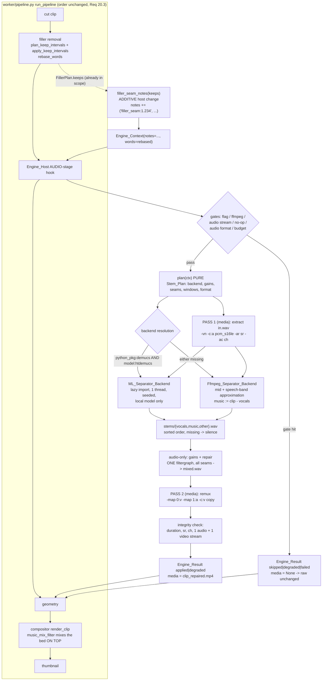

# Design Document

## Overview

This design implements the **Audio Stem Inpainting Engine** — `Stem_Inpainting_Engine` in
**(NEW)** `worker/engines/stems.py` — as the second concrete engine on the approved
`av-engines-foundation` contracts. It is one `AV_Engine` at the **audio stage** that does
three things on the already-tightened clip: separates the clip audio into the canonical
Stem_Set (`vocals`, `music`, `other`), re-mixes it with per-stem gains, and repairs the
waveform discontinuities left by `filler.apply_keep_intervals`. When it applies it returns
**Replacement_Media** (video stream copied, audio stream repaired) in
`Engine_Result.media`.

Everything heavy is optional. The module imports and plans with no ffmpeg, no separation
package and no model file on disk (Req 1.4, 1.9), and the engine always has a
dependency-free path to fall back to (Req 13.3).

### Foundation contracts consumed (recap — nothing here is redefined)

| Foundation surface | How this engine uses it |
| --- | --- |
| `AV_Engine` + ClassVar contract (`worker/engines/base.py`) | Subclassed once; the ClassVar block is reproduced verbatim from the requirements (Req 1.1, 1.5, 1.6) |
| `Engine_Stage.AUDIO` | Declared stage; host invokes once per clip after filler removal, before geometry, and takes `raw = out.media or raw` (Req 2.1, 3.3) |
| `Engine_Context` | Read-only source of `clip_path`, `duration`, `words`, `options`, `options_digest`, `seed`/`rng()`, `workspace`, `capabilities`, `permissibility`, `remaining()`, `notes`, `deps` (Req 1.3, 2.2, 19.1) |
| `Engine_Result` + `Engine_Status` | `applied` / `skipped` / `degraded` / `failed`, plus `markers`, `artifacts`, `media`, `plan`, `detail` (Req 3, 13, 14) |
| `AV_Engine.flag_field()` | Resolves `ProcessingOptions.stem_inpainting_enabled`, default OFF (Req 1.8) |
| `base.marker(engine_id, detail)` | Every marker string in the table below (Req 3.7, 13.7) |
| `Capability_Report`, `Capability_Kind`, `MODEL_LOCATORS` | `python_pkg:demucs`, `model:htdemucs`, `ffmpeg_filter:*` probing; the engine registers one model locator (Req 12) |
| `Time_Base`, `Timeline_Segment`, `normalize_segments` | Seam → Repair_Window segments, sample snapping (Req 6.7, 6.8) |
| `Engine_Workspace.path` / `.artifact(name, media_type=…, durable=…)` | Every scratch WAV and the Replacement_Media (Req 11) |
| `Engine_Options` protocol, `coerce_*`, `dump_options`, `options_digest`, `derive_seed` | `Stem_Options` parse/serialise/digest (Req 9) |

### Design decision 1 — audio stage, per clip (Req 2)

The Seams this engine exists to repair **do not exist before the clip is cut and
tightened**. `filler.plan_keep_intervals` returns `FillerPlan.keeps` in *source* time;
`filler.apply_keep_intervals` concatenates them with `atrim`/`concat`, so the join at
cumulative-keep-duration `t` on the *tightened* timeline is the only place a click lives.
A `source`-stage engine is computed before that concatenation and therefore cannot know
those positions (Req 2.4). The audio stage is also where the rebased Word_Timeline is
authoritative and where the cost is naturally bounded: only clip audio is separated, never
the whole source (Req 2.5).

### Design decision 2 — two backends, ML preferred, ffmpeg always available (Req 13)

Separation is injected behind a `Separator_Backend` protocol with exactly two shipped
adapters:

- **`ml`** — local Demucs (`htdemucs`) inference, lazily imported, CPU-pinned, seeded,
  and *refused* unless the model file is already on disk. Real separation.
- **`ffmpeg`** — a filter-only **approximation** (mid-channel + speech-band split, with
  `music := clip − vocals`). It requires nothing beyond ffmpeg and is deliberately
  described as an approximation, not separation, everywhere it appears — including in the
  marker the operator sees (`degraded:<capability_id>`).

The engine never downloads anything: if the resolved backend would fetch a checkpoint over
the network, the model is treated as unavailable and the engine degrades (Req 12.6, 16.1).

### Design decision 3 — media passes, defined precisely (Req 2.6, 15.9)

A **media pass** is an ffmpeg invocation that *reads or writes the clip media container*.
There are exactly two, always:

1. **Pass 1 — extract**: `clip.mp4 → in.wav` (`-vn`, no video decode).
2. **Pass 2 — remux**: `clip.mp4 + mixed.wav → clip_repaired.mp4` with `-c:v copy`.

Between them, at most two **audio-only** ffmpeg invocations touch WAV files only
(separation approximation, then the gain+repair graph), plus one `ffprobe`. Crucially,
**all Seams and all stem gains go into a single filtergraph**, so the invocation count is
constant in the Seam count and in the gain values — which is what Req 15.9 is protecting.
Totals per invocation: ≤ 2 media passes, ≤ 4 ffmpeg invocations, 1 ffprobe.

### Grounded integration points (verified in this repository at v0.8.0)

- `worker/effects/filler.py`: `Interval(start, end)` with `.duration`;
  `FillerPlan(keeps, removed_fillers, removed_seconds)` with `.changed`;
  `plan_keep_intervals` rounds every `Interval` bound with `round(x, 3)`; `rebase_words`
  accumulates `offset += k.duration` and rounds emitted word times with `round(x, 3)`;
  `apply_keep_intervals` concatenates with `trim`/`atrim` + `concat`.
- `worker/ffmpeg_utils.py`: `FFmpegError(RuntimeError)`, `probe() -> MediaInfo`, and
  `MediaInfo(duration, width, height, fps, has_audio)` — **`MediaInfo` carries no sample
  rate and no channel count**, so this engine adds its own private `ffprobe` audio-format
  read inside `stems.py` rather than widening `MediaInfo` (Req 20.2, 20.6).
- `worker/effects/audio.py`: `music_mix_filter(original_label, music_label, …)` is a
  compositor-side `amix` snippet; this engine runs strictly before it and never touches it.
- `config.py`: `settings.ffmpeg_binary`, `settings.temp_dir` exist; there is **no** model
  directory setting, so the model locator uses a documented env var with a repo-relative
  default and `config.py` is left unchanged (Req 20.2).
- `runtime_config.py`: `auto_delete_temp` exists (Req 11.8).
- `tests/conftest.py`: `requires_ffmpeg`, `make_video`, `probe_duration`, `FakeWord`;
  `tests/fakes.py` exists (`FakeDiarizationBackend`, `RaisingDiarizationBackend`, … — the
  established pattern this spec's fakes follow). `tests/strategies.py` does **not** exist
  yet; it is introduced by `av-engines-foundation` and extended (not replaced) here.
- `worker/engines/` does not exist yet; it is created by `av-engines-foundation`. This spec
  adds exactly one file to it.

---

## Architecture



### Stage placement consequences

- The music bed is mixed by the Compositor **after** this engine, so a bed is never
  separated, gained, or repaired, and `ProcessingOptions.music` / `music_volume` are never
  read or written here (Req 8.3, 8.4).
- The Word_Timeline the engine receives is already rebased; the engine never calls any
  `filler` function and never returns words (Req 8.2).
- The Compositor's own pass count is unaffected because it receives one clip file either
  way (Req 8.6).

---

## Components and Interfaces

### `worker/engines/stems.py` **(NEW)** — the engine

```python
"""Stem-aware audio repair for clips (engine_id "stem_inpainting").

Imports cleanly with no ffmpeg, no demucs and no model file present (Req 1.4):
every heavy import is local to the function that needs it.
"""
from __future__ import annotations

import json, math, os, shutil, subprocess
from dataclasses import dataclass, field, replace
from pathlib import Path
from typing import Any, Callable, Mapping, Optional, Protocol, Sequence

from worker.engines.base import (                       # foundation, Req 1.1
    AV_Engine, Engine_Context, Engine_Result, Engine_Stage, Engine_Status, marker,
)
from worker.engines.capabilities import MODEL_LOCATORS  # Req 12.3
from worker.engines.registry import register            # Req 1.7
from worker.engines.timebase import Timeline_Segment, normalize_segments  # Req 6.7

STEM_NAMES: tuple[str, ...] = ("music", "other", "vocals")   # SORTED, Req 4.1/4.9
STEM_MAPPING: dict[str, str] = {                             # Req 4.2
    "vocals": "vocals", "drums": "music", "bass": "music", "other": "other",
}
MIX_PRESETS: dict[str, dict[str, float]] = {                 # Req 5.2
    "speech_focus": {"vocals": 1.0, "music": 0.25, "other": 0.6},
    "music_focus":  {"vocals": 0.25, "music": 1.0, "other": 0.8},
    "clean_speech": {"vocals": 1.0, "music": 0.0,  "other": 0.0},
}
REPAIR_MODES = ("off", "crossfade", "spectral")
BACKEND_IDS = ("auto", "ml", "ffmpeg")            # resolved value is "ml" | "ffmpeg"
GAIN_MIN, GAIN_MAX, GAIN_DEFAULT = 0.0, 4.0, 1.0  # Req 5.4
WINDOW_MIN_MS, WINDOW_MAX_MS, WINDOW_DEFAULT_MS = 2, 120, 12   # Req 7.6
AMPLITUDE_TOLERANCE = 1.0 / 32768.0     # documented per-sample tolerance, Req 4.7/10.6
DISK_BOUND_MULTIPLE = 5                 # documented bound, Req 11.7
MAX_BRIDGE_WINDOWS = 24                 # spectral bridging cap (graph-size bound)
NOTCH_EXPR_CHUNK = 32                   # seams per `volume` expression chunk
ML_THREAD_COUNT = 1                     # pinned for reproducibility, Req 10.3
MODEL_DIR_ENV = "CLIPPER_STEM_MODEL_DIR"
MODEL_DIR_DEFAULT = Path("models/stems")


class Stem_Inpainting_Engine(AV_Engine):
    engine_id = "stem_inpainting"                    # Req 1.1
    stage = Engine_Stage.AUDIO                       # Req 2.1
    priority = 20                                    # Req 1.1
    required_capabilities = ("binary:ffmpeg",)       # Req 1.5
    optional_capabilities = (                        # Req 1.5, 12.1, 12.2
        "python_pkg:demucs",
        "model:htdemucs",
        "ffmpeg_filter:acrossfade",   # spectral music bridging
        "ffmpeg_filter:afade",        # declick at clip head/tail
        "ffmpeg_filter:pan",          # ffmpeg-backend mid extraction
        "ffmpeg_filter:highpass",     # ffmpeg-backend speech band
        "ffmpeg_filter:lowpass",      # ffmpeg-backend speech band
        "ffmpeg_filter:alimiter",     # optional soft peak guard
    )
    requires_network = False                          # Req 16.1
    requires_model_download = True                    # Req 16.5
    time_budget_s = 90.0                              # Req 15.1
    max_media_passes = 2                              # Req 2.6, 15.9
    produces_media = True                             # Req 3.1

    def __init__(
        self,
        *,
        backend: "Separator_Backend | None" = None,   # Req 19.1
        runner: "Command_Runner | None" = None,
        prober: Callable[[str], Any] | None = None,
    ) -> None: ...

    def resolve_options(self, options: Any) -> "Stem_Options":      # Req 1.2, 9.6
        """Pure: ProcessingOptions -> Stem_Options (idempotent, total)."""

    def plan(self, ctx: Engine_Context) -> "Stem_Plan":             # Req 1.9
        """PURE. No ffmpeg, no demucs import, no network, no model read."""

    def run(self, ctx: Engine_Context) -> Engine_Result:            # Req 1.2
        """Impure: gates, backend resolution, 2 media passes, verification."""


register(Stem_Inpainting_Engine())                                   # Req 1.7
MODEL_LOCATORS["htdemucs"] = lambda: _locate_model("htdemucs")        # Req 12.3
```

### The pure planner (Req 1.9, 2.3, 2.8, 6, 7, 10.1, 19.2)

`plan` is a thin composition of module-level pure functions, each independently testable
with no ffmpeg, no package, no network:

```python
def resolve_gains(opts: "Stem_Options") -> dict[str, float]:
    """Preset bundle wins over individual fields; `custom` uses the fields.

    Any non-finite/negative/over-max field is replaced by GAIN_DEFAULT.
    Req 5.1, 5.2, 5.3, 5.4
    """

def parse_seam_notes(notes: Sequence[str], duration: float) -> list[float]:
    """Keep only well-formed `filler_seam:<float>` notes with 0 <= v <= duration.

    Malformed, non-finite, negative and out-of-bounds values are discarded
    individually; the remaining notes survive. No other note prefix is read and no
    Seam is inferred from the waveform or from Word_Timeline gaps.
    Req 6.4, 6.5, 6.6
    """

def repair_windows(
    seams: Sequence[float], window_ms: int, duration: float, tb: "Time_Base"
) -> list[Timeline_Segment]:
    """Symmetric window per Seam, snapped to sample boundaries, clamped to
    [0, duration], then `normalize_segments` -> sorted, disjoint, contained.
    Overlapping windows therefore merge into one segment and are repaired once.
    Req 6.7, 6.8, 7.7
    """

def resolve_backend(
    opts: "Stem_Options", caps: Any, needs_separation: bool
) -> tuple[str, tuple[str, ...]]:
    """Return (resolved backend id, missing capability ids).

    "auto" -> "ml" when python_pkg:demucs AND model:<model> are both available,
    else "ffmpeg". An explicit "ml" request with a missing capability also resolves
    to "ffmpeg" and reports it as missing (the caller emits the degraded marker).
    Req 13.1, 13.2, 12.4, 12.6
    """

def resolve_repair_mode(requested: str, backend: str) -> tuple[str, bool]:
    """`spectral` + non-ml backend -> ("crossfade", True) i.e. downgraded.
    Req 7.3, 7.4
    """

def plan_stems(
    *, opts: "Stem_Options", notes: Sequence[str], duration: float,
    fmt: "Audio_Format", caps: Any, tb: "Time_Base",
) -> "Stem_Plan":
    """Compose the above into a serialisable Stem_Plan. Deterministic: no clock,
    no filesystem, no RNG unless drawn from ctx.rng().  Req 10.1, 10.2, 10.7
    """
```

`plan` never reads `ctx.source_path`, and every timestamp it produces is derived from
`[0, ctx.duration]` and the rebased `ctx.words`, so no source-relative time can reach the
audio processing (Req 2.3).

### `Separator_Backend` — the injectable protocol (Req 4.5, 19.1)

One audio file in, per-Stem_Name files out. Nothing else. The protocol is intentionally
file-based (not array-based) so the ffmpeg adapter is a first-class implementation and so
fakes need no numeric stack.

```python
class Separator_Backend(Protocol):
    backend_id: str                  # "ml" | "ffmpeg" | fake ids in tests
    requires_network: bool           # consulted by permissibility, Req 16.3

    def separate(
        self,
        source: Path,                # the extracted WAV (mono/stereo PCM)
        dest_dir: Path,              # inside the Engine_Workspace, Req 11.1
        *,
        fmt: "Audio_Format",         # must be preserved exactly, Req 4.6
        seed: int,                   # from ctx.rng(), Req 10.2
        timeout_s: float,            # derived from ctx.remaining(), Req 15.4
    ) -> Mapping[str, Path]:
        """Return {Backend_Stem name: wav path}. Names are mapped through
        STEM_MAPPING by the caller; omitted stems become silence (Req 4.3).
        Raise on failure — the engine converts that to Engine_Status failed
        (Req 14.2)."""
```

Caller-side assembly, shared by every backend (Req 4.2, 4.3, 4.9, 4.6):

```python
def assemble_stem_set(
    raw: Mapping[str, Path], *, dest_dir: Path, fmt: "Audio_Format",
    duration: float, runner: "Command_Runner", timeout_s: float,
) -> tuple[dict[str, Path], tuple[str, ...]]:
    """Map Backend_Stems -> Stem_Set, summing collisions (drums + bass -> music).

    Iterates `sorted(raw)` and then `STEM_NAMES` (already sorted), so the output is
    independent of the backend's dict iteration order (Req 4.9). A Stem_Name with no
    contributor is written as digital silence of `duration` at `fmt` via
    `anullsrc` and reported in the returned marker details as
    `stem_missing:<stem_name>` (Req 4.3). Every returned file is verified to have
    `fmt.sample_rate`, `fmt.channels` and `duration` (Req 4.6); a mismatch raises,
    which the engine reports as failed (Req 14.2).
    """
```

#### Adapter A — `ML_Separator_Backend` (`backend_id = "ml"`)

```python
class ML_Separator_Backend:
    backend_id = "ml"
    requires_network = False              # by construction: local file or refuse

    def __init__(self, model: str = "htdemucs", model_dir: Path | None = None): ...

    def separate(self, source, dest_dir, *, fmt, seed, timeout_s):
        # Req 12.6: refuse before importing anything if the checkpoint is absent.
        checkpoint = _locate_model(self.model, self.model_dir)
        if checkpoint is None:
            raise Model_Unavailable(self.model)

        import torch                       # LAZY: Req 1.4
        from demucs.apply import apply_model
        from demucs.pretrained import get_model

        torch.set_num_threads(ML_THREAD_COUNT)          # pinned, Req 10.3
        torch.set_grad_enabled(False)
        torch.manual_seed(seed & 0xFFFF_FFFF)           # seeded, Req 10.2/10.3
        try:
            torch.use_deterministic_algorithms(True)    # best effort
        except Exception:
            pass

        model = get_model(name=str(checkpoint))         # local path ONLY, never a repo id
        model.cpu().eval()                              # CPU-only, Req 15.2
        ...                                             # decode -> apply_model -> write WAVs
```

Rules this adapter obeys:

- **Never network-fetches.** It resolves the checkpoint itself and raises
  `Model_Unavailable` rather than letting `get_model` resolve a remote name. A remote
  resolution attempt is treated as "model unavailable" and the engine degrades
  (Req 12.6, 16.1).
- **CPU-pinned and seeded.** `torch.set_num_threads(1)`. One thread is chosen so
  summation order inside threaded kernels cannot vary between runs; the cost is speed, and
  the honest consequence is recorded in the Fixed_Environment definition (thread count is
  part of it, Req 10.3, 10.4).
- **Backend_Stems** for `htdemucs` are `vocals`, `drums`, `bass`, `other`; the caller maps
  them with `STEM_MAPPING` (Req 4.2).
- **Model locator** (Req 12.3): `_locate_model(name, dir)` returns
  `dir / f"{name}.th"` (or `dir / name / "model.th"`) when the file exists, else `None`,
  where `dir` defaults to `Path(os.environ.get(MODEL_DIR_ENV, MODEL_DIR_DEFAULT))`. It
  stats the filesystem only — no import, no network (Req 12.5).

#### Adapter B — `Ffmpeg_Separator_Backend` (`backend_id = "ffmpeg"`) — a candid approximation

This adapter needs nothing but ffmpeg. It produces two Backend_Stems in **one** audio-only
invocation and deliberately omits `other`, so the caller synthesises silence for it and
records `stem_missing:other` (Req 4.3):

```
[0:a]asplit=3[x1][x2][x3];
[x1]pan=stereo|c0=0.5*c0+0.5*c1|c1=0.5*c0+0.5*c1,       # mid (centre) channel
    highpass=f=180,lowpass=f=6000[voc];                 # speech band
[voc]asplit=2[voc_out][voc_src];
[voc_src]volume=-1:precision=float[voc_neg];            # phase invert
[x2][voc_neg]amix=inputs=2:normalize=0:dropout_transition=0[mus]   # music := clip - vocals
```
mapped as `-map "[voc_out]" vocals.wav -map "[mus]" music.wav`. For a mono input the `pan`
node is omitted (mid extraction is the identity), leaving a pure band split.

**This is not source separation, and the design says so plainly.** It is a
mid-channel/speech-band estimate. It cannot separate music that shares the speech band or
sits centred in the mix; on mono input it degrades to a band split; it will pull centred
instruments into `vocals` and leave sibilance in `music`. Its two real virtues are that it
needs no model and that `music := clip − vocals` makes the additive-decomposition
invariant (Req 4.7) hold *exactly* rather than approximately, so `speech_focus`-style
gains still behave predictably. Because it is a downgrade, it is only ever reached with a
`degraded:<capability_id>` marker and `Engine_Status.degraded` — the operator is never told
this is real separation (Req 13.2, 13.3).

### Seam publication — the one cross-spec touch point (Req 6.1, 6.2, 6.3, 6.9)

The Stem_Engine reads Seams **only** from `Engine_Context.notes`. Someone must put them
there, and that someone is the Engine_Host, because only the host/pipeline boundary holds
the `FillerPlan`.

**Where exactly.** `worker/pipeline.py run_pipeline` already computes
`plan = filler.plan_keep_intervals(...)` and calls `filler.apply_keep_intervals(...)` before
the geometry stage; the foundation's AUDIO-stage hook is invoked at that same point. The
change is one extra keyword argument on that existing call plus one pure helper in the
host:

```python
# worker/engines/host.py  (foundation-owned; ADDITIVE)
def filler_seam_notes(keeps: Sequence["Interval"]) -> tuple[str, ...]:
    """Interior keep boundaries as `filler_seam:<seconds>` notes (Req 6.1-6.3, 6.9).

    Mirrors `filler.rebase_words` exactly: the tightened-timeline position of the
    join after keep *i* is the cumulative sum of the preceding keep durations, and
    the value is rounded with `round(x, 3)` — the same rounding `rebase_words` applies
    to the word times the engine also receives, so seams and words agree.
    """
    notes: list[str] = []
    cursor = 0.0
    for keep in list(keeps)[:-1]:          # drop the last keep -> no clip-end seam
        cursor += keep.duration            # `Interval.duration` = max(0, end - start)
        notes.append(f"filler_seam:{round(cursor, 3):.3f}")
    return tuple(notes)                    # exactly N-1 notes for N keeps (Req 6.9)

# host AUDIO-stage hook, when building the Engine_Context:
notes = base_notes + (filler_seam_notes(filler_plan.keeps) if filler_plan else ())
```

There is no clip-start note (the loop starts after the first keep's duration is added, so
`0.0` is never emitted) and no clip-end note (the last keep is dropped) — Req 6.3.
When filler removal did not run, or produced a single keep, `filler_plan` is `None` or
yields zero notes, and the engine plans an empty Seam list (Req 6.5, 8.5).

**Scope statement (read this before reviewing it as a foundation change).** This is an
**additive change to foundation-owned host/pipeline code**, not a change to any foundation
contract, dataclass, or signature:

- `Engine_Context.notes: tuple[str, ...]` **already exists** in the pinned contract, with
  the documented free-form convention (`"fps_fallback:0.0"`). We add a value, not a field.
- No foundation dataclass, enum, protocol, or method signature is modified; no field is
  added or renamed; `filler.py` is untouched (we read `FillerPlan.keeps`, we do not
  recompute it — Req 8.2).
- Engines that do not understand `filler_seam:` ignore it, exactly as they ignore any other
  note, so `kinetic-typography` is unaffected (Req 20.6).

**Flagged as a cross-spec touch point:** implementing this spec requires one small,
additive patch to `worker/engines/host.py` (+ one keyword at the existing
`run_pipeline` → host call site). It belongs in this spec's task list and in this spec's
review, and it must be landed *after* the foundation ships those files. It is the only
file outside `worker/engines/stems.py` (plus the API/UI surface of Req 18) that this spec
writes to.

### The ffmpeg pipeline (Req 3.2, 4.4, 5.5, 7.2, 15.4, 17)

All commands go through an injectable runner so tests can record them (Req 19.1):

```python
Command_Runner = Callable[[Sequence[str], float], subprocess.CompletedProcess]

def _run(runner, cmd: Sequence[str], timeout_s: float):
    """Wraps failures as worker.ffmpeg_utils.FFmpegError (Req 14.3) and always
    passes an explicit subprocess timeout (Req 15.4)."""
```

**Audio format probe** (not a media pass — `ffprobe` only). `MediaInfo` has no sample rate
or channel count, so:

```python
@dataclass(frozen=True)
class Audio_Format:
    sample_rate: int
    channels: int
    codec: str
    start_time: float          # Req 17.4

def probe_audio_format(path, runner, timeout_s) -> Audio_Format | None:
    # ffprobe -v error -select_streams a:0 -show_entries
    #   stream=sample_rate,channels,codec_name,start_time -of json <path>
    # None when there is no audio stream (Req 4.8);
    # invalid/zero/negative sample_rate or channels -> Invalid_Audio_Format (Req 17.5)
```

`ffmpeg_utils.probe()` is still used for `has_audio`, `duration` and `fps`, i.e. for the
video-side integrity comparison (Req 17.3).

**Pass 1 — extract** (Req 4.4):

```
ffmpeg -nostdin -hide_banner -loglevel error -y -i clip.mp4 \
  -vn -map 0:a:0 -c:a pcm_s16le -ar <sr> -ac <ch> -f wav <ws>/in.wav
```

**Audio-only invocation — gains + repair in one filtergraph** (Req 5.5, 5.7, 7.2, 7.5,
7.7, 15.9). Inputs are the Stem_Set WAVs in `STEM_NAMES` order; a stem whose resolved gain
is `0.0` is **not added as an input at all** (Req 5.7):

```
ffmpeg -nostdin -y -i stems/music.wav -i stems/vocals.wav -filter_complex "
[0:a]volume=0.250000:precision=float[g_music];
[1:a]volume=1.000000:precision=float[g_vocals];
[g_music][g_vocals]amix=inputs=2:normalize=0:dropout_transition=0[mix];
[mix]volume=eval=frame:precision=float:volume='
   if(between(t,0.476,0.488), sin(PI/2*abs(t-0.482)/0.006),
   if(between(t,1.994,2.006), sin(PI/2*abs(t-2.000)/0.006), 1))'[rep];
[rep]alimiter=limit=0.977:level=disabled[out]
" -map "[out]" -c:a pcm_s16le -ar 48000 -ac 2 <ws>/mixed.wav
```

Why a time-expression `volume` filter and not `acrossfade`/chained `afade` for
`crossfade` repair (Req 7.2, 7.9):

- `acrossfade` **shortens** its output by the overlap, which would break duration
  preservation (Req 7.9, 17.1).
- Chained `afade=t=out` sets the gain to 0 for *everything after* the fade, so it cannot be
  used for an interior window.
- A single `volume` filter with `eval=frame` and a piecewise expression is duration-exact,
  affects only samples inside the planned windows, and is one filter node regardless of
  Seam count. Per window `[s, e]` with centre `c` and half-width `h`, the gain is
  `sin(PI/2 · |t − c| / h)` — an **equal-power V-notch**: unity at both window edges,
  zero exactly at the join, quarter-sine (constant-power) taper in between. The click
  disappears because the waveform is driven continuously to zero across the discontinuity.
  At the default 12 ms window (6 ms per side) it is inaudible.
- Because `repair_windows` already merged overlaps via `normalize_segments`, each merged
  window contributes **exactly one** notch, so no sample is faded twice (Req 7.7).
- Expressions are emitted in chunks of `NOTCH_EXPR_CHUNK` windows, chained with `,` into
  further `volume` filters. Chained notches are identity outside their own windows and the
  windows are disjoint, so chunking changes nothing semantically and keeps any single
  expression short.

`spectral` mode (ML backend only, Req 7.3) repairs **per stem before `amix`**:

- Each stem gets the same notch construction with a stem-scaled half-width
  (`vocals` ×0.35 to protect speech transients, `other` ×0.6, `music` ×1.0) — this is the
  "reconstruct each window per Stem_Name" step.
- Additionally, for the `music` stem only, up to `MAX_BRIDGE_WINDOWS` windows are
  **bridged** with real neighbouring material, which is where `acrossfade` is genuinely
  duration-safe: for window `[s, e]`, `h = (e − s)/2`, `c = s + h`,
  `left ← acrossfade(atrim=s−h:s, atrim=s:c, d=h, c1=qsin, c2=qsin)` and
  `right ← acrossfade(atrim=c:e, atrim=e:e+h, d=h, c1=qsin, c2=qsin)`. Crossfading two
  `h`-length segments with `d=h` yields exactly `h` samples, so `concat` of
  `[0,s) + left + right + [e,dur)` preserves duration exactly. Windows within `h` of a clip
  bound, or beyond the cap, fall back to the notch for that window; counts are recorded in
  `Stem_Plan.bridged_windows` / `notched_windows` (detail only, no extra marker).

`declick` (Req 9.1) adds `afade=t=in:st=0:d=0.001` and
`afade=t=out:st=<duration−0.001>:d=0.001` at the ends of the mixed stream. These are the
clip's own head and tail — precisely the two boundaries for which Req 6.3 forbids a Seam —
and `afade` is correct there because there is no "after" to zero out.

**Peak behaviour (Req 5.9), stated honestly.** With all gains ≤ 1.0 clipping is
practically impossible, but not *provably* impossible: anti-phase content means
`|Σ gₛ·sₛ| ≤ Σ gₛ` is the only sound analytic bound. The invariant is therefore enforced by
representation — `mixed.wav` is written as `pcm_s16le` and the remux encodes to the
container's audio codec, so no written sample can exceed full scale; it saturates.
`alimiter` is used when `ffmpeg_filter:alimiter` is available to make that ceiling musical
instead of hard, and the planner additionally clamps gains to `≤ 1.0` when a boost is
requested and `alimiter` is unavailable, recording
`degraded:ffmpeg_filter:alimiter`. Gains are capped at `4.0` and **no shipped preset
boosts any stem**, so the saturating path needs a deliberate custom configuration.

**Pass 2 — remux** (Req 3.2, 17.2, 17.4):

```
ffmpeg -nostdin -y -i clip.mp4 [-itsoffset <start_time>] -i <ws>/mixed.wav \
  -map 0:v:0 -map 1:a:0 -c:v copy -c:a <aac|matching codec> -b:a 192k \
  -ar <sr> -ac <ch> -movflags +faststart <ws>/clip_repaired.<ext>
```

`-c:v copy` guarantees the video stream is bit-copied (Req 3.2, 17.3). `-shortest` is
deliberately **not** used because it could truncate either stream and change the duration.
`-itsoffset` is emitted only when the probed audio `start_time` is non-zero, so the
audio/video relationship is preserved rather than silently re-based (Req 17.4).

**Timeouts** (Req 15.3, 15.4). Every step re-reads `ctx.remaining()`:

```python
def step_timeout(ctx, reserve_s: float) -> float:
    return max(MIN_STEP_TIMEOUT_S, ctx.remaining() - reserve_s)
```
with `EXTRACT_RESERVE_S = 3.0`, `SEPARATE_RESERVE_S = 8.0`, `REPAIR_RESERVE_S = 5.0`,
`REMUX_RESERVE_S = 0.5`, `MIN_STEP_TIMEOUT_S = 1.0`. Gate thresholds:
`SEPARATION_MIN_S = 20.0` for `ml`, `4.0` for `ffmpeg`; `REPAIR_MIN_S = 3.0`;
`REMUX_MIN_S = 2.0`.

### `run` — the gate and degradation ladder (Reqs 3, 5.6, 13, 14, 15, 16, 17)

Rungs are evaluated strictly in this order; the first match returns. Every marker is built
with `base.marker("stem_inpainting", …)`, and at most one degradation marker is emitted per
missing Capability_Id (Req 13.7).

| # | Condition | Status | Marker(s) | Media | Req |
| --- | --- | --- | --- | --- | --- |
| 0 | `stem_inpainting_enabled` false | *engine body never invoked*; no workspace, no exclusive probes, no pass | — | none | 1.8, 15.8 |
| 1 | `binary:ffmpeg` unavailable | `skipped` (host-level) | `unavailable:binary:ffmpeg` | none | 13.6 |
| 2 | Permissibility on **and** resolved backend `requires_network` | `degraded` | `permissibility_blocked` | none | 16.3 |
| 3 | All resolved gains `== 1.0` **and** repair mode `off` (**no-op**) — evaluated before any probe or subprocess | `skipped` | *(none)* | none | 5.6, 7.10 |
| 4 | No audio stream in the clip | `skipped` | *(none — explicitly)* | none | 4.8 |
| 5 | Probed sample rate/channels missing, zero or negative | `degraded` | `degraded:audio_format` | none | 17.5 |
| 6 | `remaining() < REPAIR_MIN_S + REMUX_MIN_S` before extraction | `degraded` | `degraded:budget` | none | 15.5 |
| 7 | Separation needed but `remaining() < SEPARATION_MIN_S(backend) + REPAIR_MIN_S + REMUX_MIN_S` | `degraded` (repair-only path runs: `crossfade` on the un-separated audio) | `degraded:budget` + `repair:crossfade:<n>` | **yes** | 15.5 |
| 8 | `python_pkg:demucs` and/or `model:htdemucs` unavailable, separation needed | `degraded` (ffmpeg backend) | `degraded:python_pkg:demucs` and/or `degraded:model:htdemucs`, plus `applied:ffmpeg`, `mix:<preset>`, `repair:<mode>:<n>`, `stem_missing:other` | **yes** | 13.2, 12.4, 12.6 |
| 9 | `spectral` requested, backend is not `ml` | `degraded` → repairs as `crossfade` | `degraded:python_pkg:demucs` + `repair:crossfade:<n>` | **yes** | 7.4 |
| 10 | A filter required by the resolved path is unavailable (`pan`/`highpass`/`lowpass` for the ffmpeg backend, `volume` chain otherwise) | `degraded` | `unavailable:ffmpeg_filter:<name>` | none | 13.5 |
| 11 | Budget exhausted *during* separation or later (timeout raised) | `degraded`; every partial artifact deleted | `timeout` | none | 15.6, 15.7 |
| 12 | Backend raised, returned a non-audio file, or returned wrong-duration audio | `failed` | `failed` | none | 14.2 |
| 13 | Any ffmpeg invocation raised `FFmpegError` | `failed` | `failed` | none | 14.3 |
| 14 | Integrity verification of the Replacement_Media failed | `failed`; candidate deleted | `failed` | none | 3.5, 17 |
| 15 | Otherwise, ML backend used | `applied` | `applied:ml`, `mix:<preset>`, `repair:<mode>:<n>` (when `n ≥ 1`), `stem_missing:<name>` (per omission) | **yes** | 13.1, 3.7, 5.8, 7.8 |

Notes on the ladder:

- Rungs 3 and 4 return **before** any workspace file is written, any capability beyond
  `binary:ffmpeg` is probed, and any subprocess is started — that is what makes the no-op
  property (Req 5.6) and the no-audio skip (Req 4.8) observable as "zero runner calls".
- Rungs 2, 5–11 return `degraded`; 12–14 return `failed`; both classes return **no media**,
  so the host passes the preceding stage's media through unchanged and the clip bytes match
  an all-engines-disabled run (Req 3.4, 3.8).
- Every rung that abandons work deletes the files it created inside the workspace first, so
  no partial Replacement_Media is ever left behind (Req 15.7).
- The engine catches `OSError` around each workspace write/delete, records it in
  `Engine_Result.detail`, and continues (Req 11.6). Exceptions it does not handle propagate
  to the host, which converts them into `failed` + `failed` marker and logs type and
  message (Req 14.1, 14.5).

### Integrity verification before returning media (Req 3.5, 17)

```python
def verify_replacement(candidate: Path, incoming: Path, fmt, runner, timeout_s) -> None:
    """Raise Integrity_Error unless ALL hold:
      * exactly one audio stream and exactly one video stream        (17.7)
      * audio duration within one audio frame (1/sample_rate)       (17.1)
      * sample_rate and channels equal fmt                           (17.2)
      * video duration and nb_frames equal the incoming clip's       (17.3)
      * audio start_time equal to the incoming clip's                (17.4)
    """
```
`Integrity_Error` maps to rung 14 (`failed`, no media, candidate deleted), which is why the
clip-count and media-untouched invariants hold even when verification fails (Req 3.5, 3.8).

### API and UI deltas (Req 18)

| Surface | Delta |
| --- | --- |
| `api/main.py` `OptionsModel` | `stem_inpainting_enabled: bool = False`, plus `stem_mix_preset`, `stem_gain_vocals`, `stem_gain_music`, `stem_gain_other`, `stem_repair_mode`, `stem_repair_window_ms`, `stem_declick`, `stem_backend`, `stem_model`, `stem_retain_stems`. Unknown values are coerced to documented defaults by `Stem_Options.parse`, and the job still runs (Req 18.1, 18.5) |
| `/api/upload` Form fields | The same field names, all optional (Req 18.1) |
| `/api/info` | Adds `engines.stem_inpainting`: `{flag, default: false, available, backend, capabilities: {"python_pkg:demucs": bool, "model:htdemucs": bool}, mix_presets, repair_modes, stem_set, repair_window_ms: {min, max, default}}`. Existing v0.8.0 values — including `audio.available_moods` — are untouched (Req 12.8, 18.2, 18.6) |
| `frontend/src/App.jsx` | Defaults gain `stem_inpainting_enabled: false` + one entry per Stem_Options field; `toOptions` forwards every one (Req 18.3) |
| `frontend/src/components/SettingsPanel.jsx` | A "Stem repair" group: enable toggle, Mix_Preset `Dropdown`, three gain sliders (`0.0–4.0`, disabled unless preset is `custom`), Repair_Mode `Dropdown`, window slider, declick checkbox. `spectral` is shown disabled with "needs local model" when `/api/info` reports `model:htdemucs` unavailable (Req 18.4) |

---

## Data Models

### `Stem_Options` (Req 9.1, 9.2)

```python
@dataclass(frozen=True)
class Stem_Options:                     # all fields JSON scalars (Req 9.1)
    mix_preset: str = "custom"          # custom|speech_focus|music_focus|clean_speech
    gain_vocals: float = 1.0            # [0.0, 4.0]
    gain_music: float = 1.0
    gain_other: float = 1.0
    repair_mode: str = "crossfade"      # off|crossfade|spectral
    repair_window_ms: int = 12          # [2, 120]
    declick: bool = False
    backend: str = "auto"               # auto|ml|ffmpeg
    model: str = "htdemucs"
    retain_stems: bool = False          # durable per-stem WAVs (Req 11.3)

    @classmethod
    def parse(cls, data: Mapping[str, Any] | None) -> "Stem_Options":
        """Total: never raises; each field independently defaulted/clamped.

        coerce_choice for mix_preset/repair_mode/backend (Req 9.3, following the
        existing ProcessingOptions.from_dict convention), coerce_float + finite +
        range check for gains (Req 5.4), coerce_int + clamp for the window
        (Req 7.6), coerce_bool for flags, coerce_str for the model name.
        """

    def to_dict(self) -> dict[str, Any]: ...          # Req 9.2, 9.4

    @classmethod
    def from_processing_options(cls, options: Any) -> "Stem_Options":
        """Read the `stem_*` fields off ProcessingOptions; pure and idempotent
        (Req 9.6). Never mutates `options` (Req 1.3)."""
```

`retain_stems` is beyond the Req 9.1 enumeration on purpose: Req 11.3 requires an option
that requests retained stems, and this is it. It is a JSON scalar like the rest, so
Req 9.1's constraint still holds.

`ProcessingOptions` gains exactly these eleven fields with exactly these defaults, so an
untouched upgrade behaves identically (Req 20.1, 20.2) and
`from_dict`/`dataclasses.asdict` round-trip losslessly alongside the existing
`tests/test_options_roundtrip.py` cases (Req 9.8).

### `Stem_Plan`, `Repair_Window`, `Audio_Format` (Req 10.1, 10.7)

```python
@dataclass(frozen=True)
class Repair_Window:
    start: float          # clip-relative seconds, snapped to a sample boundary
    end: float
    seams: tuple[float, ...]     # the Seam(s) merged into this window (Req 7.7)

    def to_dict(self) -> dict[str, Any]: ...

@dataclass(frozen=True)
class Stem_Plan:
    backend: str                      # "ml" | "ffmpeg"      (Req 10.7)
    model: str                        # resolved model name  (Req 10.7)
    gains: dict[str, float]           # keyed by STEM_NAMES, sorted iteration
    active_stems: tuple[str, ...]     # gain > 0.0 only       (Req 5.7)
    repair_mode: str                  # resolved, post-downgrade
    repair_window_ms: int
    seams: tuple[float, ...]          # normalised, in-bounds (Req 6.6)
    windows: tuple[Repair_Window, ...]# sorted, disjoint      (Req 6.8)
    sample_rate: int
    channels: int
    duration: float
    declick: bool
    needs_separation: bool            # any gain != 1.0 or repair_mode == "spectral"
    missing_capabilities: tuple[str, ...]
    downgraded_from: str = ""         # "spectral" when rung 9 fired
    bridged_windows: int = 0
    notched_windows: int = 0

    def to_dict(self) -> dict[str, Any]: ...   # JSON, goes into Engine_Result.plan
```

`Stem_Plan` is fully serialisable, so two runs' plans can be compared field-by-field —
which is how planning determinism (Req 10.1) and the cross-environment guarantee
(Req 10.6) are actually asserted.

### Marker table (Req 3.7, 4.3, 5.8, 7.4, 7.8, 13, 14, 15, 16, 17.5)

All markers are `engine:stem_inpainting:<detail>` via `base.marker`.

| Marker | Meaning | Req |
| --- | --- | --- |
| `applied:ml` | Real separation with the local model | 13.1 |
| `applied:ffmpeg` | Applied via the filter approximation | 3.7 |
| `mix:<mix_preset>` | Resolved Mix_Preset (`custom` included) | 5.8 |
| `repair:<repair_mode>:<seam_count>` | At least one Seam repaired; count = number of merged windows | 7.8 |
| `stem_missing:<stem_name>` | Backend omitted a stem; silence substituted | 4.3 |
| `degraded:python_pkg:demucs` | Package missing, or `spectral` downgraded to `crossfade` | 13.2, 7.4 |
| `degraded:model:htdemucs` | Model absent locally / would need a download | 13.2, 12.4, 12.6 |
| `degraded:ffmpeg_filter:alimiter` | Boost requested without a peak guard; gains clamped to 1.0 | 5.9 |
| `degraded:budget` | Separation skipped for budget; repair-only path | 15.5 |
| `degraded:audio_format` | Probed sample rate/channels invalid | 17.5 |
| `unavailable:binary:ffmpeg` | Required capability missing; body skipped | 13.6 |
| `unavailable:ffmpeg_filter:<name>` | Fallback-path filter missing; no media | 13.5 |
| `timeout` | Budget exhausted mid-work; partials discarded | 15.6 |
| `permissibility_blocked` | Resolved backend declares a network requirement | 16.3 |
| `failed` | Exception, bad backend output, or integrity failure | 14.1–14.3 |
| `artifact_failed` | Durable stem persistence failed (foundation taxonomy) | 11.3 |

Existing `filler_removal`, `music:<mood>` and every other v0.8.0 marker keep their exact
spelling and meaning and appear alongside these (Req 8.4, 8.7, 20.4).

### Workspace layout and disk bound (Req 11)

```
<settings.temp_dir>/engines/<job>/<clip>/stem_inpainting__<digest>/
├── in.wav                 transient  media_type="audio"   (Req 11.2)
├── stems/
│   ├── music.wav          transient, or durable when retain_stems (Req 11.3)
│   ├── other.wav          "
│   └── vocals.wav         "
├── mixed.wav              transient  media_type="audio"
└── clip_repaired.<ext>    media_type="video" -> Engine_Result.media (Req 11.1)
```

Let `W = sample_rate × channels × 2 × duration` bytes (the extracted WAV) and `C` the clip
size. Peak workspace usage is `in.wav (W) + 3 stems (3W) + mixed.wav (W) + C = 5W + C`, so
the documented bound is `DISK_BOUND_MULTIPLE × W + C` (Req 11.7). Before returning, the
engine deletes `in.wav`, `mixed.wav` and every non-durable stem, leaving
`clip_repaired.<ext>` (+ up to `3W` of durable stems when `retain_stems` is set) —
Req 11.4. Durable stems are persisted by the host through the active Storage_Backend under
`normalize_key`-ed keys before the workspace is deleted, and the host deletes the workspace
only after the geometry stage has taken the media (Req 11.3, 11.5). With
`auto_delete_temp`, `cleanup_temp` removes every `stem_inpainting__*` directory (Req 11.8).

### Determinism, stated honestly (Req 10)

| Scope | Guarantee | Mechanism |
| --- | --- | --- |
| Planning | **Absolute.** Equal clip audio + equal Seam_Notes + equal Word_Timeline + equal Stem_Options ⇒ equal `Stem_Plan` | `plan` is pure: no clock, no filesystem, no environment read, randomness only via `ctx.rng()` (Req 10.1, 10.2) |
| One Fixed_Environment | Byte-identical Replacement_Media audio | Same package version, same model bytes, `ML_THREAD_COUNT = 1`, `torch.manual_seed(ctx.seed)`, deterministic algorithms best-effort, fixed filtergraph string, fixed encoder flags (Req 10.4) |
| ffmpeg backend, same ffmpeg build | Byte-identical Replacement_Media audio | The whole path is a deterministic filtergraph over PCM (Req 10.8) |
| **Across** package versions, model contents, thread counts, platforms, ffmpeg builds | **No bit-exactness is claimed.** Saying otherwise would be false: CPU kernels reorder floating-point summation, checkpoints differ, encoders differ | Explicitly disclaimed (Req 10.5) |
| Cross-environment, equal inputs | Equal `Stem_Plan`; identical Stem_Set (`music`, `other`, `vocals`); equal `sample_rate`/`channels`; equal output duration; re-mixed audio equal within `AMPLITUDE_TOLERANCE` (1 LSB of 16-bit) | The weaker guarantee that tests assert (Req 10.6); `Stem_Plan.backend`/`.model` are recorded so a reproduction can be compared against the environment that produced it (Req 10.7) |

---

## Error Handling

| Failure | Detection | Response | Status | Req |
| --- | --- | --- | --- | --- |
| Separation package absent | `Capability_Report.available("python_pkg:demucs")` | Use the ffmpeg backend | `degraded` + media | 13.2 |
| Model file absent / download would be needed | model locator returns `None`; `Model_Unavailable` raised before any import | Use the ffmpeg backend; never fetch | `degraded` + media | 12.4, 12.6 |
| `spectral` without the ML backend | `resolve_repair_mode` | Repair as `crossfade`; record the downgrade | `degraded` + media | 7.4 |
| Fallback filter missing (`pan`/`highpass`/`lowpass`) | capability probe | Abandon; no media | `degraded` | 13.5 |
| `binary:ffmpeg` missing | required capability | Host skips the body | `skipped` | 13.6 |
| No audio stream | `probe_audio_format` returns `None` | Return early, no marker | `skipped` | 4.8 |
| Invalid probed format | `Invalid_Audio_Format` | Abandon; no media | `degraded:audio_format` | 17.5 |
| Backend raises / non-audio file / wrong duration | `assemble_stem_set` verification | Delete partials; no media | `failed` | 14.2 |
| Backend omits a stem | mapping produced no contributor | Substitute silence + marker | unchanged | 4.3 |
| `FFmpegError` from any invocation | `_run` wrapper | Delete partials; no media | `failed` | 14.3 |
| Subprocess timeout | `subprocess.TimeoutExpired` → budget path | Delete partials; no media | `degraded` + `timeout` | 15.6, 15.7 |
| Budget too small before/at a step | `ctx.remaining()` gates | Repair-only, or abandon | `degraded:budget` | 15.5 |
| Integrity verification fails | `verify_replacement` | Delete candidate; no media | `failed` | 3.5 |
| `OSError` on a workspace write/delete | try/except per file op | Record in `detail`, keep going | unchanged | 11.6 |
| Durable stem persistence fails | host | `artifact_failed`, clip still produced | unchanged | 11.3 |
| Unexpected exception | host catches | Log type + message | `failed` | 14.1, 14.5 |

In every non-`applied` row the engine returns **no media**, so the host forwards the
preceding stage's media untouched and the clip still gets written with its thumbnail
(Req 3.4, 14.4).

---

## Correctness Properties

*A property is a characteristic or behavior that should hold true across all valid
executions of a system — essentially, a formal statement about what the system should do.
Properties serve as the bridge between human-readable specifications and machine-verifiable
correctness guarantees.*

**Generators.** Reused from the foundation's `tests/strategies.py`: `st_options_mapping`
(hostile JSON-ish values), `st_word_timeline` (ordered `FakeWord`s + duration),
`st_time_base`, `st_segment_records`, `st_availability_map`, `st_engine_outcomes`.
Added by this spec to the same module: `st_stem_options`, `st_stem_gains`, `st_mix_preset`,
`st_repair_mode`, `st_repair_window_ms`, `st_keep_plan` (`FillerPlan` keep lists),
`st_seam_notes` (valid + hostile note tuples), `st_audio_format`, `st_pcm_frames` (tiny
float frame buffers, incl. anti-phase and full-scale cases), `st_backend_stem_sets`
(4-stem / 2-stem / unknown names / omissions), `st_gate_scenarios`
(availability × budget × forced failure), `st_failure_points`, `st_tiny_clip`.
Fakes added to `tests/fakes.py`: `Fake_Separator_Backend`, `Raising_Separator_Backend`,
`Truncating_Separator_Backend`, `Missing_Stem_Backend`, `Network_Separator_Backend`,
`Recording_Command_Runner`, `Seam_Note_Fixtures`.

### Property 1: Planning is pure and never mutates the caller

*For any* Stem_Options, Seam_Note tuple, Word_Timeline and Time_Base, calling `plan(ctx)`
performs zero command-runner invocations, imports no separation package, opens no socket,
reads no model file, and leaves `dataclasses.asdict(ctx.options)` identical to its value
before the call; every attempted `Engine_Context` field assignment raises.
Generators: `st_stem_options`, `st_seam_notes`, `st_word_timeline`, `st_time_base`.

**Validates: Requirements 1.3, 1.9, 2.7, 10.2, 12.5**

### Property 2: Equal inputs produce equal plans, and the plan names its environment

*For any* two invocations with equal clip audio, equal Seam_Note tuple, equal Word_Timeline
and equal Stem_Options, `plan(ctx).to_dict()` values are equal, and every timestamp in the
plan lies within `[0, duration]` while `backend` and `model` are non-empty.
Generators: `st_stem_options`, `st_seam_notes`, `st_word_timeline`.

**Validates: Requirements 2.3, 2.8, 10.1, 10.7**

### Property 3: Stem_Options round-trips and its digest separates exactly the distinct values

*For any* valid Stem_Options, `parse(to_dict(o)).to_dict() == o.to_dict()`; and *for any*
pair of Stem_Options, the Options_Digests are equal when the option values are equal and
differ when any field value differs.
Generator: `st_stem_options`.

**Validates: Requirements 9.4, 9.7**

### Property 4: Parsing is total — hostile input yields documented defaults, never an exception

*For any* mapping of arbitrary values, `Stem_Options.parse` returns a Stem_Options without
raising, with `mix_preset`/`repair_mode`/`backend` members of their declared value sets,
every gain finite and inside `[0.0, 4.0]`, and `repair_window_ms` inside `[2, 120]`.
Generator: `st_options_mapping`.

**Validates: Requirements 5.4, 7.6, 9.3, 9.5, 18.5**

### Property 5: Option resolution is idempotent and survives the ProcessingOptions round-trip

*For any* ProcessingOptions, `resolve_options` applied twice yields equal Stem_Options, and
`ProcessingOptions.from_dict(dataclasses.asdict(o)) == o`.
Generators: `st_options_mapping`, `st_stem_options`.

**Validates: Requirements 9.6, 9.8, 20.2**

### Property 6: Seam publication is exactly the interior joins, with `rebase_words` rounding

*For any* `FillerPlan` keep list of length `N ≥ 1`, `filler_seam_notes(keeps)` yields exactly
`N − 1` notes; the *i*-th value equals `round(Σ_{j≤i} keeps[j].duration, 3)`; no note equals
the clip start `0.0` and none equals the total tightened duration.
Generator: `st_keep_plan`.

**Validates: Requirements 6.1, 6.2, 6.3, 6.9**

### Property 7: Seam intake is robust and windows are always normalised

*For any* note tuple containing arbitrary strings mixed with valid `filler_seam:` notes, the
planned Seam list contains exactly the finite, in-bounds `filler_seam:` values (no inferred
extras), and the planned Repair_Window list is sorted, pairwise non-overlapping, and
contained in `[0, duration]`.
Generators: `st_seam_notes`, `st_repair_window_ms`.

**Validates: Requirements 6.4, 6.5, 6.6, 6.7, 6.8**

### Property 8: The no-op configuration costs nothing

*For any* Stem_Options whose resolved gains are all `1.0` and whose Repair_Mode is `off`,
`run` returns `skipped` with no media, zero command-runner invocations, zero backend calls,
and no file created in the workspace; the same holds for any options while the Feature_Flag
is disabled.
Generators: `st_stem_options`, `st_options_mapping`.

**Validates: Requirements 5.6, 7.10, 15.8**

### Property 9: The Stem_Set is always exactly three stems, assembled in sorted order

*For any* backend stem mapping — four-stem, two-stem, unknown names, or omissions, in any
dict order — the assembled result has keys exactly `{music, other, vocals}`, `drums` and
`bass` are summed into `music`, each omitted Stem_Name is a silent file of the clip's
duration with one `stem_missing:<name>` marker, and the emitted filtergraph string is
identical across permutations of the backend's iteration order.
Generator: `st_backend_stem_sets`.

**Validates: Requirements 4.1, 4.2, 4.3, 4.9**

### Property 10: Stems decompose additively and preserve the Audio_Format

*For any* clip audio, summing all Stem_Set stems at unit gain reproduces the incoming audio
within `AMPLITUDE_TOLERANCE` per sample, and every stem's duration, sample rate and channel
count equal the probed Audio_Format values.
Generators: `st_pcm_frames`, `st_audio_format`.

**Validates: Requirements 4.6, 4.7, 5.5, 13.3**

### Property 11: Gain resolution follows the preset rules, and zero means excluded

*For any* Mix_Preset and gain field combination, a non-`custom` preset yields exactly its
documented bundle and ignores the fields, `custom` yields the (validated) fields, every
stem whose resolved gain is `0.0` appears in neither `active_stems` nor the filtergraph, and
the marker set contains `mix:<mix_preset>` exactly once.
Generators: `st_mix_preset`, `st_stem_gains`.

**Validates: Requirements 5.1, 5.2, 5.3, 5.7, 5.8**

### Property 12: Repair touches only planned windows, once, and never exceeds full scale

*For any* clip audio, Seam list and Repair_Mode, samples outside the planned Repair_Windows
are identical to a gain-only reference rendering; each merged window contains exactly one
equal-power gain trough (so overlapping seams are repaired once); and no sample of the
written audio has absolute amplitude greater than full scale.
Generators: `st_pcm_frames`, `st_seam_notes`, `st_repair_mode`, `st_stem_gains`.

**Validates: Requirements 5.9, 7.2, 7.5, 7.7**

### Property 13: Replacement_Media preserves duration, format, streams and A/V alignment

*For any* tiny generated clip and *for any* Stem_Options, the Replacement_Media has exactly
one audio and one video stream, audio duration within one audio frame of the incoming clip,
identical sample rate and channel count, identical video duration and frame count,
identical audio start timestamp, and a bit-identical video stream; and the incoming clip
file's checksum is unchanged.
Generators: `st_tiny_clip`, `st_stem_options` (with `requires_ffmpeg`).

**Validates: Requirements 3.1, 3.2, 3.6, 7.9, 17.1, 17.2, 17.3, 17.4, 17.6, 17.7**

### Property 14: Re-running on repaired output changes nothing

*For any* clip, applying the engine to its own Replacement_Media with the same Stem_Options
and an empty Seam list leaves that media's decoded audio unchanged.
Generators: `st_tiny_clip`, `st_stem_options` (with `requires_ffmpeg`).

**Validates: Requirements 7.11**

### Property 15: The degradation ladder is a total function to (status, markers)

*For any* combination of capability availability map, remaining budget, Stem_Options and
backend network declaration, `run` returns the status and the exact marker set of the
matching ladder row — at most one degradation marker per missing Capability_Id, no marker
at all for the no-audio and no-op skips — and returns media only on the rows marked "yes".
Generators: `st_availability_map`, `st_gate_scenarios`, `st_stem_options`.

**Validates: Requirements 3.7, 7.4, 7.8, 12.4, 12.6, 13.1, 13.2, 13.5, 13.6, 13.7, 15.5, 15.6, 16.3, 17.5**

### Property 16: Every failure is isolated and leaves nothing behind

*For any* forced failure point — backend raising, truncated or non-audio backend output,
`FFmpegError`, timeout, integrity failure, `OSError` on a workspace operation — `run`
returns `failed` or `degraded` with no media, the incoming clip file is byte-identical, no
partial Replacement_Media remains on disk, and the clip and its thumbnail are still written
with the preceding stage's media.
Generators: `st_failure_points`, `st_stem_options`.

**Validates: Requirements 3.4, 3.5, 3.6, 11.6, 14.1, 14.2, 14.3, 14.4, 14.6, 15.7**

### Property 17: The Pipeline is unchanged except when the engine applies

*For any* input and option mapping, a run with the engine registered-but-disabled produces
byte-identical clips, identical `effects_applied` and identical metadata to a run with the
engine unregistered; and *for any* availability map or forced failure, an enabled run
produces the same clip count and the same clip durations, with the existing
`filler_removal` and `music:<mood>` markers unchanged alongside any
`engine:stem_inpainting:*` markers.
Generators: `st_options_mapping`, `st_availability_map`, `st_gate_scenarios`.

**Validates: Requirements 3.8, 3.9, 8.2, 8.4, 8.7, 13.8, 20.1, 20.4**

### Property 18: Cost and disk stay bounded regardless of seams and gains

*For any* Seam count, gain set and clip duration, the engine performs at most two media
passes over the clip container, every recorded command carries a positive timeout no greater
than `ctx.remaining()` at its step, peak workspace bytes stay within
`DISK_BOUND_MULTIPLE × extracted-WAV-size + clip-size`, and after the call only the
Replacement_Media and the declared durable artifacts remain in the workspace.
Generators: `st_seam_notes`, `st_stem_gains`, `st_audio_format`.

**Validates: Requirements 2.5, 2.6, 11.1, 11.2, 11.3, 11.4, 11.7, 15.3, 15.4, 15.9**

### Property 19: Nothing leaves the machine and nothing enters the audio

*For any* enabled configuration, with `socket.socket` raising, probing, planning and running
all complete; every command argument path lies inside the workspace or is the incoming clip;
and silent clip audio in yields silent audio out (no bed, no sample, no downloaded content).
Generators: `st_stem_options`, `st_availability_map`, `st_pcm_frames`.

**Validates: Requirements 5.10, 12.5, 16.4, 16.7**

### Property 20: Reproducibility holds where it is claimed and only there

*For any* clip audio, Stem_Options and seed, two in-process runs in the same environment
produce byte-identical decoded audio (ML backend with a fake model shim, and the ffmpeg
backend with one ffmpeg build); and *for any* pair of environments simulated by two backends
differing by sub-tolerance noise, the two runs agree on the `Stem_Plan`, the Stem_Set, the
Audio_Format and the output duration, and differ by at most `AMPLITUDE_TOLERANCE` per
sample.
Generators: `st_pcm_frames`, `st_stem_options`.

**Validates: Requirements 10.4, 10.6, 10.8**

### Property 21: Every option field survives the API surface

*For any* option mapping posted to `/api/upload`, the request succeeds, the resolved
Stem_Options equal `Stem_Options.parse` of the same mapping, and the set of `stem_*` field
names accepted by `OptionsModel` equals the set forwarded by `toOptions` and the set of
`Stem_Options` fields.
Generator: `st_options_mapping`.

**Validates: Requirements 18.1, 18.3, 18.5**

---

## Testing Strategy

**Libraries.** `hypothesis` for the properties (added to `requirements-dev.txt` only — the
runtime `requirements.txt` gains nothing, and `demucs`/`torch` stay optional, Req 20.5) and
the existing `pytest` suite. Property-based testing is never hand-rolled.

**Property tests.** One property from the section above ⇒ exactly one property-based test,
minimum **100 iterations**, tagged with a comment referencing the design property:

```python
# Feature: audio-stem-inpainting, Property 12: Repair touches only planned windows,
# once, and never exceeds full scale
@settings(max_examples=100, deadline=None)
@given(frames=st_pcm_frames(), seams=st_seam_notes(), mode=st_repair_mode())
def test_repair_confined_to_windows(frames, seams, mode): ...
```

New test modules: `tests/test_stems_options.py` (P3–P5), `tests/test_stems_plan.py`
(P1, P2, P6–P8), `tests/test_stems_backends.py` (P9–P11, P19, P20),
`tests/test_stems_ffmpeg.py` (P12–P14, P18, `requires_ffmpeg`),
`tests/test_stems_ladder.py` (P15–P17), `tests/test_stems_api.py` (P21).

**Unit and example tests** (deliberately few — the properties cover the input space):
declared ClassVars equal the pinned block (Req 1.1, 1.5, 1.6, 15.1, 15.2, 16.1, 16.5);
registration happens once (Req 1.7); `flag_field()` and its default (Req 1.8); the model
locator with an empty vs. populated directory (Req 12.3); a fake `torch` shim recording
`set_num_threads(1)`/`manual_seed` (Req 10.3); injected Capability_Report and backend
wiring (Req 4.5, 12.7, 19.1); `caplog` contains the exception type and message (Req 14.5);
`/api/info` content including existing `available_moods` (Req 12.8, 18.2, 18.6);
`SettingsPanel.jsx` references every field name (Req 18.4); filler-disabled-with-gains
(Req 8.5); invalid probed format (Req 17.5); repair-only path with `demucs` absent
(Req 13.4).

**Integration and smoke tests** (1–3 examples each, not properties): `import
worker.engines.stems` in a subprocess with `demucs`, `torch` and `ffmpeg` all unavailable
(Req 1.4); the Compositor performs the same number of passes with the engine on and off
(Req 8.6); the host takes the media before deleting the workspace (Req 11.5); a completed
job with `auto_delete_temp` leaves no `stem_inpainting__*` directory (Req 11.8); the
pipeline stage list is unchanged and `requirements.txt` mentions neither `demucs` nor
`torch` (Req 20.3, 20.5).

**Offline and CPU-only.** The whole suite runs with `socket.socket` blocked at session
scope and never requires a model file: separation is always exercised through
`tests/fakes.py` doubles or the ffmpeg backend (Req 19.3, 19.5, 19.7). ffmpeg-dependent
tests use `requires_ffmpeg`, `make_video`, `probe_duration` and `FakeWord` from the existing
`tests/conftest.py` (Req 19.4). Not testable and therefore documented rather than asserted:
Req 10.5 (a negative cross-environment claim) and Req 2.4 / 20.6 (design rationale, plus a
static check that nothing under the two sibling spec directories changed).

---

## Requirements Coverage

| Requirement | Where it is designed | Properties |
| --- | --- | --- |
| **R1** Foundation binding | Engine class block; pure planner; lazy imports | P1, P2 |
| **R2** Audio stage, per clip | Design decision 1; Architecture; media-pass definition | P1, P2, P18 |
| **R3** Replacement media | Pass 2 remux; integrity verification; ladder rows | P13, P16, P17 |
| **R4** Stem separation | `Separator_Backend`, `assemble_stem_set`, both adapters | P9, P10 |
| **R5** Gain and mute | `resolve_gains`, `MIX_PRESETS`, mix filtergraph, no-op gate | P8, P10, P11, P12, P19 |
| **R6** Seam discovery | `filler_seam_notes` in the host; `parse_seam_notes`; `repair_windows` | P6, P7 |
| **R7** Seam repair | V-notch `volume` expression; spectral per-stem + bridging; downgrade | P12, P13, P14, P15 |
| **R8** Coexistence | Stage placement consequences; no `filler`/music access | P17 |
| **R9** Options | `Stem_Options` dataclass, `parse`, `to_dict`, `from_processing_options` | P3, P4, P5 |
| **R10** Determinism | Determinism table; `ML_THREAD_COUNT`; fixed filtergraphs | P1, P2, P20 |
| **R11** Workspace and cleanup | Workspace layout; disk bound; artifact declarations | P18, P16 |
| **R12** Capabilities | `optional_capabilities`; `MODEL_LOCATORS["htdemucs"]`; `_locate_model` | P1, P15, P19 |
| **R13** Degradation ladder | Ladder table; ffmpeg approximation adapter | P15, P17 |
| **R14** Failure isolation | Error-handling matrix; rungs 12–14 | P16, P17 |
| **R15** Bounded cost | Media-pass definition; timeout helper; budget gates | P8, P15, P18 |
| **R16** Permissibility, offline | `requires_network`; rung 2; local-model-only ML adapter | P15, P19 |
| **R17** Audio integrity | `probe_audio_format`; `verify_replacement`; remux flags | P13, P15 |
| **R18** API and UI | API/UI delta table | P4, P21 |
| **R19** Testability | Injectable backend/runner/prober; Testing Strategy | all |
| **R20** Backward compatibility | Defaults; unchanged stage order; dev-only dependency | P5, P17 |
