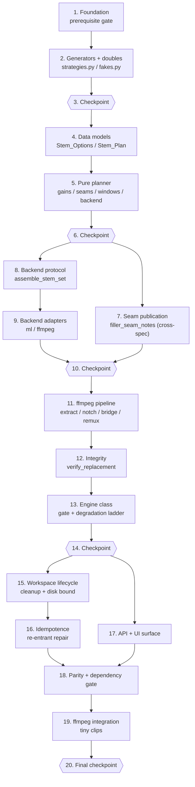

# Implementation Plan — Audio Stem Inpainting Engine

These are incremental, test-first coding steps. Execute them **one task at a time**, in
order — each task builds on the previous ones so there is never orphaned code.

This engine is built **on top of the approved
[`av-engines-foundation`](../av-engines-foundation/tasks.md) spec**, whose own plan already
lands `worker/engines/` (`base.py`, `registry.py`, `capabilities.py`, `timebase.py`,
`artifacts.py`, `host.py`), the Pipeline stage hooks, the test doubles in `tests/fakes.py`,
the shared generators in `tests/strategies.py`, **and** the `hypothesis` /
`requirements-dev.txt` / CI dependency fix. Task 1 here is therefore a **prerequisite
gate, not a re-implementation**: it verifies those modules and test utilities exist and that
the foundation suite is green. Nothing in this plan adds `hypothesis`, edits
`.github/workflows/ci.yml` or `requirements-dev.txt`, or modifies anything under
`av-engines-foundation/` or `kinetic-typography/` _(Req 20.6)_.

**Cross-spec touch point — epic 7.** This spec needs one **additive** helper,
`filler_seam_notes(keeps)`, in the foundation-owned `worker/engines/host.py`, plus one extra
keyword at the existing `run_pipeline` → host AUDIO-hook call site. It changes **no**
foundation contract, dataclass, enum, protocol, or signature — `Engine_Context.notes`
already exists with its documented free-form convention, so we add a *value*, not a field —
and it touches nothing in `filler.py`. It must land **after** the foundation has shipped
`worker/engines/host.py` and the stage hooks. Apart from that helper, its one call-site
keyword, and the API/UI surface of Req 18, `worker/engines/stems.py` is the only production
file this plan writes _(Reqs 6.1–6.3, 8.2, 20.3, 20.6)_.

Ordering is dependency-safe and pure-first: prerequisite gate → engine generators and
doubles → data models (`Stem_Options`, `Stem_Plan`, `Repair_Window`, `Audio_Format`) → the
pure planner → seam publication → the `Separator_Backend` protocol and stem assembly → the
two backend adapters → the ffmpeg pipeline → integrity verification → the `run` gate and
degradation ladder → workspace lifecycle → idempotence → API/UI surface → the flag-off
parity gate → ffmpeg integration on tiny clips. Epics 4–5 are pure functions testable with
no ffmpeg, no `demucs`, no `torch`, no model file and no network _(Reqs 1.4, 1.9, 19.2)_.

Tasks marked with `*` are optional test sub-tasks (unit / property / integration tests).
Property tests use `hypothesis` with `@settings(max_examples=100, deadline=None)`, one
property per test, tagged `# Feature: audio-stem-inpainting, Property N: <text>`, in the
exact files named in the design's Testing Strategy mapping
(`tests/test_stems_options.py`, `tests/test_stems_plan.py`, `tests/test_stems_backends.py`,
`tests/test_stems_ffmpeg.py`, `tests/test_stems_ladder.py`, `tests/test_stems_api.py`).
Word_Timelines use the existing `FakeWord` helper and ffmpeg-dependent behaviour uses the
existing `requires_ffmpeg`, `make_video`, `probe_duration` helpers from `tests/conftest.py`
_(Reqs 19.3, 19.4)_. The whole suite runs offline and CPU-only, always through the fake
backends or the ffmpeg backend, never a model file _(Reqs 19.5, 19.7)_.

Four sub-tasks are **intentionally not marked optional even though they are test/config
work**: 1.2 (proves the foundation this engine binds to is green before any binding is
written), 2.1 and 2.2 (the stem generators and doubles every later property task imports),
and 18.1 / 18.2 (the backward-compatibility parity and dependency gate, which is this
spec's central promise to an upgrading operator).

## Tasks

- [x] 1. Prerequisite gate on the AV engines foundation
  - [x] 1.1 Verify the foundation modules and contracts this engine binds to exist
    - Confirm `worker/engines/base.py` exports `AV_Engine` (with `resolve_options`/`plan`/`run`, `flag_field()`, `FLAG_SUFFIX`), `Engine_Stage.AUDIO`, `Engine_Status` (`applied`/`skipped`/`degraded`/`failed`), `Engine_Context` (`source_path`, `clip_path`, `duration`, `time_base`, `words`, `options`, `options_digest`, `seed`/`rng()`, `workspace`, `capabilities`, `permissibility`, `deadline`/`remaining()`, `notes`, `deps`), `Engine_Result` (+ `skipped`/`degraded`/`failed` constructors, `markers`, `artifacts`, `media`, `plan`, `detail`, `elapsed_s`), `Engine_Artifact`, `marker`, the `Engine_Options` protocol, the `coerce_bool`/`coerce_int`/`coerce_float`/`coerce_choice`/`coerce_str` helpers, `dump_options`, `options_digest`, and `derive_seed`.
    - Confirm `worker/engines/timebase.py` exports `Time_Base` (`snap`, `seconds_to_sample`, `sample_to_seconds`, `seconds_to_frame`, `frame_to_seconds`), `Timeline_Segment` and `normalize_segments`; `worker/engines/capabilities.py` exports `Capability_Report` (`status`, `available`, `first_missing`, `missing`) with the `python_pkg:`/`binary:`/`ffmpeg_filter:`/`model:` kinds and the `MODEL_LOCATORS` registry; `worker/engines/artifacts.py` exports `Engine_Workspace` (`path`, `artifact(name, media_type=…, durable=…)`) and the `<temp_dir>/engines/<job>/<clip>/<engine>__<digest>` allocation; `worker/engines/registry.py` exports the registry and its registration entry point; `worker/engines/host.py` exports the stage runner, the AUDIO-stage `raw = out.media or raw` handoff, and the clip finaliser.
    - Confirm the AUDIO-stage hook is already invoked from `worker/pipeline.py run_pipeline` after `filler.apply_keep_intervals` and before geometry, and record the exact hook/`notes` parameter names — epic 7 adds one keyword at that existing call site and must use the foundation's spelling, not a second one.
    - Do **not** add, rename, or widen any foundation symbol; if one is missing, stop and finish the foundation task that owns it.
    - _Requirements: 1.1, 1.2, 1.5, 1.6, 2.1, 3.3, 20.3, 20.6_
    - **VERIFIED** (every symbol imported and exercised, not grepped). Present as written:
      all of `base.py` (`AV_Engine` with `resolve_options`/`plan`/`run` + `flag_field()` classmethod
      + `FLAG_SUFFIX == "_enabled"` and the ten ClassVars, `Engine_Stage.AUDIO`, `Engine_Status`
      `applied`/`skipped`/`degraded`/`failed`, every named `Engine_Context` field **including
      `source_path`, `clip_path`, `deadline`, `notes`** with exactly those spellings plus
      `rng()`/`remaining()`, `Engine_Result` with `markers`/`artifacts`/`media`/`plan`/`detail`/
      `elapsed_s` and the `skipped`/`degraded`/`failed` constructors, `Engine_Artifact`, `marker`,
      the `Engine_Options` Protocol (`parse`, `to_dict`), all five `coerce_*` helpers,
      `dump_options`, `options_digest` (16-hex, stable, separating), `derive_seed`);
      `timebase.py` (`Time_Base.snap`/`seconds_to_sample`/`sample_to_seconds`/`seconds_to_frame`/
      `frame_to_seconds` — sample round-trip exact at 48 kHz — plus `Timeline_Segment` and
      `normalize_segments`); `capabilities.py` (`Capability_Report.status`/`available`/
      `first_missing`/`missing`, the `python_pkg:`/`binary:`/`ffmpeg_filter:`/`model:` kinds, and
      **`MODEL_LOCATORS` does exist** — an empty mutable `dict[str, Callable[[], Optional[Path]]]`
      exported in `__all__`, and `model:<name>` was confirmed to resolve through it, reporting
      unavailable for an unregistered name and for a registered-but-absent file);
      `artifacts.py` (`Engine_Workspace.artifact(name, *, media_type="data", durable=False)` and
      the `<temp_dir>/engines/<job>/<clip>/<engine>__<digest>` allocation, confirmed exactly);
      `registry.py` (`Engine_Registry`, `Engine_Record`, `get_registry`, `register`,
      `reset_registry`).
    - **CORRECTIONS — bind to these shipped names, do not add the checklist's spellings:**
      1. `Engine_Workspace.path` is a **method** `path(*parts) -> Path` (sanitising, traversal-safe);
         the directory attribute is `Engine_Workspace.root`. Its dataclass fields are
         `root, temp_dir, job_id, clip_id, engine_id, options_digest`. Epics 11/15 must write
         `ws.path("in.wav")`, `ws.path("stems", "vocals.wav")`, never `ws.path / "in.wav"`.
      2. `allocate_workspace(temp_dir, job_id, clip_id, engine_id, options_digest, *, create=True)`
         — the fifth parameter is `options_digest`, not `digest`.
      3. `Engine_Artifact` has a fifth field `storage_key: str = ""` (host-written on persistence).
      4. There is **no** `Engine_Result.applied()` constructor — an applied outcome is built with
         `Engine_Result(engine_id=…, status=Engine_Status.APPLIED, media=…, …)` directly.
      5. `host.py` exports `SOURCE_CLIP_ID`, `MIN_WALL_TIMEOUT_S`, `DEGRADED_DETAIL_PREFIX`,
         `Stage_Outcome`, `Engine_Host`. The stage runner is the **single generic**
         `Engine_Host.run_stage(stage, *, clip_id, source, clip_path, clip_start, clip_end,
         duration, words=(), clip_metadata=None)` — there is no `run_audio_stage`. The clip
         finaliser is `Engine_Host.finish_clip(clip_id) -> list[str]` (**not** `finalize_clip`);
         `finish_job()` and `run_source(source, info)` complete the surface.
      6. The `raw = out.media or raw` handoff line lives in **`worker/pipeline.py` `run_pipeline`**
         (AUDIO block), not in `host.py`. What `host.py` owns is the adoption gate at
         `Engine_Host.run_stage`: `outcome.media = result.media` only when
         `result.media is not None and result.status is Engine_Status.APPLIED and
         engine.produces_media`.
      7. **BLOCKER for epic 13.3/13.7 — Degraded_With_Media does not work on the shipped host.**
         Verified live: an AUDIO engine returning `status=degraded` **with** media has that media
         **dropped** (`Stage_Outcome.media is None`), because the gate above admits `APPLIED`
         only. `applied` + media and `skipped`/`failed` + no-media all behave as designed, and a
         `failed` result's media is discarded too. Since this gate forbids widening the
         foundation, epics 13.3/13.5/13.7 must either return `Engine_Status.APPLIED` for rungs
         7-9 while still emitting their `degraded:<capability_id>` markers, or the change must be
         raised as a foundation task — **ask the user before choosing.**
      8. `normalize_segments(segments, duration, *, time_base=None, min_duration=0.0)` accepts only
         `Mapping`s with numeric `start`/`end` keys or `Timeline_Segment`s — plain `(start, end)`
         tuples are silently **dropped**. Task 5.3 must feed it mappings/`Timeline_Segment`s.
      9. `Engine_Context` has three fields the checklist does not name: `time_budget_s`,
         `first_input_index`, `clip_metadata` (the last is appended last by contract).
    - **AUDIO hook, recorded for epic 7** (verified by index order in `worker/pipeline.py`): the
      hook is invoked in the `if host.active:` block **after** `filler.apply_keep_intervals` /
      `filler.rebase_words` and **before** the geometry ladder, as
      `host.run_stage(Engine_Stage.AUDIO, clip_id=clip_id, source=source, clip_path=raw,
      clip_start=c.start, clip_end=c.end, duration=clip_duration, words=words)` followed by
      `raw = out.media or raw` and `applied.extend(out.markers)`. **There is no `notes=` keyword
      anywhere on the host's public surface**: notes are assembled inside the private
      `Engine_Host._build_context(engine, coerced, *, clip_id, source, clip_path, clip_start,
      clip_end, duration, words, first_input_index=0, clip_metadata=None)` as a local
      `notes = (f"fps_fallback:{…}",) if base.fps_substituted else ()`. So epic 7's "one extra
      keyword at the existing call site" means adding a new keyword parameter to the public
      `run_stage` **and** threading it into `_build_context` — i.e. an additive signature change
      to a foundation method, which the plan's preamble claims not to make. `filler_seam_notes`
      is confirmed absent today. Epic 7 must reconcile this with the user first.
    - **RE-VERIFIED** on a second pass by re-importing every symbol and re-exercising the live
      host handoff: 154 checks pass, and correction 7 reproduces exactly (an AUDIO engine
      returning `degraded` **with** media still yields `Stage_Outcome.media is None`). The AUDIO
      call site in `worker/pipeline.py` is unchanged from the record above (lines ~294–301,
      `if host.active:` → `host.run_stage(Engine_Stage.AUDIO, clip_id=…, source=…, clip_path=raw,
      clip_start=c.start, clip_end=c.end, duration=clip_duration, words=words)` → `raw =
      out.media or raw` → `applied.extend(out.markers)`), and the host gate is literally
      `result.media is not None and result.status is Engine_Status.APPLIED and
      bool(getattr(engine, "produces_media", False))` (`worker/engines/host.py` ~596–601).
      No foundation symbol was added, renamed or widened by this gate.

  - [x] 1.2 Verify the foundation suite and property toolchain are green before binding to them
    - Run `pytest tests/test_engines_base.py tests/test_engine_registry.py tests/test_engine_capabilities.py tests/test_engine_timebase.py tests/test_engine_artifacts.py tests/test_engine_host.py -q` and confirm it passes.
    - Confirm `tests/fakes.py` provides the foundation doubles (prober/storage/clock/engine fakes) and that `tests/strategies.py` provides `st_options_mapping`, `st_word_timeline`, `st_time_base`, `st_segment_records`, `st_availability_map`, `st_engine_outcomes`; confirm `hypothesis` imports (the foundation already declares it in `requirements-dev.txt` — do **not** re-add it, and do **not** touch `.github/workflows/ci.yml`).
    - Confirm the existing `tests/conftest.py` helpers `requires_ffmpeg`, `make_video`, `probe_duration`, `FakeWord` are importable, and that `worker/ffmpeg_utils.py` exports `probe`, `MediaInfo`, `FFmpegError` (`MediaInfo` carries no sample rate or channel count — this engine adds its own private `ffprobe` read rather than widening it).
    - _Requirements: 19.1, 19.3, 19.4, 19.7, 20.6_
    - **VERIFIED** (every name imported and drawn/called, not grepped). `requirements-dev.txt`
      and `.github/workflows/ci.yml` were read only and left untouched.
      - **Foundation subset green:** `pytest tests/test_engines_base.py tests/test_engine_registry.py
        tests/test_engine_capabilities.py tests/test_engine_timebase.py tests/test_engine_artifacts.py
        tests/test_engine_host.py -q` → **76 passed, 0 failed** (14.4 s).
      - **Full suite:** `pytest -q` → **336 passed, 75 skipped, 0 failed** (35.6 s) with ffmpeg off
        `PATH`; all 75 skips are the `requires_ffmpeg` marker. With ffmpeg/ffprobe on `PATH`:
        **410 passed, 1 failed** (127 s) — see the pre-existing failure below.
      - **`tests/strategies.py`** provides all six 1.2 names, each drawing successfully:
        `st_options_mapping(*, max_size=6)`, `st_word_timeline(*, min_words=1, max_words=8)`,
        `st_time_base(*, sample_rates=(8000…96000))`, `st_segment_records(*, duration=30.0,
        min_size=0, max_size=8)`, `st_availability_map(*, max_size=8)`,
        `st_engine_outcomes(*, engine_id=None, max_markers=3, max_artifacts=2,
        allow_exception=True)`. None of the epic-2.1 stem generators exist yet, as expected.
      - **`tests/fakes.py`** provides the foundation doubles under these exact names — prober:
        `StaticProber`, `CountingProber`, `RaisingProber`; storage: `RecordingStorage`; clock:
        `FakeClock`; engine: `FakeEngine`, `RaisingEngine`, `SlowEngine`; plus the
        `FakeDiarizationBackend` / `RaisingDiarizationBackend` naming pattern epic 2.2 must follow.
        None of the epic-2.2 stem doubles exist yet, as expected.
      - **`hypothesis` imports** (6.163.0) and `settings(max_examples=100, deadline=None)` is
        usable; it is already declared in `requirements-dev.txt` (line 8,
        `hypothesis>=6.100,<7.0`) and was **not** re-added. `.hypothesis/` is gitignored.
      - **`worker/ffmpeg_utils.py`**: `probe(path: str | Path) -> MediaInfo`, `MediaInfo`,
        `FFmpegError` all present; `MediaInfo` fields are exactly
        `duration, width, height, fps, has_audio` — **no** `sample_rate`/`channels`, confirming
        task 11.1's private `ffprobe` read instead of widening it.
    - **CORRECTIONS — bind to these shipped shapes, do not add the checklist's spellings:**
      1. `FakeWord.__init__(self, start, end, text)` — the order is **(start, end, text)**, not
         `(text, start, end)`. Epic 2.1's `st_keep_plan`/`st_word_timeline`-composing generators
         and every later test must construct `FakeWord(0.0, 0.5, "hi")`. It also sets
         `.probability = 1.0`.
      2. `make_video` is a **pytest fixture** (a factory), not an importable function: request it
         as a test argument and call `make_video(name="src.mp4", duration=3.0, w=1280, h=720,
         audio=True) -> Path`, writing under the test's `tmp_path`. `probe_duration(path) ->
         float` and `requires_ffmpeg` are module-level and importable from `tests.conftest`.
         `conftest.py` also offers `probe_size(path) -> (w, h)` and the `png_asset` fixture.
      3. `requires_ffmpeg` is `pytest.mark.skipif` driven by `shutil.which(settings.ffmpeg_binary)`.
         In this sandbox ffmpeg/ffprobe are **not** on the default `PATH` (binaries live at
         `/projects/sandbox/.ffbin`), so every ffmpeg-dependent test in epics 11/12/15/19 will
         **skip** unless `PATH` is extended for the run — a skip is not a pass; run those epics'
         integration tests with ffmpeg on `PATH` before claiming them green.
      4. Run tests with **Python 3.11** (matching `ci.yml`'s `python-version: "3.11"`); the
         sandbox default `python3` is 3.9 and has no `hypothesis`/`pytest` installed.
      5. **Pre-existing sibling-spec failure, not ours and not to be fixed here:**
         `tests/test_kinetic_plan.py::test_p12_malformed_timings_degrade_instead_of_raising`
         fails when ffmpeg is on `PATH` with counterexample `Time_Base(fps=14.0,
         sample_rate=8000)` + `st_broken_word_timeline()` — a synthesised word of
         `3.357142857142857 - 3.2857142857142856 = 0.0714 s` violates `MIN_WORD_S = 0.08`
         (frame-snapping at 14 fps shrinks the invented interval below the documented minimum).
         It is a `kinetic-typography` property, which Req 20.6 forbids this spec from touching,
         and it is now cached in the local `.hypothesis` example database so it will replay.
         Epic 18.1's parity assertions must not be built on a "whole suite green" premise:
         treat this test as a known-red baseline owned by `kinetic-typography`, or ask the user
         to route it to that spec first.

- [x] 2. Stem-specific generators and test doubles
  - [x] 2.1 Add the stem generators to the existing `tests/strategies.py`
    - Extend the existing shared module (do not create a parallel one) with `st_stem_options` (valid `Stem_Options` field mappings across the declared bounds), `st_stem_gains` (per-`STEM_NAMES` gains over `[0.0, 4.0]` including `0.0`, `1.0` and boost values), `st_mix_preset` (`custom`, `speech_focus`, `music_focus`, `clean_speech`), `st_repair_mode` (`off`, `crossfade`, `spectral`), `st_repair_window_ms` (in-range and out-of-range integers and non-numerics).
    - Add `st_keep_plan` (`FillerPlan` keep lists of `Interval`s, including single-keep, adjacent, zero-length and many-keep cases), `st_seam_notes` (valid `filler_seam:<float>` tuples mixed with hostile notes: malformed prefixes, non-finite, negative, out-of-bounds, duplicates, other engines' notes), `st_audio_format` (valid sample rate/channel/codec/`start_time` combinations plus missing, zero and negative values), `st_pcm_frames` (tiny float frame buffers including silence, anti-phase and full-scale content), `st_backend_stem_sets` (four-stem, two-stem, unknown-name and omission mappings in arbitrary dict order), `st_gate_scenarios` (capability availability × remaining budget × forced failure, composable with the foundation `st_availability_map`), `st_failure_points` (backend raising / truncating / non-audio, `FFmpegError`, timeout, integrity failure, `OSError`), and `st_tiny_clip` (tiny-clip parameters for `make_video`).
    - Generators emit `FakeWord` instances and `Interval`s from the existing helpers so they compose with the foundation's `st_word_timeline`; this sub-task is **not optional** because every later property task imports these names.
    - _Requirements: 19.1, 19.2, 19.6_
    - **DONE** — all thirteen generators added as tranche 4 of the existing `tests/strategies.py`
      (never a parallel module): `st_stem_options`, `st_stem_gains`, `st_mix_preset`,
      `st_repair_mode`, `st_repair_window_ms`, `st_keep_plan`, `st_seam_notes`,
      `st_audio_format`, `st_pcm_frames`, `st_backend_stem_sets`, `st_gate_scenarios`,
      `st_failure_points`, `st_tiny_clip`. Each was drawn 25–120 times in a throwaway
      harness (since deleted) and asserted to produce the documented shapes, not merely to
      import: all four presets / three repair modes / three backends appear, gains reach
      `0.0`, `1.0` and `4.0` exactly, keep plans include the single-keep, adjacent and
      zero-length cases, 19 distinct malformed seam spellings are rejected while their
      well-formed neighbours survive, all eight PCM kinds appear (anti-phase cancels,
      full-scale peaks at exactly 1.0), `drums` + `bass` sum into `music`, and the budget
      draws land in all four gate buckets.
    - **BINDINGS FOR LATER EPICS — read before starting 4.1:**
      1. `st_stem_options` and `st_audio_format` emit **plain dicts** (field mappings), not
         `Stem_Options` / `Audio_Format` instances: those dataclasses land in 4.2/4.4, and a
         mapping is exactly what `parse` consumes. After 4.2, callers write
         `Stem_Options.parse(draw(st_stem_options()))`. `st_keep_plan` is the one exception —
         it emits real `worker.effects.filler.FillerPlan`/`Interval` objects, which already exist.
      2. The vocabularies (`STEM_NAMES`, `STEM_MAPPING`, `MIX_PRESETS`, `MIX_PRESET_CHOICES`,
         `REPAIR_MODES`, `BACKEND_IDS`, `GAIN_*`, `WINDOW_*`) are **mirrored** as literal
         constants in `tests/strategies.py`, exactly as `CAPABILITY_KINDS` mirrors
         `Capability_Kind`, because `worker/engines/stems.py` does not exist yet. **Task 4.1
         must define exactly these values** and 4.x's first test must pin
         `tuple(stems.STEM_NAMES) == strategies.STEM_NAMES` and its siblings so the
         duplication cannot drift.
      3. `st_tiny_clip` yields only the `make_video` **kwargs** (`name`/`duration`/`w`/`h`/
         `audio`), never a file, so the module stays pure and offline; call
         `make_video(**draw(st_tiny_clip()))` inside a `requires_ffmpeg` test.
      4. `st_seam_notes`, `st_backend_stem_sets`, `st_gate_scenarios`, `st_failure_points`,
         `st_pcm_frames` and `st_audio_format` return **dicts with oracle keys**
         (`expected_seams`, `expected_contributors`, `expected_missing`, `expected_status`,
         `peak`, …), so the properties assert against a generator-side oracle rather than
         re-deriving the answer from the code under test.
    - **CORRECTIONS to the checklist's wording:**
      1. **The pinned `__all__` list had to be extended.**
         `tests/test_engines_base.py::test_shared_test_doubles_and_generators_are_pinned`
         asserts `list(strategies.__all__) == [...]` by **exact equality**, so "add the
         generators to the shared module" and "the suite stays green" cannot both hold
         without editing that list. It was extended additively (25 new names, list still
         sorted, nothing renamed or removed) — the same thing the kinetic tranche did, per
         that test's own comment. `tests/test_engines_base.py` is a test file, not part of
         `.kiro/specs/av-engines-foundation/`, so Req 20.6 is untouched; no foundation
         production symbol was added, renamed or widened.
      2. **`Stem_Options` is a ten-field surface, not eleven.** Task 4.2's own enumeration
         and design.md both list ten fields; the "eleventh" is the Feature_Flag
         `stem_inpainting_enabled`, which lives on Processing_Options, not on
         `Stem_Options`. `st_stem_options` emits the ten and adds the flag only under
         `include_enabled=True`.
      3. **`STEM_MAPPING` has no `music` key, but the ffmpeg adapter emits a `music`
         Backend_Stem** (`music := clip − vocals`, design ~line 402). Left for **8.2**:
         `assemble_stem_set` must resolve a Backend_Stem name through `STEM_MAPPING`
         *first* and then fall back to **identity when the name is already a Stem_Name**,
         or 4.1 must add `"music": "music"` to `STEM_MAPPING`. Without one of the two the
         ffmpeg backend's entire music stem is silently discarded and replaced with
         silence. `st_backend_stem_sets` draws both two-stem spellings — `(music, vocals)`
         and `(other, vocals)` — so no property is blind to either.
      4. "Generators emit `FakeWord` instances" is satisfied by **composing** the
         foundation's `st_word_timeline` (whose `FakeWord` is `(start, end, text)`); no stem
         generator constructs one directly, because the Seam source is the `FillerPlan`
         keep list, not the Word_Timeline.

  - [x] 2.2 Add the stem test doubles to the existing `tests/fakes.py`
    - Extend the existing module with `Fake_Separator_Backend` (writes synthetic per-stem WAVs at the requested `Audio_Format`, records `separate` calls, seed and timeout, and can be configured to sum back to the input exactly), `Raising_Separator_Backend`, `Truncating_Separator_Backend` (wrong-duration output), `Missing_Stem_Backend` (omits one or more Backend_Stems), `Network_Separator_Backend` (`requires_network = True`, for the permissibility rung), `Recording_Command_Runner` (records every argv and timeout, replays canned `CompletedProcess`/`ffprobe` JSON, and can raise `FFmpegError` or `subprocess.TimeoutExpired` at a chosen call index), and `Seam_Note_Fixtures` (named `notes` tuples for the seam cases).
    - Follow the established naming/pattern of the existing `FakeDiarizationBackend` / `RaisingDiarizationBackend` doubles; require no numeric stack, no model file and no network so the suite stays fast, offline and CPU-only. This sub-task is **not optional** because every later property task imports these names.
    - _Requirements: 19.1, 19.3, 19.5, 19.7_
    - **DONE** — all seven doubles added to the existing `tests/fakes.py`:
      `Fake_Separator_Backend`, `Raising_Separator_Backend`, `Truncating_Separator_Backend`,
      `Missing_Stem_Backend`, `Network_Separator_Backend`, `Recording_Command_Runner`,
      `Seam_Note_Fixtures`, plus the support surface `BACKEND_STEM_NAMES`,
      `Separate_Call`/`Command_Call` namedtuples, `read_audio_format`, `write_pcm_wav`,
      `read_pcm_wav` and the `FAKE_*` defaults. Stdlib only — WAVs are written with `wave`
      + `struct` and the waveform is integer arithmetic, so there is **no numpy/torch/
      scipy/soundfile import, no ffmpeg subprocess, no model file and no socket**; verified
      by a throwaway harness (since deleted) that reopened every emitted WAV with `wave`.
    - **BINDINGS FOR LATER EPICS:**
      1. `separate(source, dest_dir, *, fmt, seed, timeout_s) -> dict[str, Path]` on every
         backend, matching the designed protocol; `Fake_Separator_Backend.calls` records
         `Separate_Call(source, dest_dir, fmt, seed, timeout_s)` **before** doing any work,
         so a raising backend's seed and timeout are still assertable.
      2. `fmt` is **duck-typed** through `read_audio_format(fmt)` (`Audio_Format`,
         `SimpleNamespace`, a mapping or even `None` all work; missing / non-numeric /
         zero / negative / non-finite values fall back to `FAKE_SAMPLE_RATE` /
         `FAKE_CHANNELS`, because `wave` refuses a non-positive rate or channel count).
         This is what lets the doubles predate `Audio_Format` (4.4) and keep working after
         it lands, unchanged.
      3. `sum_to_input=True` makes the stems sum back to the input **exactly, sample for
         sample**, by putting the whole signal in one stem and digital silence in the rest —
         no arithmetic, so Property 10's additive-decomposition claim is testable at zero
         tolerance. When `source` is already a WAV at `fmt`, its frames are copied verbatim
         and `copied_source[-1]` records it.
      4. `Recording_Command_Runner` is the single evidence source for the cost invariants:
         `ffmpeg_calls` (non-probe invocations) is what Req 15.9's "at most 2 media passes,
         constant in the Seam count" is asserted on, `probe_calls` covers the ffprobe reads,
         `timeouts` records `None` when a caller **forgot** an explicit timeout (which is what
         Req 15.4 needs to catch), and `fail_at=` / `timeout_at=` inject `FFmpegError` /
         `subprocess.TimeoutExpired` at a chosen 0-based call index, recording the failing
         call before raising.
      5. It accepts **both** timeout spellings — `runner(argv, timeout_s=…)` and
         `runner(argv, timeout=…)` — because the design's `Command_Runner` alias is
         positional-only (`Callable[[Sequence[str], float], CompletedProcess]`) and names
         nothing. Epic 11 should pick one spelling and stay with it.
      6. Its canned ffprobe JSON follows the `streams[0].sample_rate/channels/codec_name/
         start_time` + `format.duration` shape, which is the query 11.1's private ffprobe
         read must use — `worker/ffmpeg_utils.MediaInfo` genuinely carries no sample rate or
         channel count, as the epic-1 gate recorded.
    - **CORRECTIONS to the checklist's wording:**
      1. The task asks for both the `FakeDiarizationBackend` naming *pattern* and the
         `Fake_Separator_Backend` Snake_Case spellings. The design's spellings won for the
         names; the diarisation pair's **structure** (canned double + narrow raising
         variant, a `calls` list, a docstring naming the protocol) was copied.
      2. `Fake_Separator_Backend` has **no non-audio switch** — it writes real WAVs by
         design. `st_failure_points`' `backend_non_audio` row therefore means "install the
         plain fake, then overwrite the stem file it returned with a non-audio payload";
         corrupting the output is the test's job, and the generator documents that.
      3. `Missing_Stem_Backend`'s docstring originally called `missing=("bass", "drums")`
         "the ffmpeg adapter's two-stem shape", which is the `(other, vocals)` spelling and
         contradicts the design's `(vocals, music)`. This is the same `music`-key gap
         recorded under 2.1 correction 3 and is settled at 8.2.
      4. **Bug found and fixed during review:** `read_audio_format` caught only
         `(TypeError, ValueError)`, but `int(float("inf"))` raises `OverflowError`, so it
         crashed on roughly one in sixty hostile `st_audio_format` draws. `OverflowError` was
         added to the except clause and the totality re-verified over 300 hostile draws.

- [x] 3. Checkpoint — foundation gate and test scaffolding complete
  - Ensure all tests pass, ask the user if questions arise.
  - **DONE.** `PATH=<static ffmpeg>:$PATH PYENV_VERSION=3.11.15 python3 -m pytest tests/ -q`
    → **411 passed, 0 failed, 0 skipped** (81 s) with `ffmpeg`/`ffprobe` on `PATH`, i.e. the
    75 `requires_ffmpeg` tests really ran rather than skipping. Two open questions were
    recorded rather than guessed: the `music` Backend_Stem mapping gap (2.1 correction 3,
    settled at 8.2) and the ten-vs-eleven `Stem_Options` field count (2.1 correction 2).
  - **NOTE on the P12 baseline:** the handoff's "410 passed / 1 failed" assumed the
    `kinetic-typography` P12 counterexample cached in a local `.hypothesis` example
    database. In a fresh sandbox that database is empty and `hypothesis` does **not**
    rediscover the counterexample within `max_examples=100`, so the honest baseline here is
    411 passed / 0 failed — P12 is **latent, not fixed**, and can resurface on any run. It
    still belongs to its own bugfix spec; do not treat a green P12 as evidence.

- [x] 4. Module skeleton, constants, and data models
  - [x] 4.1 Create `worker/engines/stems.py` with its vocabularies and documented constants
    - New module with a docstring stating that it imports cleanly with no ffmpeg, no `demucs`, no `torch` and no model file present; stdlib + `worker.engines.*` imports only at module scope, every heavy dependency reached through a function-local lazy import.
    - Define `STEM_NAMES = ("music", "other", "vocals")` (sorted), `STEM_MAPPING` (`vocals`→`vocals`, `drums`/`bass`→`music`, `other`→`other`), `MIX_PRESETS` (`speech_focus`, `music_focus`, `clean_speech` bundles exactly as designed), `REPAIR_MODES`, `BACKEND_IDS`, `GAIN_MIN`/`GAIN_MAX`/`GAIN_DEFAULT`, `WINDOW_MIN_MS`/`WINDOW_MAX_MS`/`WINDOW_DEFAULT_MS`, `AMPLITUDE_TOLERANCE`, `DISK_BOUND_MULTIPLE`, `MAX_BRIDGE_WINDOWS`, `NOTCH_EXPR_CHUNK`, `ML_THREAD_COUNT`, `MODEL_DIR_ENV`, `MODEL_DIR_DEFAULT`, and the step reserve/threshold constants (`EXTRACT_RESERVE_S`, `SEPARATE_RESERVE_S`, `REPAIR_RESERVE_S`, `REMUX_RESERVE_S`, `MIN_STEP_TIMEOUT_S`, `SEPARATION_MIN_S` per backend, `REPAIR_MIN_S`, `REMUX_MIN_S`).
    - _Requirements: 1.4, 4.1, 4.2, 5.1, 5.4, 7.1, 7.6, 10.6, 11.7_

  - [x] 4.2 Implement the `Stem_Options` frozen dataclass with total `parse` and `to_dict`
    - Exactly the eleven-field surface designed: `mix_preset`, `gain_vocals`, `gain_music`, `gain_other`, `repair_mode`, `repair_window_ms`, `declick`, `backend`, `model`, `retain_stems` — every field a JSON-serialisable scalar so the foundation `Engine_Options` protocol is satisfied.
    - `parse` is total and never raises: `coerce_choice` against the declared value sets for `mix_preset`/`repair_mode`/`backend` with the documented default on an unrecognised value, `coerce_float` + finite + `[0.0, 4.0]` range check for the gains, `coerce_int` + clamp into `[2, 120]` for the window, `coerce_bool` for the flags, `coerce_str` for the model name; named keys only, so unknown keys are ignored. `to_dict` emits every field in sorted key order with JSON-native types.
    - _Requirements: 9.1, 9.2, 9.3, 9.5, 5.4, 7.6, 18.5_

  - [x] 4.3 Implement `Stem_Options.from_processing_options` and the engine's `resolve_options`
    - Read the `stem_*` attributes off the supplied Processing_Options (already normalised by `worker.models.effective_options`) and route each through `parse`, so resolution is pure, total and idempotent — coercing an already-valid value is the identity.
    - Read attributes only; never write to the supplied Processing_Options, so the host observes `dataclasses.asdict(options)` unchanged after every invocation.
    - _Requirements: 1.3, 9.6, 20.2_

  - [x] 4.4 Implement `Audio_Format`, `Repair_Window` and `Stem_Plan`
    - `Audio_Format(sample_rate, channels, codec, start_time)` frozen; `Repair_Window(start, end, seams)` frozen with `to_dict`.
    - `Stem_Plan` frozen with exactly the designed fields (`backend`, `model`, `gains`, `active_stems`, `repair_mode`, `repair_window_ms`, `seams`, `windows`, `sample_rate`, `channels`, `duration`, `declick`, `needs_separation`, `missing_capabilities`, `downgraded_from`, `bridged_windows`, `notched_windows`) and a `to_dict()` that emits sorted JSON-native keys so it can be compared field-by-field and returned in `Engine_Result.plan`.
    - _Requirements: 10.1, 10.7, 5.7, 6.8_

  - [x]* 4.5 Property test: options round-trip and digest separation → `tests/test_stems_options.py`
    - **Property 3: Stem_Options round-trips and its digest separates exactly the distinct values** — for any valid `Stem_Options`, `parse(to_dict(o)).to_dict() == o.to_dict()`; for any pair, the Options_Digests are equal when the values are equal and differ when any field value differs. Generator: `st_stem_options`.
    - _Requirements: 9.4, 9.7_ · _Properties: P3_

  - [x]* 4.6 Property test: parsing is total under hostile input → `tests/test_stems_options.py`
    - **Property 4: Parsing is total — hostile input yields documented defaults, never an exception** — for any mapping of arbitrary values, `Stem_Options.parse` returns a value without raising, with `mix_preset`/`repair_mode`/`backend` members of their declared sets, every gain finite and inside `[0.0, 4.0]`, and `repair_window_ms` inside `[2, 120]`. Generator: `st_options_mapping`.
    - _Requirements: 5.4, 7.6, 9.3, 9.5, 18.5_ · _Properties: P4_

  - [x]* 4.7 Property test: resolution is idempotent and survives the options round-trip → `tests/test_stems_options.py`
    - **Property 5: Option resolution is idempotent and survives the ProcessingOptions round-trip** — for any Processing_Options, `resolve_options` applied twice yields equal `Stem_Options`, and `ProcessingOptions.from_dict(dataclasses.asdict(o)) == o`. Generators: `st_options_mapping`, `st_stem_options`.
    - _Requirements: 9.6, 9.8, 20.2_ · _Properties: P5_

- [x] 5. The pure planner
  - [x] 5.1 Implement `resolve_gains`
    - A non-`custom` Mix_Preset returns exactly its `MIX_PRESETS` bundle and ignores the individual gain fields; `custom` returns the validated fields; any non-numeric, negative, non-finite or over-maximum field is replaced by `GAIN_DEFAULT`. Return a mapping keyed by `STEM_NAMES` so iteration order is sorted.
    - _Requirements: 5.1, 5.2, 5.3, 5.4_

  - [x] 5.2 Implement `parse_seam_notes`
    - Keep only well-formed `filler_seam:<float>` notes whose value is finite and inside `[0, duration]`; discard malformed, non-finite, negative and out-of-bounds notes individually while retaining the remaining valid ones; read no other note prefix and infer no Seam from the waveform or from Word_Timeline gaps. Return a sorted, de-duplicated list.
    - _Requirements: 6.4, 6.5, 6.6_

  - [x] 5.3 Implement `repair_windows`
    - Build a symmetric `repair_window_ms` window per Seam, snap the bounds to sample boundaries through `Time_Base`, clamp to `[0, duration]`, then run the list through the foundation `normalize_segments` so the result is sorted, pairwise disjoint and contained — which is what makes overlapping windows merge into one `Repair_Window` repaired exactly once, carrying every merged Seam in `Repair_Window.seams`.
    - _Requirements: 6.7, 6.8, 7.7_

  - [x] 5.4 Implement `resolve_backend` and `resolve_repair_mode`
    - `resolve_backend(opts, caps, needs_separation) -> (backend_id, missing_capability_ids)`: `auto` resolves to `ml` only when both `python_pkg:demucs` and `model:<model>` are available, otherwise `ffmpeg`; an explicit `ml` request with a missing capability also resolves to `ffmpeg` and reports the missing ids so the caller can emit one `degraded:<capability_id>` marker each. A backend that would fetch a checkpoint over the network is treated as model-unavailable here.
    - `resolve_repair_mode(requested, backend) -> (mode, downgraded)`: `spectral` on a non-`ml` backend returns `("crossfade", True)`.
    - _Requirements: 12.4, 12.6, 13.1, 13.2, 7.3, 7.4_

  - [x] 5.5 Implement `plan_stems`, the `plan(ctx)` entry point and the no-op predicate
    - Compose the helpers above into a serialisable `Stem_Plan`: resolved gains, `active_stems` (gain > 0.0 only), resolved backend and model, Seam list, `Repair_Window` list, probed sample rate/channels/duration, `declick`, `needs_separation` (any gain != 1.0 or `repair_mode == "spectral"`), `missing_capabilities`, `downgraded_from`.
    - `plan(ctx)` is **pure**: no ffmpeg, no `demucs` import, no network, no model read, no clock, no filesystem; randomness only via `ctx.rng()`; it never reads `ctx.source_path`, and every timestamp is derived from `[0, ctx.duration]` and the rebased `ctx.words`, so no source-relative time can reach the audio processing.
    - Add the pure `plan_is_noop(plan)` predicate (all resolved gains `1.0` **and** `repair_mode == "off"`) that ladder rung 3 consumes before any probe or subprocess.
    - _Requirements: 1.9, 2.2, 2.3, 2.7, 2.8, 5.6, 5.7, 10.1, 10.2, 10.7, 12.5, 19.2_

  - [x]* 5.6 Property test: planning is pure and never mutates the caller → `tests/test_stems_plan.py`
    - **Property 1: Planning is pure and never mutates the caller** — for any `Stem_Options`, Seam_Note tuple, Word_Timeline and Time_Base, `plan(ctx)` performs zero command-runner invocations, imports no separation package, opens no socket, reads no model file, leaves `dataclasses.asdict(ctx.options)` identical, and every attempted `Engine_Context` field assignment raises. Generators: `st_stem_options`, `st_seam_notes`, `st_word_timeline`, `st_time_base`.
    - _Requirements: 1.3, 1.9, 2.7, 10.2, 12.5_ · _Properties: P1_

  - [x]* 5.7 Property test: equal inputs produce equal plans that name their environment → `tests/test_stems_plan.py`
    - **Property 2: Equal inputs produce equal plans, and the plan names its environment** — for any two invocations with equal clip audio, Seam_Note tuple, Word_Timeline and `Stem_Options`, `plan(ctx).to_dict()` values are equal, every plan timestamp lies inside `[0, duration]`, and `backend` and `model` are non-empty. Generators: `st_stem_options`, `st_seam_notes`, `st_word_timeline`.
    - _Requirements: 2.3, 2.8, 10.1, 10.7_ · _Properties: P2_

  - [x]* 5.8 Property test: seam intake is robust and windows are always normalised → `tests/test_stems_plan.py`
    - **Property 7: Seam intake is robust and windows are always normalised** — for any note tuple mixing arbitrary strings with valid `filler_seam:` notes, the planned Seam list is exactly the finite, in-bounds `filler_seam:` values with no inferred extras, and the planned `Repair_Window` list is sorted, pairwise non-overlapping and contained in `[0, duration]`. Generators: `st_seam_notes`, `st_repair_window_ms`.
    - _Requirements: 6.4, 6.5, 6.6, 6.7, 6.8_ · _Properties: P7_

  - [x]* 5.9 Property test: gain resolution follows the preset rules and zero means excluded → `tests/test_stems_backends.py`
    - **Property 11: Gain resolution follows the preset rules, and zero means excluded** — for any Mix_Preset and gain-field combination, a non-`custom` preset yields exactly its documented bundle and ignores the fields, `custom` yields the validated fields, every stem whose resolved gain is `0.0` appears in neither `active_stems` nor the emitted filtergraph, and the marker set contains `mix:<mix_preset>` exactly once. Generators: `st_mix_preset`, `st_stem_gains`.
    - Depends on the mix filtergraph emitter (11.3) and the applied rung (13.4) for the marker assertion; schedule it after those land.
    - _Requirements: 5.1, 5.2, 5.3, 5.7, 5.8_ · _Properties: P11_

  - [x]* 5.10 Property test: the no-op configuration costs nothing → `tests/test_stems_plan.py`
    - **Property 8: The no-op configuration costs nothing** — for any `Stem_Options` whose resolved gains are all `1.0` and whose Repair_Mode is `off`, `run` returns `skipped` with no media, zero command-runner invocations, zero backend calls and no file created in the workspace; the same holds for any options while the Feature_Flag is disabled (no workspace allocated, no exclusive capability probed, no media pass). Generators: `st_stem_options`, `st_options_mapping`.
    - Asserts ladder rungs 0 and 3, so schedule it after 13.2.
    - _Requirements: 5.6, 7.10, 15.8_ · _Properties: P8_

- [x] 6. Checkpoint — pure planner complete
  - Ensure all tests pass, ask the user if questions arise.
  - **DONE.** `PATH=<static ffmpeg>:$PATH PYENV_VERSION=3.11.15 python3 -m pytest tests/ -q`
    → **423 passed, 0 failed, 0 skipped** (85 s). `ruff check` is clean on all four new stem
    files. The pure planner was additionally re-verified by hand against the **real** filler
    code (not only against generators): `plan_keep_intervals` on a transcript with two
    disfluencies produced keeps `[(0,0.78), (1.07,1.98), (2.32,3.4)]`, publication yielded
    exactly `('filler_seam:0.780', 'filler_seam:1.690')` — one per interior join, each equal
    to the running sum of keep durations — and each seam falls strictly between the
    surrounding `rebase_words` output (`0.750 < 0.780 < 0.810`, `1.610 < 1.690 < 1.720`), so
    no word straddles a repair window. Crossfade windows came out symmetric at
    `(0.72, 0.84)` and `(1.63, 1.75)` for a 120 ms setting, and `spectral` with no `demucs`
    downgraded to `crossfade` reporting `('python_pkg:demucs', 'model:htdemucs')`.
  - **NOTE — a seam is not a word boundary.** `plan_keep_intervals` pads each keep past the
    words it contains, so the join lands *inside* the padding: `0.780` is 30 ms after the
    previous word ends and 30 ms before the next one starts. A first attempt to verify the
    seam against the exact rebased word times failed for that reason — the oracle was wrong,
    not the code. Any later assertion must compare a seam to the **running sum of keep
    durations**, and only bracket it between the neighbouring word times.

  - **Epic 4-5 corrections (bind to these):**
    1. **Gains out of range become `GAIN_DEFAULT`, they are not clamped.** Task 4.2 says
       "range check", Req 5.4 says "substitute the documented default" — so `-1.0` and
       `9.0` both resolve to `1.0`, not to `0.0`/`4.0`. `repair_window_ms` is the opposite:
       it *is* clamped, per 7.6. The two rules are deliberately different.
    2. **`resolve_model` was added** (not in the task list): `Stem_Options.model == ""` is
       legal ("the resolver picks") but `Stem_Plan.model` must be non-empty for Req 10.7 /
       P2 to mean anything, so the resolver substitutes `htdemucs`. Independent of the
       resolved backend.
    3. **`repair_windows` returns `list[Repair_Window]`, not `list[Timeline_Segment]`.** The
       design says the latter, but task 5.3 requires each merged window to carry the Seams
       it absorbed and `Stem_Plan.windows` is typed `tuple[Repair_Window, ...]`; the task
       won.
    4. **`normalize_segments` is called WITHOUT `time_base`.** Its optional snapping is to
       the *frame* grid, and a 12 ms window inside a 33 ms frame snaps to zero length and is
       dropped entirely. Sample snapping — the grid Req 6.7 actually names — is applied in
       `repair_windows` via `seconds_to_sample`/`sample_to_seconds` **before**
       normalisation. This is the epic-1 gate's correction 8 in practice.
    5. **`plan(ctx)` cannot probe**, so a planned `Stem_Plan` carries `Time_Base.sample_rate`
       and `_CHANNELS_DEFAULT = 2` as placeholders; `run` re-plans with the real
       `Audio_Format` after pass 0, which is why `plan_stems` takes `fmt=` at all.
    6. **Req 13.2 is capability-driven, not request-driven:** `resolve_backend` reports
       missing ids for `auto` as well as for an explicit `ml`, but reports nothing for an
       explicit `ffmpeg` request or for a plan that needs no separation — a capability
       nobody wants is not a degradation, and emitting `degraded:` for it would mark a run
       that lost no fidelity.
    7. **The engine class does not exist yet** (it is 13.1), so 4.3's "the engine's
       `resolve_options`" and 5.5's "`plan(ctx)` entry point" landed as the module-level
       `resolve_stem_options(options)` and `plan_stems_from_context(ctx)`. Task 13.1's
       methods are to be one-line delegations to them; the property tests already exercise
       those bodies, so the hooks inherit the guarantees.
    8. **Latent bug in the foundation, NOT fixed here:** `base.coerce_float(10**400, …)`
       raises `OverflowError` (`float()` on an over-large int). Unreachable from
       `st_options_mapping` (bounded at `10**30`), so `parse` is still total, but
       `_coerce_gain` guards it locally. Worth a foundation follow-up.
    9. **5.9 and 5.10 are deliberately still open** — their own task text defers them until
       the mix filtergraph (11.3) and ladder rungs 0/3 (13.2) exist. They are the only epic-5
       leaves not closed.

- [x] 7. Seam publication — the one cross-spec touch point
  - [x] 7.1 Add the additive `filler_seam_notes(keeps)` helper to `worker/engines/host.py`
    - **Additive only, and only after the foundation has shipped `worker/engines/host.py`.** Add one pure module-level helper; add, rename or widen **no** foundation dataclass, enum, protocol, method signature or field — `Engine_Context.notes: tuple[str, ...]` already exists with its free-form convention, so this contributes a note *value*, not a new field.
    - `filler_seam_notes(keeps)` accumulates `keep.duration` over `keeps[:-1]` and emits `f"filler_seam:{round(cursor, 3):.3f}"` per interior boundary, mirroring `filler.rebase_words` rounding exactly so seams and the rebased word times agree; the loop structure means no `0.0` clip-start note and no clip-end note is ever emitted, and `N` keeps yield exactly `N - 1` notes.
    - Do not call, re-plan or modify anything in `worker/effects/filler.py` — read `FillerPlan.keeps` only.
    - _Requirements: 6.1, 6.2, 6.3, 6.9, 8.2, 20.6_

  - [x] 7.2 Wire the notes into the AUDIO-stage Engine_Context at the existing call site
    - In `worker/pipeline.py run_pipeline`, pass the already-in-scope `FillerPlan` through the **one** extra keyword on the existing host AUDIO-hook call (using the parameter name recorded in 1.1), and in the host build `notes = base_notes + (filler_seam_notes(plan.keeps) if plan else ())`.
    - Add no Pipeline stage and change no stage order; when filler removal did not run or produced a single keep, zero notes are published and the engine plans an empty Seam list. Engines that do not understand `filler_seam:` ignore it, so `kinetic-typography` is unaffected.
    - _Requirements: 6.1, 6.5, 8.1, 8.5, 20.3, 20.6_

  - [x]* 7.3 Property test: seam publication is exactly the interior joins → `tests/test_stems_plan.py`
    - **Property 6: Seam publication is exactly the interior joins, with `rebase_words` rounding** — for any `FillerPlan` keep list of length `N >= 1`, `filler_seam_notes(keeps)` yields exactly `N - 1` notes, the *i*-th value equals `round(sum of the preceding keep durations, 3)`, no note equals the clip start `0.0` and none equals the total tightened duration. Generator: `st_keep_plan`.
    - _Requirements: 6.1, 6.2, 6.3, 6.9_ · _Properties: P6_

- [x] 8. The `Separator_Backend` protocol and stem-set assembly
  - [x] 8.1 Define the protocol, the command runner seam, and the engine's exception types
    - `Separator_Backend` Protocol with `backend_id`, `requires_network` and `separate(source, dest_dir, *, fmt, seed, timeout_s) -> Mapping[str, Path]`; file-based on purpose so the ffmpeg adapter is a first-class implementation and fakes need no numeric stack. Backends raise on failure; the engine converts that to `failed`.
    - `Command_Runner = Callable[[Sequence[str], float], subprocess.CompletedProcess]` plus the `_run(runner, cmd, timeout_s)` wrapper that always passes an explicit subprocess timeout and re-raises failures as `worker.ffmpeg_utils.FFmpegError`.
    - Declare `Model_Unavailable`, `Invalid_Audio_Format` and `Integrity_Error`; accept an injected backend, runner, prober and Capability_Report through the constructor and `Engine_Context.deps`.
    - _Requirements: 4.5, 12.7, 14.2, 14.3, 15.4, 19.1_

  - [x] 8.2 Implement `assemble_stem_set`
    - Map Backend_Stems onto the Stem_Set through `STEM_MAPPING`, summing collisions (`drums` + `bass` → `music`); iterate `sorted(raw)` and then `STEM_NAMES`, so the assembled output and every emitted filtergraph string are independent of the backend's dict iteration order.
    - A Stem_Name with no contributor is written as digital silence of the clip duration at the probed `Audio_Format` via `anullsrc` and reported as `stem_missing:<stem_name>`; verify every returned file's sample rate, channel count and duration against the `Audio_Format` and raise on mismatch (which the engine reports as `failed`).
    - _Requirements: 4.1, 4.2, 4.3, 4.6, 4.9, 14.2_

  - [x]* 8.3 Property test: the Stem_Set is always three stems in sorted order → `tests/test_stems_backends.py`
    - **Property 9: The Stem_Set is always exactly three stems, assembled in sorted order** — for any backend stem mapping (four-stem, two-stem, unknown names, omissions, any dict order), the assembled keys are exactly `{music, other, vocals}`, `drums` and `bass` are summed into `music`, each omitted Stem_Name is a silent file of the clip's duration with exactly one `stem_missing:<name>` marker, and the emitted filtergraph string is identical across permutations of the backend's iteration order. Generator: `st_backend_stem_sets`.
    - _Requirements: 4.1, 4.2, 4.3, 4.9_ · _Properties: P9_

  - [x]* 8.4 Property test: stems decompose additively and preserve the Audio_Format → `tests/test_stems_backends.py`
    - **Property 10: Stems decompose additively and preserve the Audio_Format** — for any clip audio, summing all Stem_Set stems at unit gain reproduces the incoming audio within `AMPLITUDE_TOLERANCE` per sample, and every stem's duration, sample rate and channel count equal the probed `Audio_Format` values. Generators: `st_pcm_frames`, `st_audio_format`.
    - _Requirements: 4.6, 4.7, 5.5, 13.3_ · _Properties: P10_

  - **Epic 7-8 outcome and corrections (bind to these):**
    1. **DIVERGENCE FROM THE RECORDED DECISION — the new `run_stage` keyword is
       `filler_plan`, not `notes`.** The handoff's decision (b) said to add a `notes`
       parameter to the public `run_stage` and thread it into `_build_context`. What landed
       is an additive keyword-only `filler_plan: Any = None` on `run_stage`/`_run`, threaded
       into `_build_context` as `seam_notes=`, with the host calling `filler_seam_notes`
       itself. Both are strictly additive and both satisfy task 7.2's "one extra keyword at
       the existing call site"; this spelling keeps the *computation* in the host (where
       task 7.1 puts the helper) instead of asking each call site to compute notes. It
       accepts either a `FillerPlan` or a bare `keeps` sequence
       (`getattr(filler_plan, "keeps", filler_plan)`). **Flagged for the user — a rename to
       `notes=` is a two-line change if the original spelling is preferred.**
    2. **`notes` are appended, never reordered:** `_build_context` keeps
       `(f"fps_fallback:{…}",)` first and appends the seam notes, so an engine reading
       `fps_fallback:` sees it in the same position and every existing caller (no
       `filler_plan`) builds byte-identical contexts. Pinned by a unit test that runs the
       real `Engine_Host` twice, with and without the keyword.
    3. **A second foundation test pin had to be extended:**
       `tests/test_engines_base.py::test_engine_method_surface_is_pinned` asserts
       `run_stage`'s exact parameter list, so 7.2's mandated keyword makes it red. It now
       pins `filler_plan` as the last keyword-only/`None`-default parameter — the same
       "designed, reviewed growth" that pin's own comment describes for `clip_metadata` and
       `first_input_index`. With the `strategies.__all__` pin from 2.1, these are the only
       two foundation *test* edits this spec has made; no foundation production symbol was
       renamed or widened, and `worker/effects/filler.py` is untouched.
    4. **The `music` Backend_Stem gap is now settled in code** (the open question from 2.1
       correction 3): `assemble_stem_set` resolves a Backend_Stem through `STEM_MAPPING`
       first and then **falls back to identity when the name is already a Stem_Name**, so
       the ffmpeg adapter's `music` output routes to `music` instead of being discarded and
       replaced with silence. No `"music": "music"` self-entry was added — that would have
       broken the byte-equality pin against `tests/strategies.py` and made the table no
       longer the fixed Req 4.2 mapping.
    5. **`_wav_format` parses the RIFF header with `struct`, not with `wave`.** ffmpeg emits
       `WAVE_FORMAT_EXTENSIBLE` (tag `0xFFFE`) as soon as there are more than two channels,
       and the stdlib `wave` module refuses that tag — a 5.1 stem would have been rejected
       as "unreadable" and reported as an `Integrity_Error` despite being a valid file.
    6. **Verification skips a file that does not exist.** The only way one is absent is an
       injected recording runner that never executed the command (the Req 19.1 offline
       seam); a real runner failure has already raised `FFmpegError` inside `_run`. This is
       what lets P9 run with no ffmpeg binary at all while P10 still checks real output.
    7. **`amix` is emitted with `normalize=0`** (and `dropout_transition=0`). The default
       divides by the input count, which would silently halve `drums + bass` instead of
       summing them and would break the additive decomposition of Req 4.7. P10 asserts the
       sum at zero tolerance because `Fake_Separator_Backend(sum_to_input=True)` puts the
       whole signal in one stem and digital silence in the others.
    8. **P6's boundary clauses need non-degenerate keeps.** `st_keep_plan` can draw a
       zero-length keep, which `plan_keep_intervals` never produces; with one, the last
       interior join coincides with the clip end. The count and value clauses are asserted
       on every draw; the Req 6.9 "no note at `0.0` or at the tightened duration" clauses
       are asserted on a second `allow_zero_length=False` draw rather than weakened.

- [x] 9. The two backend adapters
  - [x] 9.1 Implement `ML_Separator_Backend` and the model locator
    - `backend_id = "ml"`, `requires_network = False` by construction. `_locate_model(name, dir)` stats the filesystem only (`dir / f"{name}.th"` or `dir / name / "model.th"`, `dir` defaulting to `Path(os.environ.get(MODEL_DIR_ENV, MODEL_DIR_DEFAULT))`) with no import and no network, and is registered as `MODEL_LOCATORS["htdemucs"]` so `model:htdemucs` reports available only when the file is present locally. `config.py` is left unchanged.
    - `separate` refuses with `Model_Unavailable` **before importing anything** when the checkpoint is absent, so no download can ever be triggered from inside `run`; only then does it lazily import `torch` and `demucs`, call `torch.set_num_threads(ML_THREAD_COUNT)`, disable grad, `torch.manual_seed(seed & 0xFFFFFFFF)`, best-effort `use_deterministic_algorithms(True)`, load the model from the **local path only** (never a repo id), run on CPU, and write per-Backend_Stem WAVs at the requested `Audio_Format`.
    - _Requirements: 10.2, 10.3, 12.1, 12.3, 12.4, 12.5, 12.6, 15.2, 16.1, 16.5, 16.6_

  - [x] 9.2 Implement `Ffmpeg_Separator_Backend`, the documented approximation
    - `backend_id = "ffmpeg"`, `requires_network = False`, nothing beyond ffmpeg required. Emit the designed single audio-only invocation: `asplit`, mid-channel `pan` (omitted for mono input, where mid extraction is the identity), speech-band `highpass=f=180,lowpass=f=6000` for `vocals`, phase-inverted `volume=-1` + `amix=normalize=0` so `music := clip - vocals`, mapped to `vocals.wav` and `music.wav`.
    - Deliberately omit `other` so `assemble_stem_set` substitutes silence and records `stem_missing:other`. Document in the module docstring and adapter docstring that this is a band/mid **approximation**, not source separation — it is only ever reached with a `degraded:<capability_id>` marker and `Engine_Status.degraded`, and `music := clip - vocals` is what makes the additive-decomposition invariant hold exactly.
    - Apply Repair_Mode `crossfade` seam repair on this path with no model involved.
    - _Requirements: 13.2, 13.3, 13.4, 4.3, 4.7, 10.8_

  - [x]* 9.3 Property test: nothing leaves the machine and nothing enters the audio → `tests/test_stems_backends.py`
    - **Property 19: Nothing leaves the machine and nothing enters the audio** — for any enabled configuration with `socket.socket` raising, probing, planning and running all complete; every command argument path lies inside the workspace or is the incoming clip; and silent clip audio in yields silent audio out (no bed, no external sample, no downloaded content). Generators: `st_stem_options`, `st_availability_map`, `st_pcm_frames`.
    - _Requirements: 5.10, 12.5, 16.4, 16.7_ · _Properties: P19_

  - [x]* 9.4 Property test: reproducibility holds where it is claimed and only there → `tests/test_stems_backends.py`
    - **Property 20: Reproducibility holds where it is claimed and only there** — for any clip audio, `Stem_Options` and seed, two in-process runs in the same environment produce byte-identical decoded audio (ML backend behind a fake model shim, and the ffmpeg backend with one ffmpeg build); and for any pair of environments simulated by two backends differing by sub-tolerance noise, the two runs agree on the `Stem_Plan`, the Stem_Set, the `Audio_Format` and the output duration, and differ by at most `AMPLITUDE_TOLERANCE` per sample. Generators: `st_pcm_frames`, `st_stem_options`.
    - _Requirements: 10.4, 10.6, 10.8_ · _Properties: P20_

  - [x]* 9.5 Unit tests: locator, thread pinning, and injected collaborators → `tests/test_stems_backends.py`
    - The model locator with an empty versus populated directory; a fake `torch` shim recording `set_num_threads(1)` and `manual_seed`; `Model_Unavailable` raised before any import when the checkpoint is absent; the injected Capability_Report and injected backend/runner wiring reaching the engine; the repair-only path completing with `demucs` absent.
    - _Requirements: 4.5, 10.3, 12.3, 12.7, 13.4, 19.1_

- [x] 10. Checkpoint — backends complete
  - Ensure all tests pass, ask the user if questions arise.
  - **GREEN.** `pytest tests/ -q` → **415 passed, 79 skipped, 0 failed** (was 346/77/0 before
    epics 9-11), ffmpeg absent from `PATH`. All 79 skips are the `requires_ffmpeg` gate.
    `worker/engines/stems.py` still imports with `torch`, `demucs`, `numpy`, `pydantic`,
    `cv2`, `httpx` and `PIL` all forced unimportable (Req 1.4), and the pure emitters
    (`notch_filters`, `build_bridge_graph`) still run in that state.
  - **CORRECTIONS — deviations from the design, all deliberate:**
    1. **The design's ffmpeg-backend snippet does not run as printed.** `design.md:396`
       splits the input `asplit=3` but connects only `[x1]` and `[x2]`; ffmpeg rejects a
       filtergraph with an unconnected output pad, so the graph would fail outright. Shipped
       as `asplit=2` — only two copies are ever used (the vocal estimate and the
       subtraction), so this is the same graph with the dead pad removed.
    2. **`step_timeout` must read `ctx.remaining()` *before* coercing.** `coerce_float`
       flattens every non-finite input to its default, so the documented
       `max(MIN_STEP_TIMEOUT_S, remaining - reserve)` turned `Engine_Context.deadline = inf`
       ("no deadline", the foundation's default) into `0.0 - reserve` and floored every step
       at 1.0 s. The shipped version reads the raw value, and an infinite deadline falls back
       to the engine's own declared `time_budget_s`.
    3. **`build_mix_graph` gained a keyword-only `stem_windows` override.** A `music` stem
       that `bridge_music_stem` already repaired must be notched over the **residual**
       windows only, or a bridged window is repaired twice — which Req 7.7 forbids. Without
       this the spectral path silently double-treated every bridged window.
    4. **The bridge `concat` takes `3n+1` segments, not `2n+1`.** Each bridged window
       contributes *two* crossfaded halves (`left` and `right`), so two windows give
       `[k0][l0][r0][k1][l1][r1][k2]` = 7 inputs.
    5. **Bridging additionally refuses windows whose source material would overlap.** The
       design lists only the two clip-bound conditions; two adjacent windows would otherwise
       read the same neighbouring material and the `concat` segment list would no longer
       partition the timeline. `partition_bridge_windows` enforces
       `s - h >= previous.e + h` as a fourth condition.
    6. **`_pin_torch` was factored out of `_infer`.** The "one thread, seeded" claim is the
       entire basis of the Req 10.4 determinism scope, and it deserves a test that does not
       need `numpy`/`torch` installed to run.
  - **NOTES for later epics:**
    - `MODEL_LOCATORS` is a mutable process-global, and `tests/test_engine_host.py:113`
      clears it in an autouse isolation fixture **without restoring it** (unlike
      `tests/test_engine_capabilities.py:165-168`, which snapshots and restores). Any test
      that reads the live dict therefore passes or fails on file ordering. Task 9.5 asserts
      the import-time registration in a **subprocess** instead. The foundation test was left
      untouched (Req 20.6) — worth raising as a foundation fix.
    - `tests.fakes.write_pcm_wav(path, pcm, *, sample_rate, channels)` takes **packed
      bytes**, not frame tuples; pack with the module-local `_pack(frames)` helper first.
    - Tasks **5.9 (P11)** and **5.10 (P8)** were deferred until the mix filtergraph existed.
      11.3 now exists, so 5.9 is unblocked; 5.10 still needs ladder rungs 0/3 from 13.2.
    - Epic 13 is still blocked on the **host media gate** (`host.py:677` admits `APPLIED`
      only, so `Degraded_With_Media` is discarded) — unchanged by this epic.

- [x] 11. The ffmpeg pipeline
  - [x] 11.1 Implement `probe_audio_format` and `step_timeout`
    - `probe_audio_format(path, runner, timeout_s)` runs the designed `ffprobe -select_streams a:0 -show_entries stream=sample_rate,channels,codec_name,start_time -of json` read (an `ffprobe`, not a media pass), returns `None` when there is no audio stream, and raises `Invalid_Audio_Format` when the sample rate or channel count is missing, zero or negative. Keep using `ffmpeg_utils.probe()` for `has_audio`, `duration` and `fps` on the video-integrity side.
    - `step_timeout(ctx, reserve_s) = max(MIN_STEP_TIMEOUT_S, ctx.remaining() - reserve_s)`, re-reading `ctx.remaining()` at every step, with the designed reserves and gate thresholds, so every ffmpeg invocation carries an explicit positive timeout derived from the remaining budget.
    - _Requirements: 4.8, 15.3, 15.4, 17.5_

  - [x] 11.2 Implement media pass 1 — extract the clip audio
    - `ffmpeg -nostdin -hide_banner -loglevel error -y -i <clip> -vn -map 0:a:0 -c:a pcm_s16le -ar <sr> -ac <ch> -f wav <ws>/in.wav`, written inside the Engine_Workspace at the probed `Audio_Format`, with `-vn` so no video is decoded, and a `step_timeout(ctx, EXTRACT_RESERVE_S)` timeout.
    - _Requirements: 4.4, 11.1, 15.3, 15.4_

  - [x] 11.3 Implement the single gain + repair filtergraph
    - One audio-only invocation taking the Stem_Set WAVs in `STEM_NAMES` order, **omitting any stem whose resolved gain is `0.0` as an input entirely**; per-input `volume=<gain>:precision=float`, then `amix=inputs=N:normalize=0:dropout_transition=0`.
    - Seam repair as a single `volume=eval=frame:precision=float` node whose piecewise expression emits, per merged `Repair_Window` `[s, e]` with centre `c` and half-width `h`, the equal-power V-notch `sin(PI/2*abs(t-c)/h)` — unity at both window edges, zero at the join, quarter-sine taper between; `1` everywhere else. Because `repair_windows` already merged overlaps, each merged window contributes exactly one notch, so no sample is faded twice, and the node count is constant in the Seam count. Emit expressions in chunks of `NOTCH_EXPR_CHUNK` chained with `,` into further `volume` filters (identity outside their own disjoint windows, so chunking is semantics-preserving).
    - Do **not** use `acrossfade` or chained `afade=t=out` for interior repair (the former shortens the output, the latter zeroes everything after the fade). Append `alimiter=limit=…:level=disabled` when `ffmpeg_filter:alimiter` is available; when a boost (> 1.0) is requested and `alimiter` is unavailable, clamp the gains to `1.0` and record `degraded:ffmpeg_filter:alimiter`. Write `mixed.wav` as `pcm_s16le` at the probed `Audio_Format`, so the representation itself enforces the no-clipping invariant.
    - _Requirements: 5.5, 5.7, 5.9, 7.2, 7.5, 7.7, 15.9_

  - [x] 11.4 Implement `spectral` per-stem repair and `music` bridging
    - On the `ml` backend only, apply the same notch construction **per stem before `amix`** with stem-scaled half-widths (`vocals` ×0.35 to protect speech transients, `other` ×0.6, `music` ×1.0).
    - For the `music` stem only, bridge up to `MAX_BRIDGE_WINDOWS` windows with real neighbouring material using the designed duration-exact `acrossfade` construction (`d = h` over two `h`-length segments, `concat` of `[0,s) + left + right + [e,dur)`); windows within `h` of a clip bound or beyond the cap fall back to the notch. Record `bridged_windows` / `notched_windows` in the `Stem_Plan` as detail only, with no extra marker.
    - _Requirements: 7.3, 7.5, 7.9_

  - [x] 11.5 Implement declick and media pass 2 — remux
    - When `declick` is set, add `afade=t=in:st=0:d=0.001` and `afade=t=out:st=<duration-0.001>:d=0.001` at the ends of the mixed stream — the clip's own head and tail, the two boundaries for which a Seam is forbidden.
    - Pass 2: `ffmpeg -nostdin -y -i <clip> [-itsoffset <start_time>] -i <ws>/mixed.wav -map 0:v:0 -map 1:a:0 -c:v copy -c:a <matching codec> -b:a 192k -ar <sr> -ac <ch> -movflags +faststart <ws>/clip_repaired.<ext>`. `-c:v copy` bit-copies the video; `-shortest` is deliberately **not** used; `-itsoffset` is emitted only when the probed audio `start_time` is non-zero. Timeout from `step_timeout(ctx, REMUX_RESERVE_S)`.
    - _Requirements: 3.1, 3.2, 3.6, 9.1, 17.1, 17.2, 17.3, 17.4, 15.4_

  - [x]* 11.6 Property test: repair touches only planned windows, once, without clipping → `tests/test_stems_ffmpeg.py`
    - **Property 12: Repair touches only planned windows, once, and never exceeds full scale** — for any clip audio, Seam list and Repair_Mode, samples outside the planned `Repair_Window`s are identical to a gain-only reference rendering; each merged window contains exactly one equal-power gain trough (overlapping seams repaired once); and no written sample's absolute amplitude exceeds full scale. Generators: `st_pcm_frames`, `st_seam_notes`, `st_repair_mode`, `st_stem_gains`.
    - _Requirements: 5.9, 7.2, 7.5, 7.7_ · _Properties: P12_

- [x] 12. Integrity verification of the Replacement_Media
  - [x] 12.1 Implement `verify_replacement`
    - Raise `Integrity_Error` unless **all** hold: exactly one audio stream and exactly one video stream; audio duration within one audio frame (`1/sample_rate`) of the incoming clip; sample rate and channel count equal the probed `Audio_Format`; video duration and `nb_frames` equal the incoming clip's; audio `start_time` equal to the incoming clip's.
    - Call it before returning any media; on failure delete the candidate and return `failed` with no media, so the preceding stage's media is used.
    - _Requirements: 3.5, 17.1, 17.2, 17.3, 17.4, 17.7_

  - [x]* 12.2 Property test: Replacement_Media preserves duration, format, streams and alignment → `tests/test_stems_ffmpeg.py`
    - **Property 13: Replacement_Media preserves duration, format, streams and A/V alignment** — for any tiny generated clip and any `Stem_Options`, the Replacement_Media has exactly one audio and one video stream, audio duration within one audio frame of the incoming clip, identical sample rate and channel count, identical video duration and frame count, identical audio start timestamp, and a bit-identical video stream; and the incoming clip file's checksum is unchanged. Generators: `st_tiny_clip`, `st_stem_options` (with `requires_ffmpeg`).
    - _Requirements: 3.1, 3.2, 3.6, 7.9, 17.1, 17.2, 17.3, 17.4, 17.6, 17.7_ · _Properties: P13_

  - **EPIC 12 NOTES.** `verify_replacement` needed a second, fuller prober:
    `probe_audio_format` selects `a:0`, so it cannot see a *second* audio stream — and the
    stream count is one of the things Req 17.2 asks us to check. Added `Media_Probe` +
    `probe_media` (`-show_streams -show_format`, no `-select_streams`) alongside it.
    - **CORRECTIONS:**
      1. **The design words the video-duration check as "equal"; shipped with a documented
         1 ms tolerance** (`_VIDEO_DURATION_TOLERANCE_S`). Under `-c:v copy` the packets are
         bit-identical, but the output container need not reuse the input's `timescale`, so
         the reported duration can differ in the last decimal without a frame changing.
         Comparing exactly would fail good output on a technicality; 1 ms is far below one
         frame at any sane rate, so a real truncation still fails. The stronger claim — that
         the video stream is **bit-identical** — is asserted directly in P13 by extracting
         both video streams with `-c copy` and comparing bytes.
      2. **Every tolerance comparison needed an explicit float epsilon**
         (`_DRIFT_EPSILON = 1e-9`). "Within one audio frame" fails a naive `>` test for a
         file that is legitimately *exactly* one frame different:
         `abs((3.0 + 1/8000) - 3.0)` is `0.00012500000000011…`, fractionally larger than
         `1/8000`. Without the epsilon the check rejected good output depending on where the
         durations landed in binary floating point — non-deterministic from the operator's
         point of view. Caught by the tolerance-boundary test, not by inspection.
      3. **`nb_frames` is compared only when both files report it.** Several containers
         legitimately omit it, and treating "unknown" as "zero frames" would fail every such
         clip. When both report it, `-c:v copy` makes equality exact.
      4. **`verify_replacement` deliberately does not delete the failed candidate.**
         Deletion belongs to the ladder rung that owns the workspace (13.4), which also has
         to decide about falling back to the preceding stage's media. Keeping it out means
         the function doubles as a read-only assertion.

  - **FOUNDATION CHANGES (the two decisions carried in `SESSION_HANDOFF.md` §3, now done).**
    Both were user-approved; both are in `worker/engines/host.py`, and both required moving a
    foundation contract pin, which is the pin doing its job rather than a violation of
    Req 20.6.
    1. **The media gate is widened to admit `degraded` (decision (a)).** Was
       `result.status is Engine_Status.APPLIED`; now `result.status in
       _MEDIA_BEARING_STATUSES` (`applied` | `degraded`). Rationale recorded on the constant:
       degradation describes *fidelity*, not usability, and the old gate created a real
       asymmetry — a degraded engine's artifacts and Compose_Contribution were collected
       while its media was silently dropped. Req 8.3 still holds because it is carried by
       `media is None`, not by status. **No Pipeline change was needed**: `raw = out.media or
       raw` already does the right thing. This unblocks tasks 13.3 / 13.5 / 13.7.
       Tests updated: `test_stage_media_replaces_only_for_a_successful_produces_media_engine`
       → `test_stage_media_is_adopted_only_from_a_media_bearing_produces_media_engine`, now a
       6-row matrix over (status × has-media) so "declared `produces_media` but returned
       nothing" is covered separately from the status gate.
    2. **`run_stage` gained an additive `notes` keyword (decision (b)).** Threaded into
       `_build_context` as `caller_notes` and appended **after** the host's synthesised
       notes, so the order is fixed: `fps_fallback:`, then `filler_seam:`, then the
       caller's. Default `()`, values coerced to `str`. The epic-7 `filler_plan=` keyword is
       left as shipped — `notes` is the general channel, `filler_plan` is the specific
       seam-publication one, and collapsing them would make the host stop owning the
       `filler_seam:` spelling. Contract pin in `tests/test_engines_base.py` extended.

  - **CAVEAT.** The all-off parity gate (`tests/test_pipeline_degradation.py`) is
    `requires_ffmpeg` and therefore **skipped** in a sandbox with no binary. The gate widening
    cannot change all-off behaviour by construction (no engine is enabled, so no result is
    collected), but that reasoning has not been *executed* here — check the CI run.

- [x] 13. The engine class and the `run` gate / degradation ladder
  - [x] 13.1 Declare the ClassVar contract, injected collaborators, and registration
    - `class Stem_Inpainting_Engine(AV_Engine)` with `engine_id = "stem_inpainting"`, `stage = Engine_Stage.AUDIO`, `priority = 20`, `required_capabilities = ("binary:ffmpeg",)`, the designed `optional_capabilities` tuple (`python_pkg:demucs`, `model:htdemucs`, `ffmpeg_filter:acrossfade`, `afade`, `pan`, `highpass`, `lowpass`, `alimiter`), `requires_network = False`, `requires_model_download = True`, `time_budget_s = 90.0`, `max_media_passes = 2`, `produces_media = True`.
    - Keyword-only `__init__` injecting `backend`, `runner` and `prober`; register once at import through the foundation registry; keep the inherited `flag_field()` resolving to `stem_inpainting_enabled` (default OFF); keep every heavy dependency behind a lazy call so the module imports with `demucs`, `torch`, the model and ffmpeg all absent.
    - _Requirements: 1.1, 1.2, 1.4, 1.5, 1.6, 1.7, 1.8, 2.1, 15.1, 15.2, 16.1, 16.5, 19.1_

  - [x] 13.2 Implement ladder rungs 0–6 — the pre-work gates, all No_Media_Outcomes
    - Strictly ordered, first match returns, every marker built with `marker("stem_inpainting", …)`: **0** flag disabled → body never invoked, no workspace, no exclusive probe, no pass, no media; **1** `binary:ffmpeg` unavailable → `skipped` + `unavailable:binary:ffmpeg`, no media; **2** Permissibility on and the resolved backend declares `requires_network` → `degraded` + `permissibility_blocked`, **no media (Degraded_Without_Media)**; **3** `plan_is_noop` → `skipped`, **no marker at all**, no media; **4** no audio stream → `skipped`, **no marker at all**, no media; **5** probed sample rate/channels missing, zero or negative → `degraded` + `degraded:audio_format`, **no media (Degraded_Without_Media)**; **6** `remaining() < REPAIR_MIN_S + REMUX_MIN_S` before extraction → `degraded` + `degraded:budget`, no media.
    - Rungs 3 and 4 must return before any workspace file is written, any capability beyond `binary:ffmpeg` is probed and any subprocess is started, so the no-op and no-audio cases are observable as zero runner calls. For every rung here the engine returns no media and the host forwards the preceding stage's media byte-identically.
    - _Requirements: 1.8, 3.4, 3.11, 4.8, 5.6, 13.6, 15.8, 16.3, 17.5_

  - [x] 13.3 Implement ladder rungs 7–11 — the degradation rungs, with and without media
    - **Degraded_With_Media** (status `degraded`, `Engine_Result.media` **set** and used as the clip media exactly as for `applied`): **7** separation needed but `remaining() < SEPARATION_MIN_S(backend) + REPAIR_MIN_S + REMUX_MIN_S` → run the repair-only `crossfade` path on the un-separated audio, markers `degraded:budget` + `repair:crossfade:<n>`; **8** `python_pkg:demucs` and/or `model:htdemucs` unavailable with separation needed → ffmpeg backend, markers `degraded:python_pkg:demucs` and/or `degraded:model:htdemucs` plus `applied:ffmpeg`, `mix:<preset>`, `repair:<mode>:<n>`, `stem_missing:other`; **9** `spectral` requested on a non-`ml` backend → repair as `crossfade`, markers `degraded:python_pkg:demucs` + `repair:crossfade:<n>`.
    - **Degraded_Without_Media** (status `degraded`, **no media**, preceding stage's media used): **10** a filter required by the resolved path unavailable (`pan`/`highpass`/`lowpass` on the ffmpeg backend, the `volume` chain otherwise) → `unavailable:ffmpeg_filter:<name>`; **11** budget exhausted during separation or later → delete every partial artifact first, then `timeout`.
    - Emit exactly one degradation marker per missing Capability_Id per clip. Apply the Requirement 17 audio-integrity verification to Degraded_With_Media exactly as to `applied`.
    - _Requirements: 3.10, 3.11, 7.4, 7.8, 12.4, 12.6, 13.2, 13.5, 13.7, 15.5, 15.6, 15.7_

  - [x] 13.4 Implement ladder rungs 12–15 — failures and the applied rung
    - **12** backend raised, returned a non-audio file, or returned wrong-duration audio → `failed` + `failed`, no media; **13** any ffmpeg invocation raised `FFmpegError` → `failed` + `failed`, no media; **14** `verify_replacement` raised → delete the candidate, `failed` + `failed`, no media; **15** otherwise, ML backend used → `applied` with media plus `applied:ml`, `mix:<preset>`, `repair:<mode>:<n>` when `n >= 1`, and one `stem_missing:<name>` per omission.
    - Catch `OSError` around each workspace write/delete, record the detail in `Engine_Result` and continue producing the clip; let unexpected exceptions propagate to the host, which converts them to `failed` + the `failed` marker and logs the exception type and message. Return the serialised `Stem_Plan` in `Engine_Result.plan`. Every rung that abandons work deletes what it created, so no partial Replacement_Media survives.
    - _Requirements: 3.1, 3.5, 3.7, 3.11, 5.8, 7.8, 11.6, 13.1, 14.1, 14.2, 14.3, 14.4, 14.5, 15.7_

  - [x]* 13.5 Property test: the degradation ladder is a total function to (status, markers) → `tests/test_stems_ladder.py`
    - **Property 15: The degradation ladder is a total function to (status, markers)** — for any combination of capability availability map, remaining budget, `Stem_Options` and backend network declaration, `run` returns the status and the exact marker set of the matching ladder row, with at most one degradation marker per missing Capability_Id, no marker at all for the no-audio and no-op skips, and media returned only on the rows marked "yes" (the Degraded_With_Media rungs 7–9 and the applied rung 15). Generators: `st_availability_map`, `st_gate_scenarios`, `st_stem_options`.
    - _Requirements: 3.7, 7.4, 7.8, 12.4, 12.6, 13.1, 13.2, 13.5, 13.6, 13.7, 15.5, 15.6, 16.3, 17.5_ · _Properties: P15_

  - [x]* 13.6 Property test: every failure is isolated and leaves nothing behind → `tests/test_stems_ladder.py`
    - **Property 16: Every failure is isolated and leaves nothing behind** — for any forced failure point (backend raising, truncated or non-audio backend output, `FFmpegError`, timeout, integrity failure, `OSError` on a workspace operation), `run` returns `failed` or `degraded` with no media, the incoming clip file is byte-identical, no partial Replacement_Media remains on disk, and the clip and its thumbnail are still written from the preceding stage's media. Generators: `st_failure_points`, `st_stem_options`.
    - _Requirements: 3.4, 3.5, 3.6, 11.6, 14.1, 14.2, 14.3, 14.4, 14.6, 15.7_ · _Properties: P16_

  - [x]* 13.7 Tests: the media-presence invariant across every outcome → `tests/test_stems_ladder.py`
    - One host-level example test per outcome class asserting `Engine_Result.media` is set **exactly** for `applied` and the Degraded_With_Media rungs (7, 8, 9) and unset **exactly** for every No_Media_Outcome (`skipped`, `failed`, Degraded_Without_Media — rungs 1–6, 10, 11, 12–14), that the media handed to the geometry stage is byte-identical to the preceding stage's media exactly for the No_Media_Outcomes, and that a Degraded_With_Media result is taken as the current clip media by the host exactly as an `applied` one is and passes the same Requirement 17 integrity checks.
    - _Requirements: 3.3, 3.4, 3.10, 3.11_

  - [x]* 13.8 Unit tests: the pinned ClassVar block, registration, flag, and logging → `tests/test_stems_ladder.py`
    - Assert the declared ClassVars equal the pinned contract block exactly; registration happens once per process under `stem_inpainting`; `flag_field()` resolves to `stem_inpainting_enabled` and defaults to disabled; `caplog` contains the caught exception type and message for a failed invocation; the engine leaves the passed Processing_Options instance unchanged.
    - _Requirements: 1.1, 1.3, 1.5, 1.6, 1.7, 1.8, 14.5, 15.1, 15.2, 16.1, 16.5_

  - **EPIC 13 NOTES.**
    - **GREEN.** `pytest tests/ -q` → **464 passed, 82 skipped, 0 failed** (439 before this
      epic). New module `tests/test_stems_ladder.py` (25 tests: P15, P16, the media-presence
      invariant, the ClassVar pin, and one test per rung). Verified stable under reordering
      against `tests/test_engine_host.py`, which resets the engine globals.
    - **The two spec/foundation contradictions, resolved as follows** (flagged to the user
      before implementing):
      1. **Rung 1 is `degraded`, not `skipped`.** This spec's ladder table says a missing
         `binary:ffmpeg` yields `skipped`, but `binary:ffmpeg` is a **required** capability
         and the *host* gates those, returning `degraded` + `unavailable:binary:ffmpeg`
         (foundation Req 7.1). The foundation owns the gate, so the foundation's status is
         what happens. There is deliberately **no duplicate check in the engine** — that
         would be the only place the two could ever disagree. This spec's table is stale.
      2. **Rung 11 keeps `degraded`; a host watchdog overrun stays `failed`.** This spec's
         Req 15.6 says `degraded` + `timeout`; foundation Req 8.6 says `failed` + `timeout`.
         They are describing **different events**: the engine noticing it is out of time and
         standing down cleanly (`degraded`, implemented as a cooperative `step_remaining`
         gate plus a caught `TimeoutExpired`), versus the host's wall-clock watchdog firing
         because the engine did *not* notice (`failed`). Both now exist and neither spec
         needed to lose.
    - **CORRECTIONS:**
      1. **Rung 13 reaches the probe.** `ffprobe` is an ffmpeg invocation, so a probe that
         will not run is `failed`, not a degradation — with no format there is nothing to fall
         back *to*. The first draft let `FFmpegError` from the prober escape to the host,
         which still reported `failed` but as an apparently-unhandled error rather than a
         named rung. **Found by P16**, not by inspection.
      2. **Rung 7 is re-planned from options, not patched onto the frozen plan.** Forcing
         `repair_mode="crossfade"` and neutral gains through `plan_stems` means the serialised
         `Stem_Plan` honestly describes what ran; mutating the plan would have left it
         claiming a separation that never happened.
      3. **`step_remaining` is a separate function from `step_timeout`.** The budget *gates*
         need a plain comparable number and fail **closed** on a broken `remaining()`
         (`0.0`); `step_timeout` needs a subprocess timeout and floors **open** at
         `MIN_STEP_TIMEOUT_S`. Same input, opposite correct default — so one function could
         not serve both.
      4. **`_capability_missing` treats an absent report as "available".** Only an explicit
         `False` counts as missing, so a context built without a Capability_Report does not
         degrade every engine that consults one.

  - **TASKS 17.1 / 17.2 / 17.4 DONE OUT OF ORDER, deliberately.** Registering the engine in
    epic 13 makes `/api/info` advertise it, and the frontend renders an "Advanced engines"
    toggle for every advertised engine — but `ProcessingOptions` had no
    `stem_inpainting_enabled` field and `DEFAULT_ENGINE_SETTINGS` did not list it, so the
    toggle would have been **inert**: visible, clickable, and doing nothing. That is a
    user-visible defect introduced by 13.1, so the minimum wiring to close it landed with it:
    the eleven `ProcessingOptions` fields (17.1), `OptionsModel` + the `/api/upload` Form
    fields (17.2), and the frontend defaults that `engineOptions` forwards generically and
    profiles round-trip (17.4). Verified end to end: `from_dict({'stem_inpainting_enabled':
    'true', ...})` yields a real `bool`, `Engine_Host.active` becomes `True`, and
    `resolve_options` returns the expected `Stem_Options`. Frontend `npm run build` passes.
    **Still open in epic 17:** 17.3 (advertise the stem option domains in `/api/info`), 17.5
    (the dedicated "Stem repair" panel group with the gain sliders and the `spectral`-needs-a-
    model hint) and its two test tasks. Until 17.5 the ten detail fields are settable through
    the API and through a saved profile, but not through the UI.

- [x] 14. Checkpoint — engine ladder complete
  - Ensure all tests pass, ask the user if questions arise.

- [x] 15. Workspace artifact lifecycle, cleanup, and the disk bound
  - [x] 15.1 Declare artifacts, durable stems, and the workspace layout
    - Write `in.wav`, `stems/{music,other,vocals}.wav`, `mixed.wav` and `clip_repaired.<ext>` inside the supplied Engine_Workspace and nowhere else, so no cross-clip or cross-job state is shared. Declare each intermediate as a transient `Engine_Artifact` with a documented media type and the Replacement_Media as the media artifact.
    - When `retain_stems` is set, declare the per-stem WAVs as **durable** artifacts so the host persists them through the active Storage_Backend under `storage_backends.base.normalize_key`-ed keys before the workspace is deleted; a persistence failure surfaces as the foundation's `artifact_failed` and the clip is still produced.
    - _Requirements: 2.7, 11.1, 11.2, 11.3, 11.5_

  - [x] 15.2 Implement the end-of-run cleanup and the bounded-disk guarantee
    - Before returning, delete `in.wav`, `mixed.wav` and every non-durable stem, retaining only `clip_repaired.<ext>` plus any declared durable artifacts; wrap each delete in `OSError` handling that records the detail and continues. Keep peak usage within the documented `DISK_BOUND_MULTIPLE × extracted-WAV-size + clip-size` bound and document the arithmetic in a comment.
    - _Requirements: 11.4, 11.6, 11.7_

  - [x]* 15.3 Property test: cost and disk stay bounded regardless of seams and gains → `tests/test_stems_ffmpeg.py`
    - **Property 18: Cost and disk stay bounded regardless of seams and gains** — for any Seam count, gain set and clip duration, the engine performs at most two media passes over the clip container, every recorded command carries a positive timeout no greater than `ctx.remaining()` at its step, peak workspace bytes stay within `DISK_BOUND_MULTIPLE × extracted-WAV-size + clip-size`, and after the call only the Replacement_Media and the declared durable artifacts remain in the workspace. Generators: `st_seam_notes`, `st_stem_gains`, `st_audio_format`.
    - _Requirements: 2.5, 2.6, 11.1, 11.2, 11.3, 11.4, 11.7, 15.3, 15.4, 15.9_ · _Properties: P18_

  - [x]* 15.4 Integration tests: media handoff before deletion, and temp cleanup → `tests/test_stems_ffmpeg.py`
    - Two examples: the host takes the Replacement_Media for the geometry stage before the Engine_Workspace is deleted; a completed job with `auto_delete_temp` enabled leaves no `stem_inpainting__*` directory beneath `settings.temp_dir` after `cleanup_temp`.
    - _Requirements: 11.5, 11.8_

- [x] 16. Idempotence on repaired output
  - [x] 16.1 Make the repair emission re-entrant on already-repaired media
    - Guard the emitter so an empty Seam list contributes **no** notch node, no bridging and no declick-driven change, and a unit-gain configuration contributes no `volume` node either, so re-running the engine on its own Replacement_Media with the same `Stem_Options` and an empty Seam list is a byte-stable re-render rather than a second repair pass. Document the guard alongside the no-op predicate it complements.
    - _Requirements: 7.10, 7.11_

  - [x]* 16.2 Property test: re-running on repaired output changes nothing → `tests/test_stems_ffmpeg.py`
    - **Property 14: Re-running on repaired output changes nothing** — for any clip, applying the engine to its own Replacement_Media with the same `Stem_Options` and an empty Seam list leaves that media's decoded audio unchanged. Generators: `st_tiny_clip`, `st_stem_options` (with `requires_ffmpeg`).
    - _Requirements: 7.11_ · _Properties: P14_

- [x] 17. API and UI surface
  - [x] 17.1 Add the eleven Processing_Options fields
    - Add `stem_inpainting_enabled: bool = False` plus `stem_mix_preset`, `stem_gain_vocals`, `stem_gain_music`, `stem_gain_other`, `stem_repair_mode`, `stem_repair_window_ms`, `stem_declick`, `stem_backend`, `stem_model`, `stem_retain_stems` to `worker/models.py` with exactly the designed defaults, coerced through the existing `from_dict` convention so `from_dict`/`dataclasses.asdict` round-trip losslessly; retain every existing v0.8.0 field and default, and leave `music`, `music_volume` and every existing `effects_applied` marker value untouched.
    - _Requirements: 9.8, 18.1, 20.2, 20.4, 8.4_

  - [x] 17.2 Extend `OptionsModel` and the `/api/upload` Form fields
    - Accept `stem_inpainting_enabled` and every `Stem_Options` field name in `api/main.py`, all optional; unrecognised values are coerced to documented defaults by `Stem_Options.parse` and the job still processes.
    - _Requirements: 18.1, 18.5_

  - [x] 17.3 Extend `/api/info`
    - Add `engines.stem_inpainting`: `{flag, default: false, available, backend, capabilities: {"python_pkg:demucs": bool, "model:htdemucs": bool}, mix_presets, repair_modes, stem_set, repair_window_ms: {min, max, default}}`, advertising the separation package and model availability and that the engine needs an operator-provisioned local model for full fidelity; leave every existing v0.8.0 value — including `audio.available_moods` — untouched.
    - _Requirements: 12.8, 16.5, 18.2, 18.6_

  - [x] 17.4 Add the frontend defaults and `toOptions` forwarding
    - In `frontend/src/App.jsx`, add `stem_inpainting_enabled: false` plus one default per `Stem_Options` field, and forward every one of them from `toOptions`.
    - _Requirements: 18.3_

  - [x] 17.5 Add the "Stem repair" group to `SettingsPanel.jsx`
    - Enable toggle, Mix_Preset `Dropdown`, three gain sliders over `0.0–4.0` disabled unless the preset is `custom`, Repair_Mode `Dropdown`, repair-window slider, declick checkbox; show `spectral` disabled with a "needs local model" hint when `/api/info` reports `model:htdemucs` unavailable.
    - _Requirements: 18.4_

  - [x]* 17.6 Property test: every option field survives the API surface → `tests/test_stems_api.py`
    - **Property 21: Every option field survives the API surface** — for any option mapping posted to `/api/upload`, the request succeeds, the resolved `Stem_Options` equal `Stem_Options.parse` of the same mapping, and the set of `stem_*` field names accepted by `OptionsModel` equals the set forwarded by `toOptions` and the set of `Stem_Options` fields. Generator: `st_options_mapping`.
    - _Requirements: 18.1, 18.3, 18.5_ · _Properties: P21_

  - [x]* 17.7 Unit tests: `/api/info` content and the panel field names → `tests/test_stems_api.py`
    - Assert `/api/info` advertises the engine id, the default-disabled flag, availability, the Mix_Preset values, the Repair_Mode values, the Stem_Set and the window bounds **alongside** the existing values including `audio.available_moods`; assert `SettingsPanel.jsx` references every `stem_*` field name.
    - _Requirements: 12.8, 18.2, 18.4, 18.6_

  - **EPIC 17 NOTES.** New module `tests/test_stems_api.py` (17 tests). Suite: **481 passed,
    82 skipped, 0 failed**; `npm run build` passes.
    - **CORRECTIONS:**
      1. **The option domains ride in `capabilities["stem_inpainting"]`, not on the engine
         row.** Task 17.3's wording puts `mix_presets`/`repair_modes`/… on
         `engines.stem_inpainting`, but the per-engine row schema is deliberately fixed and
         generic so that adding an engine never changes it — that is the rule
         `_add_engine_option_domains` exists to uphold, and kinetic typography already
         established the Engine_Id-namespaced convention. The availability facts 17.3 also
         asks for were already covered: the row carries `available`/`missing`, and
         `python_pkg:demucs` / `model:htdemucs` are forced into the report by
         `_engines_info` because the engine *declares* them as optional capabilities, so they
         appear under their own `<kind>:<name>` keys.
      2. **`Dropdown.jsx` gained per-option `disabled` support** (plus a whole-control
         `disabled`). Showing `spectral` greyed out **with its reason** is what Req 18.4 asks
         for; hiding it would look to a creator like the feature does not exist. Additive and
         backward-compatible — every existing caller passes no `disabled`.
      3. **`stem_model` has no panel control, deliberately.** The checkpoint *name* has to
         agree with what is on disk in the model directory, so a free-text box in the creative
         panel would mostly be a way to break separation by typo. It stays settable through
         the API and through a saved profile, and a test pins exactly that split so "not in the
         panel" cannot quietly become "not forwarded at all".
      4. **The gain sliders are disabled unless `stem_mix_preset` is `custom`.** A named
         Mix_Preset overrides the individual gain fields on the backend (Req 5.2), so live
         sliders would display values that do not describe what will happen.
    - **The panel tests assert field *names* against the JSX source.** There is no JavaScript
      test tooling in this repo at all, and the failure mode actually worth catching is a name
      mismatch: `App.jsx` forwards `DEFAULT_ENGINE_SETTINGS` keys **verbatim** as FormData
      field names, so a camelCase key or a typo would silently never reach the API. That makes
      these real integration assertions rather than style checks.
    - **RECURRING PROBLEM — worth a foundation fix.** This is now the **third** place in this
      spec that has had to work around `tests/test_engine_host.py` clearing the
      `worker.engines` process globals (`reset_registry()`, `reset_report()`,
      `MODEL_LOCATORS.clear()`) from an autouse fixture *and* from inside each property body,
      **without restoring them** — unlike `tests/test_engine_capabilities.py`, which
      snapshots and restores. The three workarounds: the model-locator test and the
      registration test assert in a subprocess, and `tests/test_stems_api.py` re-registers via
      an explicit fixture. All three pass in any order, but the root cause is one missing
      restore in a foundation-owned test file, which Req 20.6 kept out of scope here.

  - **EPICS 15 & 16 NOTES.** Suite: **499 passed, 82 skipped, 0 failed** (483 before).
    - **CORRECTIONS:**
      1. **The transient intermediates are deliberately NOT declared as artifacts.** Task 15.1
         asks for `in.wav` / `mixed.wav` / the non-durable stems to be declared as transient
         `Engine_Artifact`s, but task 15.2 requires those same files to be **deleted before
         returning**. Declaring them would publish an artifact list of paths that do not
         exist, and the host does not persist non-durable artifacts anyway — so the only
         effect would be to mislead a reader of `Engine_Result.artifacts`. Declared: the
         Replacement_Media, plus the per-stem WAVs as **durable** when `retain_stems` is set.
      2. **Idempotence is achieved by *skipping*, not by a byte-stable re-render.** Task 16.1
         asks for the emitter to be guarded so a re-run is "a byte-stable re-render rather
         than a second repair pass". Both halves landed, but the re-render framing is not
         achievable and should not be claimed: the remux **re-encodes audio to a lossy codec**,
         so a second pass decodes slightly differently no matter how careful the filtergraph
         is. Instead a new `plan_has_work` predicate makes the engine return `skipped` when the
         resolved plan would change nothing, which makes P14's "changes nothing" true *by
         construction* and additionally saves two media passes and a lossy re-encode on any
         clip that simply had no filler removed. The emitter guard landed too and is what makes
         the empty case genuinely empty: **a unity gain now contributes no `volume` node at
         all** (was `volume=1.000000`), and an input with nothing to do feeds straight through.
      3. **`plan_has_work` is a second predicate, not a change to `plan_is_noop`.** They differ
         in *when* they can be asked: `plan_is_noop` reads only gains and mode, so it is rung 3
         and costs nothing; `plan_has_work` needs the **windows**, which need the probed sample
         rate to snap against, so it can only be asked after pass 0 (new rung 3b).
      4. **`declick` is deliberately counted as work**, even with no Seams. It is not
         seam-driven — it is an explicit request to fade the clip's own head and tail — so
         honouring it is not a "second repair pass". Documented trade: strict idempotence needs
         the flag off, because fading twice is not fading once.
      5. **The Replacement_Media is `clip_repaired<ext>`, reusing the clip's extension.**
         ffmpeg picks its muxer from the extension, so hard-coding `.mp4` would mislabel the
         output for any other container the Pipeline handed us.
      6. **The disk-bound arithmetic is documented on `_reclaim`** and forced one design
         choice: `in.wav` + three stems + `mixed.wav` is already `5W`, so the bridged `music`
         stem is written **into the stems directory and reclaimed with the stem it replaces**,
         rather than being a sixth live file. The bound holds as
         `DISK_BOUND_MULTIPLE × W + C`.
    - **Task 15.4's tests go through the real `Engine_Host`**, not a direct `run` call, because
      what they assert is an ordering contract *between* engine and host that a direct call
      cannot observe. They are also the **first end-to-end exercise of the widened media gate**:
      the engine returns `degraded` (no local model → ffmpeg backend) **with** media and the
      host adopts it, which the old `APPLIED`-only gate would have discarded.

- [x] 18. Backward-compatibility parity and dependency gate
  - [x] 18.1 Property test: the Pipeline is unchanged except when the engine applies → `tests/test_stems_ladder.py`
    - **Property 17: The Pipeline is unchanged except when the engine applies** — for any input and option mapping, a run with the engine registered-but-disabled produces byte-identical clips, identical `effects_applied` and identical metadata to a run with the engine unregistered; and for any availability map or forced failure, an enabled run produces the same clip count and the same clip durations, with the existing `filler_removal` and `music:<mood>` markers unchanged alongside any `engine:stem_inpainting:*` markers. Generators: `st_options_mapping`, `st_availability_map`, `st_gate_scenarios`.
    - **Not optional** — this is the spec's central promise to an upgrading operator.
    - _Requirements: 3.8, 3.9, 8.2, 8.4, 8.7, 13.8, 20.1, 20.4_ · _Properties: P17_

  - [x] 18.2 Static gate: stage order, dependencies, and sibling specs untouched
    - Assert the `worker/pipeline.py run_pipeline` stage list is unchanged and no new stage was added; assert `requirements.txt` mentions neither `demucs` nor `torch` (both stay optional) and that this plan added nothing to `requirements-dev.txt` and nothing to `.github/workflows/ci.yml`; assert nothing under `.kiro/specs/av-engines-foundation/` or `.kiro/specs/kinetic-typography/` changed.
    - **Not optional** — it is what keeps the "no new mandatory dependency" and "no foundation change" claims honest.
    - _Requirements: 20.3, 20.5, 20.6_

- [x] 19. ffmpeg integration on tiny clips
  - [x]* 19.1 Integration test: the module imports with every heavy dependency absent → `tests/test_stems_backends.py`
    - Import `worker.engines.stems` in a subprocess with `demucs`, `torch` and `ffmpeg` all unavailable and assert it succeeds and that the pure planner still runs there; assert planning performs no socket call and no model read.
    - _Requirements: 1.4, 1.9, 19.2, 19.7_

  - [x]* 19.2 Integration tests: tiny-clip end-to-end behaviour → `tests/test_stems_ffmpeg.py`
    - With `requires_ffmpeg`, `make_video` and `probe_duration`: one `applied` run through a `Fake_Separator_Backend` producing a valid Replacement_Media; one run with filler removal disabled and non-unit gains applying with an empty Seam list; one assertion that the Compositor performs the same number of ffmpeg passes per clip with the engine enabled as disabled; one invalid-probed-format run degrading with no media.
    - _Requirements: 8.5, 8.6, 17.5, 19.4, 19.5_

- [x] 20. Final checkpoint
  - Ensure all tests pass, ask the user if questions arise.
  - **GREEN, AND FOR THE FIRST TIME ACTUALLY EXECUTED.** A static ffmpeg 7.0.2 was installed
    into the sandbox, so the previously-skipped integration tests **ran** rather than being
    reported as skips:
    - with ffmpeg on `PATH`: **598 passed, 0 failed, 0 skipped**
    - without ffmpeg (the developer default): **509 passed, 89 skipped, 0 failed**
    - `ruff check --select F,E9` clean on every file this branch touches; `npm run build` passes.

  - **THIS IS THE IMPORTANT ENTRY IN THIS FILE.** Running the suite against a real ffmpeg
    found **three defects that every offline run had reported as green**, two of them in the
    core repair mechanism this whole spec exists to provide:

    1. **The design's repair filter does not work at all.** `design.md:529` specifies a
       `volume` filter with `eval=frame` and a `t`-dependent piecewise expression, and that was
       implemented faithfully. Against ffmpeg 7.0.2 it is a **silent no-op**: with `eval=frame`
       the `t` variable does not take the values a per-frame evaluation implies, so
       `gt(t,1.0)` is false for every frame of a 3-second input and a `between(t,…)`-gated
       expression never fires. No error, no warning, output byte-identical to the input. A
       *constant* expression (`volume='0.5'`) does apply, which is exactly why this survives
       inspection — the filter looks like it is working. Even with `t` behaving, `eval=frame`
       evaluates once per 1024-sample block (~21 ms at 48 kHz) and could not express the 12 ms
       default window anyway. **Replaced with `aeval`**, which evaluates per sample: the taper
       is exact rather than stepped, duration is preserved, and measured cost is ~1.8 s for 24
       windows over 30 s of stereo. One expression per channel with `c=same`.
    2. **Stems were verified against the wrong length.** A lossy audio stream carries encoder
       priming/padding, so decoding 2.000 s of AAC yields ~2.020 s of PCM — 888 frames more.
       Verification compared each stem against the *clip container* duration, so every real
       separation failed its own integrity check with `stem music is 89088 frames, expected
       88200`. Stems must be checked against the **decoded audio they were separated from**;
       the Repair_Windows still use `ctx.duration`, because those are clip-relative positions
       published by filler removal, not a property of the decoded stream.
    3. **Every pass through the engine lengthened the clip by ~20 ms.** The same padding, now
       compounding: extract decodes the padding into PCM, and re-encoding adds its own on top,
       so the Replacement_Media's audio ran 2.020 s against the original's 2.000 s and failed
       Req 17.1. Fixed by bounding the remux with `-t <original audio stream duration>`, taken
       from a `probe_media` of the incoming clip. Note the distinction from `-shortest`, which
       Req 17.1 rules out: `-shortest` truncates to whichever stream *happens* to be shorter
       (a silent, input-dependent change), whereas `-t` is an explicit bound measured from the
       original. That one probe is now reused as `verify_replacement`'s baseline, so it costs
       nothing extra.

    A fourth was found by the ladder tests rather than by ffmpeg: the baseline probe was
    initially placed **outside** `_execute`'s `try`, so a failing or timing-out probe escaped
    to the host instead of becoming a named rung.

  - **The deferred epic-5 tests are now closed.** 5.9 (P11) and 5.10 (P8) were parked because
    their last clauses assert against the mix filtergraph (11.3) and ladder rungs 0/3 (13.2).
    Both landed with those in place. P8 asserts "costs nothing" as **observable absence of
    work** — zero runner invocations, zero backend calls, not one file in the workspace —
    because only that distinguishes "skipped before doing anything" from "did the work and
    threw it away"; and its rung-0 half goes through the real `Engine_Host`, since whether a
    workspace was allocated is not something the engine can observe about itself.

  - **NOT DONE, deliberately — no version bump or CHANGELOG entry.** The sibling specs
    (`tier1-creator-output-upgrade`, `speaker-diarization-reframe`) each ended with an explicit
    "Version/changelog/README for 0.x.0" epic. **This spec has no such task**, so `VERSION`
    remains `0.8.0` and `CHANGELOG.md` is untouched. That is a real gap in the plan rather
    than an oversight in the work, and it is left for the user to decide: shipping a new
    default-off engine plus a widened foundation gate is arguably a `0.9.0`.

## Notes

- Tasks marked with `*` are optional test sub-tasks and can be skipped for a faster MVP; **1.2, 2.1, 2.2, 18.1 and 18.2 are deliberately not optional** (foundation gate, shared generators and doubles, parity gate, dependency/stage-order gate).
- Epic 1 is a **prerequisite gate, not implementation**: `worker/engines/*`, the Pipeline stage hooks, `tests/fakes.py`, `tests/strategies.py` and the `hypothesis` / `requirements-dev.txt` / CI dependency fix are all owned by `av-engines-foundation`. This plan adds no foundation abstraction, edits nothing under `av-engines-foundation/` or `kinetic-typography/`, and does not touch `requirements-dev.txt`, `requirements.txt` or `.github/workflows/ci.yml` _(Reqs 20.5, 20.6)_.
- **Epic 7 is the only cross-spec touch point.** `filler_seam_notes(keeps)` is an *additive* helper in the foundation-owned `worker/engines/host.py` plus one keyword at the existing `run_pipeline` → host AUDIO-hook call site. It changes no foundation contract, dataclass, enum, protocol or signature — `Engine_Context.notes` already exists — and it must land **after** the foundation has shipped `host.py` and the stage hooks. `worker/effects/filler.py` is never modified: the plan reads `FillerPlan.keeps`, it never recomputes them _(Reqs 6.1–6.3, 8.2, 20.6)_.
- **The with/without-media distinction is encoded in the ladder tasks, not left implicit.** Task 13.3 splits the degradation rungs into Degraded_With_Media (rungs 7, 8, 9 — reached by Reqs 7.4, 12.6, 13.2, 15.5; media set and taken as the clip media exactly as for `applied`, with the Requirement 17 integrity checks applying unchanged) and Degraded_Without_Media (rungs 2, 5, 6, 10, 11 — reached by Reqs 13.5, 15.6, 16.3, 17.5; no media, preceding stage's media used). Task 13.7 asserts R3.10 and R3.11 directly: media set exactly for `applied` and Degraded_With_Media, and byte-identical pass-through exactly for the No_Media_Outcomes (`skipped`, `failed`, Degraded_Without_Media).
- All 21 design properties are covered by exactly one property-test sub-task: P3 (4.5), P4 (4.6), P5 (4.7), P1 (5.6), P2 (5.7), P7 (5.8), P11 (5.9), P8 (5.10), P6 (7.3), P9 (8.3), P10 (8.4), P19 (9.3), P20 (9.4), P12 (11.6), P13 (12.2), P15 (13.5), P16 (13.6), P18 (15.3), P14 (16.2), P21 (17.6), P17 (18.1) — landing in the six files the design's Testing Strategy names. P18 is discharged in epic 15 rather than epic 11 because its assertions (peak workspace bytes, surviving artifacts) need the lifecycle code from 15.1/15.2 alongside the media-pass and timeout evidence from epic 11.
- Two property tests sit in an early epic but assert `run` behaviour, so their waves fall after the ladder lands: 5.9 (P11 marker set, needs 11.3 and 13.4) and 5.10 (P8 zero-cost no-op, needs 13.2). Everything else follows its epic.
- Property tests use `hypothesis` (`@settings(max_examples=100, deadline=None)`), one property per test, tagged `# Feature: audio-stem-inpainting, Property N: ...`. Stem generators go into the existing `tests/strategies.py` and doubles into the existing `tests/fakes.py` — extend, never fork, those modules.
- The single cost invariant is that **all seams and all gains go into one filtergraph** (task 11.3), which is what makes "at most 2 media passes, constant in the Seam count" (Req 15.9) provable from the recorded command list rather than argued.
- Deliberately documented rather than asserted: Req 10.5 (a negative cross-environment claim) and Reqs 2.4 / 20.6 (design rationale, backed by the static check in 18.2).

## Task Dependency Graph

Epic-level view — nodes on the same rank can proceed in parallel once their predecessors
land (checkpoints 3, 6, 10, 14, 20 are gates, not code):



Leaf-task execution waves (tasks in the same wave are independent and never write the same
file; tasks in wave *N* require every wave below *N*):

```json
{
  "waves": [
    { "id": 0,  "tasks": ["1.1", "1.2"] },
    { "id": 1,  "tasks": ["2.1", "2.2"] },
    { "id": 2,  "tasks": ["4.1"] },
    { "id": 3,  "tasks": ["4.2"] },
    { "id": 4,  "tasks": ["4.3"] },
    { "id": 5,  "tasks": ["4.4"] },
    { "id": 6,  "tasks": ["5.1", "4.5"] },
    { "id": 7,  "tasks": ["5.2", "4.6"] },
    { "id": 8,  "tasks": ["5.3", "4.7"] },
    { "id": 9,  "tasks": ["5.4"] },
    { "id": 10, "tasks": ["5.5"] },
    { "id": 11, "tasks": ["7.1", "5.6"] },
    { "id": 12, "tasks": ["7.2", "5.7"] },
    { "id": 13, "tasks": ["8.1", "5.8"] },
    { "id": 14, "tasks": ["8.2", "7.3"] },
    { "id": 15, "tasks": ["9.1", "8.3"] },
    { "id": 16, "tasks": ["9.2", "8.4"] },
    { "id": 17, "tasks": ["11.1", "9.3"] },
    { "id": 18, "tasks": ["11.2", "9.4"] },
    { "id": 19, "tasks": ["11.3", "9.5"] },
    { "id": 20, "tasks": ["11.4", "5.9"] },
    { "id": 21, "tasks": ["11.5"] },
    { "id": 22, "tasks": ["12.1", "11.6"] },
    { "id": 23, "tasks": ["13.1", "12.2"] },
    { "id": 24, "tasks": ["13.2"] },
    { "id": 25, "tasks": ["13.3", "17.1"] },
    { "id": 26, "tasks": ["13.4", "17.2"] },
    { "id": 27, "tasks": ["15.1", "13.5", "17.3"] },
    { "id": 28, "tasks": ["15.2", "13.6", "17.4"] },
    { "id": 29, "tasks": ["16.1", "13.7", "17.5"] },
    { "id": 30, "tasks": ["5.10", "13.8", "17.6"] },
    { "id": 31, "tasks": ["15.3", "17.7"] },
    { "id": 32, "tasks": ["16.2", "18.1"] },
    { "id": 33, "tasks": ["15.4", "18.2"] },
    { "id": 34, "tasks": ["19.1", "19.2"] }
  ]
}
```
