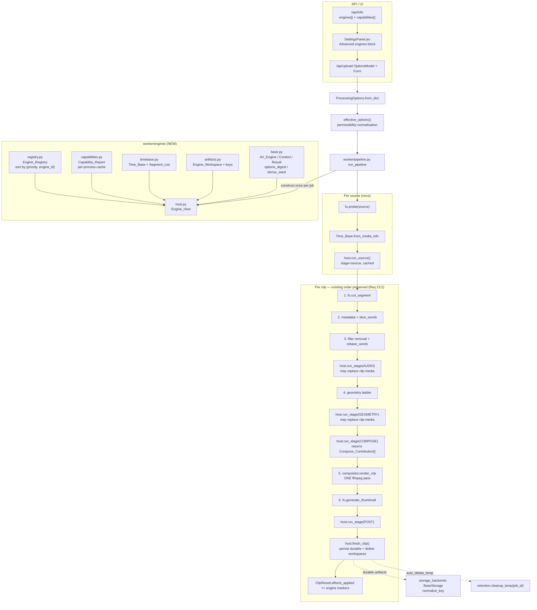
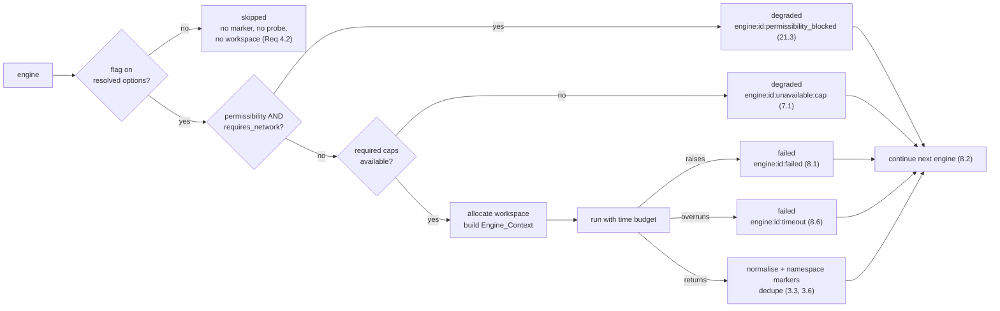

# Design Document — Advanced AV Engines Foundation

## Overview

This design delivers the **contracts layer** every future "advanced AV engine" in the
AI Video Clipper (self-hosted, CPU-first, currently **v0.8.0**) is built on. It adds no
user-visible output on its own: with no engine registered, or with every engine flag off,
the Pipeline runs the exact v0.8.0 code path and produces byte-identical
`effects_applied` _(Reqs 4.3, 9.4, 23.1–23.3)_.

Six modules ship, all under a new `worker/engines/` package, plus one coordinator:

| Module | Responsibility | Requirements |
|---|---|---|
| `worker/engines/base.py` **(NEW)** | `AV_Engine` ABC, `Engine_Context`, `Engine_Result`, `Engine_Status`, `Engine_Stage`, `Engine_Artifact`, `Compose_Contribution`, options coercion + `options_digest` + `derive_seed` | 1, 10, 11, 12 |
| `worker/engines/registry.py` **(NEW)** | registration, per-stage lookup, deterministic `(priority, engine_id)` ordering, duplicate-id error, reset, isolated instances | 2, 22.2 |
| `worker/engines/capabilities.py` **(NEW)** | `Capability_Status`, injectable `Prober`, `Capability_Report` with per-process caching + invalidation, serialisable mapping | 5, 6, 20.2, 21.5 |
| `worker/engines/timebase.py` **(NEW)** | `Time_Base` conversions/snap, `Timeline_Segment`, `Segment_List` normalisation | 13, 14, 15 |
| `worker/engines/artifacts.py` **(NEW)** | `Engine_Workspace` allocation under the Pipeline `temp_dir`, path sanitisation + containment, cleanup, durable persistence through `BaseStorage` | 16, 17, 18 |
| `worker/engines/host.py` **(NEW)** | `Engine_Host`: options resolution, capability gating, workspace lifecycle, stage invocation, failure/timeout isolation, marker merging | 3, 4, 7, 8, 19, 21 |

`host.py` is the only module beyond the five named in the requirements' new-module list;
the requirements name the *contract* modules, and the Engine_Host (glossary: "the
Pipeline-side coordinator") needs a home that is not `worker/pipeline.py` so it stays
independently testable _(Req 22.1)_.

The guiding constraint is **non-invasive integration**. The Pipeline keeps its stage order
(`cut → filler removal → geometry → compositor → thumbnail`); the host adds four
invocation points *inside* that order and one source-level point before the clip loop
_(Req 23.2)_. Compose-stage engines return **filter-graph fragments and input files**, never
ffmpeg calls, so `worker/effects/compositor.py` still renders in a single pass
_(Reqs 1.5, 23.3)_.

Everything the two queued sibling engines (**audio stem separation**, **kinetic
typography**) need is fixed here: exact dataclass field names, exact abstract method
signatures, exact marker strings, exact module paths _(Req 23.6)_. Those specs inline
this contract rather than restate it.

### Grounded integration points (verified in the repo)

- `worker/pipeline.py` `run_pipeline(source, options, clips_dir, temp_dir, progress_cb,
  start_progress, llm_client)`; calls `effective_options(options)` once, then
  `fu.probe(source)`, then per clip `fu.cut_segment` → `filler.plan_keep_intervals` /
  `apply_keep_intervals` / `rebase_words` → geometry ladder → `compositor.render_clip` →
  `fu.generate_thumbnail`. `worker/jobs.py` passes `temp_dir = settings.temp_dir/<job_id>`.
- `worker/models.py`: `ProcessingOptions.from_dict` (unknown keys ignored, enum-like fields
  validated against `_CAPTION_PRESETS`-style tuples, `_as_bool` coercion),
  `effective_options`, `ClipResult.effects_applied`.
- `worker/ffmpeg_utils.py`: `MediaInfo(duration, width, height, fps, has_audio)`,
  `probe`, `FFmpegError`.
- `worker/effects/compositor.py`: `render_clip(...) -> Optional[RenderResult]`,
  `RenderResult(path, effects_applied, broll_records)`.
- `storage_backends/base.py`: `BaseStorage.save/save_file/open/url/delete/exists/list/size`,
  `normalize_key`; `storage_backends/__init__.py` `get_storage()`.
- `storage_backends/retention.py`: `cleanup_temp(job_id=None)`; `runtime_config.py`
  `RuntimeConfig.auto_delete_temp`, `get_runtime_config()`.
- `config.py` `settings`: `ffmpeg_binary`, `ffprobe_binary`, `temp_dir`, `storage_backend`.
- Availability helpers to reuse: `worker.llm_client.llm_available()`,
  `worker.captions.font_available(name)`.
- Tests: `tests/conftest.py` (`make_video`, `requires_ffmpeg`, `probe_size`,
  `probe_duration`, `FakeWord`, `png_asset`), `tests/fakes.py`
  (`FakeS3Client`, `SpyAssetProvider`, `FakeDiarizationBackend`, …).

## Architecture

### Engine host, registry, and stage hooks



### Invocation ladder inside `Engine_Host._invoke`



### Design decisions

- **The host owns all cross-cutting concerns; engines own only their craft.** Capability
  gating, permissibility gating, workspace lifecycle, timeouts, marker namespacing and
  failure isolation live in `Engine_Host`, so a sibling engine spec cannot "forget" one of
  them _(Reqs 3, 4, 7, 8, 17, 21)_.
- **`Time_Base` derives from the source probe, not a per-clip probe.** `fu.cut_segment`
  and the geometry ladder preserve the frame rate, so one `Time_Base` built from the
  already-performed `fu.probe(source)` is shared by every engine for every clip. This adds
  **zero** ffprobe passes _(Reqs 13.7, 19.4, 19.5, 23.3)_.
- **Frozen dataclasses with tuple fields** give read-only contexts and results by
  construction rather than by convention _(Reqs 1.3, 1.6)_.
- **Cooperative deadline plus a watchdog wait** for time budgets: the context carries a
  monotonic `deadline`, and the host waits on a single-worker thread with
  `future.result(timeout=...)`. Engines pass the remaining budget to their own
  `subprocess` calls. Tradeoff: an uncooperative engine's thread may outlive the wait, so
  the host abandons its *contribution* (marker `timeout`) instead of claiming a hard kill
  _(Req 8.6)_.
- **Digest over canonical JSON, not `hash()`**: `sha256` of
  `json.dumps(..., sort_keys=True, separators=(",", ":"))` truncated to 16 hex chars —
  stable across processes and immune to `PYTHONHASHSEED` _(Req 11.5)_.
- **Compose contributions instead of ffmpeg calls** keep the single-pass compositor
  intact; `render_clip` gains one optional keyword argument that defaults to `None`, so
  the all-off path is untouched _(Reqs 1.5, 23.3)_.

## Components and Interfaces

### `worker/engines/base.py` — the engine contract _(Reqs 1, 10, 11, 12)_

```python
"""AV engine contracts: the abstraction every advanced AV engine implements.

Import-safe with zero optional heavy dependencies present (Req 1.4): this module
imports only the standard library plus ``worker.engines.timebase`` /
``worker.engines.artifacts`` / ``worker.engines.capabilities``.
"""
from __future__ import annotations

import dataclasses
import hashlib
import json
import math
from abc import ABC, abstractmethod
from dataclasses import dataclass, field
from enum import Enum
from pathlib import Path
from typing import Any, ClassVar, Mapping, Optional, Protocol, Sequence, runtime_checkable

DIGEST_LENGTH = 16            # Req 11.5 — fixed-length lowercase hex
MARKER_PREFIX = "engine"      # Req 3.3 — engine:<engine_id>:<detail>
FLAG_SUFFIX = "_enabled"      # Req 9.1 — ProcessingOptions.<engine_id>_enabled


class Engine_Stage(str, Enum):
    """Pipeline point at which an engine runs (mirrors JobStatus's str-Enum style)."""

    SOURCE = "source"        # once per source, before the clip loop (Req 3.5)
    AUDIO = "audio"          # per clip, after filler removal, before geometry
    GEOMETRY = "geometry"    # per clip, after the geometry ladder
    COMPOSE = "compose"      # per clip, contributes to the single compositor pass
    POST = "post"            # per clip, after the final file + thumbnail exist


class Engine_Status(str, Enum):
    """Outcome of one engine invocation (Req 1.6)."""

    APPLIED = "applied"
    SKIPPED = "skipped"
    DEGRADED = "degraded"
    FAILED = "failed"


@dataclass(frozen=True)
class Engine_Artifact:
    """A file produced by an engine (Reqs 17.7, 18.5)."""

    name: str                          # workspace-relative file name
    path: Path                         # absolute path inside the Engine_Workspace
    media_type: str = "data"           # video | audio | image | subtitle | data
    durable: bool = False              # persist through the Storage_Backend
    storage_key: str = ""              # set by the host after persistence (Req 18.5)

    def to_dict(self) -> dict[str, Any]: ...
    @classmethod
    def from_dict(cls, data: Mapping[str, Any]) -> "Engine_Artifact": ...


@dataclass(frozen=True)
class Compose_Input:
    """An extra ffmpeg input a compose-stage engine needs (Req 1.5)."""

    path: Path
    loop: bool = False                 # still images: ``-loop 1``
    duration: float = 0.0              # 0 => natural duration


@dataclass(frozen=True)
class Compose_Contribution:
    """Filter-graph fragments an engine contributes to the ONE compositor pass.

    The engine never invokes ffmpeg itself (Req 1.5). ``video_filters`` /
    ``audio_filters`` are appended to the compositor's existing
    ``-filter_complex`` chain; ``subtitle_path`` is handed to the existing libass
    ``subtitles`` filter slot.
    """

    engine_id: str
    inputs: tuple[Compose_Input, ...] = ()
    video_filters: tuple[str, ...] = ()
    audio_filters: tuple[str, ...] = ()
    subtitle_path: Optional[Path] = None
    z_order: int = 0                   # lower renders first; captions stay on top

    def to_dict(self) -> dict[str, Any]: ...


@dataclass(frozen=True)
class Engine_Context:
    """Immutable per-invocation record handed to an engine (Reqs 1.2, 1.3, 15.1).

    Every timestamp is a float in **clip-relative seconds** (Req 15.7).
    """

    job_id: str
    clip_id: str
    engine_id: str
    stage: Engine_Stage
    source_path: Path                     # original source media
    clip_path: Optional[Path]             # current clip media (None at SOURCE stage)
    time_base: "Time_Base"                # identical for every engine of this clip (13.7)
    clip_start: float                     # source-relative provenance only
    clip_end: float
    duration: float                       # clip-relative upper bound == end - start (15.1)
    words: tuple[Any, ...] = ()           # rebased clip-relative Word_Timeline (15.2)
    options: Any = None                   # this engine's resolved Engine_Options
    options_digest: str = ""              # Req 11.1
    seed: int = 0                         # Req 12.2 — only randomness source
    workspace: Optional["Engine_Workspace"] = None
    capabilities: Optional["Capability_Report"] = None
    permissibility: bool = False          # ProcessingOptions.permissibility_mode
    deadline: float = math.inf            # time.monotonic() budget end (Req 8.6)
    time_budget_s: float = 0.0
    first_input_index: int = 0            # absolute ffmpeg index of this engine's
                                          # FIRST reserved -i input, so the engine
                                          # can write valid [N:v]/[N:a] labels
                                          # (Req 1.5); 0 == none reserved
    notes: tuple[str, ...] = ()           # e.g. "fps_fallback:0.0" (Req 13.3)
    deps: Mapping[str, Any] = field(default_factory=dict)   # injected fakes (Req 22.1)

    def rng(self) -> "random.Random":
        """Return a seeded RNG; the ONLY permitted randomness source (Req 12.2)."""

    def remaining(self, now: float | None = None) -> float:
        """Seconds left before ``deadline`` (pass to subprocess timeouts)."""


@dataclass(frozen=True)
class Engine_Result:
    """Immutable, serialisable outcome of one engine invocation (Reqs 1.2, 1.6)."""

    engine_id: str
    status: Engine_Status
    markers: tuple[str, ...] = ()                       # namespaced by the host (3.3)
    artifacts: tuple[Engine_Artifact, ...] = ()
    contribution: Optional[Compose_Contribution] = None
    plan: Mapping[str, Any] = field(default_factory=dict)   # serialisable planning output
    media: Optional[Path] = None            # replacement clip media (AUDIO/GEOMETRY only)
    detail: str = ""
    elapsed_s: float = 0.0

    def to_dict(self) -> dict[str, Any]: ...
    @classmethod
    def from_dict(cls, data: Mapping[str, Any]) -> "Engine_Result": ...

    # Convenience constructors used by engines and by the host's gating ladder.
    @classmethod
    def skipped(cls, engine_id: str) -> "Engine_Result": ...          # Req 3.4
    @classmethod
    def degraded(cls, engine_id: str, detail: str, *,
                 markers: Sequence[str] = ()) -> "Engine_Result": ...  # Req 7.1
    @classmethod
    def failed(cls, engine_id: str, detail: str) -> "Engine_Result": ...  # Req 8.1


def marker(engine_id: str, detail: str) -> str:
    """Return ``engine:<engine_id>:<detail>`` (Req 3.3)."""


def merge_markers(results: Sequence[Engine_Result]) -> list[str]:
    """Concatenate result markers in invocation order, de-duplicated (Reqs 3.2, 3.6).

    ``skipped`` results contribute nothing (Req 3.4).
    """
```

Options resolution, digest, and seed derivation — the pure layer sibling specs reuse:

```python
@runtime_checkable
class Engine_Options(Protocol):
    """Per-engine options record: a dataclass of JSON-serialisable values (Req 10.1)."""

    @classmethod
    def parse(cls, data: Mapping[str, Any] | None) -> "Engine_Options":
        """Total parser: never raises, ignores unknown keys, defaults per field (10.2/10.4/10.5)."""

    def to_dict(self) -> dict[str, Any]:
        """Serialise to a JSON-safe mapping (Req 10.2)."""


# Coercion helpers mirroring the ``ProcessingOptions.from_dict`` conventions
# (``worker.models._as_bool`` semantics, enum-like known-value sets) — Req 10.7.
def coerce_bool(value: Any, default: bool = False) -> bool: ...
def coerce_int(value: Any, default: int, lo: int | None = None, hi: int | None = None) -> int: ...
def coerce_float(value: Any, default: float, lo: float | None = None, hi: float | None = None) -> float: ...
def coerce_choice(value: Any, known: Sequence[str], default: str) -> str: ...
def coerce_str(value: Any, default: str = "", max_len: int = 512) -> str: ...

def dump_options(options: Any) -> dict[str, Any]:
    """``dataclasses.asdict`` with private keys dropped and mappings emitted in
    sorted key order (Reqs 10.2, 12.6)."""

def options_digest(options: Any) -> str:
    """Return a stable 16-char lowercase hex digest of resolved options (Req 11).

    ``sha256(json.dumps(dump_options(options), sort_keys=True, separators=(",", ":"),
    ensure_ascii=True, default=str)).hexdigest()[:DIGEST_LENGTH]`` — equal for equal
    values (11.2), insensitive to key insertion order (11.3), different for different
    values (11.4), fixed-length lowercase hex and process-stable (11.5).
    """

def derive_seed(source_identity: str, digest: str) -> int:
    """Reproducible per-invocation seed (Req 12.4).

    ``int(sha256(f"{source_identity}|{digest}").hexdigest()[:16], 16)`` — never stored,
    always recomputable.
    """
```

The abstract base:

```python
class AV_Engine(ABC):
    """Base class every advanced AV engine implements (Req 1.1).

    Class-level declarations are the engine's contract with the host; instance
    collaborators are dependency-injected through ``__init__`` (Req 22.1).
    """

    engine_id: ClassVar[str] = ""                              # snake_case, stable
    stage: ClassVar[Engine_Stage] = Engine_Stage.POST
    priority: ClassVar[int] = 100                              # ordering key (Req 2.5)
    required_capabilities: ClassVar[tuple[str, ...]] = ()      # Req 7.1
    optional_capabilities: ClassVar[tuple[str, ...]] = ()      # Req 7.2
    requires_network: ClassVar[bool] = False                   # Req 21.1
    requires_model_download: ClassVar[bool] = False            # Req 21.1
    time_budget_s: ClassVar[float] = 30.0                      # Req 19.1
    max_media_passes: ClassVar[int] = 1                        # Req 19.1
    max_inputs: ClassVar[int] = 0                              # ffmpeg -i inputs this
                                                               # engine may contribute
                                                               # to the ONE compose pass
    produces_media: ClassVar[bool] = False                     # may return Result.media

    @classmethod
    def flag_field(cls) -> str:
        """ProcessingOptions attribute holding this engine's Feature_Flag.

        Defaults to ``f"{cls.engine_id}{FLAG_SUFFIX}"`` (Reqs 9.1, 9.2).
        """

    def is_enabled(self, options: Any) -> bool:
        """True when the Feature_Flag on the *resolved* options is set (Reqs 4.1, 4.4)."""

    @abstractmethod
    def resolve_options(self, options: Any) -> Any:
        """Project ProcessingOptions onto this engine's Engine_Options (Reqs 1.1, 10.6).

        Pure and idempotent; applies the documented safe values under
        ``options.permissibility_mode`` (Req 9.5). Must not mutate ``options`` (9.6).
        """

    @abstractmethod
    def plan(self, ctx: Engine_Context) -> Mapping[str, Any]:
        """Pure planning step: no ffmpeg, no network, no model download (Req 12.5).

        Deterministic for equal inputs and equal ``ctx.seed`` (Reqs 12.1–12.3).
        Returns a JSON-serialisable mapping (segment lists, cue lists, parameters).
        """

    @abstractmethod
    def run(self, ctx: Engine_Context) -> Engine_Result:
        """Execute the engine. Exactly one argument, exactly one result (Req 1.2).

        Treats ``ctx`` as read-only (Req 1.3); writes only inside
        ``ctx.workspace`` (Req 16.4); returns compose work as a
        ``Compose_Contribution`` rather than invoking ffmpeg (Req 1.5).
        """
```

### `worker/engines/registry.py` — discovery and deterministic ordering _(Req 2)_

```python
class Engine_Registration_Error(ValueError):
    """Raised when an Engine_Id is registered twice (Req 2.3)."""


@dataclass(frozen=True)
class Engine_Record:
    engine: AV_Engine
    engine_id: str
    stage: Engine_Stage
    priority: int

    @property
    def sort_key(self) -> tuple[int, str]:
        return (self.priority, self.engine_id)          # Req 2.5


class Engine_Registry:
    """Engine_Id -> AV_Engine, yielded in a registration-order-independent order."""

    def __init__(self) -> None:
        self._records: dict[str, Engine_Record] = {}
        # Registration happens at import time in production and inside tests
        # otherwise, so the duplicate check and the insert are made atomic. The lock
        # is a private implementation detail: it is never exposed and never held
        # across a call into an engine.
        self._lock = threading.RLock()

    def register(self, engine: AV_Engine, *, priority: int | None = None) -> AV_Engine:
        """Register ``engine`` (Req 2.1).

        Raises:
            Engine_Registration_Error: naming the conflicting Engine_Id (Req 2.3).
                The registry is left unchanged.
        """

    def get(self, engine_id: str) -> AV_Engine:
        """Return the engine for ``engine_id`` (Req 2.2); raises ``KeyError`` if absent."""

    def find(self, engine_id: str) -> Optional[AV_Engine]:
        """Non-raising variant of :meth:`get`."""

    def for_stage(self, stage: Engine_Stage) -> list[AV_Engine]:
        """Engines declaring ``stage``, ordered by ``(priority, engine_id)``.

        Returns ``[]`` for an empty registry or an unused stage (Reqs 2.4, 2.6).
        """

    def all(self) -> list[AV_Engine]: ...        # same deterministic order
    def ids(self) -> list[str]: ...              # sorted Engine_Ids
    def records(self) -> list[Engine_Record]: ...

    def stage_of(self, engine_id: str) -> Optional[Engine_Stage]:
        """The Engine_Stage ``engine_id`` was registered under, or ``None``.

        The stage captured at registration time, so it is stable even if the engine
        object is mutated afterwards — which is what makes it usable for the
        stage-partition assertions in P4.
        """

    def reset(self) -> None:
        """Clear every registration (Reqs 2.7, 22.2)."""
    def __len__(self) -> int: ...
    def __contains__(self, engine_id: str) -> bool: ...
    def __iter__(self): ...                      # iterates ``all()`` — same order


_DEFAULT = Engine_Registry()

def get_registry() -> Engine_Registry:
    """Process-wide default registry (tests may build isolated ones — Req 22.2)."""

def register(engine: AV_Engine, *, priority: int | None = None) -> AV_Engine: ...
def reset_registry() -> None: ...
```

### `worker/engines/capabilities.py` — probing and caching _(Reqs 5, 6, 21.5)_

```python
class Capability_Kind(str, Enum):
    PYTHON_PKG = "python_pkg"        # python_pkg:demucs      -> importlib.util.find_spec
    BINARY = "binary"                # binary:ffprobe         -> shutil.which
    FFMPEG_FILTER = "ffmpeg_filter"  # ffmpeg_filter:atempo   -> settings.ffmpeg_binary -filters
    FONT = "font"                    # font:Impact            -> captions.font_available
    PROVIDER_KEY = "provider_key"    # provider_key:broll     -> settings.<name>_api_key
    MODEL = "model"                  # model:htdemucs         -> registered locator
    LLM = "llm"                      # bare "llm"             -> llm_client.llm_available


LLM_CAPABILITY = "llm"

def parse_capability_id(capability_id: str) -> tuple[str, str]:
    """Split ``"<kind>:<name>"``; ``"llm"`` parses as ``("llm", "")``.

    Unknown kinds return ``("", capability_id)`` and probe as unavailable (Req 5.2).
    """


@dataclass(frozen=True)
class Capability_Status:
    capability_id: str
    available: bool
    detail: str = ""                       # short, human-readable (Req 5.2)

    def to_dict(self) -> dict[str, Any]: ...
    @classmethod
    def from_dict(cls, data: Mapping[str, Any]) -> "Capability_Status": ...


Prober = Callable[[str], Capability_Status]     # injectable (Req 5.7)

#: ``model:<name>`` locators registered by engines; empty by default so an absent
#: model with downloading disabled reports unavailable (Req 21.5).
MODEL_LOCATORS: dict[str, Callable[[], Optional[Path]]] = {}

def default_prober(capability_id: str) -> Capability_Status:
    """Probe one Capability_Id locally, never raising and never touching the network.

    Dispatches on :class:`Capability_Kind` (Req 5.1); wraps every underlying error as
    ``available=False`` with the error summary as ``detail`` (Req 5.3); uses
    ``settings.ffmpeg_binary`` for filter probes (Req 5.4); delegates to
    ``worker.llm_client.llm_available`` and ``worker.captions.font_available`` (Req 5.5);
    performs no network access (Req 5.6).
    """


class Capability_Report:
    """Per-process cache of Capability_Id -> Capability_Status (Req 6)."""

    def __init__(self, prober: Prober | None = None) -> None:
        self._prober = prober or default_prober      # Req 5.7
        self._cache: dict[str, Capability_Status] = {}

    def status(self, capability_id: str) -> Capability_Status:
        """Cached status; the underlying prober runs at most once per id (Reqs 6.1, 6.2)."""

    def available(self, capability_id: str) -> bool: ...

    def first_missing(self, capability_ids: Iterable[str]) -> Optional[str]:
        """First unavailable id in declaration order, else ``None`` (Req 7.1)."""

    def missing(self, capability_ids: Iterable[str]) -> list[str]:
        """All unavailable ids, in declaration order (Req 7.2)."""

    def to_dict(self) -> dict[str, dict[str, Any]]:
        """Serialisable mapping in sorted key order, for /api/info (Reqs 6.4, 20.2)."""

    def invalidate(self, capability_id: str | None = None) -> None:
        """Drop one or all cached entries so a new prober can be injected (Req 6.5)."""


_REPORT: Optional[Capability_Report] = None

def get_report(prober: Prober | None = None) -> Capability_Report:
    """Process-wide report (Req 6.1); ``prober`` is honoured on first construction."""

def reset_report() -> None:
    """Drop the process-wide report (test isolation — Reqs 6.5, 22.1)."""
```

### `worker/engines/timebase.py` — timing and segments _(Reqs 13, 14, 15)_

```python
DEFAULT_FPS = 30.0            # Req 13.3 documented fallback
DEFAULT_SAMPLE_RATE = 48000   # MediaInfo carries no sample rate; documented default
MIN_FPS, MAX_FPS = 1.0, 240.0


class Rounding(str, Enum):
    NEAREST = "nearest"       # default
    FLOOR = "floor"


@dataclass(frozen=True)
class Time_Base:
    """Shared timing record for one clip (Reqs 13.1, 13.7)."""

    fps: float = DEFAULT_FPS
    sample_rate: int = DEFAULT_SAMPLE_RATE
    rounding: Rounding = Rounding.NEAREST
    fps_substituted: bool = False          # True when the fallback was used (Req 13.3)

    @classmethod
    def from_media_info(cls, info: "MediaInfo", *, sample_rate: int = DEFAULT_SAMPLE_RATE,
                        rounding: Rounding = Rounding.NEAREST) -> "Time_Base":
        """Build from ``worker.ffmpeg_utils.probe`` output (Req 13.2).

        Missing, zero, negative, non-finite or out-of-range ``info.fps`` substitutes
        ``DEFAULT_FPS`` and sets ``fps_substituted`` (Req 13.3).
        """

    def frame_duration(self) -> float: ...           # 1 / fps
    def seconds_to_frame(self, seconds: float) -> int: ...    # Reqs 13.4, 13.6
    def frame_to_seconds(self, frame: int) -> float: ...      # frame / fps
    def seconds_to_sample(self, seconds: float) -> int: ...
    def sample_to_seconds(self, sample: int) -> float: ...
    def snap(self, seconds: float) -> float:
        """Align to the nearest frame boundary; idempotent (Reqs 15.3, 15.4)."""
    def to_dict(self) -> dict[str, Any]: ...
    @classmethod
    def from_dict(cls, data: Mapping[str, Any]) -> "Time_Base": ...


@dataclass(frozen=True)
class Timeline_Segment:
    """Half-open clip-relative interval in seconds with ``start <= end`` (Req 14.1)."""

    start: float
    end: float

    @property
    def duration(self) -> float: ...
    def overlaps(self, other: "Timeline_Segment") -> bool: ...
    def to_dict(self) -> dict[str, float]: ...
    @classmethod
    def from_dict(cls, data: Any) -> Optional["Timeline_Segment"]:
        """Parse one record; returns ``None`` for malformed or inverted input (Req 14.7)."""


def normalize_segments(segments: Iterable[Any], duration: float, *,
                       time_base: Time_Base | None = None,
                       min_duration: float = 0.0) -> list[Timeline_Segment]:
    """Return a canonical Segment_List (Req 14.2).

    Drops malformed/inverted records (14.7), clamps to ``[0, duration]``, sorts by
    ``start``, drops zero-length (and sub-``min_duration``) segments, merges overlapping
    or touching segments. When ``time_base`` is given, bounds are snapped to frame
    boundaries first (Req 15.3). Idempotent (14.4); output is sorted, disjoint,
    in-bounds, and totals at most ``duration`` (14.3, 14.5, 15.5).
    """

def parse_segments(raw: Any, duration: float) -> list[Timeline_Segment]:
    """Parse a serialised Segment_List, then normalise it (Reqs 14.6, 14.7)."""

def dump_segments(segments: Sequence[Timeline_Segment]) -> list[dict[str, float]]:
    """Serialise a Segment_List (Req 14.6)."""

def total_duration(segments: Sequence[Timeline_Segment]) -> float: ...

def invert_segments(segments: Sequence[Timeline_Segment], duration: float) -> list[Timeline_Segment]:
    """Complement of a normalised Segment_List within ``[0, duration]``."""

def clip_bounds(words: Sequence[Any], duration: float) -> tuple[float, float]:
    """``(0.0, duration)`` helper for engines that need explicit clip bounds (Req 15.1)."""
```

### `worker/engines/artifacts.py` — workspaces and durable artifacts _(Reqs 16, 17, 18)_

```python
ENGINE_TEMP_ROOT = "engines"     # <temp_dir>/engines/<job>/<clip>/<engine>__<digest>
ENGINE_KEY_ROOT = "engines"      # engines/<job>/<clip>/<engine>/<name>
MAX_COMPONENT_LEN = 48


def sanitize_component(value: Any, *, fallback: str = "x") -> str:
    """Return a safe single path component (Reqs 16.6, 18.4).

    Lowercases, replaces every character outside ``[a-z0-9._-]`` with ``_``, strips
    leading dots, rejects ``""``/``"."``/``".."`` in favour of ``fallback``, and truncates
    to ``MAX_COMPONENT_LEN``.
    """


@dataclass(frozen=True)
class Engine_Workspace:
    """Per-job, per-clip, per-engine scratch directory (Req 16)."""

    root: Path                 # absolute, inside the Pipeline temp_dir
    temp_dir: Path             # the ``run_pipeline`` temp_dir it is contained by
    job_id: str
    clip_id: str
    engine_id: str
    options_digest: str

    def path(self, *parts: str) -> Path:
        """Sanitised path inside :attr:`root`.

        Raises ``ValueError`` if the resolved path would escape ``root`` (Reqs 16.4, 16.5).
        """

    def artifact(self, name: str, *, media_type: str = "data",
                 durable: bool = False) -> Engine_Artifact:
        """Declare an artifact at ``self.path(name)`` (Reqs 17.7, 18.1)."""

    def exists(self) -> bool: ...


def allocate_workspace(temp_dir: str | Path, job_id: str, clip_id: str, engine_id: str,
                       options_digest: str, *, create: bool = True) -> Engine_Workspace:
    """Allocate ``<temp_dir>/engines/<job>/<clip>/<engine>__<digest>`` (Reqs 16.1–16.3).

    Every component is sanitised, the result is asserted to resolve inside ``temp_dir``
    (16.5, 16.6), parents are created when ``create`` (16.3), and distinct
    (job, clip, engine, digest) tuples map to distinct directories (16.7, 11.6).
    """

def cleanup_workspace(ws: Engine_Workspace, *, remover: Callable[[Path], None] | None = None,
                      logger: Any | None = None) -> bool:
    """Delete ``ws.root``. Logs and swallows ``OSError`` (Req 17.4); returns success."""

def cleanup_job_workspaces(temp_dir: str | Path, job_id: str) -> int:
    """Delete ``<temp_dir>/engines/<job>``; returns entries removed (Reqs 17.1, 17.6)."""

def artifact_key(job_id: str, clip_id: str, engine_id: str, name: str) -> str:
    """Durable storage key ``engines/<job>/<clip>/<engine>/<name>``.

    Components are sanitised and the result passes through
    ``storage_backends.base.normalize_key``, so it has no leading slash and no ``.``/``..``
    segment and is identical on local and S3 backends (Reqs 18.2–18.4).
    """

def persist_artifact(artifact: Engine_Artifact, *, job_id: str, clip_id: str,
                     storage: "BaseStorage | None" = None) -> Engine_Artifact:
    """Persist a durable artifact through the active Storage_Backend (Req 18.1).

    Uses ``storage or get_storage()`` and ``BaseStorage.save_file``; returns a copy with
    ``storage_key`` set (Req 18.5). Errors propagate to the host, which records
    ``engine:<id>:artifact_failed`` (Req 18.6).
    """
```

### `worker/engines/host.py` — the coordinator _(Reqs 3, 4, 7, 8, 19, 21)_

```python
@dataclass
class Stage_Outcome:
    """Aggregate of one stage's invocations."""

    stage: Engine_Stage
    results: list[Engine_Result] = field(default_factory=list)
    markers: list[str] = field(default_factory=list)          # merged, deduped (3.2, 3.6)
    artifacts: list[Engine_Artifact] = field(default_factory=list)
    contributions: list[Compose_Contribution] = field(default_factory=list)
    media: Optional[Path] = None      # replacement clip media, else None (Req 8.3)


class Engine_Host:
    """Pipeline-side engine coordinator. Fully dependency-injected (Req 22.1)."""

    def __init__(self, options: Any, *, job_id: str, temp_dir: str | Path,
                 registry: Engine_Registry | None = None,
                 capabilities: Capability_Report | None = None,
                 storage: "BaseStorage | None" = None,
                 clock: Callable[[], float] = time.monotonic,
                 logger: Any | None = None,
                 sample_rate: int = DEFAULT_SAMPLE_RATE) -> None:
        """``options`` MUST already be ``effective_options(...)``-normalised (Req 4.4).

        Collaborators default lazily: ``registry or get_registry()``, ``capabilities or
        get_report()`` — the report is only *touched* when an engine is enabled (Req 4.2),
        and ``storage`` is only resolved when a durable artifact exists.
        """

    # --- gating -----------------------------------------------------------
    @property
    def active(self) -> bool:
        """True when at least one registered engine is enabled (Reqs 19.5, 23.1)."""

    def enabled_for(self, stage: Engine_Stage) -> list[AV_Engine]:
        """Enabled engines for ``stage`` in registry order (Reqs 3.1, 4.1)."""

    # --- timing -----------------------------------------------------------
    def time_base(self, info: "MediaInfo") -> Time_Base:
        """Build (once) and cache the Time_Base for this job from the source probe.

        Shared by every engine of every clip; adds no ffprobe pass (Reqs 13.7, 19.4).
        """

    # --- invocation -------------------------------------------------------
    def run_source(self, source: str | Path, info: "MediaInfo") -> Stage_Outcome:
        """Invoke SOURCE-stage engines at most once per source (Reqs 3.5, 19.3).

        Results are cached; :meth:`source_result` serves every clip.
        """

    def source_result(self, engine_id: str) -> Optional[Engine_Result]: ...

    def run_stage(self, stage: Engine_Stage, *, clip_id: str, source: str | Path,
                  clip_path: Path, clip_start: float, clip_end: float, duration: float,
                  words: Sequence[Any] = ()) -> Stage_Outcome:
        """Invoke every enabled engine of ``stage`` for one clip.

        Applies the gating ladder per engine, isolates failures and timeouts (Req 8),
        merges markers in registry order (Reqs 3.2, 3.3, 3.6), and returns replacement
        media only when an engine of ``produces_media`` succeeded (Req 8.3).
        """

    def finish_clip(self, clip_id: str) -> list[str]:
        """Persist durable artifacts, then delete this clip's workspaces (Reqs 17.1, 17.7).

        Returns any extra markers (e.g. ``engine:<id>:artifact_failed`` — Req 18.6).
        Deletion honours ``runtime_config.get_runtime_config().auto_delete_temp`` and
        routes job-level cleanup through ``storage_backends.retention.cleanup_temp``
        (Reqs 17.2, 17.3); ``OSError`` is logged and swallowed (Req 17.4).
        """

    def finish_job(self) -> None:
        """Delete ``<temp_dir>/engines/<job_id>`` when ``auto_delete_temp`` (Req 17.6)."""

    # --- internals --------------------------------------------------------
    def _invoke(self, engine: AV_Engine, ctx_factory: Callable[[], Engine_Context]) -> Engine_Result:
        """Gating ladder + failure isolation for one engine (see the Mermaid ladder).

        1. disabled -> ``skipped``, no probe, no workspace, no marker (4.2, 3.4)
        2. permissibility and ``requires_network`` -> ``degraded`` +
           ``permissibility_blocked`` (21.2, 21.3)
        3. first missing required capability -> ``degraded`` +
           ``unavailable:<capability_id>`` (7.1) — engine body never runs
        4. allocate workspace + build context, then run under ``time_budget_s``
        5. ``Exception`` (incl. ``FFmpegError``) -> ``failed`` + ``failed``, logged with
           type and message (8.1, 8.4, 8.5)
        6. budget exceeded -> ``failed`` + ``timeout``, contribution abandoned (8.6)
        7. namespace + dedupe markers, cap degradation markers at one per engine (7.4)
        """
```

### Pipeline integration — exact hook points _(Reqs 23.2, 23.3)_

`worker/pipeline.py` changes are additive and guarded by `host.active`:

```python
# after the existing ``options = effective_options(options)`` (Req 4.4)
host = Engine_Host(options, job_id=temp_dir.name, temp_dir=temp_dir)   # jobs.py uses
                                                                       # settings.temp_dir/<job_id>

# after the existing ``info = fu.probe(source)``  (no additional probe — Req 19.4)
source_outcome = host.run_source(source, info) if host.active else None   # Reqs 3.5, 19.5

# ... inside the per-clip loop, after step 3 (filler removal + rebase_words) ...
if host.active:                                                     # Reqs 15.2, 8.3
    out = host.run_stage(Engine_Stage.AUDIO, clip_id=clip_id, source=source,
                         clip_path=raw, clip_start=c.start, clip_end=c.end,
                         duration=clip_duration, words=words)
    raw = out.media or raw
    applied.extend(out.markers)

# ... after step 4 (the untouched geometry ladder) ...
if host.active:
    out = host.run_stage(Engine_Stage.GEOMETRY, ..., clip_path=geo, ...)
    geo = out.media or geo
    applied.extend(out.markers)

# ... immediately before step 5, the single compositor pass ...
compose = host.run_stage(Engine_Stage.COMPOSE, ..., clip_path=geo, ...) if host.active else None
rendered = compositor.render_clip(
    geo, final, options, words, temp_dir,
    hook_text=md.hook_text, llm_client=llm_client, broll_resolver=broll_resolver,
    engine_contributions=(compose.contributions if compose else None),   # NEW kwarg
)
if compose:
    applied.extend(compose.markers)

# ... after step 6 (thumbnail) ...
if host.active:
    out = host.run_stage(Engine_Stage.POST, ..., clip_path=final, ...)
    applied.extend(out.markers)
    applied.extend(host.finish_clip(clip_id))        # Reqs 17.1, 17.7, 18.6
```

`compositor.render_clip` gains exactly one optional keyword,
`engine_contributions: Optional[Sequence[Compose_Contribution]] = None`. When it is
`None`/empty the existing code path — including the "return `None` when nothing changed"
contract — is unchanged, so an all-off clip still performs the same number of ffmpeg
passes as v0.8.0 _(Reqs 1.5, 23.3)_. When contributions exist, their `inputs` are added to
the same `-i` list and their filters to the same `-filter_complex`, with captions kept on
top.

#### The reserved engine input block — `max_inputs` / `first_input_index` _(Reqs 1.5, 10.3)_

A compose-stage engine writes filter text, so it must be able to name its own inputs
(`[N:v]`, `[N:a]`). `AV_Engine.max_inputs` declares how many ffmpeg `-i` inputs an engine
may contribute (default `0`: no input, no index space), and the host publishes the block
start as `Engine_Context.first_input_index` **before** `run()` executes:

```
first_input_index(engine_k) = 1 + sum(max_inputs of the preceding engines of the
                                      same stage run, in registry (priority, engine_id)
                                      order)
```

Index `0` is always the primary clip, which no engine owns, so `0` doubles as "nothing
reserved" — the value every non-COMPOSE stage and every `max_inputs == 0` engine receives.
The compositor lays the blocks out **immediately after the base clip**, ahead of music,
b-roll and emoji, because the host cannot know whether music/b-roll/emoji exist for a
given clip and the index must be fixed before the engine runs; the music / `broll_offset`
/ `emoji_offset` indices are therefore shifted by the total engine input count:

```
idx 0        : base clip
idx 1..N     : reserved engine input blocks (N == total contributed inputs)
music        : 1 + N            (label "1:a" when N == 0 — the v0.8.0 spelling)
broll_offset : (2 if music else 1) + N
emoji_offset : broll_offset + b-roll inputs
```

With no contribution `N == 0` and every index, filter label and argv element is
byte-identical to v0.8.0, which is what keeps Property 34 intact _(Req 23.1)_.

**Two orderings, deliberately decoupled.** Inputs are emitted in registry
`(priority, engine_id)` order — the order the reservation is computed from, and the only
order an engine can rely on before it runs. Filters keep layering in
`(z_order, engine_id)` order, which is a *rendering* decision taken after the fact.
Sorting inputs by `z_order` would let a z-order change silently invalidate filter labels
an engine had already written, so the two orders are never merged.

**Contract for a contributing engine:** when invoked it must emit exactly `max_inputs`
inputs, because the compositor appends the inputs it actually receives contiguously; a
short contribution would shift every later engine's real index. Reservations are computed
over the *enabled* engines of the stage run, since a disabled engine is gated out before
its body is entered and contributes nothing _(Req 4.2)_. No engine declares an input today
(`max_inputs` defaults to `0`), so the whole mechanism is inert until a sibling spec needs
it.

## Data Models

### `ProcessingOptions` — engine flags by convention _(Reqs 9.1–9.3, 20.3, 23.4)_

The foundation registers **no** engines, so it adds **no** fields today. It fixes the
convention every sibling engine spec follows:

```python
# worker/models.py — pattern each engine spec appends (all default OFF, Req 9.2)
<engine_id>_enabled: bool = False        # Feature_Flag, resolved by AV_Engine.flag_field()
<engine_id>_<option>: str | bool | float | int = <documented default>

# from_dict additions the engine spec makes, following the existing conventions:
#  - boolean flags added to the ``_as_bool`` coercion tuple
#  - enum-like fields added to the ``(field, known_values, default)`` validation table
#    so an unrecognised value becomes the documented default (Reqs 10.7, 20.5)
```

Because fields are plain dataclass scalars, they round-trip through `from_dict` and
`dataclasses.asdict` exactly like the existing checks in `tests/test_options_roundtrip.py`
_(Req 23.4)_, and all existing v0.8.0 fields/defaults are untouched _(Req 9.3)_.

### `ClipResult.effects_applied` — engine marker taxonomy _(Reqs 3.3, 23.5)_

Legacy markers keep their exact spellings and meanings _(Req 23.5)_. Every engine marker
is namespaced `engine:<engine_id>:<detail>`, so the two namespaces are disjoint:

| Marker | Meaning | Requirement |
|---|---|---|
| `engine:<id>:<detail>` | engine-defined success detail | 3.3 |
| `engine:<id>:unavailable:<capability_id>` | required capability missing; engine skipped, status `degraded` | 7.1 |
| `engine:<id>:degraded:<capability_id>` | optional capability missing; reduced-fidelity output | 7.2 |
| `engine:<id>:permissibility_blocked` | permissibility mode blocked a network-declaring engine | 21.3 |
| `engine:<id>:failed` | engine raised (including `FFmpegError`) | 8.1, 8.4 |
| `engine:<id>:timeout` | per-clip time budget exceeded, contribution abandoned | 8.6 |
| `engine:<id>:artifact_failed` | durable artifact persistence failed | 18.6 |
| _(none)_ | status `skipped` (engine disabled) | 3.4 |

At most **one** degradation marker per engine per clip; markers are de-duplicated and
ordered by registry invocation order _(Reqs 3.2, 3.6, 7.4)_.

### Serialised shapes

```jsonc
// Engine_Result.to_dict()
{
  "engine_id": "stem_separation",
  "status": "degraded",
  "markers": ["engine:stem_separation:unavailable:python_pkg:demucs"],
  "artifacts": [{"name": "vocals.wav", "path": "...", "media_type": "audio",
                 "durable": true, "storage_key": "engines/j1/01_ab12/stem_separation/vocals.wav"}],
  "contribution": null,
  "plan": {"segments": [{"start": 0.0, "end": 1.5}]},
  "media": null, "detail": "demucs not installed", "elapsed_s": 0.004
}

// Capability_Report.to_dict()  -> /api/info "capabilities"
{
  "ffmpeg_filter:atempo": {"capability_id": "ffmpeg_filter:atempo", "available": true, "detail": "ffmpeg filter present"},
  "python_pkg:demucs":    {"capability_id": "python_pkg:demucs", "available": false, "detail": "module not importable"}
}
```

### Directory and key layout

```
<settings.temp_dir>/<job_id>/                     # existing run_pipeline temp_dir
└── engines/<job_id>/<clip_id>/<engine_id>__<digest16>/   # Engine_Workspace (16.2, 11.6)

storage key: engines/<job_id>/<clip_id>/<engine_id>/<name>   # normalize_key'd (18.2–18.4)
```

## Correctness Properties

*A property is a characteristic or behavior that should hold true across all valid
executions of a system — essentially, a formal statement about what the system should do.
Properties serve as the bridge between human-readable specifications and
machine-verifiable correctness guarantees.*

These properties come from the acceptance-criteria prework. Criteria classified
EXAMPLE, EDGE_CASE, INTEGRATION or SMOKE are covered by the unit/integration tests in the
Testing Strategy instead. A **property reflection** then consolidated redundancy: the
register/lookup pair (2.1, 2.2) became one round trip; the four "clip still produced"
criteria (7.3, 7.5, 8.3, 8.7) became one invariance property; the five digest criteria
(11.1–11.5) became one property with four conjuncts; the three normalisation-invariant
criteria (14.1, 14.3, 14.5, 15.5) became one invariant property; the containment criteria
(16.1, 16.3–16.6) became one property; the cleanup criteria (17.1, 17.5, 17.6) became one;
and the three "all-off equals v0.8.0" criteria (4.3, 9.4, 23.1) became one parity property.

**Named generators** (hypothesis strategies, defined in `tests/strategies.py` and shared
by sibling specs): `st_engine_id`, `st_priority`, `st_registrations`, `st_stage`,
`st_capability_id`, `st_availability_map`, `st_options_mapping` (hostile JSON-ish values),
`st_segment_records` (valid + malformed), `st_word_timeline` (ordered `FakeWord`s +
duration), `st_time_base`, `st_hostile_component`, `st_engine_outcomes`
(status × markers × artifacts × exception).

### Property 1: Engine_Result is serialisable with a closed status domain

*For any* Engine_Result produced by any engine outcome, `Engine_Result.from_dict(r.to_dict())`
equals `r`, `to_dict()` is JSON-encodable, and `status` is a member of `Engine_Status`.
Generator: `st_engine_outcomes`.

**Validates: Requirements 1.2, 1.6, 18.5**

### Property 2: Engine invocation never mutates the caller's options or context

*For all* generated `ProcessingOptions` and *for any* engine — including one that attempts
to mutate its context — `dataclasses.asdict(options)` is identical before and after the
stage runs, and every attempted `Engine_Context` field assignment raises.
Generators: `st_options_mapping`, `st_engine_outcomes`.

**Validates: Requirements 1.3, 9.6**

### Property 3: Registry order is independent of registration order

*For any* set of registrations and *for any* permutation of it, `for_stage(stage)` returns
the same sequence, equal to the registrations sorted by `(priority, engine_id)`.
Generator: `st_registrations`.

**Validates: Requirements 2.5**

### Property 4: Stage lookup partitions the registry, and lookup round-trips

*For any* set of registrations (including the empty set), every engine returned by
`for_stage(s)` declares stage `s`, the union over all stages equals the registration set
with no duplicates, and `get(engine_id)` returns the exact instance registered for that id.
Generators: `st_registrations`, `st_stage`.

**Validates: Requirements 2.1, 2.2, 2.4, 2.6**

### Property 5: Duplicate Engine_Id registration is a named error

*For any* Engine_Id, registering it twice raises `Engine_Registration_Error` whose message
contains that id, and the registry is unchanged (same length, same instance for the id).
Generator: `st_engine_id`.

**Validates: Requirements 2.3**

### Property 6: Reset empties a registry and instances stay isolated

*For any* set of registrations, after `reset()` the registry length is zero and every
stage list is empty; and *for any* two `Engine_Registry` instances, registering into one
never changes the contents of the other or of the module-level default.
Generator: `st_registrations`.

**Validates: Requirements 2.7, 22.2**

### Property 7: Marker merge is namespaced, ordered, deduplicated, and silent for skips

*For any* sequence of Engine_Results (including duplicated markers and `skipped`
statuses), the merged marker list contains every non-skipped engine's markers exactly
once, in registry invocation order, each matching `^engine:<engine_id>:`, and contributes
nothing for `skipped` results.
Generators: `st_registrations`, `st_engine_outcomes`.

**Validates: Requirements 3.1, 3.2, 3.3, 3.4, 3.6**

### Property 8: Source-stage engines run once per source and are reused

*For any* clip count `n >= 1`, a counting SOURCE-stage engine records exactly one
invocation per `run_pipeline` call, and every clip observes the same cached
`Engine_Result`.
Generators: `st_engine_outcomes`, clip counts in `[1, 5]`.

**Validates: Requirements 3.5, 19.3**

### Property 9: Disabled engines cost nothing

*For any* subset of enabled Feature_Flags, exactly that subset is invoked, and for every
disabled engine the counting prober records zero probes of its exclusive capabilities, no
workspace directory exists on disk, and the host performs no additional media pass. With
the empty subset, the prober call count is zero overall.
Generators: `st_registrations`, boolean-flag subsets.

**Validates: Requirements 4.1, 4.2, 19.5**

### Property 10: Probing is total, offline, and shaped

*For any* string Capability_Id — well-formed or not — `default_prober` returns a
`Capability_Status` with a `bool` `available` and a `str` `detail` without raising; *for
any* exception raised by an injected prober, the status is unavailable with the exception
class name in `detail`; and *for any* set of Capability_Ids, probing performs zero network
calls (socket guard). Model capabilities with no registered locator report unavailable.
Generators: `st_capability_id`, exception classes.

**Validates: Requirements 5.2, 5.3, 5.6, 21.5**

### Property 11: The report caches, is deterministic, serialises, and invalidates

*For any* set of Capability_Ids and *for any* injected availability map, a counting prober
is invoked at most once per id however often `status()` is called; two `to_dict()` calls
are equal; `to_dict()` is JSON-round-trippable with sorted keys; `available(id)` equals
the injected map value; and after `invalidate()` the next `status()` re-probes exactly
once.
Generators: `st_capability_id`, `st_availability_map`.

**Validates: Requirements 5.7, 6.1, 6.2, 6.3, 6.4, 6.5, 20.2**

### Property 12: Missing capabilities degrade with exact, single markers

*For any* engine declaring required and optional capabilities and *for any* availability
map, if a required capability is unavailable the result status is `degraded`, the marker
is exactly `engine:<id>:unavailable:<first missing required id in declaration order>`, and
the engine's `run` body never executed; each missing optional capability yields exactly
`engine:<id>:degraded:<capability_id>`; and at most one degradation marker exists per
engine per clip.
Generators: `st_registrations`, `st_availability_map`.

**Validates: Requirements 7.1, 7.2, 7.4**

### Property 13: Clip count is invariant under degradation and failure

*For any* availability map and *for any* subset of engines forced to raise (including
`FFmpegError`) or to overrun their budget, the Pipeline produces the same number of
ClipResults as the all-engines-disabled run of the same input, and the media handed to the
next stage equals the pre-stage media for every failing engine.
Generators: `st_availability_map`, failing subsets, `st_engine_outcomes`.

**Validates: Requirements 7.3, 7.5, 8.3, 8.7**

### Property 14: One engine's failure is isolated

*For any* subset of engines raising *any* exception type, each raising engine yields
status `failed` with exactly one `engine:<id>:failed` marker, and every remaining engine
of that stage is still invoked in registry order.
Generators: `st_registrations`, exception classes including `fu.FFmpegError`.

**Validates: Requirements 8.1, 8.2, 8.4**

### Property 15: Time budgets are enforced and abandoned cleanly

*For any* declared `time_budget_s` and *for any* engine that overruns it under an injected
clock, the result carries exactly one `engine:<id>:timeout` marker, no contribution or
artifact from that engine is applied or persisted, and the clip still completes.
Generators: budgets and overrun factors.

**Validates: Requirements 8.6, 19.1**

### Property 16: Engine_Options parsing is total and ignores unknown keys

*For any* mapping of arbitrary JSON-ish values (wrong types, `None`, nested structures,
NaN-like strings), `parse` returns an Engine_Options instance without raising in which
every field is either a coerced valid value or the documented default; and *for any* valid
mapping extended with arbitrary unrecognised keys, the parsed value equals the parse of
the mapping alone. `coerce_choice` returns its input when in the known set and the default
otherwise.
Generator: `st_options_mapping`.

**Validates: Requirements 10.2, 10.4, 10.5, 10.7, 20.5**

### Property 17: Engine_Options serialisation round-trips

*For any* valid Engine_Options value `o`, `dump_options(parse(dump_options(o))) ==
dump_options(o)`, and the dumped mapping contains only JSON-serialisable scalars, lists,
and mappings.
Generator: `st_options_mapping`.

**Validates: Requirements 10.1, 10.3**

### Property 18: Options resolution is idempotent and order-insensitive

*For any* `ProcessingOptions`, `resolve_options` called twice returns equal
Engine_Options with equal digests; and *for any* mapping, the dumped output is identical
for every insertion-order permutation of that mapping (sorted-key iteration).
Generators: `st_options_mapping`, key permutations.

**Validates: Requirements 10.6, 12.6**

### Property 19: Options_Digest is deterministic, order-insensitive, discriminating, and stable

*For any* Engine_Options value the digest is stable across repeated calls; *for any*
mapping and any permutation of its key insertion order the digests are equal; *for any*
two values whose dumps differ the digests differ; and every digest matches
`^[0-9a-f]{16}$` and equals the digest recomputed in a fresh interpreter process.
Generator: `st_options_mapping`.

**Validates: Requirements 11.1, 11.2, 11.3, 11.4, 11.5**

### Property 20: Engine planning is pure, seeded, and reproducible

*For any* clip inputs (words, bounds, options) and *for any* seed, `plan` returns equal
serialised plans on repeated invocations; the seed is the only randomness source (a
patched global `random` that raises is never touched); `plan` runs with `subprocess.run`
and `socket.socket` patched to raise; `derive_seed(source_identity, digest)` is stable and
differs whenever either input differs; and every timing value in the plan is a `float`.
Generators: `st_word_timeline`, `st_options_mapping`.

**Validates: Requirements 12.1, 12.2, 12.3, 12.4, 12.5, 15.7**

### Property 21: Time_Base conversions round-trip and the fps fallback is recorded

*For any* fps in `[MIN_FPS, MAX_FPS]` and *for any* frame index within the clip,
`seconds_to_frame(frame_to_seconds(f)) == f`, and likewise for samples; *for any*
non-positive, non-finite, or out-of-range probed fps, `from_media_info` yields
`DEFAULT_FPS` with `fps_substituted` true and the Engine_Context notes contain
`fps_fallback:<value>`.
Generators: `st_time_base`, invalid fps values.

**Validates: Requirements 13.1, 13.3, 13.4, 13.5**

### Property 22: Frame quantisation is bounded and snapping is idempotent

*For any* timestamp `t` in `[0, duration]`,
`abs(frame_to_seconds(seconds_to_frame(t)) - t) < 1/fps`, `snap(t)` is an exact multiple
of the frame duration within float tolerance with `abs(snap(t) - t) <= 1/(2*fps)`, and
`snap(snap(t)) == snap(t)`.
Generators: `st_time_base`, timestamps.

**Validates: Requirements 13.6, 15.3, 15.4**

### Property 23: Every engine of a clip shares one Time_Base and adds no probe

*For any* set of enabled engines and *for any* clip count, all recorded
`ctx.time_base` values for a clip are equal (and the same object), and the ffprobe spy
count added by the host is zero.
Generators: `st_registrations`, clip counts.

**Validates: Requirements 13.7, 19.4**

### Property 24: Segment normalisation yields a canonical, in-bounds Segment_List

*For any* list of segment records (valid, malformed, inverted, NaN, out-of-range) and
*for any* clip duration `D`, the normalised output is sorted by `start`, pairwise disjoint
and non-touching, has every bound within `[0, D]` with `start <= end` and
`duration > 0`, totals at most `D`, and contains exactly the normalised valid records
(malformed ones discarded, the rest retained).
Generator: `st_segment_records`.

**Validates: Requirements 14.1, 14.2, 14.3, 14.5, 14.7, 15.1, 15.5**

### Property 25: Segment normalisation is idempotent

*For any* list of segment records and any duration,
`normalize_segments(normalize_segments(x, D), D) == normalize_segments(x, D)`.
Generator: `st_segment_records`.

**Validates: Requirements 14.4**

### Property 26: Segment_List serialisation round-trips

*For any* normalised Segment_List `s` and duration `D`,
`parse_segments(dump_segments(s), D) == s`, and the dumped form is JSON-encodable.
Generator: `st_segment_records`.

**Validates: Requirements 14.6**

### Property 27: The rebased Word_Timeline reaches every subsequent engine

*For any* Word_Timeline and *for any* filler keep-plan, the words recorded by every engine
invoked after filler removal equal `filler.rebase_words(words, keeps)`, and every word
bound lies within `[0, ctx.duration]`.
Generators: `st_word_timeline`, keep-plans.

**Validates: Requirements 15.1, 15.2**

### Property 28: Independent engines are confluent

*For any* two engines whose contributions occupy disjoint time ranges, running them in
either relative priority order yields equal merged marker sets and equal produced-artifact
key sets.
Generators: `st_registrations`, disjoint segment pairs.

**Validates: Requirements 15.6**

### Property 29: Workspace paths are contained, sanitised, and unique

*For any* job id, clip id, engine id, digest, and relative artifact name — including
traversal payloads (`..`, `/`, `\`, NUL, unicode, very long strings) — the allocated
workspace and every `ws.path(...)` result resolve inside the Pipeline `temp_dir`, the
directory exists and is writable after allocation, the sanitised job/clip/engine/digest
components all appear in the path, and distinct tuples map to distinct directories.
Generator: `st_hostile_component`.

**Validates: Requirements 16.1, 16.2, 16.3, 16.4, 16.5, 16.6, 16.7, 11.6**

### Property 30: Workspaces are always cleaned up, durable artifacts first

*For any* set of engines with any statuses (`applied`, `degraded`, `failed`, timeout),
after `finish_clip` no workspace directory for that clip exists and after `finish_job` no
`engines/<job_id>` directory remains beneath `settings.temp_dir`; a recording storage
shows every durable artifact saved *before* its workspace was removed; and *for any*
`OSError` raised by the injected remover, the call returns normally, logs once, and later
clips still process.
Generators: `st_engine_outcomes`, `OSError` injection.

**Validates: Requirements 17.1, 17.4, 17.5, 17.6, 17.7**

### Property 31: Durable artifact keys are safe and backend-neutral

*For any* job id, clip id, engine id, and artifact name (including hostile values),
`artifact_key` output is a fixed point of `normalize_key`, has no empty/`.`/`..` segment
and no leading slash, is identical when the active backend is local and when it is a fake
S3 backend, and is recorded on the returned Engine_Result artifact record.
Generator: `st_hostile_component`.

**Validates: Requirements 18.1, 18.2, 18.3, 18.4, 18.5**

### Property 32: Artifact persistence failure degrades, it does not fail the clip

*For any* storage that raises on `save_file`, exactly one `engine:<id>:artifact_failed`
marker is recorded, the clip is still produced, and the workspace is still cleaned up.
Generator: raising fake storages.

**Validates: Requirements 18.6**

### Property 33: Permissibility blocks network engines and keeps runs offline

*For any* set of enabled engines with `permissibility_mode` on, no engine declaring
`requires_network` executes its `run` body, each such engine yields status `degraded` with
exactly one `engine:<id>:permissibility_blocked` marker, the engine's resolved options
equal the documented safe values, and *for any* set of purely local engines a clip
completes with `socket.socket` patched to raise.
Generators: `st_registrations`, network-declaring subsets.

**Validates: Requirements 9.5, 21.2, 21.3, 21.4**

### Property 34: All engines off reproduces v0.8.0 exactly

*For any* `ProcessingOptions` with every engine Feature_Flag off (and *for any*
registry contents, including empty), the Pipeline produces the same clip count, the same
`effects_applied` list, and the same ffmpeg invocation count as the baseline run with no
Engine_Host, and the recorded stage order remains
`cut → filler removal → geometry → compositor → thumbnail`.
Generators: `st_options_mapping`, `st_registrations`.

**Validates: Requirements 4.3, 9.4, 23.1, 23.2, 23.3**

### Property 35: Engine option fields round-trip through ProcessingOptions

*For any* options mapping, `ProcessingOptions.from_dict(asdict(from_dict(m))) ==
from_dict(m)`, every engine Feature_Flag defaults to `False` on a fresh instance, and
`AV_Engine.flag_field()` equals `f"{engine_id}_enabled"` for every registered engine.
Generators: `st_options_mapping`, `st_engine_id`.

**Validates: Requirements 9.1, 9.2, 23.4**

## Error Handling

Every failure mode degrades the *engine*, never the job. The Pipeline always writes the
clip and always returns a ClipResult _(Reqs 7.3, 8.3)_.

| Failure / missing dependency | Host behaviour | Status | Marker |
|---|---|---|---|
| Engine Feature_Flag off | skip before any probe or workspace | `skipped` | _(none)_ — 3.4 |
| Required capability unavailable | skip engine body, keep prior media | `degraded` | `engine:<id>:unavailable:<cap>` — 7.1 |
| Optional capability unavailable | engine runs reduced-fidelity | `applied`/`degraded` | `engine:<id>:degraded:<cap>` — 7.2 |
| Permissibility + `requires_network` | never invoke the engine | `degraded` | `engine:<id>:permissibility_blocked` — 21.3 |
| Engine raises any `Exception` | catch, log type + message, continue next engine | `failed` | `engine:<id>:failed` — 8.1, 8.5 |
| Engine raises `fu.FFmpegError` | same as above | `failed` | `engine:<id>:failed` — 8.4 |
| Engine exceeds `time_budget_s` | abandon contribution, discard artifacts | `failed` | `engine:<id>:timeout` — 8.6 |
| Durable persistence raises | keep clip, still clean workspace | unchanged | `engine:<id>:artifact_failed` — 18.6 |
| `ws.path()` escape attempt | `ValueError` inside the engine → caught as failure | `failed` | `engine:<id>:failed` — 16.5 |
| Workspace deletion `OSError` | log, continue remaining clips | unchanged | _(none)_ — 17.4 |
| Probe raises internally | report capability unavailable with the error summary | — | via 7.1/7.2 |
| Probed fps missing/zero/negative | substitute `DEFAULT_FPS` | — | context note `fps_fallback:<value>` — 13.3 |
| Malformed segment record | discard the record, keep the rest | — | _(none)_ — 14.7 |
| Unrecognised engine option value | apply the documented default, still process | — | _(none)_ — 10.4, 20.5 |
| Model absent, download disabled | capability unavailable | `degraded` | `engine:<id>:unavailable:model:<name>` — 21.5 |

Logging uses the module logger with the engine id, the exception class, and the message,
so an operator can attribute every degradation to one engine _(Req 8.5)_.

## API + UI Surface

### `/api/info` additions _(Reqs 20.1, 20.2, 20.6)_

Additive only; every existing v0.8.0 key and list is retained _(Req 20.6)_:

```python
"engines": [                                       # Req 20.1 — [] until an engine lands
    {
        "id": e.engine_id,
        "stage": e.stage.value,
        "priority": e.priority,
        "flag": e.flag_field(),                    # "<engine_id>_enabled"
        "enabled_by_default": False,               # Req 9.2
        "available": not report.missing(e.required_capabilities),
        "missing": report.missing(e.required_capabilities),
        "requires_network": e.requires_network,
        "time_budget_s": e.time_budget_s,
    }
    for e in get_registry().all()                  # deterministic order (Req 2.5)
],
"capabilities": get_report().to_dict(),            # Req 20.2
```

`get_report()` is only consulted for capabilities that registered engines declare, so a
stock install pays nothing.

### `OptionsModel` + `/api/upload` Form _(Reqs 20.3, 20.5)_

The foundation adds no fields (no engines registered). It fixes the checklist every engine
spec must complete, mirroring the Tier 1 / v0.8.0 pattern already in `api/main.py`:

1. `OptionsModel`: add `<engine_id>_enabled: bool = False` plus each option field with the
   same default as `ProcessingOptions`.
2. `POST /api/upload`: add matching `Form(...)` parameters and thread them into the
   `ProcessingOptions.from_dict` dict.
3. `from_dict`: add booleans to the `_as_bool` tuple and enum-like fields to the
   `(field, known, default)` validation table so junk values become documented defaults
   and the job still processes _(Req 20.5)_.

### Frontend wiring _(Req 20.4)_

- `frontend/src/App.jsx`: `DEFAULT_SETTINGS` gains `<engine_id>_enabled: false` plus each
  option at its documented default; `toOptions` forwards each key. Because profiles
  persist the opaque settings blob, engine settings are saved/restored automatically.
- `frontend/src/components/SettingsPanel.jsx`: a new **Advanced engines** collapsible
  block renders from `info.engines`. It is **not rendered when `info.engines` is empty**,
  so the v0.8.0 UI is pixel-identical until an engine ships. Each row shows the engine
  name, a toggle bound to `<engine_id>_enabled`, and — when `available` is false — a
  disabled toggle with the missing capability names, so a creator cannot enable something
  that would silently degrade.

## Testing Strategy

The suite follows the project's established dual approach: **property tests** for the
universal properties above, **unit/example tests** for wiring and edge cases, and
**tiny-clip ffmpeg integration tests** — all offline, CPU-only, and deterministic
_(Req 22)_.

### Property-based tests

- **Library**: `hypothesis` (already the project's PBT library; `requirements-dev.txt`).
  Generators are never hand-rolled ad hoc — the named strategies live in
  `tests/strategies.py` so the stem-separation and kinetic-typography specs reuse them.
- **Configuration**: minimum **100 iterations** per property test
  (`@settings(max_examples=100)`); `deadline=None` for the workspace/cleanup properties
  that touch `tmp_path`.
- **Tagging**: one comment per test, format
  `# Feature: av-engines-foundation, Property N: <property text>`.
- **One property → exactly one property test.** File mapping:

| File | Properties | Requirements |
|---|---|---|
| `tests/test_engines_base.py` | 1, 2, 16, 17, 18, 19, 20 | 1.2, 1.3, 1.6, 9.6, 10, 11, 12, 15.7 |
| `tests/test_engine_registry.py` | 3, 4, 5, 6 | 2.1–2.7, 22.2 |
| `tests/test_engine_capabilities.py` | 10, 11 | 5.2, 5.3, 5.6, 5.7, 6.1–6.5, 20.2, 21.5 |
| `tests/test_engine_timebase.py` | 21, 22, 24, 25, 26 | 13.1, 13.3–13.6, 14.1–14.7, 15.3, 15.4 |
| `tests/test_engine_artifacts.py` | 29, 30, 31, 32 | 16, 17, 18 |
| `tests/test_engine_host.py` | 7, 8, 9, 12, 13, 14, 15, 23, 27, 28, 33 | 3, 4.1, 4.2, 7, 8, 15.1, 15.2, 15.6, 19.1, 19.3–19.5, 21.2–21.4 |
| `tests/test_options_roundtrip.py` (extended) | 35 | 9.1, 9.2, 23.4 |
| `tests/test_pipeline_degradation.py` (extended) | 13, 34 | 4.3, 7.3, 7.5, 8.3, 8.7, 9.4, 23.1–23.3 |

### Unit / example tests (pure, no ffmpeg) _(Reqs 22.1, 22.3)_

- `AV_Engine` abstract surface: required abstract methods, `ClassVar` defaults,
  `TypeError` on an incomplete subclass, `flag_field()` derivation _(Reqs 1.1, 19.1, 21.1)_.
- Import safety: import `worker.engines.*` in a subprocess with `sys.modules` blockers for
  optional heavy packages _(Req 1.4)_.
- One test per capability kind with the collaborator stubbed: `importlib.util.find_spec`,
  `shutil.which`, `ffmpeg -filters` output, `captions.font_available`,
  `settings.<name>_api_key`, `llm_client.llm_available`; plus a sentinel
  `settings.ffmpeg_binary` assertion _(Reqs 5.1, 5.4, 5.5)_.
- `Time_Base.from_media_info` on a hand-built `MediaInfo`; field defaults _(Reqs 13.1, 13.2)_.
- Retention wiring: spy `retention.cleanup_temp` with `auto_delete_temp` on; assert the
  job workspace root survives with it off _(Reqs 17.2, 17.3)_.
- Logging: `caplog` assertion that a failed engine logs its exception class and message
  _(Req 8.5)_.
- `/api/info` shape: `engines` and `capabilities` present, all pre-existing keys retained
  _(Reqs 20.1, 20.6)_; a POST with junk engine option values still creates a job
  _(Req 20.5)_.
- Legacy marker regression: the documented v0.8.0 `effects_applied` strings are unchanged
  and disjoint from the `engine:` namespace _(Req 23.5)_.
- Contract-surface pin: a test asserting the public names and dataclass fields of
  `base`/`registry`/`capabilities`/`timebase`/`artifacts` so sibling engines can depend on
  them _(Req 23.6)_.

### ffmpeg integration tests (tiny clips) _(Req 22.5)_

Using the existing `tests/conftest.py` helpers `make_video`, `requires_ffmpeg`,
`probe_size`, `probe_duration`, `FakeWord`, `png_asset`:

- Register one COMPOSE-stage fake engine contributing a still-image overlay (from
  `png_asset`) and render a 2–3s `make_video` clip; **spy on the compositor's `_run` to
  assert exactly one ffmpeg invocation** and assert `probe_size`/`probe_duration` match the
  target _(Reqs 1.5, 23.3)_.
- Register one AUDIO-stage engine returning replacement media and assert the final clip's
  duration is unchanged _(Req 8.3)_.
- All-off run: assert `render_clip` still returns `None` and the ffmpeg invocation count
  equals the baseline _(Reqs 4.3, 23.3)_.

### Test doubles — added to `tests/fakes.py` _(Reqs 22.4, 22.6)_

Sibling engine specs import these rather than redefining them:

- `FakeEngine(engine_id, stage, *, status, markers, artifacts, contribution, plan, media,
  required_capabilities, optional_capabilities, requires_network, priority)` — records
  every `run` call and the context it saw.
- `RaisingEngine(engine_id, stage, exc=RuntimeError("boom"))` — failure isolation
  _(Reqs 8.1, 8.4, 22.4)_.
- `SlowEngine(engine_id, stage, overrun=2.0)` — cooperates with the injected clock to
  overrun its budget _(Req 8.6)_.
- `StaticProber(mapping, *, default=False)` and `CountingProber(inner)` — capability
  injection and caching assertions _(Reqs 5.7, 6.1, 6.2)_.
- `RaisingProber(exc)` — probe error handling _(Req 5.3)_.
- `RecordingStorage(*, fail_on=())` — a `BaseStorage` implementation recording
  `save_file` keys in order and optionally raising, reused with the existing
  `FakeS3Client` for backend-neutrality checks _(Reqs 18.1–18.6)_.
- `FakeClock(start=0.0)` — monotonic clock stub for budget tests _(Req 8.6)_.

## Requirements Coverage

| Requirement | Satisfied by |
|---|---|
| 1 — Engine abstraction | `base.AV_Engine` + `Engine_Context`/`Engine_Result`/`Compose_Contribution`; P1, P2 |
| 2 — Registry & discovery | `registry.Engine_Registry` `(priority, engine_id)` ordering, duplicate error, reset; P3–P6 |
| 3 — Invocation & merging | `host.run_stage`/`run_source`, `base.merge_markers`; P7, P8 |
| 4 — Enabled resolution | `AV_Engine.is_enabled`, host gating on `effective_options`; P9, P34 |
| 5 — Capability probing | `capabilities.default_prober` kinds + injectable `Prober`; P10, kind unit tests |
| 6 — Report caching | `Capability_Report` cache/`invalidate`/`to_dict`; P11 |
| 7 — Graceful degradation | gating ladder steps 2–3, degradation markers; P12, P13 |
| 8 — Failure isolation | `_invoke` try/except + budget watchdog; P13, P14, P15 |
| 9 — Flags default OFF | `flag_field()` convention, `ProcessingOptions` additions per engine; P35, P33 |
| 10 — Options round-trip | `Engine_Options` protocol + `coerce_*`/`dump_options`; P16, P17, P18 |
| 11 — Digest determinism | `base.options_digest` canonical-JSON sha256; P19, P29 |
| 12 — Reproducibility | `plan` purity, `derive_seed`, `ctx.rng()`, sorted iteration; P20 |
| 13 — Time base | `timebase.Time_Base` from `MediaInfo`, fallback + conversions; P21, P22, P23 |
| 14 — Segment invariants | `normalize_segments`/`parse_segments`/`dump_segments`; P24, P25, P26 |
| 15 — No timeline drift | clip-relative context, rebased words, `snap`, confluence; P22, P24, P27, P28 |
| 16 — Workspace allocation | `artifacts.allocate_workspace` + `sanitize_component`; P29 |
| 17 — Cleanup & retention | `finish_clip`/`finish_job`, `cleanup_temp` + `auto_delete_temp`; P30, P32 |
| 18 — Storage neutrality | `artifact_key` via `normalize_key`, `persist_artifact` on `BaseStorage`; P31, P32 |
| 19 — Bounded cost | declared budget/passes, source-once cache, shared Time_Base, zero-cost all-off; P8, P9, P15, P23 |
| 20 — API/UI surface | `/api/info` `engines`+`capabilities`, OptionsModel/Form + App.jsx/SettingsPanel checklist; P11, P16, endpoint tests |
| 21 — Permissibility/offline | `requires_network` gating, offline probes, model locators; P10, P33 |
| 22 — Testability | DI everywhere, pure primitives, `tests/fakes.py` doubles, hypothesis suite; all properties |
| 23 — Backward compatibility | additive hooks inside the existing stage order, one optional compositor kwarg, marker namespacing; P34, P35, contract-surface test |

---

**Please review this design.** In particular, confirm:

1. The **`AV_Engine` surface** (`resolve_options` / `plan` / `run`, plus the class-level
   declarations for capabilities, network, time budget and media passes) is the contract
   you want the stem-separation and kinetic-typography specs to inline verbatim.
2. The **five stage hook points** (`source`, `audio`, `geometry`, `compose`, `post`) and
   the single new optional `engine_contributions` kwarg on `compositor.render_clip` are an
   acceptable footprint in `worker/pipeline.py`.
3. The **timeout model** (cooperative `ctx.deadline` + watchdog wait, abandoning the
   contribution rather than hard-killing the engine) is the right tradeoff for a CPU-first
   self-hosted tool.

Once you approve the design, the next step is the implementation plan (`tasks.md`). I will
not write tasks or touch any code until you approve.
