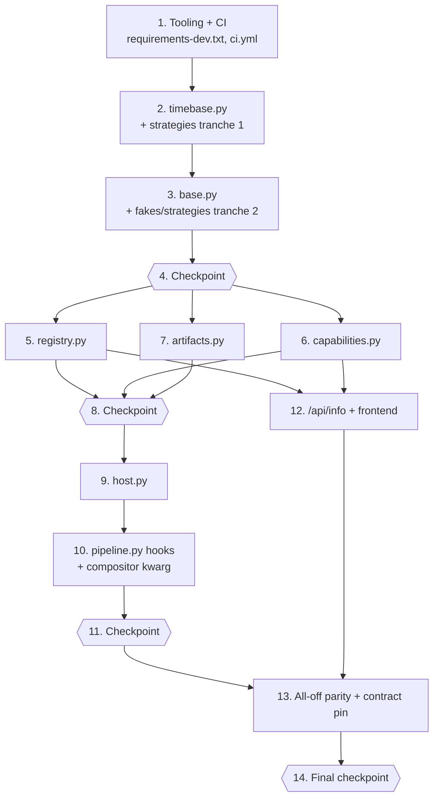

# Implementation Plan — Advanced AV Engines Foundation

These are incremental, test-first coding steps. Execute them **one task at a time**,
in order — each task builds on the previous ones so there is never orphaned code.

The plan deliberately lands **test tooling first** (the suite already imports
`hypothesis`, but it is neither declared in `requirements-dev.txt` nor installed by CI),
then the **pure primitives** (`timebase.py`, `base.py`) with the shared generators and
test doubles the sibling engine specs will reuse, then the stateful layers
(`registry.py` → `capabilities.py` → `artifacts.py` → `host.py`), and only afterwards the
**Pipeline / Compositor hooks** and the API + UI surface. Because this spec registers no
engines, the last epic is an explicit **all-off parity gate**: same clip count, same
`effects_applied`, same ffmpeg invocation count as the v0.8.0 baseline.

Tasks marked with `*` are optional test sub-tasks (unit / property / integration tests).
Property tests use `hypothesis` with `@settings(max_examples=100)`, one property per test,
tagged `# Feature: av-engines-foundation, Property N: <text>`, in the exact files named in
the design's Testing Strategy (`tests/test_engines_base.py`,
`tests/test_engine_registry.py`, `tests/test_engine_capabilities.py`,
`tests/test_engine_timebase.py`, `tests/test_engine_artifacts.py`,
`tests/test_engine_host.py`, and the extended `tests/test_options_roundtrip.py` /
`tests/test_pipeline_degradation.py`). Named generators live in the new
`tests/strategies.py`; engine/probe/storage/clock doubles live in the existing
`tests/fakes.py`, because both are designated for reuse by the queued
**audio stem separation** and **kinetic typography** specs. ffmpeg integration tests reuse
the existing helpers (`make_video`, `requires_ffmpeg`, `probe_size`, `probe_duration`,
`FakeWord`, `png_asset`) and spy on the compositor's `_run` so the suite stays fast,
offline, deterministic, and CPU-only.

Three sub-tasks are **intentionally not marked optional even though they are test/config
work**: 1.3 (proves the dependency fix actually works), 3.4 and 2.3 (the shared generators
and doubles every later test task and both sibling specs depend on), and 13.1/13.2 (the
backward-compatibility parity gate that is this spec's central guarantee).

## Tasks

- [x] 1. Test tooling and CI dependency single-sourcing
  - [x] 1.1 Declare `hypothesis` in `requirements-dev.txt`
    - The suite already uses `hypothesis` (`tests/test_options_roundtrip.py`, `tests/test_diarization.py`, `tests/test_reframe_geometry.py`, and six others import it) but the file currently declares only `-r requirements.txt`, `ruff`, `black`, `mypy`, `pytest` — `hypothesis` is **absent**.
    - Add `hypothesis>=6.100,<7.0` with a short trailing comment, matching the file's existing `>=x,<y` pin style and comment alignment.
    - _Requirements: 22.7_

  - [x] 1.2 Install the dev dependency set from `requirements-dev.txt` in CI
    - `.github/workflows/ci.yml` job `backend`, step **"Install Python dependencies"**, currently runs a hardcoded `pip install ruff fastapi uvicorn pydantic pydantic-settings python-dotenv httpx python-multipart pytest` list, so adding `hypothesis` to `requirements-dev.txt` alone would **not** make property tests runnable in CI.
    - Replace the hardcoded list with `python -m pip install --upgrade pip` followed by `pip install -r requirements-dev.txt`, so the dev dependency set is single-sourced from the file and every future PBT dependency is picked up automatically. Leave the `ruff check . || true` lint step, the import/boot smoke step, the `pytest tests/ -q` step, and the `frontend` / `deploy` jobs untouched.
    - `ci.yml` is a CI pipeline file: land this change **via pull request**, never by pushing to the default branch.
    - _Requirements: 22.7_

  - [x] 1.3 Verify a `hypothesis` property test collects and passes
    - Create `tests/test_engines_base.py` with a module docstring and a single tooling smoke property (`@given(st.integers())`, `@settings(max_examples=100)`) asserting a trivial invariant; this file is extended with the real base-contract properties in epic 3.
    - Confirm `pytest tests/test_engines_base.py tests/test_options_roundtrip.py -q` collects and passes locally, and that `pip install -r requirements-dev.txt` resolves `hypothesis` — i.e. the property-test toolchain is genuinely available before any property is written.
    - _Requirements: 22.7_

- [x] 2. Time-base and timeline primitives (`worker/engines/timebase.py`)
  - [x] 2.1 Create the engines package and implement `Time_Base`
    - Add `worker/engines/__init__.py` (empty package marker, no heavy imports) and `worker/engines/timebase.py` with `DEFAULT_FPS=30.0`, `DEFAULT_SAMPLE_RATE=48000`, `MIN_FPS=1.0`, `MAX_FPS=240.0`, the `Rounding` str-Enum (`nearest`, `floor`), and the frozen `Time_Base` dataclass (`fps`, `sample_rate`, `rounding`, `fps_substituted`).
    - Implement `from_media_info(info, *, sample_rate, rounding)` reading `worker.ffmpeg_utils.MediaInfo.fps` and substituting `DEFAULT_FPS` with `fps_substituted=True` when the probed fps is missing, zero, negative, non-finite, or outside `[MIN_FPS, MAX_FPS]`; plus `frame_duration`, `seconds_to_frame`, `frame_to_seconds`, `seconds_to_sample`, `sample_to_seconds`, `snap`, `to_dict`, `from_dict`. Stdlib-only imports so the module loads with every optional heavy dependency absent.
    - _Requirements: 1.4, 13.1, 13.2, 13.3, 13.4, 13.6, 15.3, 22.3_

  - [x] 2.2 Implement `Timeline_Segment` and Segment_List normalisation
    - Add the frozen `Timeline_Segment` (`start`, `end`, `duration` property, `overlaps`, `to_dict`, `from_dict` returning `None` for malformed or inverted records).
    - Implement `normalize_segments(segments, duration, *, time_base=None, min_duration=0.0)` — discard malformed/inverted/NaN records, optionally snap bounds to frame boundaries, clamp to `[0, duration]`, sort by `start`, drop zero-length and sub-`min_duration` segments, merge overlapping or touching segments — plus `parse_segments`, `dump_segments`, `total_duration`, `invert_segments`, and `clip_bounds`. All pure: no ffmpeg, no OpenCV, no network.
    - _Requirements: 14.1, 14.2, 14.6, 14.7, 15.1, 15.5, 22.3_

  - [x] 2.3 Add the first tranche of named generators in `tests/strategies.py`
    - Create `tests/strategies.py` (new shared module, designated for reuse by the stem-separation and kinetic-typography specs) with the design's named generators that need no engine contract: `st_engine_id`, `st_priority`, `st_capability_id`, `st_availability_map`, `st_options_mapping` (hostile JSON-ish values: wrong types, `None`, nested structures, NaN-like strings), `st_segment_records` (valid + malformed + inverted + out-of-range), `st_word_timeline` (ordered `FakeWord`s plus a duration), `st_time_base`, and `st_hostile_component` (`..`, `/`, `\`, NUL, unicode, very long strings).
    - _Requirements: 22.6, 22.7_

  - [x]* 2.4 Property test: time-base conversions round-trip and the fps fallback is recorded → `tests/test_engine_timebase.py`
    - **Property 21: Time_Base conversions round-trip and the fps fallback is recorded** — for any fps in `[MIN_FPS, MAX_FPS]` and any in-clip frame index, `seconds_to_frame(frame_to_seconds(f)) == f` (likewise for samples), and any non-positive, non-finite, or out-of-range probed fps yields `DEFAULT_FPS` with `fps_substituted` true. Generators: `st_time_base`, invalid fps values.
    - _Requirements: 13.1, 13.3, 13.4, 13.5_ · _Properties: P21_

  - [x]* 2.5 Property test: frame quantisation is bounded and snapping is idempotent → `tests/test_engine_timebase.py`
    - **Property 22: Frame quantisation is bounded and snapping is idempotent** — for any `t` in `[0, duration]`, `abs(frame_to_seconds(seconds_to_frame(t)) - t) < 1/fps`, `snap(t)` is an exact frame multiple within float tolerance with `abs(snap(t) - t) <= 1/(2*fps)`, and `snap(snap(t)) == snap(t)`.
    - _Requirements: 13.6, 15.3, 15.4_ · _Properties: P22_

  - [x]* 2.6 Property test: normalisation yields a canonical, in-bounds Segment_List → `tests/test_engine_timebase.py`
    - **Property 24: Segment normalisation yields a canonical, in-bounds Segment_List** — output is sorted by `start`, pairwise disjoint and non-touching, every bound within `[0, D]` with `start <= end` and `duration > 0`, total at most `D`, and contains exactly the normalised valid records (malformed discarded, the rest retained). Generator: `st_segment_records`.
    - _Requirements: 14.1, 14.2, 14.3, 14.5, 14.7, 15.1, 15.5_ · _Properties: P24_

  - [x]* 2.7 Property test: segment normalisation is idempotent → `tests/test_engine_timebase.py`
    - **Property 25: Segment normalisation is idempotent** — `normalize_segments(normalize_segments(x, D), D) == normalize_segments(x, D)` for any records and duration.
    - _Requirements: 14.4_ · _Properties: P25_

  - [x]* 2.8 Property test: Segment_List serialisation round-trips → `tests/test_engine_timebase.py`
    - **Property 26: Segment_List serialisation round-trips** — for any normalised Segment_List `s` and duration `D`, `parse_segments(dump_segments(s), D) == s` and the dumped form is JSON-encodable.
    - _Requirements: 14.6_ · _Properties: P26_

  - [x]* 2.9 Unit tests: `from_media_info` wiring and field defaults → `tests/test_engine_timebase.py`
    - Assert `Time_Base.from_media_info` on a hand-built `MediaInfo` reads `fps`, that the documented defaults (`DEFAULT_FPS`, `DEFAULT_SAMPLE_RATE`, `Rounding.NEAREST`, `fps_substituted=False`) hold on a bare instance, and that `to_dict`/`from_dict` round-trip a `Time_Base`.
    - _Requirements: 13.1, 13.2_

- [x] 3. Engine contract records, options layer, and shared test doubles (`worker/engines/base.py`)
  - [x] 3.1 Implement the enums, frozen records, and marker helpers
    - Add `worker/engines/base.py` with `DIGEST_LENGTH=16`, `MARKER_PREFIX="engine"`, `FLAG_SUFFIX="_enabled"`, the `Engine_Stage` (`source`, `audio`, `geometry`, `compose`, `post`) and `Engine_Status` (`applied`, `skipped`, `degraded`, `failed`) str-Enums, and the frozen dataclasses `Engine_Artifact`, `Compose_Input`, `Compose_Contribution` (with `z_order`), `Engine_Context` (all tuple/mapping fields, `rng()`, `remaining()`), and `Engine_Result` (`to_dict`/`from_dict` plus the `skipped`/`degraded`/`failed` constructors).
    - Add `marker(engine_id, detail)` producing `engine:<engine_id>:<detail>` and `merge_markers(results)` concatenating markers in invocation order, de-duplicated, contributing nothing for `skipped` results. Stdlib-only imports plus `worker.engines.timebase`.
    - _Requirements: 1.2, 1.3, 1.4, 1.5, 1.6, 3.2, 3.3, 3.4, 3.6, 15.1, 15.7_

  - [x] 3.2 Implement the options coercion, digest, and seed layer
    - Add the `Engine_Options` protocol (`parse` / `to_dict`), the `coerce_bool` / `coerce_int` / `coerce_float` / `coerce_choice` / `coerce_str` helpers mirroring the `worker.models._as_bool` and enum-known-value conventions of `ProcessingOptions.from_dict`, and `dump_options` (`dataclasses.asdict` with private keys dropped and mappings emitted in sorted key order).
    - Add `options_digest(options)` = `sha256(json.dumps(dump_options(options), sort_keys=True, separators=(",", ":"), ensure_ascii=True, default=str))` truncated to `DIGEST_LENGTH` lowercase hex, and `derive_seed(source_identity, digest)` = `int(sha256(f"{source_identity}|{digest}").hexdigest()[:16], 16)`. Both pure and process-stable (no `hash()`, no `PYTHONHASHSEED` dependence).
    - _Requirements: 10.1, 10.2, 10.4, 10.5, 10.7, 11.1, 11.5, 12.4, 12.6, 22.3_

  - [x] 3.3 Implement the `AV_Engine` abstract base
    - Add the ABC with the class-level declarations `engine_id`, `stage`, `priority`, `required_capabilities`, `optional_capabilities`, `requires_network`, `requires_model_download`, `time_budget_s`, `max_media_passes`, `produces_media`; the `flag_field()` classmethod defaulting to `f"{engine_id}{FLAG_SUFFIX}"`; `is_enabled(options)` reading that flag off the resolved options; and the abstract `resolve_options(options)`, `plan(ctx)`, `run(ctx)` trio (exactly one `Engine_Context` in, exactly one `Engine_Result` out). Collaborators are injected through `__init__`.
    - This is the surface both sibling engine specs inline verbatim — keep the names and signatures exactly as designed.
    - _Requirements: 1.1, 1.2, 4.1, 9.1, 9.2, 12.5, 19.1, 21.1, 22.1, 23.6_

  - [x] 3.4 Add the shared engine test doubles and the second generator tranche
    - Extend `tests/fakes.py` with `FakeEngine(engine_id, stage, *, status, markers, artifacts, contribution, plan, media, required_capabilities, optional_capabilities, requires_network, priority)` recording every `run` call and the context it saw; `RaisingEngine(engine_id, stage, exc=RuntimeError("boom"))`; `SlowEngine(engine_id, stage, overrun=2.0)` cooperating with an injected clock; `StaticProber(mapping, *, default=False)`; `CountingProber(inner)`; `RaisingProber(exc)`; `RecordingStorage(*, fail_on=())` implementing `BaseStorage` and recording `save_file` keys in order; and `FakeClock(start=0.0)`.
    - Extend `tests/strategies.py` with `st_stage`, `st_registrations` (id × stage × priority sets), and `st_engine_outcomes` (status × markers × artifacts × exception).
    - Both modules are the reuse contract for the stem-separation and kinetic-typography specs, so keep the constructor keywords exactly as designed.
    - _Requirements: 22.1, 22.4, 22.6, 22.7_

  - [x]* 3.5 Property test: `Engine_Result` is serialisable with a closed status domain → `tests/test_engines_base.py`
    - **Property 1: Engine_Result is serialisable with a closed status domain** — `Engine_Result.from_dict(r.to_dict()) == r`, `to_dict()` is JSON-encodable, and `status` is an `Engine_Status` member. Generator: `st_engine_outcomes`.
    - _Requirements: 1.2, 1.6, 18.5_ · _Properties: P1_

  - [x]* 3.6 Property test: invocation never mutates the caller's options or context → `tests/test_engines_base.py`
    - **Property 2: Engine invocation never mutates the caller's options or context** — for any generated `ProcessingOptions` and any engine (including one attempting to mutate its context), `dataclasses.asdict(options)` is identical before and after, and every attempted `Engine_Context` field assignment raises. Generators: `st_options_mapping`, `st_engine_outcomes`.
    - _Requirements: 1.3, 9.6_ · _Properties: P2_

  - [x]* 3.7 Property test: options parsing is total and ignores unknown keys → `tests/test_engines_base.py`
    - **Property 16: Engine_Options parsing is total and ignores unknown keys** — for any hostile mapping, `parse` returns an instance without raising whose every field is a coerced valid value or the documented default; extending a valid mapping with arbitrary unrecognised keys does not change the parse result; `coerce_choice` returns its input when known and the default otherwise. Generator: `st_options_mapping`.
    - _Requirements: 10.2, 10.4, 10.5, 10.7, 20.5_ · _Properties: P16_

  - [x]* 3.8 Property test: options serialisation round-trips → `tests/test_engines_base.py`
    - **Property 17: Engine_Options serialisation round-trips** — `dump_options(parse(dump_options(o))) == dump_options(o)` and the dumped mapping contains only JSON-serialisable scalars, lists, and mappings. Generator: `st_options_mapping`.
    - _Requirements: 10.1, 10.3_ · _Properties: P17_

  - [x]* 3.9 Property test: resolution is idempotent and order-insensitive → `tests/test_engines_base.py`
    - **Property 18: Options resolution is idempotent and order-insensitive** — `resolve_options` called twice returns equal Engine_Options with equal digests, and the dumped output is identical for every key-insertion-order permutation of a mapping. Generators: `st_options_mapping`, key permutations.
    - _Requirements: 10.6, 12.6_ · _Properties: P18_

  - [x]* 3.10 Property test: the options digest is deterministic, order-insensitive, discriminating, and stable → `tests/test_engines_base.py`
    - **Property 19: Options_Digest is deterministic, order-insensitive, discriminating, and stable** — stable across repeated calls, equal across key-order permutations, different whenever the dumps differ, matching `^[0-9a-f]{16}$`, and equal to the digest recomputed in a fresh interpreter process (subprocess check). Generator: `st_options_mapping`.
    - _Requirements: 11.1, 11.2, 11.3, 11.4, 11.5_ · _Properties: P19_

  - [x]* 3.11 Property test: planning is pure, seeded, and reproducible → `tests/test_engines_base.py`
    - **Property 20: Engine planning is pure, seeded, and reproducible** — `plan` returns equal serialised plans on repeated invocations, the context seed is the only randomness source (a patched global `random` that raises is never touched), `plan` runs with `subprocess.run` and `socket.socket` patched to raise, `derive_seed` is stable and differs whenever either input differs, and every plan timing value is a `float`. Generators: `st_word_timeline`, `st_options_mapping`.
    - _Requirements: 12.1, 12.2, 12.3, 12.4, 12.5, 15.7_ · _Properties: P20_

  - [x]* 3.12 Unit tests: abstract surface, marker helpers, and import safety → `tests/test_engines_base.py`
    - Assert an incomplete `AV_Engine` subclass raises `TypeError`; the `ClassVar` defaults (`priority=100`, `time_budget_s=30.0`, `max_media_passes=1`, `requires_network=False`, `produces_media=False`) hold; `flag_field()` derives `<engine_id>_enabled`; `marker()` formats `engine:<id>:<detail>`; and importing every `worker.engines.*` module succeeds in a subprocess with `sys.modules` blockers installed for the optional heavy packages.
    - _Requirements: 1.1, 1.4, 3.3, 19.1, 21.1_

- [x] 4. Checkpoint — Ensure all tests pass, ask the user if questions arise.

- [x] 5. Engine registry and deterministic ordering (`worker/engines/registry.py`)
  - [x] 5.1 Implement `Engine_Registry` and the module-level default
    - Add `Engine_Registration_Error(ValueError)`, the frozen `Engine_Record` (`engine`, `engine_id`, `stage`, `priority`, `sort_key == (priority, engine_id)`), and `Engine_Registry` with `register` (raising `Engine_Registration_Error` naming the conflicting id and leaving the registry unchanged), `get`, `find`, `for_stage` (only engines declaring that stage, ordered by `(priority, engine_id)`, `[]` when empty), `all`, `ids`, `records`, `reset`, `__len__`, `__contains__`.
    - Add the module-level `_DEFAULT` instance with `get_registry()`, `register()`, and `reset_registry()`, keeping instances fully independent so tests can build isolated registries.
    - _Requirements: 2.1, 2.2, 2.3, 2.4, 2.5, 2.6, 2.7, 22.2_

  - [x]* 5.2 Property test: registry order is independent of registration order → `tests/test_engine_registry.py`
    - **Property 3: Registry order is independent of registration order** — for any registration set and any permutation of it, `for_stage(stage)` returns the same sequence, equal to the registrations sorted by `(priority, engine_id)`. Generator: `st_registrations`.
    - _Requirements: 2.5_ · _Properties: P3_

  - [x]* 5.3 Property test: stage lookup partitions the registry and lookup round-trips → `tests/test_engine_registry.py`
    - **Property 4: Stage lookup partitions the registry, and lookup round-trips** — every engine from `for_stage(s)` declares `s`, the union over all stages equals the registration set with no duplicates (including the empty set), and `get(engine_id)` returns the exact registered instance. Generators: `st_registrations`, `st_stage`.
    - _Requirements: 2.1, 2.2, 2.4, 2.6_ · _Properties: P4_

  - [x]* 5.4 Property test: duplicate Engine_Id registration is a named error → `tests/test_engine_registry.py`
    - **Property 5: Duplicate Engine_Id registration is a named error** — registering any id twice raises `Engine_Registration_Error` whose message contains that id, and the registry is unchanged in length and instance identity. Generator: `st_engine_id`.
    - _Requirements: 2.3_ · _Properties: P5_

  - [x]* 5.5 Property test: reset empties a registry and instances stay isolated → `tests/test_engine_registry.py`
    - **Property 6: Reset empties a registry and instances stay isolated** — after `reset()` the length is zero and every stage list empty; and registering into one `Engine_Registry` never changes another instance or the module-level default. Generator: `st_registrations`.
    - _Requirements: 2.7, 22.2_ · _Properties: P6_

- [x] 6. Capability probing and caching (`worker/engines/capabilities.py`)
  - [x] 6.1 Implement capability ids, statuses, and the default prober
    - Add the `Capability_Kind` str-Enum (`python_pkg`, `binary`, `ffmpeg_filter`, `font`, `provider_key`, `model`, `llm`), `LLM_CAPABILITY`, `parse_capability_id` (unknown kinds return `("", id)`), the frozen `Capability_Status` (`capability_id`, `available`, `detail`, `to_dict`, `from_dict`), the `Prober` callable alias, and the empty `MODEL_LOCATORS` registry.
    - Implement `default_prober` dispatching on kind: `importlib.util.find_spec`, `shutil.which`, an `settings.ffmpeg_binary -filters` invocation (never a hardcoded binary name), `worker.captions.font_available`, `settings.<name>_api_key`, a registered model locator (absent locator ⇒ unavailable), and `worker.llm_client.llm_available`. Never raise — wrap every underlying error as `available=False` with the error summary as `detail` — and never touch the network.
    - _Requirements: 5.1, 5.2, 5.3, 5.4, 5.5, 5.6, 21.5_

  - [x] 6.2 Implement `Capability_Report` caching, serialisation, and invalidation
    - Add `Capability_Report(prober=None)` with the per-process `_cache`, `status` (underlying prober invoked at most once per id), `available`, `first_missing`, `missing` (both in declaration order), `to_dict` (sorted keys, serialisable for `/api/info`), and `invalidate(capability_id=None)`; plus the module-level `get_report(prober=None)` and `reset_report()`.
    - _Requirements: 5.7, 6.1, 6.2, 6.3, 6.4, 6.5, 20.2_

  - [x]* 6.3 Property test: probing is total, offline, and shaped → `tests/test_engine_capabilities.py`
    - **Property 10: Probing is total, offline, and shaped** — for any string capability id (well-formed or not) `default_prober` returns a `Capability_Status` with a `bool` `available` and `str` `detail` without raising; for any exception raised by an injected prober the status is unavailable with the exception class name in `detail`; probing performs zero network calls (socket guard); model capabilities with no registered locator report unavailable. Generators: `st_capability_id`, exception classes; doubles: `RaisingProber`.
    - _Requirements: 5.2, 5.3, 5.6, 21.5_ · _Properties: P10_

  - [x]* 6.4 Property test: the report caches, is deterministic, serialises, and invalidates → `tests/test_engine_capabilities.py`
    - **Property 11: The report caches, is deterministic, serialises, and invalidates** — a `CountingProber` is invoked at most once per id however often `status()` is called; two `to_dict()` calls are equal; `to_dict()` is JSON-round-trippable with sorted keys; `available(id)` equals the injected `StaticProber` map value; and after `invalidate()` the next `status()` re-probes exactly once. Generators: `st_capability_id`, `st_availability_map`.
    - _Requirements: 5.7, 6.1, 6.2, 6.3, 6.4, 6.5, 20.2_ · _Properties: P11_

  - [x]* 6.5 Unit tests: one test per capability kind with the collaborator stubbed → `tests/test_engine_capabilities.py`
    - Stub `importlib.util.find_spec`, `shutil.which`, the `ffmpeg -filters` output, `captions.font_available`, `settings.<name>_api_key`, and `llm_client.llm_available`; assert each kind maps to the right collaborator, that a sentinel `settings.ffmpeg_binary` is the binary actually invoked for filter probes, and that `parse_capability_id` handles `"llm"` and unknown kinds.
    - _Requirements: 5.1, 5.4, 5.5_

- [x] 7. Engine workspaces and durable artifacts (`worker/engines/artifacts.py`)
  - [x] 7.1 Implement path sanitisation, `Engine_Workspace`, and allocation
    - Add `ENGINE_TEMP_ROOT="engines"`, `ENGINE_KEY_ROOT="engines"`, `MAX_COMPONENT_LEN=48`, and `sanitize_component` (lowercase, non-`[a-z0-9._-]` → `_`, leading dots stripped, `""`/`"."`/`".."` → fallback, truncated).
    - Add the frozen `Engine_Workspace` (`root`, `temp_dir`, `job_id`, `clip_id`, `engine_id`, `options_digest`) with `path(*parts)` raising `ValueError` on an escape attempt, `artifact(name, *, media_type, durable)`, and `exists()`; and `allocate_workspace(temp_dir, job_id, clip_id, engine_id, options_digest, *, create=True)` producing `<temp_dir>/engines/<job>/<clip>/<engine>__<digest>` with every component sanitised, containment asserted, and parents created.
    - _Requirements: 11.6, 16.1, 16.2, 16.3, 16.4, 16.5, 16.6, 16.7_

  - [x] 7.2 Implement workspace cleanup
    - Add `cleanup_workspace(ws, *, remover=None, logger=None)` deleting `ws.root`, logging and swallowing `OSError`, and returning success; and `cleanup_job_workspaces(temp_dir, job_id)` deleting `<temp_dir>/engines/<job>` and returning the number of entries removed. The `remover` seam lets tests inject `OSError`.
    - _Requirements: 17.1, 17.4, 17.6_

  - [x] 7.3 Implement durable artifact keys and persistence
    - Add `artifact_key(job_id, clip_id, engine_id, name)` building `engines/<job>/<clip>/<engine>/<name>` from sanitised components and passing it through `storage_backends.base.normalize_key`, and `persist_artifact(artifact, *, job_id, clip_id, storage=None)` saving through `storage or get_storage()` via `BaseStorage.save_file` and returning a copy with `storage_key` set. Errors propagate to the host (which records `engine:<id>:artifact_failed`).
    - _Requirements: 18.1, 18.2, 18.3, 18.4, 18.5_

  - [x]* 7.4 Property test: workspace paths are contained, sanitised, and unique → `tests/test_engine_artifacts.py`
    - **Property 29: Workspace paths are contained, sanitised, and unique** — for any job/clip/engine/digest and any relative artifact name including traversal payloads, the workspace and every `ws.path(...)` resolve inside the Pipeline `temp_dir`, the directory exists and is writable after allocation, the sanitised components all appear in the path, and distinct tuples map to distinct directories. Generator: `st_hostile_component`; `@settings(deadline=None)` because it touches `tmp_path`.
    - _Requirements: 11.6, 16.1, 16.2, 16.3, 16.4, 16.5, 16.6, 16.7_ · _Properties: P29_

  - [x]* 7.5 Property test: workspaces are always cleaned up, durable artifacts first → `tests/test_engine_artifacts.py`
    - **Property 30: Workspaces are always cleaned up, durable artifacts first** — for engines of any status (`applied`, `degraded`, `failed`, timeout), no workspace for that clip remains after cleanup and no `engines/<job_id>` directory remains after job cleanup; a `RecordingStorage` shows every durable artifact saved *before* its workspace was removed; and an injected `OSError` remover returns normally, logs once, and later clips still process. Generators: `st_engine_outcomes`, `OSError` injection.
    - _Requirements: 17.1, 17.4, 17.5, 17.6, 17.7_ · _Properties: P30_

  - [x]* 7.6 Property test: durable artifact keys are safe and backend-neutral → `tests/test_engine_artifacts.py`
    - **Property 31: Durable artifact keys are safe and backend-neutral** — `artifact_key` output is a fixed point of `normalize_key`, has no empty/`.`/`..` segment and no leading slash, is identical for a local backend and a fake S3 backend (`FakeS3Client`), and is recorded on the returned artifact record. Generator: `st_hostile_component`.
    - _Requirements: 18.1, 18.2, 18.3, 18.4, 18.5_ · _Properties: P31_

  - [x]* 7.7 Property test: artifact persistence failure degrades, it does not fail the clip → `tests/test_engine_artifacts.py`
    - **Property 32: Artifact persistence failure degrades, it does not fail the clip** — for any storage raising on `save_file` (`RecordingStorage(fail_on=...)`), exactly one `engine:<id>:artifact_failed` marker is recorded, the clip is still produced, and the workspace is still cleaned up.
    - _Requirements: 18.6_ · _Properties: P32_

  - [x]* 7.8 Unit tests: retention wiring under `auto_delete_temp` → `tests/test_engine_artifacts.py`
    - Spy `storage_backends.retention.cleanup_temp` and assert it is used for job-level cleanup when `runtime_config.get_runtime_config().auto_delete_temp` is enabled, and that the job workspace root survives when it is disabled (awaiting the `RetentionSweeper` sweep).
    - _Requirements: 17.2, 17.3_

- [x] 8. Checkpoint — Ensure all tests pass, ask the user if questions arise.

- [x] 9. Engine host: gating, isolation, timeouts, and lifecycle (`worker/engines/host.py`)
  - [x] 9.1 Implement host construction, gating, and the shared time base
    - Add `Stage_Outcome` (`stage`, `results`, `markers`, `artifacts`, `contributions`, `media`) and `Engine_Host(options, *, job_id, temp_dir, registry=None, capabilities=None, storage=None, clock=time.monotonic, logger=None, sample_rate=DEFAULT_SAMPLE_RATE)` where `options` is already `effective_options(...)`-normalised and every collaborator defaults lazily (`get_registry()`, `get_report()`, `get_storage()` only when needed).
    - Implement `active` (true only when at least one registered engine is enabled), `enabled_for(stage)` (registry order), and `time_base(info)` building and caching one `Time_Base` per job from the source probe so no additional ffprobe pass is added.
    - _Requirements: 4.1, 4.4, 13.7, 19.2, 19.4, 19.5, 22.1_

  - [x] 9.2 Implement the gating ladder in `_invoke`
    - Steps 1–3: disabled engine ⇒ `skipped` with no marker, no capability probe and no workspace; `permissibility_mode` plus `requires_network` ⇒ `degraded` with `engine:<id>:permissibility_blocked` and the engine body never entered; first missing required capability in declaration order ⇒ `degraded` with `engine:<id>:unavailable:<capability_id>`; each missing optional capability ⇒ `engine:<id>:degraded:<capability_id>`, capped at one degradation marker per engine per clip.
    - _Requirements: 4.2, 7.1, 7.2, 7.4, 9.5, 21.2, 21.3_

  - [x] 9.3 Implement execution, failure isolation, timeout, and marker merging
    - Step 4 onwards: allocate the workspace, build the frozen `Engine_Context` (clip-relative bounds, shared `Time_Base`, rebased words, resolved options, `options_digest`, `derive_seed`, `deadline = clock() + time_budget_s`, `fps_fallback:<value>` note when substituted, injected `deps`), then run on a single-worker thread with `future.result(timeout=...)`.
    - Catch every `Exception` (including `worker.ffmpeg_utils.FFmpegError`) ⇒ `failed` + exactly one `engine:<id>:failed`, logging the exception class and message; budget overrun ⇒ `failed` + exactly one `engine:<id>:timeout` with the contribution and artifacts abandoned; then namespace and de-duplicate markers via `merge_markers` in registry order and continue with the remaining engines.
    - _Requirements: 3.2, 3.3, 3.6, 8.1, 8.2, 8.4, 8.5, 8.6, 13.3, 19.1_

  - [x] 9.4 Implement `run_source`, `source_result`, and `run_stage`
    - `run_source(source, info)` invokes SOURCE-stage engines at most once per source per `run_pipeline` call and caches each result for `source_result(engine_id)` so every clip reuses it.
    - `run_stage(stage, *, clip_id, source, clip_path, clip_start, clip_end, duration, words=())` invokes every enabled engine of that stage through `_invoke`, accumulates results/markers/artifacts/contributions into a `Stage_Outcome`, and returns replacement `media` only when a `produces_media` engine succeeded — so a failed or degraded engine leaves the preceding stage's media in place.
    - _Requirements: 3.1, 3.5, 7.3, 8.3, 15.1, 15.2, 19.3_

  - [x] 9.5 Implement `finish_clip` and `finish_job`
    - `finish_clip(clip_id)` persists durable artifacts through `persist_artifact` **before** deleting that clip's workspaces, returns any extra markers (`engine:<id>:artifact_failed`), honours `runtime_config.get_runtime_config().auto_delete_temp`, routes job-level cleanup through `storage_backends.retention.cleanup_temp`, and logs-and-swallows `OSError`. `finish_job()` removes `<temp_dir>/engines/<job_id>` when `auto_delete_temp` is enabled.
    - _Requirements: 17.1, 17.2, 17.3, 17.4, 17.5, 17.6, 17.7, 18.6_

  - [x]* 9.6 Property test: marker merge is namespaced, ordered, deduplicated, and silent for skips → `tests/test_engine_host.py`
    - **Property 7: Marker merge is namespaced, ordered, deduplicated, and silent for skips** — the merged list contains every non-skipped engine's markers exactly once, in registry invocation order, each matching `^engine:<engine_id>:`, with `skipped` results contributing nothing. Generators: `st_registrations`, `st_engine_outcomes`.
    - _Requirements: 3.1, 3.2, 3.3, 3.4, 3.6_ · _Properties: P7_

  - [x]* 9.7 Property test: source-stage engines run once per source and are reused → `tests/test_engine_host.py`
    - **Property 8: Source-stage engines run once per source and are reused** — for any clip count `n >= 1` a counting SOURCE-stage `FakeEngine` records exactly one invocation and every clip observes the same cached `Engine_Result`. Generators: `st_engine_outcomes`, clip counts in `[1, 5]`.
    - _Requirements: 3.5, 19.3_ · _Properties: P8_

  - [x]* 9.8 Property test: disabled engines cost nothing → `tests/test_engine_host.py`
    - **Property 9: Disabled engines cost nothing** — for any subset of enabled flags exactly that subset is invoked; for every disabled engine the `CountingProber` records zero probes of its exclusive capabilities, no workspace directory exists on disk, and no additional media pass occurs; with the empty subset the prober call count is zero overall. Generators: `st_registrations`, boolean-flag subsets.
    - _Requirements: 4.1, 4.2, 19.5_ · _Properties: P9_

  - [x]* 9.9 Property test: missing capabilities degrade with exact, single markers → `tests/test_engine_host.py`
    - **Property 12: Missing capabilities degrade with exact, single markers** — an unavailable required capability yields `degraded` with exactly `engine:<id>:unavailable:<first missing required id>` and a `run` body that never executed; each missing optional capability yields exactly `engine:<id>:degraded:<capability_id>`; at most one degradation marker per engine per clip. Generators: `st_registrations`, `st_availability_map`.
    - _Requirements: 7.1, 7.2, 7.4_ · _Properties: P12_

  - [x]* 9.10 Property test: one engine's failure is isolated → `tests/test_engine_host.py`
    - **Property 14: One engine's failure is isolated** — for any subset of `RaisingEngine`s (any exception type, including `fu.FFmpegError`), each yields `failed` with exactly one `engine:<id>:failed` marker and every remaining engine of that stage is still invoked in registry order. Generators: `st_registrations`, exception classes.
    - _Requirements: 8.1, 8.2, 8.4_ · _Properties: P14_

  - [x]* 9.11 Property test: time budgets are enforced and abandoned cleanly → `tests/test_engine_host.py`
    - **Property 15: Time budgets are enforced and abandoned cleanly** — for any declared `time_budget_s` and any `SlowEngine` overrunning it under `FakeClock`, the result carries exactly one `engine:<id>:timeout` marker, no contribution or artifact from that engine is applied or persisted, and the clip still completes. Generators: budgets and overrun factors.
    - _Requirements: 8.6, 19.1_ · _Properties: P15_

  - [x]* 9.12 Property test: every engine of a clip shares one Time_Base and adds no probe → `tests/test_engine_host.py`
    - **Property 23: Every engine of a clip shares one Time_Base and adds no probe** — all recorded `ctx.time_base` values for a clip are equal (and the same object) and the ffprobe spy count added by the host is zero. Generators: `st_registrations`, clip counts.
    - _Requirements: 13.7, 19.4_ · _Properties: P23_

  - [x]* 9.13 Property test: the rebased Word_Timeline reaches every subsequent engine → `tests/test_engine_host.py`
    - **Property 27: The rebased Word_Timeline reaches every subsequent engine** — for any Word_Timeline and any filler keep-plan, the words recorded by every engine invoked after filler removal equal `filler.rebase_words(words, keeps)` and every word bound lies within `[0, ctx.duration]`. Generators: `st_word_timeline`, keep-plans.
    - _Requirements: 15.1, 15.2_ · _Properties: P27_

  - [x]* 9.14 Property test: independent engines are confluent → `tests/test_engine_host.py`
    - **Property 28: Independent engines are confluent** — for any two engines whose contributions occupy disjoint time ranges, running them in either relative priority order yields equal merged marker sets and equal produced-artifact key sets. Generators: `st_registrations`, disjoint segment pairs.
    - _Requirements: 15.6_ · _Properties: P28_

  - [x]* 9.15 Property test: permissibility blocks network engines and keeps runs offline → `tests/test_engine_host.py`
    - **Property 33: Permissibility blocks network engines and keeps runs offline** — with `permissibility_mode` on, no engine declaring `requires_network` executes its `run` body, each yields `degraded` with exactly one `engine:<id>:permissibility_blocked` marker, resolved options equal the documented safe values, and a clip of purely local engines completes with `socket.socket` patched to raise. Generators: `st_registrations`, network-declaring subsets.
    - _Requirements: 9.5, 21.2, 21.3, 21.4_ · _Properties: P33_

  - [x]* 9.16 Unit tests: failure logging and media fallback examples → `tests/test_engine_host.py`
    - `caplog` assertion that a failed engine logs its exception class and message; example assertions that `Stage_Outcome.media` is `None` for a failed/degraded `produces_media` engine (so the caller keeps the prior media) and set for a successful one.
    - _Requirements: 8.3, 8.5_

- [x] 10. Pipeline hooks and the single-pass compositor kwarg
  - [x] 10.1 Add the `engine_contributions` keyword to `compositor.render_clip`
    - Add exactly one optional keyword, `engine_contributions: Optional[Sequence[Compose_Contribution]] = None`, to `worker/effects/compositor.py` `render_clip`. When it is `None`/empty every existing code path — including the "return `None` when nothing changed" contract — is byte-for-byte unchanged. When contributions exist, append their `inputs` to the same `-i` list and their `video_filters`/`audio_filters` to the same `-filter_complex`, ordered by `(z_order, engine_id)` with captions kept on top, and hand any `subtitle_path` to the existing libass slot — still **one** ffmpeg pass.
    - _Requirements: 1.5, 23.3_

  - [x] 10.2 Construct the host and add the source-stage hook in `worker/pipeline.py`
    - After the existing `options = effective_options(options)`, construct `Engine_Host(options, job_id=temp_dir.name, temp_dir=temp_dir)`; after the existing `info = fu.probe(source)` call `host.run_source(source, info)` guarded by `host.active` so no probe, workspace, or media pass is added when every engine is off. Do not reorder or duplicate any existing call.
    - _Requirements: 4.4, 13.2, 13.7, 19.4, 19.5, 23.2_

  - [x] 10.3 Add the audio, geometry, compose, and post hooks plus clip/job finalisation
    - Inside the per-clip loop, insert `host.run_stage(...)` calls guarded by `host.active` at the four designed points — after filler removal + `rebase_words` (AUDIO, `raw = out.media or raw`), after the geometry ladder (GEOMETRY, `geo = out.media or geo`), immediately before `compositor.render_clip` (COMPOSE, passing `engine_contributions=`), and after `fu.generate_thumbnail` (POST) — extending `applied` with each outcome's markers, then `host.finish_clip(clip_id)` and `host.finish_job()`. The existing stage order `cut → filler removal → geometry → compositor → thumbnail` is preserved exactly.
    - _Requirements: 3.1, 3.2, 7.3, 8.3, 15.1, 15.2, 17.1, 17.6, 18.6, 23.2, 23.3_

  - [x]* 10.4 Property test: clip count is invariant under degradation and failure → `tests/test_pipeline_degradation.py`
    - **Property 13: Clip count is invariant under degradation and failure** — for any availability map and any subset of engines forced to raise (including `FFmpegError`) or to overrun their budget, the Pipeline produces the same number of ClipResults as the all-engines-disabled run of the same input, and the media handed to the next stage equals the pre-stage media for every failing engine. Generators: `st_availability_map`, failing subsets, `st_engine_outcomes`.
    - _Requirements: 7.3, 7.5, 8.3, 8.7_ · _Properties: P13_

  - [x]* 10.5 ffmpeg integration test: a compose-stage contribution still renders in one pass → `tests/test_pipeline_effects.py`
    - Register one COMPOSE-stage `FakeEngine` contributing a still-image overlay from `png_asset`, render a 2–3s `make_video` clip with `requires_ffmpeg`, spy on the compositor's `_run` to assert **exactly one** ffmpeg invocation, and assert `probe_size`/`probe_duration` match the target.
    - _Requirements: 1.5, 22.5, 23.3_

  - [x]* 10.6 ffmpeg integration test: an audio-stage engine may replace clip media → `tests/test_pipeline_effects.py`
    - Register one AUDIO-stage `FakeEngine` returning replacement media and assert the final clip is produced with an unchanged duration; then force that engine to raise and assert the clip is still produced from the pre-stage media.
    - _Requirements: 8.3, 22.5_

- [ ] 11. Checkpoint — Ensure all tests pass, ask the user if questions arise.

- [ ] 12. API and UI surface
  - [ ] 12.1 Advertise engines and capabilities from `/api/info`
    - In `api/main.py`, add an `"engines"` list built from `get_registry().all()` (`id`, `stage`, `priority`, `flag`, `enabled_by_default: False`, `available`, `missing`, `requires_network`, `time_budget_s`) and a `"capabilities"` mapping from `get_report().to_dict()`, consulting the report only for capabilities that registered engines declare. Every existing v0.8.0 key and list is retained unchanged; with no engine registered the list is `[]`.
    - _Requirements: 20.1, 20.2, 20.6_

  - [ ] 12.2 Wire the frontend engine surface
    - In `frontend/src/App.jsx`, forward engine keys generically from `DEFAULT_SETTINGS` through `toOptions` (so a sibling engine only adds its default, and profiles persist it automatically). In `frontend/src/components/SettingsPanel.jsx`, add an **Advanced engines** collapsible block rendered from `info.engines` — one row per engine with its name, a toggle bound to `<engine_id>_enabled`, and, when `available` is false, a disabled toggle listing the missing capability names. The block is **not rendered when `info.engines` is empty**, so the v0.8.0 UI is unchanged until an engine ships.
    - _Requirements: 20.1, 20.3, 20.4_

  - [ ]* 12.3 Unit tests: `/api/info` shape and junk option tolerance → `tests/test_api.py`
    - Assert `/api/info` exposes `engines` (empty with no registration) and `capabilities` while retaining every pre-existing key, that a registered `FakeEngine` appears with `flag == "<engine_id>_enabled"` and `enabled_by_default is False`, and that a `POST /api/upload` carrying unrecognised engine option values still creates a job.
    - _Requirements: 20.1, 20.2, 20.3, 20.5, 20.6_

  - [ ]* 12.4 Property test: engine option fields round-trip through `ProcessingOptions` → `tests/test_options_roundtrip.py`
    - **Property 35: Engine option fields round-trip through ProcessingOptions** — for any options mapping, `ProcessingOptions.from_dict(asdict(from_dict(m))) == from_dict(m)`, every engine Feature_Flag defaults to `False` on a fresh instance, and `AV_Engine.flag_field()` equals `f"{engine_id}_enabled"` for every registered engine. Generators: `st_options_mapping`, `st_engine_id`.
    - _Requirements: 9.1, 9.2, 9.3, 23.4_ · _Properties: P35_

- [ ] 13. All-off parity gate and contract pin
  - [ ] 13.1 Property test: all engines off reproduces v0.8.0 exactly → `tests/test_pipeline_degradation.py`
    - **Property 34: All engines off reproduces v0.8.0 exactly** — for any `ProcessingOptions` with every engine Feature_Flag off and for any registry contents (including empty), the Pipeline produces the same **clip count**, the same **`effects_applied`** list, and the same **ffmpeg invocation count** as the baseline run with no `Engine_Host`, and the recorded stage order remains `cut → filler removal → geometry → compositor → thumbnail`. Generators: `st_options_mapping`, `st_registrations`; ffmpeg calls counted with a spy on `_run` / `fu` helpers.
    - This is the spec's central backward-compatibility guarantee, so it is **not** an optional sub-task.
    - _Requirements: 4.3, 9.4, 23.1, 23.2, 23.3_ · _Properties: P34_

  - [ ] 13.2 All-off ffmpeg parity check on a tiny clip → `tests/test_pipeline_degradation.py`
    - With `make_video` and `requires_ffmpeg`, run an all-off clip through the hooked Pipeline and assert `compositor.render_clip` still returns `None` when no effect is enabled, that the ffmpeg invocation count equals the pre-hook baseline, and that no `engines/` directory is created beneath the job `temp_dir`. Non-optional for the same reason as 13.1.
    - _Requirements: 4.3, 19.5, 23.1, 23.3_

  - [ ]* 13.3 Unit tests: legacy marker regression and contract-surface pin → `tests/test_engines_base.py`
    - Assert the documented v0.8.0 `effects_applied` marker strings are unchanged and disjoint from the `engine:` namespace, and pin the public names and dataclass fields of `worker.engines.base` / `registry` / `capabilities` / `timebase` / `artifacts` (plus the `tests/fakes.py` doubles and `tests/strategies.py` generators) so the stem-separation and kinetic-typography specs can depend on them without modification.
    - _Requirements: 22.6, 23.5, 23.6_

- [ ] 14. Final checkpoint — Ensure all tests pass, ask the user if questions arise.

## Notes

- Tasks marked with `*` are optional test sub-tasks (unit / property / integration) and can be skipped for a faster MVP; core implementation tasks are never optional. The exceptions are called out above: **1.3** (proves the CI/dependency fix actually works), **2.3** and **3.4** (the shared generators and doubles every later test task and both sibling specs import), and **13.1/13.2** (the all-off parity gate that is this spec's whole backward-compatibility promise).
- Each task references the specific requirement clauses it satisfies, and every property-test task cites the design property (P1–P35) it discharges.
- Task 1 fixes a real two-part gap verified in the repo: `hypothesis` is **absent** from `requirements-dev.txt` even though nine test modules import it, **and** the CI `backend` job installs a hardcoded pip list rather than `-r requirements-dev.txt` — so both edits are needed for property tests to run in CI. `.github/workflows/ci.yml` must be landed via pull request, never pushed to the default branch.
- Ordering is dependency-safe: tooling → pure primitives (`timebase`, `base`) and the shared test surface → registry → capabilities → artifacts → host → Pipeline/Compositor hooks → API/UI → parity. The shared generators land in two tranches (2.3 before the primitive property tests, 3.4 once `Engine_Stage`/`AV_Engine` exist) because test-first property tasks cannot run before their generators exist.
- All 35 design properties are covered by exactly one property-test sub-task: P21, P22, P24–P26 (`tests/test_engine_timebase.py`); P1, P2, P16–P20 (`tests/test_engines_base.py`); P3–P6 (`tests/test_engine_registry.py`); P10, P11 (`tests/test_engine_capabilities.py`); P29–P32 (`tests/test_engine_artifacts.py`); P7–P9, P12, P14, P15, P23, P27, P28, P33 (`tests/test_engine_host.py`); P13, P34 (`tests/test_pipeline_degradation.py`); P35 (`tests/test_options_roundtrip.py`).
- Property tests use `hypothesis` (`@settings(max_examples=100)`, `deadline=None` for the workspace/cleanup properties that touch `tmp_path`), one property per test, tagged `# Feature: av-engines-foundation, Property N: ...`.
- This spec registers **no** engines, so it adds no `ProcessingOptions` fields and no UI controls that render by default; it fixes the `<engine_id>_enabled` flag convention, the `engine:<engine_id>:<detail>` marker namespace, and the five stage hooks that the audio stem separation and kinetic typography specs inline verbatim.
- Test doubles live in `tests/fakes.py` and generators in `tests/strategies.py` precisely so those two sibling specs import rather than redefine them; keep the designed constructor keywords and generator names stable.

## Task Dependency Graph

Epic-level view — nodes on the same rank can proceed in parallel once their predecessors
land (checkpoints 4, 8, 11, 14 are gates, not code):



Leaf-task execution waves (tasks in the same wave are independent and never write the same
file; tasks in wave *N* require every wave below *N*):

```json
{
  "waves": [
    { "id": 0,  "tasks": ["1.1", "1.2"] },
    { "id": 1,  "tasks": ["1.3"] },
    { "id": 2,  "tasks": ["2.1"] },
    { "id": 3,  "tasks": ["2.2", "2.3"] },
    { "id": 4,  "tasks": ["3.1", "2.4"] },
    { "id": 5,  "tasks": ["3.2", "2.5"] },
    { "id": 6,  "tasks": ["3.3", "2.6"] },
    { "id": 7,  "tasks": ["3.4", "2.7"] },
    { "id": 8,  "tasks": ["5.1", "6.1", "7.1", "2.8", "3.5"] },
    { "id": 9,  "tasks": ["6.2", "7.2", "5.2", "2.9", "3.6"] },
    { "id": 10, "tasks": ["7.3", "5.3", "6.3", "3.7"] },
    { "id": 11, "tasks": ["9.1", "5.4", "6.4", "7.4", "3.8"] },
    { "id": 12, "tasks": ["9.2", "5.5", "6.5", "7.5", "3.9"] },
    { "id": 13, "tasks": ["9.3", "7.6", "12.1", "3.10"] },
    { "id": 14, "tasks": ["9.4", "7.7", "12.3", "3.11"] },
    { "id": 15, "tasks": ["9.5", "7.8", "12.2", "12.4", "3.12"] },
    { "id": 16, "tasks": ["10.1", "9.6"] },
    { "id": 17, "tasks": ["10.2", "9.7"] },
    { "id": 18, "tasks": ["10.3", "9.8"] },
    { "id": 19, "tasks": ["10.4", "9.9"] },
    { "id": 20, "tasks": ["10.5", "9.10"] },
    { "id": 21, "tasks": ["10.6", "9.11"] },
    { "id": 22, "tasks": ["13.1", "9.12"] },
    { "id": 23, "tasks": ["13.2", "9.13"] },
    { "id": 24, "tasks": ["13.3", "9.14"] },
    { "id": 25, "tasks": ["9.15"] },
    { "id": 26, "tasks": ["9.16"] }
  ]
}
```
