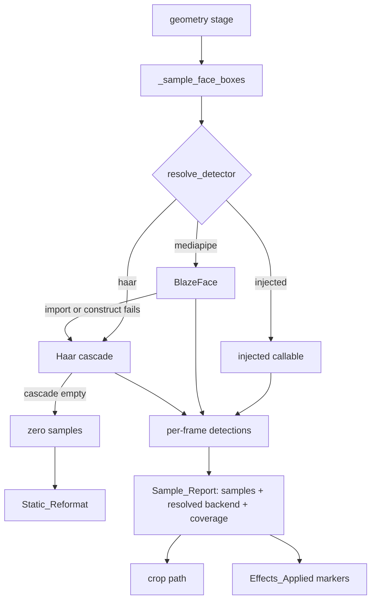

# Design Document — Modern Face Detection & Detection Confidence

## Overview

This feature replaces nothing and adds two things: a **second Face_Detector_Backend**
reached through an injection point that already exists, and a **measured confidence
signal** attached to the clip record.

The design's governing constraint is that `ProcessingOptions.reframe` defaults to
`True`. Face detection is therefore on the critical path for nearly every clip, which
makes it the worst possible place for a regression and the best possible place for a
measurement. Both halves of this spec follow from that: the new backend is **opt-in**
so the default path is untouched, and the confidence marker is **always computed** so
the default path finally reports on itself.

### Where it sits

Detection is confined to one function today, and stays confined to it:

```
apply_reframe / apply_speaker_reframe        (geometry stage, worker/effects/reframe.py)
  └── track_faces / detect_faces
        └── _sample_face_boxes(video, sample_fps, max_samples, detector)   ← the seam
              ├── resolve_detector(backend, injected)     ← NEW
              │     ├── _default_haar_detector(cv2)       ← unchanged
              │     └── _mediapipe_detector()             ← NEW
              └── per-frame: detector(frame) -> list[Detection]
```

Nothing above `_sample_face_boxes` learns which backend ran except through the returned
Sample_Report. Nothing below it touches ffmpeg. The filter graph, the `sendcmd` script,
and the pass count are untouched — Requirement 9.3 and 9.4 are satisfied structurally
rather than by testing.



---

## The central hazard: two coordinate systems

**This is the part of the design that will break if implemented carelessly, and it is
the reason Requirement 11 demands a real-library test.**

The existing detector returns absolute pixels:

```python
faces = detector.detectMultiScale(gray, ...)   # [(x, y, w, h)] ints, pixels
```

MediaPipe does not. Its detections carry
`detection.location_data.relative_bounding_box`, whose `xmin`, `ymin`, `width` and
`height` are **normalised to `[0.0, 1.0]` of frame width and height**.

Passing those straight through would produce boxes of width `0` and `1` pixels after the
`int()` coercion in `detect_faces`. The consequences are worth spelling out, because
none of them is an error:

- `pick_main_face` would still return a centre — near the frame's top-left corner.
- `FaceBox` would still validate.
- `build_face_tracks` would still build tracks, all of them tiny and clustered.
- `build_sendcmd` would still clamp to a valid crop window.
- ffmpeg would still encode successfully.
- The clip record would still say `reframe`.

The only symptom would be every clip cropped to the left edge of the frame, and the only
place it would be visible is the pixels. This is precisely the shape of the
`font_substituted:Arial` defect the working agreement was written after, and precisely
what a suite of fake detectors returning pixel tuples cannot catch — because the fakes
would be right and the real backend wrong.

Hence:

- Conversion is a **named, pure, separately tested function**, not an inline expression.
- It takes frame dimensions explicitly rather than reading them from a captured frame,
  so it is testable without OpenCV.
- Requirement 11.2 asserts the *real* backend's output is in pixels and in bounds.
- Requirement 2.5 asserts `w > 0 and h > 0`, which is the cheap invariant that fails
  loudly the moment normalised coordinates leak through.

```python
def relative_box_to_pixels(
    rel_x: float, rel_y: float, rel_w: float, rel_h: float, *, width: int, height: int
) -> Optional[tuple[int, int, int, int]]:
    """Convert a MediaPipe Relative_Bounding_Box to an absolute-pixel box.

    Pure, and deliberately not inlined at the call site. MediaPipe reports geometry
    normalised to [0, 1]; every other detector in this module reports pixels. A box that
    silently stays normalised produces a 1-pixel face at the frame origin, which fails no
    assertion anywhere downstream and is visible only in the rendered pixels.

    Returns ``None`` for a degenerate box rather than a zero-sized one, so the caller
    drops it instead of tracking it. MediaPipe can report boxes extending past the frame
    edge for a partially visible face, so the box is clamped, and clamping is what can
    make an off-frame box degenerate.
    """
```

Clamping order matters and is fixed by the docstring: convert, then clamp, then test for
degeneracy. Testing degeneracy before clamping would admit a box that is entirely
off-frame; clamping before conversion is meaningless.

---

## Detector backends

### Resolution

```python
FACE_DETECTOR_BACKENDS: tuple[str, ...] = ("haar", "mediapipe")
DEFAULT_FACE_DETECTOR_BACKEND = "haar"
```

`haar` is the default because the working agreement requires every new setting to
default to previously shipped behaviour. That is not caution for its own sake here: the
golden and parity renders only detect an *accidental* change if they are not re-frozen
each release, and switching the default detector would change the crop path — and
therefore the pixels — for every clip in every golden.

```python
def resolve_detector(
    backend: str,
    *,
    injected: Optional[Callable] = None,
    cv2_module=None,
    min_score: Optional[float] = None,
) -> tuple[Optional[Callable], str]:
    """Return ``(detector, resolved_label)``.

    ``resolved_label`` is what gets recorded, and it names what *ran* — never what was
    asked for. An injected detector resolves to ``"injected"`` rather than borrowing a
    backend name, because a test double is not evidence that a backend works.

    Never raises. A detector that cannot be built returns ``(None, ...)`` and the caller
    degrades.
    """
```

The return type is the design decision worth defending: a bare callable would force the
caller to infer which backend ran, and inference is how `font_substituted:Arial` got
frozen into a golden file as correct. The label is returned *by the resolver*, from the
branch that actually succeeded.

### The MediaPipe backend — and the API that no longer exists

**Measured against the installed library before writing this section**, because the
first draft of this design was wrong about it:

```
mediapipe 0.10.35
  dir(mp) -> ['Image', 'ImageFormat', 'tasks']       # no `solutions`
  *.tflite / *.task / *.binarypb in the wheel -> 0
  vision.FaceDetectorOptions -> base_options, running_mode,
      min_detection_confidence, min_suppression_threshold, result_callback
  base_options requires model_asset_path
```

Three consequences, each of which changes the design:

1. **`mp.solutions.face_detection` cannot be used.** It was removed. Any tutorial or
   prior knowledge describing `mp.solutions.face_detection.FaceDetection(model_selection=1)`
   is describing an API this project cannot call. `model_selection` does not exist on the
   current options object at all — the near/far distinction is now a property of *which
   model file you load*, not a constructor argument.
2. **No model ships with the package.** The current API takes an explicit
   `model_asset_path`. `cv2.FaceDetectorYN` (YuNet) is the obvious alternative and has
   the same problem: OpenCV 4.11 exposes the class and bundles no ONNX file.
3. **Therefore the model must come from somewhere**, and "download it on first use" is
   not available: the no-skips rule means a test cannot depend on a fetch, and
   `permissibility_mode` exists precisely to guarantee no external sourcing.

So the model is **vendored**, following the pattern this repository already uses for
emoji artwork and fonts:

| Precedent | This feature |
| --- | --- |
| `assets/emoji/` — 326 PNGs committed | `assets/models/blaze_face_short_range.tflite` (~230 KB) |
| `assets/font-licenses/` | `assets/models/LICENSE-blazeface.txt` (Apache-2.0) |
| `scripts/fetch_emoji.py --check` — verifies offline, CI runs it | `scripts/fetch_models.py --check` — same shape |
| `docker_smoke.sh` asserts ≥ 300 emoji **through the API** | assert the model resolves through `/api/info` |

This is the line between this feature and `V3`/`V7`. An active-speaker or body-detection
model is tens to hundreds of megabytes, often under a research-only licence, and cannot
go in a git repository. A single BlazeFace graph at a quarter of a megabyte under
Apache-2.0 can — which is what moves this item out of the weight-blocked bucket.

```python
def _mediapipe_detector(
    min_score: float, model_path: Path
) -> Optional[tuple[Callable, Callable]]:
    """Build the BlazeFace detector, returning ``(detect, close)`` or ``None``.

    ``mediapipe`` is imported here rather than at module scope, matching every other
    heavy dependency in this package: ``worker/effects/reframe.py`` must stay importable
    on a host with no vision stack, because the capability probe and the options
    round-trip tests import it.

    Uses ``mediapipe.tasks.python.vision.FaceDetector``. The legacy
    ``mediapipe.solutions.face_detection`` namespace was REMOVED in 0.10.x and must not
    be reintroduced — there is a test pinning the API surface for exactly this reason.
    Consequently there is no ``model_selection`` argument: near versus far range is
    decided by which vendored model file is loaded, not by a constructor flag.

    ``model_path`` is passed in rather than read from settings here, so the function
    stays pure with respect to configuration and testable with a temp path. A missing
    file returns ``None`` and the caller degrades; it never raises and never fetches.

    Returns a ``close`` alongside the detector because MediaPipe holds a native graph
    that must be released; the sampler calls it in a ``finally``.
    """
```

Detections arrive as `FaceDetectorResult.detections[].bounding_box`. **Verify whether
the tasks API returns absolute pixels or a normalised box before implementing the
conversion** — the legacy `solutions` API returned `relative_bounding_box` in `[0, 1]`,
and the tasks API's `BoundingBox` carries integer `origin_x`/`origin_y`/`width`/`height`
which appear to be pixels. If they are already pixels, `relative_box_to_pixels` becomes a
clamp-and-validate step rather than a conversion, and Requirement 2.4 is satisfied
trivially — but the real-library test in Requirement 11 is what establishes which, and it
must be written before the conversion is trusted either way.

Two constants are settings rather than literals, because both are legitimately
content-dependent: the minimum Detection_Score (Requirement 2.8) and the Coverage_Floor
(Requirement 6.1). The model path is a setting because the container and the working tree
put it in different places (Requirement 12.9).

### Detection scores

Haar supplies no confidence. `detectMultiScale` can be asked for reject levels, but the
values are not comparable across scales and are not probabilities, and treating them as
if they were is the kind of false precision this codebase avoids elsewhere (see
`worker/language.py` declining to guess a language from Han script).

So Detection_Score is `Optional[float]`, absent for `haar`, present for `mediapipe`, and
`pick_main_face` branches on availability (Requirement 7.1 / 7.2) rather than
synthesising a score for Haar. The `haar` path keeps largest-area selection *exactly*,
which is what makes Requirement 9.1 achievable.

---

## Detection confidence

### The report

`_sample_face_boxes` currently returns `list[(t, boxes)]`. It grows a sibling that
returns the same samples plus what was learned while producing them:

```python
@dataclass(frozen=True)
class Sample_Report:
    """Samples plus what was learned while producing them.

    ``coverage`` is computed here, from the sample set the crop path is derived from,
    because a second sampling pass could disagree with the first (Requirement 5.5) and
    the disagreement would be invisible.
    """
    samples: list[tuple[float, list[Detection]]]
    resolved_backend: str
    effective_fps: float
    requested_fps: float

    @property
    def coverage(self) -> float:
        if not self.samples:
            return 0.0
        hit = sum(1 for _, boxes in self.samples if boxes)
        return hit / len(self.samples)
```

The existing `_sample_face_boxes` signature is retained as a thin wrapper returning
`report.samples`, so the 48 existing reframe tests and the three module-level DI globals
in `worker/pipeline.py` continue to work untouched. This is a deliberate
additive-sibling rather than a signature change, because `FRAME_SAMPLER` is patched by
name in tests and by the pipeline.

### Marker vocabulary

Markers are the only channel a caller sees, so they are specified here rather than
discovered in review:

| Marker | When |
| --- | --- |
| `face_detector:haar` | the Haar backend produced the detections |
| `face_detector:mediapipe` | the MediaPipe backend produced the detections |
| `face_detector:injected` | an injected detector produced the detections |
| `face_detector_substituted:mediapipe:haar` | MediaPipe was requested, Haar ran |
| `reframe_low_confidence:0.12` | coverage below the floor, with the measured value |
| `reframe_sample_rate:2.0` | the cap bound, with the effective rate |
| `faces_none` | *existing* — zero detections anywhere |
| `speaker_reframe_degraded` | *existing* — unchanged |
| `reframe` | *existing* — unchanged |

Two rules govern the formatting, both learned from existing markers in this repo:

- **Substitution names both sides.** `caption_font_substituted:{script}:{family}` sets
  the precedent: a marker that names only the outcome cannot tell you what was lost.
- **Numbers are formatted deterministically.** `f"{coverage:.2f}"`, never `str(float)`.
  Requirement 6.6 exists because a marker that varies with float repr would make golden
  comparison platform-dependent — and the golden renders are how Requirement 9 is
  verified.

`faces_none` and `reframe_low_confidence` are mutually exclusive (Requirement 6.4). Zero
coverage is already reported by the existing marker and the existing fallback; emitting
`reframe_low_confidence:0.00` alongside it would be a second name for one condition,
which is the duplicated-fact pattern that mutation testing has already caught twice in
this codebase.

---

## Degradation ladder

Ordered, and each rung is reached only from the one above:

1. **Injected detector present** → use it, record `face_detector:injected`.
2. **`mediapipe` requested, importable, model present and verified** → use it, record
   `face_detector:mediapipe`.
3. **`mediapipe` requested, but import fails / construction raises / Vendored_Model
   absent or digest-mismatched** → build `haar`, record
   `face_detector_substituted:mediapipe:haar`.
4. **`haar` requested or reached** → use it, record `face_detector:haar`.
5. **No backend constructible, or `cv2` missing, or video unopenable** → zero samples,
   caller degrades to Static_Reformat via the existing path.

Rung 3 collapses four distinct causes into one marker deliberately. The operator's
remedy is identical in every case — the vendored asset or the dependency is wrong — and a
marker per cause would multiply the vocabulary without changing what anyone does. The
*log line* names the specific cause; the marker names the outcome.

A detector raising on a *single frame* (Requirement 4.3) is deliberately not a rung: one
bad frame is not a broken backend, and aborting sampling would discard the frames that
worked. The frame contributes zero detections, which is already a state the coverage
calculation understands — and which correctly *lowers* the reported confidence.

---

## Configuration and options

New `ProcessingOptions` field, defaulting to previously shipped behaviour:

```python
face_detector: str = "haar"     # haar | mediapipe
```

New `config.py` settings, each with a documented `.env.example` entry
(`tests/test_config_documentation.py` enforces this):

| Setting | Default | Note |
| --- | --- | --- |
| `face_detector_backend` | `"haar"` | fallback when the per-job option is unset |
| `face_detector_min_score` | `0.5` | MediaPipe Detection_Score floor |
| `reframe_coverage_floor` | `0.35` | below this, framing is reported low-confidence |
| `face_model_dir` | `BASE_DIR / "assets" / "models"` | Vendored_Model location (Req 12.9) |

The dependency pin also changes. `requirements.txt` currently says
`mediapipe>=0.10,<1.0`, which spans both sides of the `solutions` removal — so the
declared range includes versions on which this backend cannot work at all. Narrow it to
a range whose every member exposes `tasks.python.vision.FaceDetector`, and say at the pin
that `mediapipe.solutions` is gone and must not be depended upon (Requirement 13).

`0.35` is a starting value, not a measured one, and the spec says so. It is the point at
which the crop path is interpolated across more frames than it is anchored by. The
labelled-benchmark work (`M4`/`S1`) is what would let it be chosen rather than argued;
until then it is a setting so it can be moved without a code change.

`from_dict` validates `face_detector` against `FACE_DETECTOR_BACKENDS` and falls back to
`"haar"` on an unknown value without raising (Requirement 1.4), matching the existing
treatment of `reframe_layout` and `reframe_intensity`.

### Drift pins this feature must update

Adding a setting and an option touches three tests that exist to fail on exactly this:

- `tests/test_config_documentation.py` — every setting needs a `.env.example` entry.
- `tests/conftest.py` `EFFECTS_OFF` — `assert_effects_off_is_exhaustive()` walks
  `dataclasses.fields(ProcessingOptions)`. `face_detector` is a string, not a
  default-on boolean effect, so it should not need listing — **verify, do not assume.**
- The API options round-trip tests, which enumerate fields.

---

## Testing strategy

Files, and what goes where:

| File | Content |
| --- | --- |
| `tests/test_face_detection.py` | **new.** Backend resolution, the pixel conversion, coverage arithmetic, marker formatting, main-face selection with and without scores |
| `tests/test_face_detection_real_binary.py` | **new.** Requirement 11 — real MediaPipe against a real image, no mocks |
| `tests/test_effects_reframe.py` | extend — the sampler wrapper still returns what it used to |
| `tests/test_reframe_geometry.py` | extend — geometry unchanged under the new report type |
| `tests/test_speaker_reframe.py` | extend — markers on the speaker-aware path |
| `tests/test_pipeline_degradation.py` | extend — the five-rung ladder |
| `tests/test_options_roundtrip.py` | extend — `face_detector` round-trips, unknown → default |

Property tests use `hypothesis` with `@settings(max_examples=100)`, tagged
`# Feature: face-detection-upgrade, Property N: <text>`, one property per test:

- **P1** — for any relative box and any positive frame size, the converted box is within
  frame bounds, and is either `None` or has `w > 0 and h > 0`.
- **P2** — for any sample list, coverage is in `[0, 1]`, is `0.0` for an empty list, and
  is `1.0` when every sample has at least one detection.
- **P3** — for any detection list with no scores, main-face selection is exactly
  largest-area (pins Requirement 9.1's mechanism, not just its outcome).
- **P4** — for any detection list, at most one main face is selected, and a single
  detection is always selected regardless of score.
- **P5** — for any coverage value, the marker string is stable across repeated
  formatting and contains a two-decimal representation.
- **P6** — for any options dict, `face_detector` round-trips, and any unrecognised value
  resolves to `haar` without raising.

The real-library test is the load-bearing one. It must:

- construct the actual `mediapipe` backend, with no monkeypatching of `mediapipe`;
- run it on a real image containing a face-like region, generated with the existing
  `png_asset` / ffmpeg fixtures rather than a vendored photo;
- assert the returned boxes are in **pixels** — specifically that at least one dimension
  exceeds `1`, which is the assertion that fails if normalised coordinates leak;
- assert every box lies within frame bounds;
- cross-check the conversion through an independent path — read the relative box from
  MediaPipe directly and compute the expected pixel box in the test, sharing no code
  with `relative_box_to_pixels`.

That last point is the working agreement's rule, restated: the cross-check must not
reuse the parsing code under test, or it verifies only that the code agrees with itself.

### Two known suite hazards

- **Warnings are errors.** `mediapipe` imports `protobuf` and historically emits
  `pkg_resources` deprecation warnings. `pyproject.toml` already carries two targeted
  ignores naming mediapipe/protobuf. Importing mediapipe in a *new* place may surface a
  further one; add a targeted ignore with a comment, never a broad one.
- **A skip is not a pass.** The real-library test must not be guarded by a
  `mediapipe`-available check, because `mediapipe` is a hard dependency in
  `requirements.txt` — a skip there would mean the dependency had vanished, which is
  exactly the condition the no-skips rule exists to surface.

---

## Byte-parity argument

Requirement 9 is verified by three things, in increasing order of strength:

1. **Structurally** — with `face_detector="haar"`, `resolve_detector` returns the
   unmodified `_default_haar_detector`, and `pick_main_face` takes the no-scores branch,
   which is the current implementation verbatim.
2. **By the existing suite** — 1880 tests currently pass; none may change behaviour, and
   the sampler wrapper preserves the old signature so none needs editing.
3. **By the goldens and the smoke reel** — the only permitted new marker on a default run
   is `face_detector:haar`. If the parity goldens compare `effects_applied` sets, that
   addition is a deliberate, reviewed golden update, and the PR must say so.

Point 3 is the one to settle before writing code: **check whether the parity goldens
pin `effects_applied` exactly.** If they do, decide explicitly between updating them and
withholding the `face_detector:*` marker on the default backend. Withholding it would
weaken Requirement 3, so the recommendation is to update them and record why — but that
is a reviewed decision, not an implementation detail.

---

## What this design deliberately does not do

- **No active-speaker detection.** Needs weights CI cannot host.
- **No vertical reframing.** `compute_crop_size` returns full source height for any
  target narrower than the source, so `max_y == 0`. Geometric, not detector-related.
- **No change to `reframe_sample_cap`'s default.** It is reported (Requirement 8), not
  altered, because changing it changes both timing and output for existing users.
- **No automatic layout selection.** Depends on this landing first.
- **No new ffmpeg pass, filter, or `sendcmd` change.** Detection feeds the existing
  geometry stage and stops there.
