# Design Document — Kinetic Typography Engine

## Overview

This design delivers the **first concrete engine** on the approved
[`av-engines-foundation`](../av-engines-foundation/design.md) contracts: animated,
per-word caption rendering for the AI Video Clipper (self-hosted, CPU-first, **v0.8.0**).

One new module ships:

| Module | Responsibility | Requirements |
|---|---|---|
| `worker/engines/kinetic.py` **(NEW)** | `Kinetic_Typography_Engine` (`AV_Engine` subclass), `Kinetic_Options`, the pure planner (`plan_kinetic`), the pure layout/Display_Width helpers, and the pure ASS emitter (`emit_ass`) | 1, 2, 4–12, 14–16, 18 |

Everything else is an **additive delta on verified existing code**: a caption-ownership
branch in `worker/effects/compositor.py` `render_clip` (Req 3), new Processing_Options
fields (Req 17.1), API/UI plumbing (Reqs 17.2–17.6), and new tests. No foundation module
changes _(Req 19.5)_.

The engine adds **no ffmpeg pass**: it runs in `Engine_Stage.COMPOSE`, plans and emits a
single `.ass` file inside its `Engine_Workspace`, and returns it as the
`Compose_Contribution.subtitle_path` that the compositor hands to its one existing libass
`subtitles` filter slot _(Reqs 2.1–2.6, 16.1)_.

### The caption-ownership decision (the subtle part)

The compositor has **exactly one** libass Subtitle_Slot, and `worker/captions.py`
`build_ass` already writes *one combined ASS* holding both the caption events (`Default`
style) and the optional hook title (`Hook` style). Two independent ASS producers cannot
share that slot, so ownership must be decided per clip, exactly once:

- The Engine_Host runs the COMPOSE stage **before** `render_clip` (the foundation's
  pipeline hook order: `host.run_stage(Engine_Stage.COMPOSE, …)` → `compositor.render_clip`)
  and forwards the resulting contributions into `render_clip`.
- Only an `applied` Engine_Result carries a `Compose_Contribution`. The foundation's
  `Engine_Result.skipped/degraded/failed` constructors leave `contribution` as `None`, so
  **"a `kinetic_typography` contribution with a non-`None` `subtitle_path` is present"** is
  exactly equivalent to **"the engine applied"** _(Reqs 3.2, 3.5, 3.6)_.
- Therefore `render_clip` needs a single boolean, `engine_owns_captions`. When true it
  **skips its own `cues`/`plan_keywords`/`build_ass` work entirely** and wraps the engine's
  path in `cap.subtitles_filter`; when false the v0.8.0 preset/legacy ladder runs
  byte-for-byte unchanged _(Reqs 3.1, 3.6, 3.9, 19.1, 19.6)_.
- Because the engine takes over the whole slot, it must **re-emit the hook title itself**
  using the same `Hook` style line and the same `{\fad(250,350)}` upper-cased event that
  `build_ass` emits, or the hook would silently vanish _(Req 3.3)_.

This is a strict *supersede*, never a *merge*: caption text is drawn by exactly one of the
two producers for any clip and any options value _(Req 3.9)_.

### Relationship to the Tier 1 preset system

A `CaptionPreset` remains the source of truth for the caption **look**. `Kinetic_Options`
names a Base_Preset, resolves it through the existing `caption_presets.resolve_preset`, and
inherits `font`, `CaptionColors`, `border_style`, `font_size`, and default `position`
_(Req 10.4)_. The engine adds only the **motion** vocabulary (7 Kinetic_Styles) and the
**reveal** dimension (2 Reveal_Modes), and for the four styles shared with
`VALID_ANIMATIONS` it reproduces `captions.build_word_span` tag semantics verbatim
_(Req 4.3)_.

### Grounded integration points (verified in the repo)

| Symbol | Location | Use here |
|---|---|---|
| `Cue(start, end, words)` | `worker/captions.py:31` | cue record consumed by the planner |
| `words_to_cues(words, max_words=5, max_gap=0.6, max_duration=3.0)` | `worker/captions.py:61` | primary grouping _(Req 5.2)_ |
| `_ass_timestamp(seconds) -> "H:MM:SS.cs"` | `worker/captions.py:94` | every emitted timestamp _(Req 11.6)_ |
| `_escape(text)` (`\`→`\\`, `{`→`(`, `}`→`)`) | `worker/captions.py:107` | every word's text _(Req 4.7)_ |
| `_POSITION_ALIGN = {"bottom": (2,220), "center": (5,0), "top": (8,200)}` | `worker/captions.py` | alignment + default `MarginV` _(Req 7.3)_ |
| `_FALLBACK_FONT = "Arial"` | `worker/captions.py:165` | last rung of the font ladder _(Req 9.3)_ |
| `font_available(name) -> bool` (conservative: unknown ⇒ `True`) | `worker/captions.py:206` | backs `font:<family>` probing _(Req 9.2)_ |
| `build_word_span(word, preset, highlighted, *, cue_start=0.0)` | `worker/captions.py:244` | tag semantics to preserve _(Req 4.3)_ |
| `caption_emoji_glyph(word, preset, *, permissible=False, glyph_available=None, downloader=None)` | `worker/captions.py:329` | inline emoji _(Reqs 8.6, 8.7)_ |
| `_preset_style_line(preset, font, font_size, align, margin_v)` | `worker/captions.py:362` | `Style: Default` shape to mirror |
| `Style: Hook,…,1,5,2,8,60,60,160,1` + `{\fad(250,350)}` upper-cased hook event | `worker/captions.py` (`build_ass`, `_preset_header_styles`) | hook re-emission _(Req 3.3)_ |
| ASS header (`ScriptType: v4.00+`, `PlayResX/Y`, `WrapStyle: 2`, `ScaledBorderAndShadow: yes`) | `worker/captions.py` (`build_ass`) | header to reproduce _(Reqs 7.1, 7.5)_ |
| `subtitles_filter(ass)` | `worker/captions.py:612` | slot wiring |
| `CaptionColors(primary, highlight, outline, box)`, `CaptionPreset(name, animation, font, font_size, colors, position, highlight_keywords, highlight_scale, emoji_inline, border_style)` | `worker/effects/caption_presets.py:47,78` | Base_Preset look |
| `resolve_preset(name) -> (CaptionPreset, bool)`, `FALLBACK_PRESET_NAME = "karaoke"`, `VALID_POSITIONS`, `VALID_ANIMATIONS`, `plan_keywords(words, use_ai, client)` | `worker/effects/caption_presets.py` | preset + keyword planning _(Reqs 5.9, 10.4, 19.2)_ |
| `render_clip(base_clip, dest, options, words, temp_dir, hook_text="", llm_client=None, emoji_resolver=None, broll_resolver=None)`, `RenderResult(path, effects_applied, broll_records)`, the `caption_chain` / `look_chain` / emoji z-ordering | `worker/effects/compositor.py:41` | ownership handoff _(Req 3)_ |
| `ProcessingOptions.captions`, `.hook_title`, `.caption_preset`, `.caption_animation`, `.caption_position`, `.caption_keyword_highlight`, `.caption_keyword_ai`, `.caption_emoji`, `.permissibility_mode`, `effective_options` | `worker/models.py` | flag + option projection _(Reqs 10.10, 17.1)_ |
| `Word(start, end, text, probability)` | `worker/transcribe.py` | Word_Timeline element |
| `make_video`, `requires_ffmpeg`, `probe_size`, `probe_duration`, `FakeWord`, `png_asset` | `tests/conftest.py` | tests _(Reqs 18.4, 18.5)_ |

## Architecture

```mermaid
flowchart TD
    subgraph clip["per-clip pipeline (unchanged shape)"]
        GEO["geometry ladder<br/>clip media"] --> HC
        HC["host.run_stage(COMPOSE)"] --> RC["compositor.render_clip<br/>ONE ffmpeg pass"]
        RC --> FIN["clip file + ClipResult"]
    end

    subgraph eng["Kinetic_Typography_Engine (NEW) — stage=COMPOSE, max_media_passes=0"]
        direction TB
        RO["resolve_options(options)<br/>ProcessingOptions -> Kinetic_Options<br/>resolve_preset + coerce_* (Req 10)"]
        GATE["gates: flag off / captions off / words empty<br/>-> SKIPPED (Reqs 3.4, 3.5)"]
        CAP["capabilities: ffmpeg_filter:subtitles (required)<br/>font:&lt;family&gt; ladder (Req 9)"]
        PLAN["plan(ctx) — PURE<br/>rebase -> words_to_cues -> layout -> re-split<br/>-> Time_Base.snap -> normalize_segments<br/>-> Kinetic_Plan (JSON) (Reqs 5, 7, 11)"]
        EMIT["emit_ass(plan) — PURE<br/>header + Style: Default + Style: Hook<br/>+ per-word span tags (Reqs 4, 8)"]
        WS["workspace.path('kinetic.ass')<br/>+ workspace.artifact(media_type='subtitle')<br/>(Req 12)"]
        RO --> GATE --> CAP --> PLAN --> EMIT --> WS
    end

    HC -->|Engine_Context: words, Time_Base, seed, workspace, capabilities| eng
    WS -->|"Engine_Result(applied)<br/>Compose_Contribution(subtitle_path, z_order=100)"| HC

    subgraph own["caption ownership in render_clip (Req 3)"]
        direction TB
        Q{"kinetic contribution with<br/>subtitle_path present?"}
        Q -->|"yes = engine applied"| A["suppress own build_ass;<br/>subtitles_filter(engine ass)<br/>(Reqs 3.2, 3.9)"]
        Q -->|"no = skipped/degraded/failed/flag off"| B["existing preset or legacy<br/>build_ass path, unchanged<br/>(Reqs 3.1, 3.6, 19.1)"]
    end

    RC --> own
    A --> SLOT["the ONE libass subtitles filter<br/>inside caption_chain<br/>(above look + b-roll, below emoji)"]
    B --> SLOT
```



### Stage placement and z-order

`Compose_Contribution.z_order` is advisory metadata describing where the slot sits; the
compositor's actual ordering is its existing hard-coded chain
(`look_chain → b-roll overlays → caption_chain → emoji overlays`). The engine declares the
documented Caption_Layer band so the metadata matches reality _(Req 2.3)_:

| Band | z_order | Producer |
|---|---|---|
| look chain (colour/zoom/fades) | 0 | compositor |
| b-roll overlays | 50 | `effects/broll.py` |
| **Caption_Layer (Subtitle_Slot)** | **100** | `KINETIC_Z_ORDER` |
| emoji overlays | 200 | `effects/emoji.py` |

### Design decisions

1. **Emit ASS, never `drawtext`.** All seven styles are pure libass override tags, so
   motion costs zero extra ffmpeg passes and stays inside the existing slot _(Reqs 2.2, 4.2)_.
2. **Plan/emit split.** `plan(ctx)` produces a JSON-serialisable Kinetic_Plan; `emit_ass`
   is a pure `Kinetic_Plan → str` function. `run` is the only impure step (one
   `write_text`). This makes determinism, round-trip, and totality properties testable with
   no ffmpeg _(Reqs 11.1, 11.2, 18.2)_.
3. **Reveal_Mode is orthogonal to Kinetic_Style.** Reveal is realised by *which* words a
   cue's event contains (`word_by_word` emits one event per revealed prefix; `cumulative`
   emits one event per cue), style by *which tags* wrap each word. The 7 × 2 matrix is
   therefore a product, not 14 special cases _(Req 4.9)_.
4. **Layout is explicit.** `WrapStyle: 2` disables libass auto-wrapping, so the engine owns
   line breaking and inserts `\N` itself. Display_Width is measured in character units, not
   pixels — no font metrics, no probing, fully deterministic _(Reqs 7.5, 8.1)_.
5. **Degradation never costs captions.** Every failure mode leaves `contribution=None`, and
   the compositor's own path then renders — so a degraded engine is *visually* a v0.8.0
   caption, not a missing caption _(Reqs 3.6, 13.2)_.
6. **`word_by_word` bounds the event count.** Naively one event per word would break the
   output-size bound of Req 16.4, so `word_by_word` emits **one event per cue** as well: the
   whole cue is laid out, and not-yet-spoken words are hidden with a per-word
   `\alpha&HFF&` → `\alpha&H00&` `\t` gate at the word's own onset. Layout is thus stable
   (no reflow as words appear) and the event count stays `cues + hook` _(Req 16.4)_.

## Components and Interfaces

### `worker/engines/kinetic.py` — the engine _(Reqs 1, 2, 4–12, 14–16, 18)_

Module-level constants and vocabularies (all sorted, all documented defaults):

```python
# Req 4.1 — the Kinetic_Style vocabulary, ordered for deterministic iteration.
KINETIC_STYLES: tuple[str, ...] = (
    "bounce", "highlight_sweep", "karaoke_fill", "none",
    "pop", "slide_up", "typewriter",
)
DEFAULT_STYLE = "karaoke_fill"          # Req 4.8 — matches FALLBACK_PRESET_NAME's look

REVEAL_MODES: tuple[str, ...] = ("cumulative", "word_by_word")   # Req 4.9
DEFAULT_REVEAL = "cumulative"

POSITIONS: tuple[str, ...] = ("bottom", "center", "top")   # == VALID_POSITIONS, Req 7.3
FALLBACK_FONT = "Arial"                 # == captions._FALLBACK_FONT, Req 9.3

KINETIC_Z_ORDER = 100                   # Req 2.3 — Caption_Layer band
ASS_NAME = "kinetic.ass"                # Req 16.3 — at most one ASS per invocation

MIN_WORD_S = 0.08                       # Req 6.2 — minimum on-screen duration
SYNTHESISED_RATIO_LIMIT = 0.40          # Req 6.3 — cue-level fallback threshold
CUE_FADE_MS = (120, 120)                # Req 6.4 — \fad(in,out) for cue-level animation
BOUNCE_OVERSHOOT = 118                  # Req 4.4 — percent, then settle to 100
SLIDE_UP_PX = 40                        # Req 4.5 — entry offset, resolved position is the end
```

Class declaration — the ClassVar contract is pinned by the requirements and copied exactly:

```python
class Kinetic_Typography_Engine(AV_Engine):        # (NEW) worker/engines/kinetic.py
    engine_id: ClassVar[str] = "kinetic_typography"        # Req 1.1
    stage: ClassVar[Engine_Stage] = Engine_Stage.COMPOSE   # Req 1.1
    priority: ClassVar[int] = 50                           # Req 1.1
    required_capabilities: ClassVar[tuple[str, ...]] = ("ffmpeg_filter:subtitles",)  # Req 1.5
    optional_capabilities: ClassVar[tuple[str, ...]] = ()  # font:<family> probed per clip, Req 1.5
    requires_network: ClassVar[bool] = False               # Reqs 1.5, 15.1
    requires_model_download: ClassVar[bool] = False        # Reqs 1.5, 15.2
    time_budget_s: ClassVar[float] = 5.0                   # Reqs 1.6, 16.1
    max_media_passes: ClassVar[int] = 0                    # Reqs 1.6, 2.2
    produces_media: ClassVar[bool] = False                 # Req 1.6 — never sets Result.media

    def __init__(                                          # Req 18.1 — injected collaborators
        self,
        *,
        font_probe: Callable[[str], bool] = captions.font_available,
        keyword_planner: Callable[..., set[int]] = caption_presets.plan_keywords,
        ass_writer: Callable[[Path, str], None] = _write_text_utf8,
    ) -> None: ...
```

`flag_field()` is inherited and resolves to `"kinetic_typography_enabled"`
(`engine_id` + `FLAG_SUFFIX`), default OFF _(Req 1.8)_. Registration happens once at import
via the foundation registry decorator, and the module imports with no ffmpeg, no libass and
no fonts present because every dependency is a lazy call, not import-time work
_(Reqs 1.4, 1.7)_.

The three contract methods:

```python
def resolve_options(self, options: Any) -> Kinetic_Options:
    """Pure, idempotent projection; never mutates ``options`` (Reqs 1.3, 10.3, 10.9)."""
    return Kinetic_Options.from_processing_options(options)     # Reqs 10.3, 10.4, 10.10

def plan(self, ctx: Engine_Context) -> Mapping[str, Any]:
    """Pure planner: no ffmpeg, no network, no subprocess (Reqs 11.1, 15.6, 18.2)."""
    return plan_kinetic(
        words=ctx.words,                # rebased clip-relative Word_Timeline, Req 5.1
        duration=ctx.duration,          # Reqs 5.6, 5.7
        time_base=ctx.time_base,        # Reqs 5.4, 16.2
        opts=ctx.options,
        font=self._resolve_font(ctx),   # Req 9 ladder, decided before emission
        hook_text=str(ctx.deps.get("hook_text", "")),   # Req 3.3
        keyword_planner=self._keyword_planner,          # Req 18.1
        remaining=ctx.remaining,                        # Req 14.4
    ).to_dict()                          # Reqs 11.2, 11.10

def run(self, ctx: Engine_Context) -> Engine_Result:
    """The only impure step: one UTF-8 write inside the Engine_Workspace (Req 12.1)."""
```

`run` ladder, in order — each rung returns and the compositor consequently keeps its own
caption path:

```python
def run(self, ctx):
    opts: Kinetic_Options = ctx.options
    markers: list[str] = []

    if not opts.captions_enabled:                                  # Req 3.4
        return Engine_Result.skipped(self.engine_id)
    words = [w for w in ctx.words if str(getattr(w, "text", "")).strip()]   # Req 6.6
    if not words:                                                  # Req 3.5
        return Engine_Result.skipped(self.engine_id)
    if not ctx.capabilities.available("ffmpeg_filter:subtitles"):   # Req 13.1
        return Engine_Result.degraded(
            self.engine_id, "subtitles filter unavailable",
            markers=(marker(self.engine_id, "unavailable:ffmpeg_filter:subtitles"),))
    if ctx.remaining() <= 0.0:                                     # Req 14.4
        return Engine_Result.degraded(
            self.engine_id, "budget exhausted before planning",
            markers=(marker(self.engine_id, "degraded:budget"),))

    font, font_markers = self._resolve_font(ctx)      # Reqs 9.1-9.4, 9.8 (<=1 marker)
    kplan = plan_kinetic(...)                          # pure, Reqs 5, 6, 7, 8, 11
    text = emit_ass(kplan)                             # pure, Reqs 4, 8.8, 11.5

    try:                                               # Req 12.5
        dest = ctx.workspace.path(ASS_NAME)            # Reqs 12.1, 12.3, 12.6
        self._ass_writer(dest, text)
    except OSError as exc:
        return Engine_Result.failed(self.engine_id, f"{type(exc).__name__}: {exc}")

    artifact = ctx.workspace.artifact(                 # Reqs 12.2, 12.4, 12.7
        ASS_NAME, media_type="subtitle", durable=opts.durable_subtitle)
    markers += font_markers + kplan.markers            # style / style_substituted / degraded:*
    markers.append(marker(self.engine_id, f"style:{kplan.style}"))        # Req 3.7
    markers.append(marker(self.engine_id, "supersedes_captions"))         # Req 3.7
    status = Engine_Status.DEGRADED if kplan.degraded else Engine_Status.APPLIED
    return Engine_Result(
        engine_id=self.engine_id, status=status,
        markers=tuple(markers), artifacts=(artifact,), plan=kplan.to_dict(),
        contribution=Compose_Contribution(                # Reqs 2.1, 2.3, 2.4
            engine_id=self.engine_id, inputs=(), video_filters=(), audio_filters=(),
            subtitle_path=dest, z_order=KINETIC_Z_ORDER),
        detail=kplan.detail)
```

**Degraded still owns the slot?** No. When `kplan.degraded` is true (font substitution or
word-timing fallback) the engine *has* produced a usable ASS file, but Req 3.6 requires the
compositor to render captions through its existing path on `degraded`. To keep the
mutual-exclusion invariant provable from one signal, a degraded result **omits the
contribution**:

```python
    if status is Engine_Status.DEGRADED:               # Reqs 3.6, 3.9
        return replace(result, contribution=None)      # compositor renders captions itself
```

so `contribution is not None` ⇔ `status is APPLIED` ⇔ engine owns the slot. Font
substitution therefore intentionally hands the clip back to the v0.8.0 caption path, which
performs the same substitution through `_preset_header_styles`; the ASS artifact is still
returned for inspection and for durable persistence _(Reqs 9.4, 9.5, 12.4)_.

Font ladder resolution _(Req 9)_:

```python
def _resolve_font(self, ctx) -> tuple[str, list[str]]:
    """Descend font_override -> Base_Preset.font -> "Arial"; at most one marker (Req 9.8)."""
    opts = ctx.options
    ladder = [f for f in (opts.font_override, opts.preset_font, FALLBACK_FONT) if f]
    requested = ladder[0]
    for family in ladder:                                    # Req 9.3, sorted-free: fixed order
        if ctx.capabilities.available(f"font:{family}"):      # Reqs 9.1, 9.2, 9.6 (no download)
            if family == requested:
                return family, []
            return family, [marker(self.engine_id, f"degraded:font:{requested}")]  # Req 9.4
    return FALLBACK_FONT, [marker(self.engine_id, f"degraded:font:{requested}")]    # Req 9.7
```

`font_available` is conservative (unknown host font list ⇒ `True`), so on a minimal install
the first rung normally wins and no substitution marker appears. The returned family is
always a member of the ladder, which is the font-ladder invariant _(Req 9.7)_.

### The pure planner — `plan_kinetic` _(Reqs 5, 6, 7, 8)_

```python
def plan_kinetic(words, duration, time_base, opts, font, hook_text,
                 keyword_planner, remaining) -> Kinetic_Plan:
    """Pure: Word_Timeline -> Kinetic_Plan. No I/O, no ffmpeg, no clock (Req 18.2)."""
```

Pipeline, in order:

1. **Sanitise words.** Drop empty/whitespace-only text _(Req 6.6)_; coerce bounds like
   `captions._word_bounds` (non-numeric → `0.0`, inverted → `end = start`) and flag those
   words `timing_synthesised` _(Req 6.1)_.
2. **Group.** `captions.words_to_cues(words)` with its existing defaults — same grouping
   rules as the v0.8.0 caption path _(Req 5.2)_.
3. **Lay out and re-split.** `layout_cue` packs each cue's words greedily into at most
   `opts.max_lines` Text_Lines of at most `opts.max_line_width` Display_Width. Overflow
   splits the cue at a word boundary, dividing the original interval **in proportion to the
   split halves' word-time spans** _(Reqs 7.5–7.8)_.
4. **Fill synthesised timings.** Words flagged in step 1 get their cue span distributed
   evenly across that cue's words; zero-length words are widened to `MIN_WORD_S`
   _(Reqs 6.1, 6.2)_.
5. **Snap and normalise.** Every cue bound goes through `time_base.snap`, then the cue list
   goes through `normalize_segments(segments, duration, time_base=time_base,
   min_duration=MIN_WORD_S)` — sorted, disjoint, clamped to `[0, duration]`
   _(Reqs 5.4–5.7)_. Cues dropped by normalisation drop their words with them; surviving
   cues clamp their words into their own snapped bounds so Req 5.8 holds by construction.
6. **Keywords.** When `opts.highlight_keywords` and the Base_Preset enables highlighting,
   `keyword_planner(flat_words, use_ai=opts.keyword_ai, client=None)` selects flat indices;
   words below `opts.confidence_floor` have emphasis stripped, text and timing untouched
   _(Reqs 5.9, 6.5)_.
7. **Degradation check.** If `synthesised_count / word_count > SYNTHESISED_RATIO_LIMIT`,
   set `cue_level=True`, `degraded=True`, add
   `engine:kinetic_typography:degraded:word_timings` _(Reqs 6.3, 6.4)_.
8. **Budget check.** `remaining()` is consulted once between steps 3 and 5; at `<= 0` the
   planner stops with `degraded=True` and `degraded:budget` _(Req 14.4)_.
9. **Style validation.** An unknown/empty/non-string style became `DEFAULT_STYLE` back in
   `resolve_options`, which also recorded `style_substituted` in `Kinetic_Options.notes`;
   the planner copies those notes into `Kinetic_Plan.markers` _(Req 4.8)_.

Layout helpers (pure, separately testable):

```python
def display_width(text: str) -> int:
    """Req 8.1 — East Asian 'F'/'W' width classes cost 2 units, everything else 1.

    Uses unicodedata.east_asian_width; combining marks (category Mn/Me) cost 0 so a
    decomposed grapheme is not double-counted (Req 8.9).
    """

def is_space_free(text: str) -> bool:
    """True for scripts written without inter-word spaces (Han, Hiragana, Katakana,
    Hangul), decided per-word from the first non-combining code point (Reqs 8.2, 8.4)."""

def pack_lines(words: Sequence[Kinetic_Word], max_lines: int,
               max_width: int) -> tuple[list[list[int]], list[int]]:
    """Greedy left-to-right packing. Returns (lines as word-index lists, overflow tail).

    * A word whose own Display_Width exceeds ``max_width`` is placed alone on a line and
      never split (Reqs 7.8, 8.5).
    * A line's join cost adds 1 unit for the space between two Latin-script words and 0
      between space-free-script words (Req 8.4).
    * Words that do not fit in ``max_lines`` are returned as the overflow tail, which the
      caller re-splits into a new Kinetic_Cue (Req 7.7).
    """
```

Right-to-left text needs no special handling: words are emitted in Word_Timeline order with
no directional override characters inserted, and libass performs the bidi reordering
_(Req 8.3)_.

Proportional interval division on re-split _(Req 7.7)_:

```python
# Req 7.7 — split a cue at index k; divide [c.start, c.end) by the two halves' word spans.
head_span = words[k - 1].end - words[0].start
tail_span = words[-1].end - words[k].start
total = head_span + tail_span
ratio = 0.5 if total <= 0.0 else head_span / total          # degenerate spans split evenly
boundary = time_base.snap(c.start + (c.end - c.start) * ratio)
```

### The pure ASS emitter — `emit_ass` _(Reqs 4, 7.1–7.5, 8.6–8.8, 11.5, 11.6)_

```python
def emit_ass(plan: Kinetic_Plan) -> str:
    """Pure Kinetic_Plan -> ASS document text. Deterministic, locale-free (Req 11.5)."""
```

**Header** — identical in shape to `captions.build_ass` so libass parses it the same way
_(Reqs 7.1, 7.5)_:

```
[Script Info]
ScriptType: v4.00+
PlayResX: {play_res_x}          # Req 7.1 — the clip's probed width
PlayResY: {play_res_y}          # Req 7.1 — the clip's probed height
WrapStyle: 2                    # Req 7.5 — no libass auto-wrap; the engine emits \N
ScaledBorderAndShadow: yes

[V4+ Styles]
Format: Name, Fontname, Fontsize, PrimaryColour, SecondaryColour, OutlineColour, BackColour, Bold, Italic, Underline, StrikeOut, ScaleX, ScaleY, Spacing, Angle, BorderStyle, Outline, Shadow, Alignment, MarginL, MarginR, MarginV, Encoding
{style_line}                    # Reqs 7.2, 7.3, 10.4 — from the Base_Preset
{hook_style}                    # Req 3.3 — the existing Hook style, same numbers

[Events]
Format: Layer, Start, End, Style, Name, MarginL, MarginR, MarginV, Effect, Text
```

**`Style: Default` line** — the Base_Preset drives every look field exactly as
`captions._preset_style_line` does (`primary`, `colors.highlight` as `SecondaryColour` so
`\kf` sweeps the right way, `border_style`, and the karaoke-thickened outline/shadow);
the engine differs only in the three margin columns, which carry the Safe_Area
_(Reqs 7.2, 10.4)_:

```python
# Reqs 7.2, 7.10 — Safe_Area insets as percentages of PlayResX / PlayResY.
margin_l = margin_r = int(round(play_res_x * opts.safe_area_x_pct / 100.0))
align, default_margin_v = _POSITION_ALIGN[position]          # Reqs 7.3, 7.4
margin_v = max(default_margin_v, int(round(play_res_y * opts.safe_area_y_pct / 100.0)))
```

`max(...)` guarantees the text box never sits **outside** the Safe_Area rectangle while
preserving the v0.8.0 vertical placement when the inset is smaller than the preset default;
`center` (align 5) keeps `MarginV = 0` semantics as libass centres vertically, so its
safe-area obligation is satisfied by the horizontal insets alone.

**Per-word spans.** The four shared styles reproduce `build_word_span` byte-for-byte for the
same inputs _(Req 4.3)_; the three new styles follow the same shape. `rel_ms` is the word's
onset relative to its **cue** start, in milliseconds, exactly as libass `\t` requires
_(Req 5.3)_; `d = opts.motion_duration_ms`.

| Kinetic_Style | Emitted span (before reveal gating / emphasis) | Req |
|---|---|---|
| `none` | `{escaped}` | 4.3 |
| `karaoke_fill` | `{\kf{dur_cs}}{escaped}` — `dur_cs = max(1, round((end-start)*100))` | 4.3 |
| `pop` | `{\fscx60\fscy60\t({rel},{rel+120},\fscx100\fscy100)}{escaped}` | 4.3 |
| `typewriter` | `{\alpha&HFF&\t({rel},{rel+30},\alpha&H00&)}{escaped}` | 4.3 |
| `bounce` | `{\fscx55\fscy55\t({rel},{rel+d//2},\fscx118\fscy118)\t({rel+d//2},{rel+d},\fscx100\fscy100)}{escaped}` — overshoot then settle at 100 | 4.4 |
| `slide_up` | event-level `\move` entry plus the per-word alpha gate — see the note below the table | 4.5 |
| `highlight_sweep` | `{\c{highlight}&\t({rel},{rel+d},\c{primary}&)}{escaped}` — Base_Preset `colors.highlight` → `colors.primary` | 4.6 |

`slide_up` is the one style that cannot be expressed per-word inside a shared event, because
`\move` is an event-scoped tag. It is therefore realised as an **event-level** entry: the
event gains a leading
`{\move({cx},{cy}+{SLIDE_UP_PX},{cx},{cy},0,{d})}` prefix that ends at the resolved caption
position (derived from `align` and the Safe_Area margins), and each word additionally gets
the `typewriter` alpha gate at its own onset so words still appear on beat _(Req 4.5)_.

**Reveal gating** _(Req 4.9)_ composes *around* the style span, so the 7 × 2 matrix is a
product:

```python
# Req 4.9 — cumulative: whole cue visible, active word emphasised (style tags only).
#           word_by_word: words before their onset are fully transparent, revealed by \t.
if reveal == "word_by_word" and style != "typewriter":
    span = f"{{\\alpha&HFF&\\t({rel},{rel + 1},\\alpha&H00&)}}{span}"
```

`typewriter` is excluded because its own tag set already is that gate — double-gating would
emit two `\alpha` overrides for one word.

**Emphasis** wraps outermost, matching `build_word_span`'s composition order so both tags
apply and spoken timing is untouched _(Reqs 4.3, 5.9)_:

```
{\c{highlight}&\fscx{scale}\fscy{scale}}<span>{\c{primary}&\fscx100\fscy100}
```

**Inline emoji** _(Reqs 8.6, 8.7)_: when the Base_Preset enables `emoji_inline` and
`opts.emoji_inline` is on, `captions.caption_emoji_glyph(word, preset,
permissible=ctx.permissibility, glyph_available=…)` is appended **inside** the word's span;
an empty return drops the glyph and keeps every surrounding word.

**Event assembly**: lines are joined with `" "` (Latin) or `""` (space-free) per Req 8.4 and
Text_Lines are joined with the literal `\N` _(Req 7.5)_. Cue-level animation replaces all
per-word tags with a single `{\fad(120,120)}` prefix over the plain joined text
_(Req 6.4)_. Every timestamp goes through `captions._ass_timestamp` after clamping to
`[0, duration]` _(Reqs 5.6, 11.6)_. The document is joined with `"\n"`, ends with a single
newline, and is written UTF-8 _(Req 8.8)_.

**Well-formedness by construction** _(Req 4.10)_: spans are built only from the closed table
above, every `{` opened by a template is closed in the same f-string, and word text has
already had `{`/`}` replaced by `(`/`)` by `_escape`, so no user text can unbalance braces.
Every event names either `Default` or `Hook`.

**Hook re-emission** _(Req 3.3)_: when `opts.hook_enabled` and the hook text (carried
per-clip on `ctx.deps["hook_text"]`, which needs no foundation change) is non-empty, the
first event is exactly what `build_ass` emits today:

```
Dialogue: 1,0:00:00.00,{hook_end},Hook,,0,0,0,,{\fad(250,350)}{ESCAPED UPPER-CASED HOOK}
```

with `hook_end = _ass_timestamp(max(0.5, opts.hook_duration_s))`, so nothing is lost when
the engine owns the slot.

### `worker/effects/compositor.py` — the caption-ownership handoff _(Req 3)_

One new keyword-only parameter and one new branch. Nothing else in `render_clip` changes,
which is what makes Req 19.6 (identical filter graph with the flag off) hold: with no
contributions the new code is inert.

```python
def render_clip(
    base_clip, dest, options, words, temp_dir, hook_text="",
    llm_client=None, emoji_resolver=None, broll_resolver=None,
    engine_contributions: Optional[Sequence["Compose_Contribution"]] = None,   # from host.run_stage
) -> Optional[RenderResult]:
```

```python
# --- captions + hook title (single combined ASS) ---------------------
subtitles_filter: Optional[str] = None
need_caps = options.captions and bool(words)
need_hook = options.hook_title and bool(hook_text.strip())

# Req 3.2 — an engine contribution carrying a subtitle_path exists iff that engine
# returned Engine_Status.applied (skipped/degraded/failed carry contribution=None),
# so this single check is the caption-ownership decision.
kinetic_ass: Optional[Path] = None
for contribution in engine_contributions or ():
    if (getattr(contribution, "engine_id", "") == "kinetic_typography"
            and getattr(contribution, "subtitle_path", None) is not None):
        kinetic_ass = Path(contribution.subtitle_path)
        break
engine_owns_captions = kinetic_ass is not None            # Req 3.9

if engine_owns_captions:
    # Req 3.2 — suppress our own ASS generation entirely: no words_to_cues, no
    # plan_keywords (so no duplicate LLM call), no build_ass. Req 2.6 — still exactly
    # one libass subtitles filter instance. Req 2.5 — still one ffmpeg pass.
    subtitles_filter = cap.subtitles_filter(kinetic_ass)
    if need_caps:
        applied.append("captions")                        # Req 3.8 — spelling unchanged
    if need_hook:
        applied.append("hook_title")                      # Req 3.3 — engine re-emitted it
elif need_caps or need_hook:
    # Reqs 3.1, 3.6, 19.1, 19.6 — the v0.8.0 preset/legacy ladder, byte-for-byte
    # unchanged. Reached when the flag is off, or the engine skipped / degraded / failed.
    ...existing block: ass_path / words_to_cues / use_preset / build_ass...
    subtitles_filter = cap.subtitles_filter(ass_path)
    if need_caps:
        applied.append("captions")
    if need_hook:
        applied.append("hook_title")
```

The `caption_chain` / `look_chain` / b-roll / emoji graph assembly below this block is
untouched, so the Subtitle_Slot stays in the Caption_Layer and the pass count is unchanged
_(Reqs 2.3, 2.5, 2.6)_. `engine:kinetic_typography:*` markers are appended by the
Engine_Host (`host.finish_clip`), not by the compositor _(Req 3.7)_.

The exhaustive ownership table _(Req 3.9)_:

| Flag | Engine_Status | `contribution` | Caption text drawn by |
|---|---|---|---|
| off | not invoked | — | existing preset/legacy path _(Req 3.1)_ |
| on | `skipped` (captions off) | `None` | nothing (captions were disabled) _(Req 3.4)_ |
| on | `skipped` (empty Word_Timeline) | `None` | existing path _(Req 3.5)_ |
| on | `applied` | set | **Kinetic_Engine ASS** _(Req 3.2)_ |
| on | `degraded` | `None` | existing path _(Reqs 3.6, 13.2)_ |
| on | `failed` | `None` | existing path _(Reqs 3.6, 14.2)_ |
| on | `timeout` (host-abandoned) | discarded | existing path _(Req 14.3)_ |

## Data Models

### `Kinetic_Options` _(Req 10)_

A frozen dataclass of JSON-serialisable scalars satisfying the foundation `Engine_Options`
protocol _(Req 10.1)_.

```python
@dataclass(frozen=True)
class Kinetic_Options:
    # --- motion vocabulary (Req 10.2) ---
    style: str = DEFAULT_STYLE            # one of KINETIC_STYLES
    reveal: str = DEFAULT_REVEAL          # one of REVEAL_MODES
    # --- look, inherited from the Base_Preset (Reqs 10.2, 10.4) ---
    preset_name: str = "karaoke"          # FALLBACK_PRESET_NAME
    font_override: str = ""               # "" => use preset_font
    preset_font: str = "Arial"            # resolved from the Base_Preset
    font_size: int = 84
    position: str = ""                    # "" => Base_Preset.position (Req 7.4)
    # --- layout (Reqs 7.5, 7.6, 7.2) ---
    max_lines: int = 2                    # 1..4
    max_line_width: int = 22              # Display_Width units, 6..80
    safe_area_x_pct: float = 6.0          # 0..25
    safe_area_y_pct: float = 10.0         # 0..40
    # --- motion + emphasis (Reqs 10.2, 5.9, 6.5, 8.6) ---
    motion_duration_ms: int = 120         # 20..1000
    highlight_keywords: bool = False
    keyword_ai: bool = False
    emoji_inline: bool = False
    confidence_floor: float = 0.0         # 0.0..1.0
    # --- carried context (Reqs 3.3, 3.4, 12.2) ---
    captions_enabled: bool = True
    hook_enabled: bool = False
    hook_duration_s: float = 2.5
    hook_font_size: int = 110
    durable_subtitle: bool = False
    permissibility: bool = False
    # --- resolution provenance, excluded from the digest payload ---
    notes: tuple[str, ...] = ()           # e.g. "style_substituted" (Req 4.8)

    def to_dict(self) -> dict[str, Any]: ...        # sorted keys (Reqs 10.7, 11.4)
    @classmethod
    def parse(cls, data: Mapping[str, Any]) -> "Kinetic_Options": ...   # Reqs 10.5, 10.6
    @classmethod
    def from_processing_options(cls, options: Any) -> "Kinetic_Options": ...  # Req 10.3
```

`parse` is total: every field goes through a foundation coercion helper with the documented
default and, where meaningful, bounds — `coerce_choice(data.get("style"), KINETIC_STYLES,
DEFAULT_STYLE)`, `coerce_int(data.get("max_lines"), 2, lo=1, hi=4)`,
`coerce_float(data.get("confidence_floor"), 0.0, lo=0.0, hi=1.0)`, and so on. Unknown keys
are ignored because parsing reads named keys only _(Reqs 10.5, 10.6)_. `to_dict` emits every
field in sorted key order with JSON-native types, giving the round-trip property _(Req 10.7)_.

`from_processing_options` additionally:

```python
preset, _substituted = caption_presets.resolve_preset(options.caption_preset)   # Req 10.4
# inherit look; the engine never redefines colours/fonts/positions
preset_font, font_size, preset_position = preset.font, preset.font_size, preset.position
highlight = bool(options.caption_keyword_highlight) and preset.highlight_keywords  # Req 5.9
emoji = bool(options.caption_emoji) and preset.emoji_inline                        # Req 8.6
captions_enabled = bool(options.captions)                                          # Req 3.4
hook_enabled = bool(options.hook_title)                                            # Req 3.3
```

and records `"style_substituted"` / `"position_substituted"` in `notes` when
`coerce_choice` fell back _(Req 4.8)_. It reads attributes only, so the caller's
Processing_Options instance is provably unmodified _(Reqs 1.3, 10.9)_; it is idempotent
because coercion of an already-valid value is the identity _(Req 10.8)_. Enablement is read
from options already normalised by `worker.models.effective_options` _(Req 10.10)_.

### `Kinetic_Plan`, `Kinetic_Cue`, `Kinetic_Word` _(Reqs 11.2, 11.10)_

```python
@dataclass(frozen=True)
class Kinetic_Word:
    text: str                    # already _escape-d (Req 4.7)
    start: float                 # clip-relative seconds, snapped
    end: float                   # >= start
    rel_ms: int                  # motion offset from its cue start, ms (Req 5.3)
    emphasis: bool = False       # Reqs 5.9, 6.5
    timing_synthesised: bool = False    # Req 6.1
    emoji: str = ""              # inline glyph or "" (Reqs 8.6, 8.7)
    line: int = 0                # Text_Line index within the cue (Req 7.5)

@dataclass(frozen=True)
class Kinetic_Cue:
    segment: Timeline_Segment    # snapped, normalised (Reqs 5.4, 5.5)
    words: tuple[Kinetic_Word, ...]
    lines: tuple[tuple[int, ...], ...]   # word indices per Text_Line (Req 7.5)

@dataclass(frozen=True)
class Kinetic_Plan:
    style: str
    reveal: str
    font: str                    # the resolved ladder rung (Req 9.7)
    font_size: int
    position: str                # bottom | center | top
    align: int                   # 2 | 5 | 8 (Req 7.3)
    play_res_x: int              # Req 7.1
    play_res_y: int              # Req 7.1
    margin_l: int
    margin_r: int
    margin_v: int                # Safe_Area (Reqs 7.2, 7.10)
    duration: float
    style_line: str              # Style: Default, from the Base_Preset (Req 10.4)
    hook_style: str              # Style: Hook, verbatim shape (Req 3.3)
    hook_text: str = ""
    hook_duration_s: float = 2.5
    cues: tuple[Kinetic_Cue, ...] = ()
    cue_level: bool = False      # Req 6.4
    degraded: bool = False
    markers: tuple[str, ...] = ()
    detail: str = ""
    colors: Mapping[str, str] = field(default_factory=dict)   # primary/highlight, Req 4.6
    highlight_scale: int = 118                                # percent, Req 5.9

    def to_dict(self) -> dict[str, Any]: ...     # sorted keys, JSON-native (Req 11.2)
    @classmethod
    def from_dict(cls, data: Mapping[str, Any]) -> "Kinetic_Plan": ...   # Req 11.10
```

### Marker table _(Reqs 3.7, 4.8, 6.3, 9.4, 13.1, 14.1, 14.3, 14.4)_

All markers use the foundation namespace `engine:kinetic_typography:<detail>` via
`base.marker`; existing v0.8.0 spellings are untouched _(Req 3.8)_.

| Marker | Emitted by | When | Req |
|---|---|---|---|
| `engine:kinetic_typography:style:<kinetic_style>` | engine | applied | 3.7 |
| `engine:kinetic_typography:supersedes_captions` | engine | applied | 3.7 |
| `engine:kinetic_typography:style_substituted` | engine | unknown style coerced | 4.8 |
| `engine:kinetic_typography:degraded:word_timings` | engine | synthesised ratio over threshold | 6.3 |
| `engine:kinetic_typography:degraded:font:<requested_family>` | engine | font ladder descended (max 1/clip) | 9.4, 9.8 |
| `engine:kinetic_typography:degraded:budget` | engine | `ctx.remaining() <= 0` | 14.4 |
| `engine:kinetic_typography:unavailable:ffmpeg_filter:subtitles` | engine | required capability missing | 13.1 |
| `engine:kinetic_typography:failed` | host | exception during `run` | 14.1 |
| `engine:kinetic_typography:timeout` | host | budget exceeded | 14.3 |
| `engine:kinetic_typography:artifact_failed` | host | durable persistence failed | 12.7 |

### Directory layout _(Reqs 12.1, 12.6)_

```
<temp_dir>/engines/<job_id>/<clip_id>/kinetic_typography__<options_digest>/kinetic.ass
```

allocated by the foundation's `allocate_workspace`; the engine writes through
`workspace.path(ASS_NAME)`, which raises `ValueError` on escape, so containment is
structural _(Reqs 12.3, 12.6)_. Durable persistence uses the foundation `artifact_key`
_(Req 12.7)_.

### Determinism strategy _(Req 11)_

Byte-identical output follows from five construction rules, each individually testable:

1. **One randomness source.** The planner takes no `random` module reference; any random
   choice would come from `ctx.rng()` alone. In practice the planner is fully
   deterministic and calls `rng()` zero times _(Req 11.3)_.
2. **Sorted iteration.** Every mapping the emitter reads (`colors`, plan dicts, option
   dicts) is iterated via `sorted(mapping.items())`; cue/word/line order comes from
   sequences, never sets. Keyword indices from `plan_keywords` (a `set[int]`) are consumed
   as a membership test against a positional index, never iterated _(Req 11.4)_.
3. **No host state.** No `time`, no `datetime`, no `os.getpid`, no absolute paths, no
   `locale`-sensitive formatting. Numbers are formatted with explicit f-string integer
   conversions after `int(round(...))`; timestamps only through `captions._ass_timestamp`
   _(Reqs 11.5, 11.6)_.
4. **Pure emitter.** `emit_ass(plan) -> str` depends on nothing but `plan`, and
   `plan_kinetic` depends on nothing but its arguments, so equal inputs give an equal string
   and `run` writes that string verbatim with a fixed `"\n"` join and a single trailing
   newline _(Reqs 11.7, 11.8)_.
5. **Digest fidelity.** `Kinetic_Options.to_dict()` is a flat, sorted, JSON-native mapping,
   so the foundation `options_digest` is equal for equal options and differs when any field
   differs _(Req 11.9)_.

### Worked ASS output example

Given `PlayResX/Y = 1080/1920`, Base_Preset `hormozi`-like colours
(`primary=&H00FFFFFF`, `highlight=&H0000E5FF`), `position="bottom"` (align 2),
`safe_area_x_pct=6`, `safe_area_y_pct=10` ⇒ `MarginL/R = 65`, `MarginV = max(220, 192) = 220`,
`motion_duration_ms = 120`, `max_lines = 2`, `max_line_width = 22`, and the cue
`[1.00, 2.20)` with words `THIS`(1.00–1.30) `CHANGED`(1.30–1.80, emphasised)
`EVERYTHING`(1.80–2.20):

**`style = "bounce"`, `reveal = "cumulative"`** — one event, whole cue visible, per-word
overshoot-then-settle; `rel_ms` are 0 / 300 / 800:

```
Dialogue: 0,0:00:01.00,0:00:02.20,Default,,0,0,0,,{\fscx55\fscy55\t(0,60,\fscx118\fscy118)\t(60,120,\fscx100\fscy100)}THIS {\c&H0000E5FF&\fscx118\fscy118}{\fscx55\fscy55\t(300,360,\fscx118\fscy118)\t(360,420,\fscx100\fscy100)}CHANGED{\c&H00FFFFFF&\fscx100\fscy100}\N{\fscx55\fscy55\t(800,860,\fscx118\fscy118)\t(860,920,\fscx100\fscy100)}EVERYTHING
```

(`EVERYTHING` moved to the second Text_Line because `4 + 1 + 7 + 1 + 10 = 23 > 22`
Display_Width units — greedy packing, explicit `\N`, no word split.)

**`style = "highlight_sweep"`, `reveal = "word_by_word"`** — same layout and timing, colour
transition per word, plus the alpha reveal gate at each word's onset:

```
Dialogue: 0,0:00:01.00,0:00:02.20,Default,,0,0,0,,{\alpha&HFF&\t(0,1,\alpha&H00&)}{\c&H0000E5FF&\t(0,120,\c&H00FFFFFF&)}THIS {\c&H0000E5FF&\fscx118\fscy118}{\alpha&HFF&\t(300,301,\alpha&H00&)}{\c&H0000E5FF&\t(300,420,\c&H00FFFFFF&)}CHANGED{\c&H00FFFFFF&\fscx100\fscy100}\N{\alpha&HFF&\t(800,801,\alpha&H00&)}{\c&H0000E5FF&\t(800,920,\c&H00FFFFFF&)}EVERYTHING
```

With `cue_level = True` (word-timing degradation) the same cue collapses to
`{\fad(120,120)}THIS CHANGED\NEVERYTHING` _(Req 6.4)_.

## Correctness Properties

*A property is a characteristic or behavior that should hold true across all valid
executions of a system—essentially, a formal statement about what the system should do.
Properties serve as the bridge between human-readable specifications and machine-verifiable
correctness guarantees.*

**Named generators.** Reused from `tests/strategies.py` (introduced by
`av-engines-foundation`): `st_word_timeline` (ordered `FakeWord`s + duration),
`st_options_mapping` (hostile JSON-ish values), `st_time_base`, `st_availability_map`.
Added here for this engine: `st_kinetic_options` (valid `Kinetic_Options`),
`st_kinetic_style` (the 7 styles), `st_reveal_mode` (the 2 modes),
`st_i18n_word_timeline` (wide-script, RTL, combining-mark, emoji, and over-long tokens),
`st_broken_word_timeline` (missing/non-numeric/inverted/zero-length/empty-text words),
`st_font_availability` (font-ladder availability combinations).

The prework consolidated 190 acceptance criteria into 18 properties: the declaration
criteria (1.1, 1.5, 1.6, 2.4, 15.2, 16.1) collapsed into one contract property; the four
timeline criteria (5.4–5.7) into one timeline invariant; the three text-preservation
criteria (4.11, 8.9, 4.7) into one; the layout criteria (7.5, 7.6, 7.9, 8.10, 7.8) into two;
and the locality criteria (2.2, 15.1, 15.6) into one.

### Property 1: The engine's declared contract is exactly the pinned one

*For any* freshly imported process, `Kinetic_Typography_Engine` has `engine_id ==
"kinetic_typography"`, `stage is Engine_Stage.COMPOSE`, an integer `priority`,
`"ffmpeg_filter:subtitles"` in `required_capabilities`, `requires_network is False`,
`requires_model_download is False`, `max_media_passes == 0`, `produces_media is False`, a
positive `time_budget_s`, `flag_field() == "kinetic_typography_enabled"`, and appears
exactly once in the registry for the COMPOSE stage.
Generator: none required (module-level assertion over a re-imported module).

**Validates: Requirements 1.1, 1.4, 1.5, 1.6, 1.7, 1.8, 15.2, 16.1**

### Property 2: Applying contributes a subtitle-only compose fragment

*For all* Word_Timelines and Kinetic_Options values for which the engine returns
`applied`, the `Compose_Contribution` has `engine_id == "kinetic_typography"`,
`inputs == ()`, `audio_filters == ()`, `video_filters == ()`, `z_order == 100`, a
`subtitle_path` that exists, and `Engine_Result.media is None`.
Generators: `st_word_timeline`, `st_kinetic_options`.

**Validates: Requirements 2.1, 2.3, 2.4, 12.4, 16.3**

### Property 3: Caption text is rendered by exactly one producer

*For any* Processing_Options value, Word_Timeline, and Engine_Status outcome (including the
flag disabled), `render_clip` builds its own caption ASS **iff** no `kinetic_typography`
contribution with a `subtitle_path` was supplied, the resulting filter graph contains
exactly one `subtitles=` filter when captions or a hook are wanted, and the ffmpeg pass
count equals the flag-disabled pass count for the same input.
Generators: `st_options_mapping`, `st_word_timeline`, `st_engine_outcomes`.

**Validates: Requirements 2.5, 2.6, 3.1, 3.2, 3.6, 3.9, 13.2, 14.2, 19.6**

### Property 4: Gates return `skipped` and leave no contribution

*For all* Word_Timelines, when `ProcessingOptions.captions` is disabled or the rebased
Word_Timeline contains no non-whitespace word, the result status is `skipped`, its
`contribution is None`, its `markers == ()`, and no file was written.
Generators: `st_word_timeline`, `st_kinetic_options`.

**Validates: Requirements 3.4, 3.5**

### Property 5: The hook title survives engine ownership

*For all* non-empty hook texts and Word_Timelines, when the engine applies with
`hook_enabled`, the emitted ASS declares a `Style: Hook` line identical in shape to
`captions.build_ass`'s, contains exactly one event whose style is `Hook`, and that event's
tag-stripped text equals the escaped upper-cased hook text.
Generators: `st_word_timeline`, `st_kinetic_options`, hypothesis `text()` for hook text.

**Validates: Requirements 3.3, 3.7**

### Property 6: Every emitted ASS document is well-formed

*For every* Kinetic_Style, *every* Reveal_Mode, and *every* non-empty Word_Timeline, each
`Dialogue:` line has balanced `{`/`}` override braces, names a style declared in the
`[V4+ Styles]` section (`Default` or `Hook`), has the 9 comma-separated fields the `Format:`
line declares before its text, and the document parses with the header fields `PlayResX`,
`PlayResY`, and `WrapStyle: 2` present.
Generators: `st_word_timeline`, `st_kinetic_style`, `st_reveal_mode`, `st_kinetic_options`.

**Validates: Requirements 4.10, 7.1, 7.5, 8.8**

### Property 7: Visible text preserves every word in order

*For every* Word_Timeline — including wide-script, right-to-left, combining-mark, emoji, and
over-long tokens — *every* Kinetic_Style, and *every* Reveal_Mode, stripping all
ASS_Override_Tags, `\N` breaks, and inline emoji glyphs from the `Default` events yields a
sequence containing every non-whitespace word's `_escape`-d text, in Word_Timeline order,
with no directional override characters inserted.
Generators: `st_word_timeline`, `st_i18n_word_timeline`, `st_kinetic_style`, `st_reveal_mode`.

**Validates: Requirements 4.7, 4.11, 6.6, 8.3, 8.9**

### Property 8: Shared styles reproduce `build_word_span` semantics

*For all* words and Base_Presets, for each Kinetic_Style in `{none, pop, typewriter,
karaoke_fill}`, the span the emitter produces for a non-emphasised word under
`reveal="cumulative"` is byte-identical to
`captions.build_word_span(word, replace(preset, animation=style), False,
cue_start=cue.start)`; and for `bounce` the span contains two `\t` stages whose final scale
is `100`, for `slide_up` the event carries a `\move` ending at the resolved caption
position, and for `highlight_sweep` the span transitions `colors.highlight` →
`colors.primary`.
Generators: `st_word_timeline`, `st_kinetic_style`, `st_kinetic_options`.

**Validates: Requirements 4.2, 4.3, 4.4, 4.5, 4.6**

### Property 9: Reveal_Mode is orthogonal to Kinetic_Style

*For every* pair of Kinetic_Style and Reveal_Mode and *every* Word_Timeline, the emitted
document's tag-stripped text and its cue count are identical across both Reveal_Modes for
the same style, and switching Reveal_Mode changes only the presence of the per-word
`\alpha` gate.
Generators: `st_word_timeline`, `st_kinetic_style`.

**Validates: Requirements 4.9**

### Property 10: An unrecognised style falls back once, and names it

*For any* value that is not a member of `KINETIC_STYLES` (including non-strings, empty
strings, and unknown names), `resolve_options` yields `style == DEFAULT_STYLE` and the
result carries exactly one `engine:kinetic_typography:style_substituted` marker; for any
member value it carries none.
Generator: `st_options_mapping`.

**Validates: Requirements 4.8**

### Property 11: Cue timeline is sorted, disjoint, in-bounds, and word-consistent

*For every* Word_Timeline, Kinetic_Options value, and Time_Base, the emitted cue intervals
are sorted by start, mutually non-overlapping, contained in `[0, duration]`, snapped to
frame boundaries (`time_base.snap(x) == x`), every emitted timestamp lies in
`[0, duration]`, and every word's motion start satisfies
`cue.start <= word_motion_start <= word.end`.
Generators: `st_word_timeline`, `st_kinetic_options`, `st_time_base`.

**Validates: Requirements 5.1, 5.2, 5.3, 5.4, 5.5, 5.6, 5.7, 5.8, 16.2**

### Property 12: Malformed timings degrade instead of raising

*For every* Word_Timeline containing missing, non-numeric, inverted, zero-length, or
empty-text words, `run` returns an `Engine_Result` without raising; every synthesised word
is flagged `timing_synthesised` and has `end - start >= MIN_WORD_S`; and when the
synthesised proportion exceeds `SYNTHESISED_RATIO_LIMIT` the status is `degraded`, the
markers contain exactly one `engine:kinetic_typography:degraded:word_timings`, and every
`Default` event carries a single `\fad` with no per-word `\t`.
Generators: `st_broken_word_timeline`, `st_kinetic_options`.

**Validates: Requirements 6.1, 6.2, 6.3, 6.4, 6.7**

### Property 13: Low-confidence words lose emphasis but keep text and timing

*For every* Word_Timeline and confidence floor, every word whose `probability` is below the
floor is emitted without emphasis tags, while its text and its `[start, end)` interval are
identical to the run with emphasis enabled.
Generators: `st_word_timeline`, `st_kinetic_options`.

**Validates: Requirements 5.9, 6.5**

### Property 14: Layout respects line count, line width, and word integrity

*For every* Word_Timeline and Kinetic_Options value, every `Default` event contains at most
`max_lines - 1` literal `\N` breaks; every Text_Line's Display_Width is at most
`max_line_width` unless that line holds exactly one word; and no word's escaped text is
split across a `\N` break. Latin-script neighbours are joined by exactly one space,
space-free-script neighbours by none.
Generators: `st_word_timeline`, `st_i18n_word_timeline`, `st_kinetic_options`.

**Validates: Requirements 7.5, 7.6, 7.8, 7.9, 8.1, 8.2, 8.4, 8.5, 8.10**

### Property 15: Cue re-splitting conserves the interval proportionally

*For every* Word_Timeline and Kinetic_Options value that forces a cue overflow, the cues
produced from one original cue are contiguous, their union equals the original snapped
interval, and each part's share of the interval is within one frame of its share of the
words' time span.
Generators: `st_word_timeline`, `st_kinetic_options`, `st_time_base`.

**Validates: Requirements 7.7**

### Property 16: Style margins keep the caption box inside the Safe_Area

*For every* Kinetic_Options value and probed clip size, the emitted `Style:` line's
`MarginL`, `MarginR`, and `MarginV` are each at least the corresponding Safe_Area inset in
pixels, `MarginL + MarginR < PlayResX`, `2 * MarginV < PlayResY`, and `Alignment` is the
value `_POSITION_ALIGN` gives for the resolved position (with the Base_Preset position used
when the option is empty).
Generators: `st_kinetic_options`, hypothesis integers for width/height.

**Validates: Requirements 7.2, 7.3, 7.4, 7.10**

### Property 17: Exactly one font name, always from the ladder, marked once

*For every* Kinetic_Options value and *every* font availability combination, the emitted
document contains exactly one `Fontname` value in its `Style: Default` line, that value is a
member of `(font_override, preset_font, "Arial")`, the requested Kinetic_Style and
Reveal_Mode are still emitted, at most one `degraded:font:` marker is recorded, and the
injected probe is the only font oracle consulted.
Generators: `st_kinetic_options`, `st_font_availability`, `st_availability_map`.

**Validates: Requirements 9.1, 9.2, 9.3, 9.4, 9.5, 9.7, 9.8, 13.3**

### Property 18: Options and plans round-trip; resolution is idempotent

*For every* mapping of arbitrary values, `Kinetic_Options.parse(data)` returns a
Kinetic_Options without raising and ignores keys that are not fields; *for every* valid
Kinetic_Options value, `parse(o.to_dict()).to_dict() == o.to_dict()`; *for every*
Processing_Options value, `resolve_options(resolve_options(o)) == resolve_options(o)` and
`dataclasses.asdict(options)` is unchanged; and *for every* Kinetic_Plan,
`Kinetic_Plan.from_dict(p.to_dict())` is equivalent to `p` and `p.to_dict()` is
JSON-encodable.
Generators: `st_options_mapping`, `st_kinetic_options`, `st_word_timeline`.

**Validates: Requirements 10.1, 10.3, 10.5, 10.6, 10.7, 10.8, 10.9, 10.10, 11.2, 11.10, 17.8**

### Property 19: Output is byte-identical, offline, and side-effect-free

*For the same* clip bounds, Word_Timeline, Kinetic_Options, Time_Base, and seed, two
independent invocations produce byte-identical ASS content and equal Kinetic_Plan values;
across those invocations zero subprocesses are created, zero sockets are opened, the ASS
content contains no absolute path, no wall-clock value, and no process identifier; every
file written resolves inside the Pipeline `temp_dir`; the emitted `Default` event count is at
most the cue count plus one hook event; and the Options_Digest is equal for equal options
and different for options differing in any field.
Generators: `st_word_timeline`, `st_kinetic_options`, `st_time_base`.

**Validates: Requirements 2.2, 11.1, 11.3, 11.4, 11.5, 11.6, 11.7, 11.8, 11.9, 12.1, 12.3, 12.6, 14.6, 15.1, 15.5, 15.6, 16.4**

## Error Handling

| Condition | Detection | Behaviour | Status / marker | Req |
|---|---|---|---|---|
| Feature_Flag off | `is_enabled` in the host | engine never invoked; no workspace, no font probe | — | 13.4, 16.5 |
| `options.captions` off | `run` gate 1 | return immediately | `skipped` | 3.4 |
| Empty / whitespace-only Word_Timeline | `run` gate 2 | return immediately; compositor renders captions | `skipped` | 3.5 |
| `ffmpeg_filter:subtitles` unavailable | `ctx.capabilities.available` | no ASS written; compositor renders captions | `degraded` + `unavailable:ffmpeg_filter:subtitles` | 13.1, 13.3 |
| Requested font unavailable | injected `font_probe` ladder | next ladder rung used; style/reveal preserved | `degraded` + `degraded:font:<family>` (≤1) | 9.3, 9.4, 9.5, 9.8 |
| Synthesised-timing ratio over threshold | planner step 7 | cue-level `\fad` animation | `degraded` + `degraded:word_timings` | 6.3, 6.4 |
| `ctx.remaining() <= 0` during planning | planner budget check | planning stops | `degraded` + `degraded:budget` | 14.4 |
| Unknown / non-string style, reveal, or position | `coerce_choice` | documented default applied | `applied` + `style_substituted` | 4.8, 10.3, 17.7 |
| Malformed / inverted / zero-length word timing | `_word_bounds`-style coercion | interval synthesised or widened to `MIN_WORD_S` | `applied` (or `degraded` past threshold) | 6.1, 6.2, 6.7 |
| Empty-text word | planner step 1 | word omitted, cue retained | `applied` | 6.6 |
| Emoji glyph unavailable in the active font | `caption_emoji_glyph` returns `""` | glyph dropped, neighbours retained | `applied` | 8.7 |
| `OSError` writing the ASS file | `try/except OSError` in `run` | no contribution | `failed` with `"<Type>: <msg>"` detail | 12.5 |
| Any other exception in `run` | Engine_Host `_invoke` | caught, type + message logged | `failed` + `failed` marker | 14.1, 14.5 |
| Time budget exceeded | Engine_Host deadline | contribution abandoned, clip continues | `timeout` marker | 14.3 |
| Durable persistence failure | Engine_Host `finish_clip` | clip unaffected | `artifact_failed` marker | 12.7 |
| Workspace path escape attempt | `workspace.path` raises `ValueError` | caught by the host's isolation ladder | `failed` | 12.3, 12.6 |

Under every row the Pipeline still writes the clip file and returns a `ClipResult`, and the
clip count matches a flag-disabled run _(Reqs 13.2, 13.5, 14.6)_.

## Testing Strategy

### Existing helpers reused

- `tests/conftest.py`: `FakeWord` for every Word_Timeline _(Req 18.4)_; `make_video`,
  `requires_ffmpeg`, `probe_size`, `probe_duration` for the libass-backed integration tests
  _(Req 18.5)_.
- `tests/fakes.py` (foundation doubles): `StaticProber` / `CountingProber` / `RaisingProber`
  wrapped in a real `Capability_Report` for capability injection, `RecordingStorage` for
  durable-artifact checks, `FakeClock` for budget tests, `FakeEngine` / `RaisingEngine` as
  co-resident COMPOSE engines in ordering and isolation tests _(Req 18.3)_.
- `tests/strategies.py` (foundation generators): `st_word_timeline`, `st_options_mapping`,
  `st_time_base`, `st_availability_map`; this spec adds `st_kinetic_options`,
  `st_kinetic_style`, `st_reveal_mode`, `st_i18n_word_timeline`,
  `st_broken_word_timeline`, `st_font_availability` to the same module.
- Engine_Workspaces come from the foundation `allocate_workspace(tmp_path, …)`, so no test
  writes outside `tmp_path` _(Reqs 12.3, 18.3)_.

### Dual approach

**Property-based tests** — hypothesis, **minimum 100 iterations** per property
(`@settings(max_examples=100)`), one property per test, each tagged:

```python
# Feature: kinetic-typography, Property 11: Cue timeline is sorted, disjoint, in-bounds,
# and word-consistent
```

One design property → exactly one property test. File mapping:

| File | Properties | Requirements |
|---|---|---|
| `tests/test_kinetic_engine.py` | 1, 2, 4, 5, 10 | 1, 2.1, 2.3, 2.4, 3.3–3.5, 4.8, 12.4, 16.1, 16.3 |
| `tests/test_kinetic_plan.py` | 11, 12, 13, 15, 18 | 5, 6, 7.7, 10, 11.2, 11.10, 16.2, 17.8 |
| `tests/test_kinetic_ass.py` | 6, 7, 8, 9 | 4, 6.6, 7.1, 7.5, 8.3, 8.8, 8.9 |
| `tests/test_kinetic_layout.py` | 14, 16, 17 | 7.2–7.6, 7.8–7.10, 8.1–8.5, 8.10, 9 |
| `tests/test_kinetic_determinism.py` | 19 | 2.2, 11, 12.1, 12.3, 12.6, 14.6, 15, 16.4 |
| `tests/test_kinetic_compositor.py` | 3 | 2.5, 2.6, 3.1, 3.2, 3.6, 3.9, 13.2, 14.2, 19.6 |

**Unit / example tests** — deliberately few, for the concrete cases properties do not pin:

- The two worked ASS examples above, asserted literally, so a tag-shape regression is a
  one-line diff.
- `render_clip` marker spellings in the engine-owned path: `captions` and `hook_title`
  present, `caption_preset:*` absent, and `plan_keywords` / `build_ass` never called
  (spies) _(Reqs 3.7, 3.8)_.
- Import-time isolation: importing `worker.engines.kinetic` with `shutil.which` and
  `font_available` monkeypatched to fail raises nothing _(Req 1.4)_.
- Registry singleton: importing the module twice registers once _(Req 1.7)_.
- Backward-compatibility parity: with the flag off, `render_clip` produces the same
  `effects_applied` list and the same `-filter_complex` string as the v0.8.0 baseline for a
  representative options matrix, and `BUILTIN_PRESETS`, `VALID_ANIMATIONS`,
  `VALID_POSITIONS`, `FALLBACK_PRESET_NAME`, `build_ass`, `build_word_span`,
  `words_to_cues`, and `subtitles_filter` are unchanged _(Reqs 19.1–19.4, 19.6)_.

**Integration tests** (`requires_ffmpeg`, tiny `make_video` clips) — 1–2 examples each, no
property tests, because they verify libass and ffmpeg rather than this engine's logic:

- For **every** Kinetic_Style × position combination, burning the emitted ASS onto a
  1-second generated clip exits 0 and libass logs no parse error _(Req 18.6)_.
- One end-to-end `render_clip` run with an engine contribution present: exactly one ffmpeg
  invocation, output size equals `probe_size` of the input _(Reqs 2.5, 2.6)_.

**Smoke tests** — API/UI surface: `/api/info` advertises `kinetic_typography` with its
default, availability, `KINETIC_STYLES`, and `REVEAL_MODES` while still advertising every
v0.8.0 value _(Reqs 17.2, 17.3)_; `/api/upload` accepts every field and an unrecognised
value still processes the job _(Reqs 17.4, 17.7)_.

## API and UI Deltas _(Req 17)_

- **`worker/models.py`** — `ProcessingOptions` gains `kinetic_typography_enabled: bool =
  False` (the Feature_Flag, resolved by `flag_field()`) plus flat `kinetic_*` fields
  mirroring `Kinetic_Options`: `kinetic_style`, `kinetic_reveal`, `kinetic_font`,
  `kinetic_max_lines`, `kinetic_max_line_width`, `kinetic_safe_area_x_pct`,
  `kinetic_safe_area_y_pct`, `kinetic_motion_ms`, `kinetic_confidence_floor`. Every field is
  a JSON scalar, so `from_dict` / `dataclasses.asdict` round-trip losslessly and the boolean
  joins the existing `bool_field` normalisation loop in `effective_options`
  _(Reqs 17.1, 17.8, 10.10)_.
- **`api/main.py`** — `OptionsModel` gains the same fields with the same defaults, and the
  `/api/upload` `Form(...)` parameter list is extended in parallel; unknown values are not
  rejected but coerced by `resolve_options`, so the job still runs _(Reqs 17.4, 17.7)_.
- **`/api/info`** — a new `engines` entry:
  `{"id": "kinetic_typography", "default_enabled": false, "available": <capability probe>,
  "styles": [...7 sorted...], "reveal_modes": ["cumulative", "word_by_word"]}`, added
  alongside — never replacing — the existing caption preset and `VALID_ANIMATIONS` lists
  _(Reqs 17.2, 17.3)_.
- **`frontend/src/App.jsx`** — the defaults object gains `kineticTypographyEnabled: false`
  and the `kinetic*` fields at their documented defaults; `toOptions` forwards all of them
  _(Req 17.5)_.
- **`frontend/src/components/SettingsPanel.jsx`** — a "Kinetic typography" group with the
  enable toggle, a Kinetic_Style `Dropdown`, and a Reveal_Mode `Dropdown`, disabled and
  annotated when `/api/info` reports the engine unavailable _(Req 17.6)_.

## Requirements Coverage

| Requirement | Satisfied by |
|---|---|
| 1 — Bind to the AV engine contract | `Kinetic_Typography_Engine` ClassVars + `resolve_options`/`plan`/`run`, lazy imports, registry decorator; P1 |
| 2 — Single compositor pass | `Compose_Contribution(subtitle_path, z_order=100)`, no subprocess, unchanged `caption_chain`; P2, P3, P19 |
| 3 — Caption ownership and mutual exclusion | `engine_owns_captions` branch in `render_clip`, degraded/failed drop the contribution, hook re-emission, ownership table; P3, P4, P5 |
| 4 — Kinetic style vocabulary | style span table, `build_word_span` parity, reveal composition, `_escape`, `coerce_choice` fallback; P6, P7, P8, P9, P10 |
| 5 — Per-word timing | `plan_kinetic` steps 1–6, `words_to_cues`, `Time_Base.snap`, `normalize_segments`, `rel_ms`, `plan_keywords`; P11, P13 |
| 6 — Missing / degenerate / low-confidence timings | synthesised-timing ladder, `MIN_WORD_S`, `SYNTHESISED_RATIO_LIMIT`, cue-level `\fad`, confidence floor, empty-word drop; P12, P13 |
| 7 — Layout, safe area, line breaking | header `PlayResX/Y` + `WrapStyle: 2`, Safe_Area margins, `_POSITION_ALIGN`, `pack_lines`, proportional re-split; P6, P14, P15, P16 |
| 8 — Wide scripts, bidi, emoji, long words | `display_width`, `is_space_free`, RTL passthrough, `caption_emoji_glyph`, single-word overflow line, UTF-8 write; P7, P14 |
| 9 — Font ladder | `_resolve_font` ladder over injected `font_probe`, single marker, style preserved; P17 |
| 10 — Options resolution and round-trip | `Kinetic_Options` dataclass, `parse`/`to_dict`, `from_processing_options` + `resolve_preset`; P18 |
| 11 — Deterministic ASS output | determinism strategy rules 1–5, pure `plan_kinetic`/`emit_ass`, `_ass_timestamp`; P18, P19 |
| 12 — Workspace and artifacts | `workspace.path(ASS_NAME)`, `workspace.artifact(media_type="subtitle")`, `OSError` → `failed`, `artifact_key`; P2, P19 |
| 13 — Graceful degradation | capability gate, contribution dropped on degrade, no workspace when flag off; P3, P17 |
| 14 — Failure isolation and budget | host `_invoke` isolation, `remaining()` check, `degraded:budget`, `timeout`; P3, P19 |
| 15 — Fully local and permissibility-safe | `requires_network=False`, no subprocess, glyph-only emoji, CPU-only; P1, P19 |
| 16 — Bounded declared cost | `time_budget_s=5.0`, `max_media_passes=0`, one ASS per invocation, one event per cue + hook; P1, P2, P19 |
| 17 — API and UI surface | Processing_Options / `OptionsModel` / `/api/upload` / `/api/info` / `App.jsx` / `SettingsPanel.jsx` deltas; P18 + smoke tests |
| 18 — Testability offline | injected `font_probe` / `keyword_planner` / `ass_writer`, pure planner + emitter, foundation fakes and generators; whole property suite |
| 19 — Backward compatibility | inert new branch, unchanged `captions` / `caption_presets` symbols, flag-off parity tests; P3 + parity unit tests |
