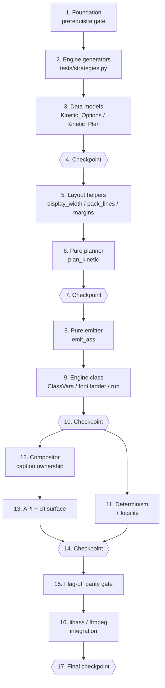

# Implementation Plan — Kinetic Typography Engine

These are incremental, test-first coding steps. Execute them **one task at a time**, in
order — each task builds on the previous ones so there is never orphaned code.

This engine is built **on top of the approved
[`av-engines-foundation`](../av-engines-foundation/tasks.md) spec**, whose own plan already
lands `worker/engines/` (`base.py`, `registry.py`, `capabilities.py`, `timebase.py`,
`artifacts.py`, `host.py`), the `engine_contributions` handoff into
`compositor.render_clip`, the Pipeline stage hooks, the test doubles in `tests/fakes.py`,
the shared generators in `tests/strategies.py`, **and** the `hypothesis` /
`requirements-dev.txt` / CI dependency fix. Task 1 here is therefore a **prerequisite
gate**, not a re-implementation: it verifies those modules and test utilities exist and
that the foundation suite is green. Nothing in this plan adds `hypothesis`, edits
`.github/workflows/ci.yml`, or modifies anything under `av-engines-foundation/`
_(Req 19.5)_.

Ordering is dependency-safe: prerequisite gate → engine generators → data models
(`Kinetic_Options`, `Kinetic_Plan`) → pure layout helpers → pure planner → pure ASS emitter
→ the `AV_Engine` class and its gate ladder → determinism/locality verification → the
compositor caption-ownership branch → API/UI surface → the flag-off parity gate → libass
integration. Every impure step is confined to a single UTF-8 write inside the
Engine_Workspace, so all of epics 3–8 are pure-function work testable with no ffmpeg, no
libass, and no fonts installed _(Reqs 18.2, 15.6)_.

Tasks marked with `*` are optional test sub-tasks (unit / property / integration tests).
Property tests use `hypothesis` with `@settings(max_examples=100)`, one property per test,
tagged `# Feature: kinetic-typography, Property N: <text>`, in the exact files named in the
design's Testing Strategy file mapping (`tests/test_kinetic_engine.py`,
`tests/test_kinetic_plan.py`, `tests/test_kinetic_ass.py`, `tests/test_kinetic_layout.py`,
`tests/test_kinetic_determinism.py`, `tests/test_kinetic_compositor.py`). Word_Timelines are
built with the existing `FakeWord` helper from `tests/conftest.py`; Engine_Contexts are
built from the foundation doubles in `tests/fakes.py`; libass-dependent behaviour uses the
existing `make_video`, `requires_ffmpeg`, `probe_size`, `probe_duration` helpers
_(Reqs 18.3, 18.4, 18.5)_.

Three sub-tasks are **intentionally not marked optional even though they are test/config
work**: 1.2 (proves the foundation this engine binds to is actually green before any
binding is written), 2.1 (the six engine generators every later property task imports), and
15.1 / 15.2 (the flag-off backward-compatibility parity gate, which is this spec's central
guarantee).

## Tasks

- [x] 1. Prerequisite gate on the AV engines foundation
  - [x] 1.1 Verify the foundation modules and contracts this engine binds to exist
    - Confirm `worker/engines/base.py` exports `AV_Engine` (with `resolve_options`/`plan`/`run`, `flag_field()`, `FLAG_SUFFIX`), `Engine_Stage.COMPOSE`, `Engine_Status`, `Engine_Context` (`words`, `duration`, `time_base`, `options`, `options_digest`, `rng()`, `remaining()`, `workspace`, `capabilities`, `permissibility`, `deps`), `Engine_Result` (+ `skipped`/`degraded`/`failed`), `Compose_Contribution` (`engine_id`, `inputs`, `video_filters`, `audio_filters`, `subtitle_path`, `z_order`), `Engine_Artifact`, `marker`, the `Engine_Options` protocol, the `coerce_*` helpers, `dump_options`, `options_digest`, and `derive_seed`.
    - Confirm `worker/engines/timebase.py` exports `Time_Base` (`snap`, `seconds_to_frame`, `frame_to_seconds`), `Timeline_Segment`, and `normalize_segments`; `worker/engines/capabilities.py` exports `Capability_Report` (`available`, `status`, `first_missing`, `missing`) resolving `font:<name>` through `worker.captions.font_available` and `ffmpeg_filter:<name>`; `worker/engines/artifacts.py` exports `Engine_Workspace` (`path`, `artifact`), `allocate_workspace`, `artifact_key`; `worker/engines/registry.py` exports the registry + registration decorator; `worker/engines/host.py` exports the stage runner and clip finaliser.
    - Confirm `worker/effects/compositor.py` `render_clip` already accepts the foundation's `engine_contributions` parameter (this plan only adds a branch inside it, in task 12.1) — that is the confirmed shipped parameter name, so use `engine_contributions` throughout epic 12 instead of introducing a second one.
    - Do **not** add, rename, or widen any foundation symbol; if one is missing, stop and finish the foundation task that owns it.
    - **Verified 1.1 — shipped reality (no foundation symbol added, renamed, or widened):** every symbol above exists and was checked by import, not by grep. Two wording corrections to carry into later epics: (a) `worker/engines/registry.py` ships **`register(engine, *, priority=None) -> AV_Engine`** — a module-level *function* taking an engine **instance** (plus `get_registry` / `reset_registry` / `Engine_Registry.register`), **not** a registration decorator, so task 9.1 must call `registry.register(Kinetic_Typography_Engine())` at import rather than decorate the class; (b) `worker/effects/compositor.py` `render_clip` takes **`engine_contributions`** (positional-or-keyword, `default=None`) — the confirmed name for all of epic 12. Also noted: `Engine_Context` now additionally carries `first_input_index` (from the AV-engine input-seam work); kinetic does not read it. `allocate_workspace` signature is `(temp_dir, job_id, clip_id, engine_id, options_digest, *, create=True)`. Host entry points are `Engine_Host.run_stage(...)` (stage runner) and `Engine_Host.finish_clip(clip_id)` (clip finaliser).
    - _Requirements: 1.1, 1.2, 1.5, 1.6, 18.3, 19.5_

  - [x] 1.2 Verify the foundation suite and property toolchain are green before binding to them
    - Run `pytest tests/test_engines_base.py tests/test_engine_registry.py tests/test_engine_capabilities.py tests/test_engine_timebase.py tests/test_engine_artifacts.py tests/test_engine_host.py -q` and confirm it passes.
    - Confirm `tests/fakes.py` provides `StaticProber` / `CountingProber` / `RaisingProber`, `RecordingStorage`, `FakeClock`, `FakeEngine` / `RaisingEngine`, and that `tests/strategies.py` provides `st_word_timeline`, `st_options_mapping`, `st_time_base`, `st_availability_map`; confirm `hypothesis` imports (the foundation already declares it in `requirements-dev.txt` — do **not** re-add it, and do **not** touch `.github/workflows/ci.yml`).
    - **Verified 1.2:** foundation subset (`test_engines_base`, `test_engine_registry`, `test_engine_capabilities`, `test_engine_timebase`, `test_engine_artifacts`, `test_engine_host`) = **72 passed**; full suite baseline = **287 passed, 52 skipped, 0 failed**. All seven `tests/fakes.py` doubles and all four `tests/strategies.py` generators import and draw live values; `hypothesis` 6.161.6 imports. `requirements-dev.txt` and `.github/workflows/ci.yml` untouched.
    - _Requirements: 18.3, 18.4, 18.7, 19.5_

- [x] 2. Engine-specific generators (`tests/strategies.py`)
  - [x] 2.1 Add the six kinetic generators to the existing shared generator module
    - Extend `tests/strategies.py` (do not create a parallel module) with `st_kinetic_options` (valid `Kinetic_Options` field mappings across the declared bounds: `max_lines` 1–4, `max_line_width` 6–80, `safe_area_x_pct` 0–25, `safe_area_y_pct` 0–40, `motion_duration_ms` 20–1000, `confidence_floor` 0.0–1.0), `st_kinetic_style` (the 7 members of `KINETIC_STYLES`), `st_reveal_mode` (`cumulative`, `word_by_word`).
    - Add `st_i18n_word_timeline` (wide-script Han/Hiragana/Katakana/Hangul, right-to-left Arabic/Hebrew, combining marks, emoji, and single tokens whose Display_Width exceeds any legal `max_line_width`), `st_broken_word_timeline` (missing `end`, non-numeric bounds, inverted `end < start`, zero-length, and empty / whitespace-only text), and `st_font_availability` (availability combinations over the `(font_override, preset_font, "Arial")` ladder, composable with the foundation `st_availability_map`).
    - All generators emit `FakeWord` instances from `tests/conftest.py` so they compose with the foundation's `st_word_timeline`; this sub-task is **not optional** because every later property task imports these names.
    - **Completed 2.1 — shipped shapes and three carried-forward notes:** all six generators added to `tests/strategies.py` (tranche 3, extended not forked). `st_kinetic_options()` emits a **plain field mapping** (not a `Kinetic_Options` instance — that dataclass lands in 3.2) covering every declared bound inclusively; `notes` is deliberately absent (resolution provenance, never input). `st_i18n_word_timeline()` and `st_broken_word_timeline()` both **draw their timing skeleton from `st_word_timeline`** and return its `(words, duration)` shape, so they are drop-in interchangeable. `st_font_availability()` returns a dict with `ladder` / `availability` (capability-id keyed, ready for `StaticProber`) / `expected_font` / `expected_marked`, merging foundation `st_availability_map` noise which the ladder entries override. (a) **`KINETIC_STYLES` / `REVEAL_MODES` are duplicated as literal constants** in `tests/strategies.py` because `worker/engines/kinetic.py` does not exist yet — **task 3.1 must define the same values** and task 9.4 must assert `tuple(kinetic.KINETIC_STYLES) == strategies.KINETIC_STYLES` and the same for `REVEAL_MODES` so the duplication cannot drift (the requirement is written into the module comment). (b) The **pinned `__all__` list** in `tests/test_engines_base.py::test_shared_test_doubles_and_generators_are_pinned` was deliberately updated with the 8 new names (2 constants + 6 generators), kept sorted, plus a `sorted()` self-check. (c) **`FakeWord.probability` exists but is hard-coded to `1.0`** and is not a constructor parameter; rather than widen that shared double, the new generators construct a `FakeWord` and set `.probability` on the instance (`_word` helper). Consequence for **task 6.8 (P13)**: timelines drawn straight from `st_word_timeline` can never sit below a legal `confidence_floor`, so P13 must draw from `st_i18n_word_timeline` / `st_broken_word_timeline` or set `.probability` itself.
    - _Requirements: 18.3, 18.4, 18.7_

- [x] 3. Data models — `Kinetic_Options`, `Kinetic_Plan`, `Kinetic_Cue`, `Kinetic_Word`
  - [x] 3.1 Create `worker/engines/kinetic.py` with the vocabularies and documented defaults
    - New module with a docstring, stdlib + `worker.captions` + `worker.effects.caption_presets` + `worker.engines.*` imports only, every heavy dependency reached through a lazy call so the module imports with ffmpeg, libass, and all optional fonts absent.
    - Define `KINETIC_STYLES` (sorted: `bounce`, `highlight_sweep`, `karaoke_fill`, `none`, `pop`, `slide_up`, `typewriter`), `DEFAULT_STYLE = "karaoke_fill"`, `REVEAL_MODES` (`cumulative`, `word_by_word`), `DEFAULT_REVEAL = "cumulative"`, `POSITIONS` (`bottom`, `center`, `top`), `FALLBACK_FONT = "Arial"`, `KINETIC_Z_ORDER = 100`, `ASS_NAME = "kinetic.ass"`, `MIN_WORD_S = 0.08`, `SYNTHESISED_RATIO_LIMIT = 0.40`, `CUE_FADE_MS = (120, 120)`, `BOUNCE_OVERSHOOT = 118`, `SLIDE_UP_PX = 40`, and the `_write_text_utf8(path, text)` helper.
    - **Verified 3.1:** all 13 constants plus `_write_text_utf8` present with the designed values. Import-time deps are stdlib (`dataclasses`, `collections.abc`, `pathlib`, `typing`) + `worker.effects.caption_presets` + `worker.engines.base`/`worker.engines.timebase` only (`worker.captions` is *not* imported — the two literals borrowed from it, `FALLBACK_FONT = "Arial"`, are pinned by an assertion-checked comment instead); `import worker.engines.kinetic` pulls in none of `cv2`/`torch`/`requests`/`numpy`. Cross-checked programmatically: `tuple(kinetic.KINETIC_STYLES) == strategies.KINETIC_STYLES` and `tuple(kinetic.REVEAL_MODES) == strategies.REVEAL_MODES` both **True**; `POSITIONS == tuple(sorted(caption_presets.VALID_POSITIONS))` and `FALLBACK_FONT == captions._FALLBACK_FONT` also hold. No engine class and no registry decorator yet (deferred to task 9, by design).
    - _Requirements: 1.4, 4.1, 4.9, 6.2, 6.3, 6.4, 7.3, 9.3, 16.3_

  - [x] 3.2 Implement the `Kinetic_Options` frozen dataclass with `parse` and `to_dict`
    - All fields exactly as designed (`style`, `reveal`, `preset_name`, `font_override`, `preset_font`, `font_size`, `position`, `max_lines`, `max_line_width`, `safe_area_x_pct`, `safe_area_y_pct`, `motion_duration_ms`, `highlight_keywords`, `keyword_ai`, `emoji_inline`, `confidence_floor`, `captions_enabled`, `hook_enabled`, `hook_duration_s`, `hook_font_size`, `durable_subtitle`, `permissibility`, `notes`), every one a JSON-serialisable scalar so the foundation `Engine_Options` protocol is satisfied.
    - `parse` is total: each field goes through a foundation coercion helper with its documented default and bounds (`coerce_choice(..., KINETIC_STYLES, DEFAULT_STYLE)`, `coerce_int(..., lo=1, hi=4)`, `coerce_float(..., lo=0.0, hi=1.0)`, …); it reads named keys only, so unrecognised keys are ignored and no input raises. `to_dict` emits every field in sorted key order with JSON-native types.
    - **Verified 3.2:** all 23 fields present with the designed defaults and bounds. Coercion lives in `__post_init__` (via `object.__setattr__`), so *construction* — not just `parse` — is total and `parse` stays a thin named-key filter over `dataclasses.fields`; unknown keys are dropped. Exercised by hand against 18 hostile inputs (`None`, `[]`, `"str"`, `5`, a mapping whose `__contains__` raises, `NaN`/`inf` floats, `object()` sentinels, out-of-range ints, non-iterable `notes`): none raised, and `parse(o.to_dict()).to_dict() == o.to_dict()` held for every one. `to_dict` emits sorted keys with JSON-native types (`notes` as a `list`) and is `json.dumps`-able.
    - _Requirements: 10.1, 10.2, 10.5, 10.6, 10.7, 11.4_

  - [x] 3.3 Implement `from_processing_options` with Base_Preset inheritance
    - Resolve the Base_Preset through `caption_presets.resolve_preset(options.caption_preset)` and inherit its `font`, `font_size`, `position`, colours, and border style; gate `highlight_keywords` on `options.caption_keyword_highlight and preset.highlight_keywords` and `emoji_inline` on `options.caption_emoji and preset.emoji_inline`; carry `captions_enabled`, `hook_enabled`, `hook_duration_s`, `hook_font_size`, `durable_subtitle`, `permissibility`.
    - Record `"style_substituted"` / `"position_substituted"` in `notes` when `coerce_choice` fell back. Read attributes only — never write to the supplied Processing_Options — and make coercion of an already-valid value the identity so resolution is idempotent. Read enablement from options already normalised by `worker.models.effective_options`.
    - **Verified 3.3 — plus one shape note for task 9:** `caption_presets.resolve_preset(name)` returns the **2-tuple `(CaptionPreset, substituted: bool)`**, not a bare preset; the projection unpacks it as `preset, _substituted` and deliberately **discards the substitution flag** — preset substitution is already reported by the v0.8.0 caption path, and `notes` carries only `style_substituted` / `position_substituted` per Req 4.8. `preset_font`/`font_size` are inherited from the preset; `position` inherits as `""` (meaning "use `Base_Preset.position`", resolved at layout time in task 5) so an explicit `caption_position` can still override it. Reads are attribute-only through a `_read(options, <processing_spelling>, <resolved_spelling>)` helper, which is what makes re-resolution the identity. Checked by hand on 4 Processing_Options shapes (default, `hormozi` + unknown style + illegal position, `pop` + valid values, `caption_preset=None`): `options.__dict__` unchanged in every case, `resolve(resolve(o)) == resolve(o)` and `dataclasses.asdict` equal in every case, and notes came out sorted/de-duplicated (`('position_substituted', 'style_substituted')`).
    - _Requirements: 1.3, 4.8, 5.9, 7.4, 8.6, 10.3, 10.4, 10.8, 10.9, 10.10_

  - [x] 3.4 Implement the `Kinetic_Word`, `Kinetic_Cue`, and `Kinetic_Plan` frozen dataclasses
    - `Kinetic_Word` (`text` already `_escape`-d, `start`, `end`, `rel_ms`, `emphasis`, `timing_synthesised`, `emoji`, `line`), `Kinetic_Cue` (`segment: Timeline_Segment`, `words`, `lines` as word-index tuples per Text_Line), and `Kinetic_Plan` (`style`, `reveal`, `font`, `font_size`, `position`, `align`, `play_res_x`, `play_res_y`, `margin_l`, `margin_r`, `margin_v`, `duration`, `style_line`, `hook_style`, `hook_text`, `hook_duration_s`, `cues`, `cue_level`, `degraded`, `markers`, `detail`, `colors`, `highlight_scale`).
    - `Kinetic_Plan.to_dict()` emits sorted, JSON-native keys and `Kinetic_Plan.from_dict()` reconstructs an equivalent value, so `plan(ctx)` can return a JSON-serialisable mapping.
    - **Completed 3.4 — two deliberate widenings vs. the design snippet:** (a) `Kinetic_Word.text/start/end/rel_ms` and `Kinetic_Cue.segment/words/lines` were given **defaults** (`""`, `0.0`, `Timeline_Segment(0.0, 0.0)`, `()`) where the design shows them as required, so `from_dict` can rebuild from a partial/hostile mapping without raising; the planner always passes them explicitly, so no call site changes. (b) `Kinetic_Cue`/`Kinetic_Plan` `__post_init__` **accept nested mappings as well as instances** (`words=[{...}]`, `segment={"start":…}`) and silently drop non-index-sequence `lines` entries, which is what makes `from_dict` total. `end` is clamped to `>= start`; `Kinetic_Cue.start`/`.end` are read-only properties delegating to the segment. Round-trip checked by hand: `Kinetic_Plan.from_dict(p.to_dict()) == p` with nested cues/words/lines/colors preserved, keys sorted, `json.dumps`-able, and `from_dict(None)` / `from_dict(3)` return defaulted values instead of raising.
    - _Requirements: 11.2, 11.4, 11.10_

  - [x]* 3.5 Property test: options and plans round-trip; resolution is idempotent → `tests/test_kinetic_plan.py`
    - **Property 18: Options and plans round-trip; resolution is idempotent** — for every hostile mapping, `Kinetic_Options.parse(data)` returns a value without raising and ignores non-field keys; for every valid options value, `parse(o.to_dict()).to_dict() == o.to_dict()`; for every Processing_Options value, `resolve_options(resolve_options(o)) == resolve_options(o)` and `dataclasses.asdict(options)` is unchanged; for every plan, `Kinetic_Plan.from_dict(p.to_dict())` is equivalent to `p` and `p.to_dict()` is JSON-encodable. Generators: `st_options_mapping`, `st_kinetic_options`, `st_word_timeline`.
    - **Completed 3.5 — passed first run, no counter-example:** `tests/test_kinetic_plan.py` created with one test (`test_p18_options_and_plans_round_trip_and_resolution_is_idempotent`, `@settings(max_examples=100, deadline=None)`) exercising all four clauses on every example. **`resolve_options` does not exist yet** (the engine class is task 9), so the resolution clauses call **`Kinetic_Options.from_processing_options`** — the function task 9's `resolve_options` is specified to delegate to — and the test docstring says so. Clause shapes: parse totality is checked against `st_options_mapping` *plus* an injected `{"": None, "not_a_field": object(), "🎬": [...]}` and against non-mapping junk (`None`, `3`, `"style"`, a list of pairs); key-filtering is proved by `parse(mapping) == parse({k: v for k, v in mapping if k in field_names})`; the read-only claim is checked twice over — `repr(dataclasses.asdict(po))` unchanged (repr so a `NaN` payload compares equal to itself) **and** every attribute still the *same object* (`is`) afterwards; the plan clause builds a two-Text_Line cue from `st_word_timeline` and asserts `from_dict(to_dict()) == p`, `to_dict()` sorted + `json.dumps`-able, nested words/lines/segment preserved, and `from_dict` total on a hostile mapping / `None`.
    - _Requirements: 10.1, 10.3, 10.5, 10.6, 10.7, 10.8, 10.9, 10.10, 11.2, 11.10, 17.8_ · _Properties: P18_

  - [x]* 3.6 Property test: an unrecognised style falls back once, and names it → `tests/test_kinetic_engine.py`
    - **Property 10: An unrecognised style falls back once, and names it** — for any value outside `KINETIC_STYLES` (non-strings, empty strings, unknown names), `resolve_options` yields `style == DEFAULT_STYLE` and exactly one `engine:kinetic_typography:style_substituted` marker is carried; for any member value, none is carried. Generator: `st_options_mapping`.
    - **Completed 3.6 — passed first run, no counter-example; plus the vocabulary pin:** `tests/test_kinetic_engine.py` created with `test_p10_unrecognised_style_falls_back_once_and_names_it` (`max_examples=100`). Again `resolve_options` does not exist yet, so the property drives **`Kinetic_Options.from_processing_options`**; provenance is asserted on **`Kinetic_Options.notes`** (`notes.count("style_substituted") == 1` / `== 0`) because the `engine:kinetic_typography:<note>` marker namespacing is applied by the engine in task 9, which copies these notes into `Kinetic_Plan.markers`. The drawn `st_options_mapping` is attached to a real `ProcessingOptions` as attribute noise (proving unknown option keys change neither outcome) with `kinetic_style` set last. Two extra guards: the invalid-style result differs from a `DEFAULT_STYLE`-requested twin **only** in `notes`, and re-resolving does not accumulate a second note. **One deliberate exclusion, worth carrying forward:** `None` is *not* in the invalid pool — `kinetic.py::_read` treats `None` as "attribute absent", so a `None` style is an *unrequested* style that lands on `DEFAULT_STYLE` with **no** note. Req 4.8 says "IF the *requested* Kinetic_Style is unknown, empty, or not a string", so absence is not a substitution; the pool covers present-but-invalid values only (unknown/mis-cased/whitespace-padded names, `""`, bools, ints, non-finite floats, lists, dicts, a bare `object()`). If the API later sends `kinetic_style=None` to mean "explicitly none", that reading needs a spec decision, not a code change.
    - **Harness defect found later and fixed (test-only, no production change):** Hypothesis eventually drew the hostile key `"__dict__"` (its constants pool mines string literals out of the codebase, so dunder names are reachable from the `st.text` leg of `st_options_mapping`), and `_carrier` did `setattr(options, "__dict__", None)` — which raises `TypeError` **inside the test**, before resolution was ever reached. The generator and the noise mechanism are unchanged; `_carrier` now filters its keys through a new `_attachable_noise_key` predicate that skips dunder/private names only (they address the instance's own machinery, and some are type-checked slots, so they never were *option* keys). Every hostile key the generator can otherwise produce — unknown names, `""`, `" "`, `"🎬"`, an 80-character key, plausible option names — is still attached as noise, so the property still proves resolution ignores option keys it does not know.
    - **Also landed here (duplication gap closed):** `test_kinetic_vocabularies_match_the_shared_generators` asserts `tuple(kinetic.KINETIC_STYLES) == strategies.KINETIC_STYLES` and `tuple(kinetic.REVEAL_MODES) == strategies.REVEAL_MODES` (plus that both are sorted and de-duplicated), which **discharges the "MUST assert" note left in `tests/strategies.py` tranche 3** — that comment block was updated in place to point at this test instead of task 9.4. The literal vocabularies in `tests/strategies.py` can no longer drift from the module.
    - _Requirements: 4.8_ · _Properties: P10_

- [x] 4. Checkpoint — data models complete
  - Ensure all tests pass, ask the user if questions arise.
  - **Verified:** full suite `pytest tests/ -q` = **290 passed, 52 skipped, 0 failed** (287 foundation baseline + the two kinetic property tests from 3.5 / 3.6 + the vocabulary pin from 3.6). No questions outstanding.

- [x] 5. Pure layout helpers and Safe_Area geometry
  - [x] 5.1 Implement `display_width` and `is_space_free`
    - `display_width(text)` counts `unicodedata.east_asian_width` classes `F`/`W` as 2 units, combining marks (categories `Mn`/`Me`) as 0 so a decomposed grapheme is not double-counted, and everything else as 1.
    - `is_space_free(text)` returns true for scripts written without inter-word spaces (Han, Hiragana, Katakana, Hangul), decided per-word from the first non-combining code point.
    - **Completed 5.1 — signatures `display_width(text: Any) -> int` / `is_space_free(text: Any) -> bool`, both total** (a non-string argument is rendered through the existing `_text` helper instead of raising, so the planner can never blow up on a hostile word). Two deliberate details: (a) the zero-width set is **`Mn`/`Me` *plus* `Cf`** — format characters (ZWJ, ZWNJ, the bidi marks) also occupy no advance width, so counting them would over-measure emoji sequences and any RTL text that carries embedded marks; (b) `is_space_free("")` and combining-only text are **False** (they take the default Latin join), and the decision is made from the first non-zero-width code point only, per word, never per cue. Script membership is a `_SPACE_FREE_RANGES` table (Han incl. radicals/compat/ext-A/ext-B+, Hiragana, Katakana incl. halfwidth + phonetic extensions, Bopomofo, Hangul Jamo/compat-Jamo/ext-A/ext-B/syllables) rather than `unicodedata.name` parsing, so it is locale-free and allocation-free (Req 11.5). Checked by hand: `THIS`→4, `世界`→4, `e`+U+0301→1, `🎬`→2; space-free True for `世界`/`こんにちは`/`한국`, False for `THIS`/`مرحبا`/`""`.
    - _Requirements: 8.1, 8.2, 8.4_

  - [x] 5.2 Implement `pack_lines` greedy Text_Line packing
    - `pack_lines(words, max_lines, max_width) -> (lines as word-index lists, overflow tail)`: greedy left-to-right packing; a word whose own Display_Width exceeds `max_width` is placed alone on its line and never split; the join cost adds 1 unit between two Latin-script neighbours and 0 between space-free-script neighbours; words that do not fit within `max_lines` are returned as the overflow tail for the caller to re-split.
    - Keep every word intact inside one Text_Line — no word may cross a `\N` break.
    - **Completed 5.2 — signature `pack_lines(words: Any, max_lines: Any = 2, max_width: Any = 22) -> tuple[list[list[int]], list[int]]`**, accepting `Kinetic_Word` instances *or* bare strings (`_word_text`) and coercing the two bounds through `coerce_int` (`max_lines` 1–4, `max_width` ≥ 1), so it is total on hostile input (`pack_lines(None) == ([], [])`). **The join rule was factored into two shared helpers rather than inlined:** `join_separator(previous, following) -> str` returns `""` only when **both** neighbours are space-free and `" "` otherwise (mixed CJK↔Latin therefore takes a space, which is the conventional typesetting choice and the only symmetric reading of Req 8.4), and `join_width(...) -> int` is literally `display_width(join_separator(...))`. Task 8.4 **must call `join_separator` for the emitted Text_Line join** — that is what makes the measured width and the emitted text provably identical, and it is why the join is not a local constant. Verified against the design's worked example: `THIS`/`CHANGED`/`EVERYTHING` at `max_lines=2, max_line_width=22` packs to `([[0, 1], [2]], [])` (i.e. `4+1+7 = 12` fits, `12+1+10 = 23 > 22` breaks), a 40-unit token lands alone on its line without splitting, and a 6-word cue overflows to `([[0, 1], [2, 3]], [4, 5])` for the planner to re-split.
    - _Requirements: 7.5, 7.6, 7.8, 8.4, 8.5_

  - [x] 5.3 Implement `_POSITION_ALIGN` and the Safe_Area margin computation
    - `_POSITION_ALIGN` maps `bottom`/`center`/`top` to ASS alignments `2`/`5`/`8` with their v0.8.0 default `MarginV` values; an empty options position resolves to the Base_Preset position.
    - Compute `margin_l = margin_r = int(round(play_res_x * safe_area_x_pct / 100.0))` and `margin_v = max(default_margin_v, int(round(play_res_y * safe_area_y_pct / 100.0)))`, so the text box never sits outside the Safe_Area while preserving v0.8.0 vertical placement when the inset is smaller; `center` keeps `MarginV = 0` semantics with its safe-area obligation met by the horizontal insets.
    - **Completed 5.3 — `_POSITION_ALIGN` is *reused, not redefined*.** `worker.captions._POSITION_ALIGN` (`bottom: (2, 220)`, `center: (5, 0)`, `top: (8, 200)`) is read directly, so the table cannot drift from the v0.8.0 caption path. It is reached through a new lazy **`_captions()`** accessor because `worker.captions` imports `config` and therefore `pydantic`, which `tests/test_engines_base.py::test_every_engine_module_imports_without_heavy_dependencies` blocks at module scope — a module-level `from worker import captions` fails that gate, so **every later `captions.*` reuse in the planner (6.1) and emitter (8.x) must go through `_captions()` too**.
    - Three public helpers: **`resolve_position(position, preset_position="") -> str`** (Req 7.4 — `""`/unrecognised falls through to the Base_Preset value, then to `"bottom"`), **`position_align(position, preset_position="") -> (align, default_margin_v)`**, and **`safe_area_margins(play_res_x=1080, play_res_y=1920, *, safe_area_x_pct=6.0, safe_area_y_pct=10.0, position="", preset_position="") -> (align, margin_l, margin_r, margin_v)`**. The preset position is a *parameter* of the geometry helper precisely so `Kinetic_Options.position == ""` resolves correctly: `hormozi` (which declares `center`) yields `align 5`, not the `bottom` default.
    - Two judgement calls: (a) the `max(default_margin_v, inset_y)` formula is applied **uniformly, including `center`** — for `center` the default is `0`, so the result is exactly the safe-area inset, which is what P16 (task 5.5) requires ("`MarginV` at least the corresponding Safe_Area inset"); the design's "`center` keeps `MarginV = 0` semantics" remark is about libass ignoring `MarginV` for alignment 5, not about emitting a literal `0` that would violate Req 7.10. (b) Both margins are finally clamped to `margin_l + margin_r < PlayResX` and `2 * margin_v < PlayResY` so a degenerately small probed size still leaves the caption box room to exist (the design's `max(...)` alone would emit `MarginV = 220` on a 100 px-tall clip). Neither clamp binds at real resolutions. Verified against the worked example: `1080×1920`, `safe_area 6/10`, `position="bottom"` ⇒ `(2, 65, 65, 220)`; `position=""` + preset `center` ⇒ `(5, 65, 65, 192)`; preset `top` ⇒ `(8, 65, 65, 200)`; hostile input (`None`, `"oops"`, `object()`, `[1]`, `3`) ⇒ `(2, 0, 0, 220)` without raising.
    - _Requirements: 7.2, 7.3, 7.4, 7.10_

  - [x]* 5.4 Property test: layout respects line count, line width, and word integrity → `tests/test_kinetic_layout.py`
    - **Property 14: Layout respects line count, line width, and word integrity** — for every Word_Timeline and options value, every `Default` event contains at most `max_lines - 1` literal `\N` breaks, every Text_Line's Display_Width is at most `max_line_width` unless the line holds exactly one word, no word's escaped text is split across a `\N`, Latin neighbours are joined by exactly one space and space-free neighbours by none. Generators: `st_word_timeline`, `st_i18n_word_timeline`, `st_kinetic_options`.
    - **Completed 5.4 — passed first run, no counter-example; asserted one layer down, to be tightened by task 8.** `tests/test_kinetic_layout.py` created with `test_p14_layout_respects_line_count_line_width_and_word_integrity` (`max_examples=100, deadline=None`), drawing `st.one_of(st_word_timeline(), st_i18n_word_timeline())` × `st_kinetic_options`. **`emit_ass` does not exist until task 8**, so the property is asserted directly on `pack_lines` output using the same invariants restated without the emitter: `len(lines) <= max_lines` (⇔ at most `max_lines - 1` `\N` breaks), each line's Display_Width `<= max_line_width` **unless** the line holds exactly one word, `[i for line in lines for i in line] + overflow == list(range(len(words)))` (every index exactly once, order preserved ⇒ nothing dropped, duplicated, reordered or split), overflow is the contiguous tail and only appears when `len(lines) == max_lines`, and the join rule via `join_separator` (`""` iff both neighbours space-free, else exactly one space). Two extra guards worth keeping: the measured width **equals `display_width` of the rendered line**, so a line can never be measured short and emitted long, and `"\N".join(...)` splits back into exactly the packed lines. The module docstring says all of this and names task 8 as the place to re-run the same assertions over real `Default` events (adding `_escape` and inline-emoji handling, which only the emitter performs). Property 17 is noted as belonging to this file but landing with task 9.7.
    - _Requirements: 7.5, 7.6, 7.8, 7.9, 8.1, 8.2, 8.4, 8.5, 8.10_ · _Properties: P14_

  - [x]* 5.5 Property test: style margins keep the caption box inside the Safe_Area → `tests/test_kinetic_layout.py`
    - **Property 16: Style margins keep the caption box inside the Safe_Area** — for every options value and probed clip size, `MarginL`, `MarginR`, and `MarginV` are each at least the corresponding Safe_Area inset in pixels, `MarginL + MarginR < PlayResX`, `2 * MarginV < PlayResY`, and `Alignment` is the `_POSITION_ALIGN` value for the resolved position (Base_Preset position used when the option is empty). Generators: `st_kinetic_options`, hypothesis integers for width/height.
    - **Completed 5.5 — passed first run, no counter-example; one documented domain restriction.** `test_p16_style_margins_keep_the_caption_box_inside_the_safe_area` (`max_examples=100, deadline=None`) drives `safe_area_margins` / `position_align` / `resolve_position` with `st_kinetic_options` × probed sizes drawn from `st.one_of(sampled_from(real sizes), integers(16, 7680))`, asserting `margin_l == margin_r >= round(w * pct_x / 100)`, `margin_v >= round(h * pct_y / 100)`, `margin_l + margin_r < w`, `2 * margin_v < h`, `align == captions._POSITION_ALIGN[resolved][0]`, and that the v0.8.0 default `MarginV` is preserved whenever it fits. **The 16 px lower bound is deliberate and is the one place the design's property is not universally satisfiable:** at `play_res_y == 4` with `safe_area_y_pct == 40` the property demands `margin_v >= 2` *and* `2 * margin_v < 4` simultaneously — unsatisfiable — and the same holds at `play_res_y == 2`. Task 5.3 already resolved that tie in favour of "the caption box always has room to exist" (the `min(..., (height - 1) // 2)` clamp), so the generator stays inside the domain where both clauses can hold; 16 px is orders of magnitude below any real probed video size. **Not a code bug — a degenerate-input gap in P16's wording**; if it ever matters, P16 should be restated as "at least the inset, or the largest value that still leaves the box room".
    - Base_Preset inheritance (Req 7.4) is covered **deterministically for every example**, not just by lucky draws: after the drawn case the same clause set is re-run with `position=""` against each of the three preset positions, plus explicit pins that `BUILTIN_PRESETS["hormozi"].position == "center"`, `resolve_position("", "center") == "center"` and `position_align("", "center")[0] == 5` — the hormozi centre case the design calls out.
    - _Requirements: 7.2, 7.3, 7.4, 7.10_ · _Properties: P16_

- [x] 6. The pure planner — `plan_kinetic`
  - [x] 6.1 Implement sanitisation and cue grouping (planner steps 1–2)
    - `plan_kinetic(words, duration, time_base, opts, font, hook_text, keyword_planner, remaining) -> Kinetic_Plan`, pure: no I/O, no ffmpeg, no clock, no subprocess.
    - Step 1 drops empty / whitespace-only words and coerces bounds the way `captions._word_bounds` does (non-numeric → `0.0`, inverted → `end = start`), flagging those words `timing_synthesised`. Step 2 groups the survivors with `captions.words_to_cues` using its existing defaults, so grouping matches the v0.8.0 caption path. Escape every word with `captions._escape`.
    - **Completed 6.1 — shipped signature `plan_kinetic(words, duration, time_base=None, opts=None, font="", hook_text="", keyword_planner=None, remaining=None, *, play_res_x=1080, play_res_y=1920) -> Kinetic_Plan`.** The eight designed parameters keep their designed order and spelling; the tail carries defaults so the planner is *total* (`plan_kinetic(None, 0)` returns an empty plan rather than raising, Req 6.7), and `play_res_x`/`play_res_y` were added **keyword-only** because Req 7.1 wants the *probed* clip size in `PlayResX/PlayResY` and neither the designed signature nor `plan(ctx)` carried it — task 9.3 passes the probed size through these two, and the 1080×1920 defaults reproduce `captions.build_ass`'s own defaults until it does.
    - Three purity notes: (a) **every** `worker.captions` symbol the planner borrows (`_word_bounds`, `words_to_cues`, `_escape`, `_preset_style_line`, `caption_emoji_glyph`) is reached through the lazy `_captions()` accessor from task 5.3 — a module-scope import would fail `test_every_engine_module_imports_without_heavy_dependencies`; (b) `captions._preset_header_styles` is deliberately **not** reused for the `Style: Hook` line even though it owns that literal, because it calls `font_available` → `fc-list` → a *subprocess*, which a pure planner may not do (`_hook_style_line` repeats the numbers verbatim instead, and task 8.10's P5 pins the two spellings together); (c) `math` was added to the module imports (stdlib, and not one of the `time`/`datetime`/`os.getpid`/`locale` symbols task 11.2 forbids).
    - Sanitisation ships as `_sanitise_words` → `list[_Source_Word]`, a planner-internal frozen record carrying the **raw** (un-escaped) text plus `probability`, because `caption_presets.plan_keywords` and the Word_Confidence floor both need the pre-escape token (`Kinetic_Word.text` is escaped, so it cannot serve). Bounds go through `captions._word_bounds` and are then re-coerced with `coerce_float`, which is what rejects the `NaN`/`inf` that `_word_bounds` lets through unchanged. A word is flagged `timing_synthesised` when its `start` **or** `end` attribute was missing / non-numeric / non-finite, or when the coerced interval is inverted or zero-length — the zero-length case is included deliberately, since Req 6.2 has the engine invent that word's duration too.
    - Also landed: `ENGINE_ID = "kinetic_typography"` as a module constant, because the *planner* already needs the `engine:<id>:<detail>` marker namespace (Reqs 4.8, 6.3, 14.4). Task 9.1 must declare `engine_id = ENGINE_ID` rather than a second literal.
    - _Requirements: 4.7, 5.1, 5.2, 6.1, 6.6_

  - [x] 6.2 Implement layout application and proportional cue re-splitting (planner step 3)
    - Pack each cue's words with `pack_lines` into at most `opts.max_lines` lines of at most `opts.max_line_width` Display_Width, recording each word's `line` index and the cue's `lines` tuple.
    - On overflow, split the cue at a word boundary and divide the original interval in proportion to the two halves' word-time spans (`ratio = head_span / (head_span + tail_span)`, `0.5` for degenerate spans), snapping the boundary with `time_base.snap`; repeat until every cue fits.
    - **Completed 6.2 — `_split_drafts(cue_start, cue_end, items, max_lines, max_width, time_base)`** returns a list of `(start, end, words, lines)` drafts. The overflow tail is re-examined **in place** (pushed to the front of the work queue), so a cue that overflows twice yields three parts in Word_Timeline order and the interval is divided *pairwise*: `boundary = time_base.snap(start + (end - start) * ratio)` with `ratio = head_span / (head_span + tail_span)` over the split halves' word-time spans, `0.5` when that total is `<= 0`, and the result clamped into `[start, end]` — so the parts are contiguous (`head.end == tail.start`) and their union is exactly the original snapped interval (Req 7.7). The split index is `overflow[0]`, i.e. `pack_lines`'s own word boundary, so no word is ever divided (Req 7.8).
    - Two guards: an iteration cap of `4 * len(words) + 16` (each split consumes at least one word, so it is unreachable — it exists so a pathological packing degrades instead of looping), and `_finalise_lines`, which appends any index `pack_lines` left unplaced to the last Text_Line. That makes "every word appears in exactly one `lines` entry" true *by construction* rather than by trusting the packer, which is what the emitter (task 8.4) and `Kinetic_Word.line` rely on.
    - _Requirements: 7.5, 7.6, 7.7, 7.8_

  - [x] 6.3 Implement synthesised timing fill, snapping, and normalisation (planner steps 4–5)
    - Distribute a cue's span evenly across its words for every word flagged in step 1; widen zero-length words to `MIN_WORD_S`.
    - Snap every cue bound through `time_base.snap`, then run the cue list through `normalize_segments(segments, duration, time_base=time_base, min_duration=MIN_WORD_S)`; cues dropped by normalisation drop their words with them, surviving cues clamp their words into their own snapped bounds, and every word's `rel_ms` is its onset relative to its cue start in milliseconds.
    - **Completed 6.3 — the mandated call ships verbatim** (`normalize_segments(segments, limit, time_base=base, min_duration=MIN_WORD_S)`) and its result is used as the *allowed coverage*: each snapped cue is matched to the canonical segment overlapping it (`_covering_segment`), intersected with it, and additionally clamped to a running cursor. A cue with no covering segment is dropped **with its words** (Req 5.5); the cursor clamp is what makes the surviving cues provably sorted and pairwise disjoint even though `normalize_segments` *merges* touching/overlapping cue intervals rather than keeping them apart. Word bounds are then clamped into their own cue and `rel_ms = round((word.start - cue.start) * 1000)`, floored so `cue.start <= cue.start + rel_ms/1000 <= word.end` holds exactly (Reqs 5.3, 5.8).
    - **One deliberate deviation, worth carrying into task 6.6 (P11).** Bounds are clamped to `_snap_floor(time_base, duration)` — the last frame boundary at or before the clip end — not to `duration` itself. `normalize_segments` documents a "clamp, snap, clamp again" order, so a segment reaching the clip end comes back as the **un-snapped** `duration`; clamping to the floor instead satisfies Req 5.4 (*snapped*) **and** Req 5.6 (*inside `[0, duration]`*) simultaneously, at the cost of at most the final fraction of a frame. Found by a counter-example sweep (`fps=1.0`, `duration=0.5`), where `time_base.snap(cue.end) == cue.end` failed on the clip-end cue; P11's "snapped" clause is therefore satisfiable as written.
    - **One behavioural decision (Req 6.1/6.2 vs. an empty document).** `_fill_timings` distributes the cue span evenly over the cue's flagged words and widens a still-zero word to `MIN_WORD_S`; but a cue whose *whole* interval collapsed to a point (every word's timing missing — the `st_broken_word_timeline` case) has no span to distribute and would be dropped by `min_duration=MIN_WORD_S`, silently discarding its words and emitting an events-free ASS that the compositor would still hand to libass. Such **point cues only** (never a cue with a real interval, so re-split parts stay contiguous for P15) are therefore given `MIN_WORD_S` of span, laid out after the previous cue and never past the next cue that has a real start. Verified on `[("a", None, None), ("b", "x", "y"), ("  ", 1, 2), ("c", 2.0, 1.0), ("d", 0.5, 0.5)]`: 4 words survive, all flagged `timing_synthesised` with `end - start >= MIN_WORD_S`, and the plan degrades to `cue_level` with exactly one `degraded:word_timings` marker.
    - Checked by a 400-example scratch sweep over `st_word_timeline` / `st_i18n_word_timeline` / `st_broken_word_timeline` × `st_kinetic_options` × `st_time_base` (deleted after the run — the real property tests are 6.6–6.9): cues sorted, disjoint, inside `[0, duration]`, `snap(x) == x` on every bound, `len(lines) <= max_lines`, every word index in exactly one Text_Line, `cue.start <= word.start <= word.end <= cue.end`, synthesised words `>= MIN_WORD_S`, plan round-trip equal, and two invocations byte-equal.
    - _Requirements: 5.3, 5.4, 5.5, 5.6, 5.7, 5.8, 6.1, 6.2, 16.2_

  - [x] 6.4 Implement keyword emphasis and the Word_Confidence floor (planner step 6)
    - When `opts.highlight_keywords` is on, call the injected `keyword_planner(flat_words, use_ai=opts.keyword_ai, client=None)` and consume the returned `set[int]` as a membership test against a positional index (never iterated), so ordering stays deterministic.
    - Strip emphasis from any word whose `probability` is below `opts.confidence_floor` while leaving its text and `[start, end)` untouched.
    - **Completed 6.4 — the call is exactly `keyword_planner(flat, use_ai=options.keyword_ai, client=None)`** with `flat` the surviving `_Source_Word`s in emission order, so the returned flat indices align with the emitter's global word index the same way `captions._preset_dialogue_lines` aligns them. The result is consumed **only** as `index in selected` over `range(len(flat))` — never iterated, never sorted, never unpacked — so a `set`'s iteration order cannot reach the output (Req 11.4). Proved with a `set` subclass whose `__iter__` raises. `client=None` is hard-coded: the planner is pure and offline, so `keyword_ai=True` degrades to the deterministic rule set inside `plan_keywords` (Req 15.1); the LLM path stays the compositor's business.
    - **One judgement call:** the gate is `options.highlight_keywords` alone, *not* `options.highlight_keywords and preset.highlight_keywords`. The Base_Preset conjunction has already been applied by `Kinetic_Options.from_processing_options` (task 3.3) — `Kinetic_Options` is the *resolved* value — so re-applying it here would make a hand-built `Kinetic_Options(highlight_keywords=True)` silently unemphasised and would leave tasks 6.8 (P13) and 8.8 (P8) unable to exercise emphasis with the default `karaoke` preset (whose `highlight_keywords` is `False`). This matches the sub-task's own wording ("When `opts.highlight_keywords` is on"); the design prose's "and the Base_Preset enables highlighting" describes resolution, which already happened.
    - The floor comparison is `word.probability < options.confidence_floor` on the **raw** sanitised word (`FakeWord.probability` defaults to `1.0`, so a `0.0` floor never strips anything), and it clears `emphasis` only — text, `start`, `end`, `rel_ms`, `line` and `timing_synthesised` are bit-identical to the emphasis-enabled run, which is the P13 clause. A raising `keyword_planner` loses emphasis instead of propagating, keeping Req 6.7 totality.
    - Also populated here: `Kinetic_Word.emoji`, via `captions.caption_emoji_glyph(word, preset, permissible=opts.permissibility)` guarded by `opts.emoji_inline`. That helper is pure and download-free, and the planner is the only pure place holding the Base_Preset, so `emit_ass(plan)` (task 8.3) can read `word.emoji` instead of needing a preset threaded into it; an unavailable glyph returns `""`, which is exactly Req 8.7's "drop the glyph, keep the neighbours".
    - _Requirements: 5.9, 6.5, 11.4_

  - [x] 6.5 Implement the degradation and budget checks (planner steps 7–9)
    - If `synthesised_count / word_count > SYNTHESISED_RATIO_LIMIT`, set `cue_level=True`, `degraded=True`, and add `engine:kinetic_typography:degraded:word_timings`.
    - Consult `remaining()` once between the layout and normalisation steps; at `<= 0` stop planning with `degraded=True` and `engine:kinetic_typography:degraded:budget`. Copy `Kinetic_Options.notes` (e.g. `style_substituted`) into `Kinetic_Plan.markers`, and populate `style_line`, `hook_style`, `colors`, `highlight_scale`, `align`, margins, `play_res_x/y`, and `detail`.
    - **Completed 6.5 — `remaining()` is called exactly once**, on the single line between the re-splitting step and the snap/normalise step, and only when it is callable (a `None` budget reader means "unlimited" and is not invented). At `<= 0` the planner returns immediately with `cues=()`, `degraded=True`, `markers=(…:degraded:budget,)` and `detail="budget exhausted during planning"` — verified with a counting stub (`len(calls) == 1`). A raising reader is treated as unlimited rather than propagating (Req 6.7).
    - The synthesised ratio is computed over the **surviving** plan words (`synthesised_count / word_count > SYNTHESISED_RATIO_LIMIT`), so it measures what will actually be emitted; over the limit the plan sets `cue_level=True`, `degraded=True` and exactly one `…:degraded:word_timings` marker. `Kinetic_Options.notes` become `marker(ENGINE_ID, note)` entries at the *front* of `markers`, so `run` can forward `kplan.markers` verbatim (task 9.3) and `style_substituted` arrives namespaced as the design's marker table spells it.
    - Look and geometry are populated through **reuse**: `align`/`margin_l`/`margin_r`/`margin_v` from task 5.3's `safe_area_margins(..., position=opts.position, preset_position=preset.position)` and `position` from `resolve_position`, so an empty option position inherits the Base_Preset (Req 7.4 — `hormozi` plans at `align 5`, checked). `style_line` calls `captions._preset_style_line` and then replaces **only** the three margin columns (indices 19–21 of the 23-column `Format:` shape) with the Safe_Area values, so every look field — colours, `SecondaryColour` for `\kf`, border style, karaoke-thickened outline/shadow — is byte-identical to the v0.8.0 caption path by construction. `colors` carries the preset's four colours in sorted key order and `highlight_scale` is `round(preset.highlight_scale * 100)`, matching `build_word_span`'s own arithmetic. `detail` is a locale-free, path-free, clock-free summary (`"<n> cues, <m> words, style=…, reveal=…"`, or the degradation reason).
    - _Requirements: 4.8, 6.3, 6.4, 14.4_

  - [x]* 6.6 Property test: cue timeline is sorted, disjoint, in-bounds, and word-consistent → `tests/test_kinetic_plan.py`
    - **Property 11: Cue timeline is sorted, disjoint, in-bounds, and word-consistent** — for every Word_Timeline, options value, and Time_Base, cue intervals are sorted by start, mutually non-overlapping, contained in `[0, duration]`, snapped (`time_base.snap(x) == x`), every emitted timestamp lies in `[0, duration]`, and every word's motion start satisfies `cue.start <= motion_start <= word.end`. Generators: `st_word_timeline`, `st_kinetic_options`, `st_time_base`.
    - **Completed 6.6 — passed first run, no counter-example; appended to the existing `tests/test_kinetic_plan.py` (not forked).** `test_p11_cue_timeline_is_sorted_disjoint_in_bounds_and_word_consistent` (`max_examples=100, deadline=None`) drives `plan_kinetic` over `st_word_timeline` × `st_kinetic_options` × `st_time_base` and asserts, per plan: cues sorted by `start`, pairwise disjoint (`previous.end <= following.start`), `0 <= start <= end <= duration`, both bounds fixed points of `time_base.snap` (exact `==`, `snap` being exactly idempotent), every word timestamp inside both the clip and its own cue, and `cue.start <= cue.start + rel_ms/1000 <= word.end` for the motion onset. **One documented domain fact:** a clip whose `duration` is shorter than one frame (`fps=1.0`, `duration=0.75`) legitimately plans **zero** cues — the `_snap_floor` grid limit collapses the whole timeline — so the clause set is *also* re-run on a fixed 3-word 30 fps reference timeline that must plan at least one cue, which keeps the property non-vacuous on every example. Float comparisons use a 1 µs tolerance (three orders of magnitude below one frame at `MAX_FPS`); the snapped-bound clause is exact.
    - _Requirements: 5.1, 5.2, 5.3, 5.4, 5.5, 5.6, 5.7, 5.8, 16.2_ · _Properties: P11_

  - [x]* 6.7 Property test: malformed timings degrade instead of raising → `tests/test_kinetic_plan.py`
    - **Property 12: Malformed timings degrade instead of raising** — for every timeline with missing, non-numeric, inverted, zero-length, or empty-text words, planning and `run` return without raising; every synthesised word is flagged `timing_synthesised` with `end - start >= MIN_WORD_S`; past `SYNTHESISED_RATIO_LIMIT` the status is `degraded` with exactly one `degraded:word_timings` marker and every `Default` event carries a single `\fad` and no per-word `\t`. Generators: `st_broken_word_timeline`, `st_kinetic_options`.
    - **Completed 6.7 — passed first run, no counter-example; the tag clause is asserted one layer down, to be tightened by task 8.** `test_p12_malformed_timings_degrade_instead_of_raising` (`max_examples=100, deadline=None`) drives `st_broken_word_timeline` × `st_kinetic_options` × `st_time_base`: planning returns a `Kinetic_Plan` without raising (Req 6.7), every `timing_synthesised` word satisfies `end - start >= MIN_WORD_S`, every word stays in `[0, duration]`, and the ratio branch is asserted **both ways** — over `SYNTHESISED_RATIO_LIMIT` ⇒ `cue_level is True`, `degraded is True`, exactly one `…:degraded:word_timings` marker; at or under it ⇒ all three negated. **The design's final clause is about emitted events** ("every `Default` event carries a single `\fad` and no per-word `\t`") and **`emit_ass` lands in task 8**, so the plan-level equivalent is asserted instead — `cue_level` is precisely the flag the emitter reads to choose the single-`\fad`, no-`\t` cue-level rendering — and the test docstring names task 8 as the place to re-run the tag clause over real `Default` events. Non-vacuity is guaranteed rather than hoped for: every example *also* plans a fixed fully-broken timeline (missing bounds, absent `end` attribute, non-numeric start, NaN end, inverted, zero-length, whitespace-only) which must land in the degraded branch, and the whitespace-only word is asserted dropped with its neighbours retained (Req 6.6).
    - _Requirements: 6.1, 6.2, 6.3, 6.4, 6.7_ · _Properties: P12_

  - [x]* 6.8 Property test: low-confidence words lose emphasis but keep text and timing → `tests/test_kinetic_plan.py`
    - **Property 13: Low-confidence words lose emphasis but keep text and timing** — for every Word_Timeline and confidence floor, every word below the floor is emitted without emphasis tags while its text and `[start, end)` are identical to the emphasis-enabled run. Generators: `st_word_timeline`, `st_kinetic_options`.
    - **Completed 6.8 — passed first run once both vacuity traps were closed explicitly.** `test_p13_low_confidence_words_lose_emphasis_but_keep_text_and_timing` (`max_examples=100, deadline=None`) draws `st_word_timeline(2..6)` × `st_kinetic_options` × `st_time_base` × a floor in `[0.05, 1.0]`. **Trap 1 (task 2.1's carried-forward warning):** `FakeWord.probability` is pinned to `1.0`, so a timeline drawn straight from `st_word_timeline` can never sit below a legal floor — the test therefore *sets* `.probability` itself, even positions to `floor - 0.05` (strictly below) and odd positions to `1.0`, so both sides of the comparison are populated on every example. **Trap 2:** emphasis has to be reachable at all, so `highlight_keywords` is forced on, `caption_presets.plan_keywords` is injected as the `keyword_planner`, and every word's text is replaced with a **unique 13-character non-stopword token** — `plan_keywords` marks any token of length >= 6 as a keyword *irrespective of confidence*, which both guarantees emphasis in the unfloored run and lets each planned word be mapped back to the Word_Confidence it was given. Three runs per timeline (floor `0.0`, the drawn floor, and `1.0` over confidences all clamped below `1.0`): the unfloored run must emphasise **every** planned word, the floored run must satisfy `emphasis is (probability >= floor)` word by word, the `1.0` run must strip everything, and `text / start / end / rel_ms / line / timing_synthesised / emoji` plus `cue_level` / `degraded` are asserted **bit-identical across all three** (Req 5.9). The emphasis matrix is asserted to *actually differ*. As in 6.6, the degenerate zero-cue draw is handled by re-running the whole clause set on a fixed 4-word 30 fps keyword timeline, which is where the difference assertion is guaranteed to bite.
    - _Requirements: 5.9, 6.5_ · _Properties: P13_

  - [x]* 6.9 Property test: cue re-splitting conserves the interval proportionally → `tests/test_kinetic_plan.py`
    - **Property 15: Cue re-splitting conserves the interval proportionally** — for every Word_Timeline and options value that forces a cue overflow, the cues produced from one original cue are contiguous, their union equals the original snapped interval, and each part's share of the interval is within one frame of its share of the words' time span. Generators: `st_word_timeline`, `st_kinetic_options`, `st_time_base`.
    - **Completed 6.9 — passed first run, no counter-example.** `test_p15_cue_re_splitting_conserves_the_interval_proportionally` (`max_examples=100, deadline=None`) **forces** the overflow instead of hoping for one: `max_lines=1`, `max_line_width=6` and 15-unit-wide unique tokens make `pack_lines` emit one word per Text_Line and hand the rest back, so an *n*-word cue re-splits into *n* parts (`len(cues) >= 2` asserted, and each part asserted to hold exactly one word). A bespoke local generator keeps the drawn timeline inside all three `words_to_cues` limits (<= 4 words, gaps <= 0.05 s, span <= 2.55 s) so `len(captions.words_to_cues(words)) == 1` is an **assertion**, not an `assume` — which is what makes "the parts from *one* original cue" well defined. Clauses: consecutive parts are contiguous (`previous.end == following.start`), the union equals the original snapped interval (`cues[0].start == snap(cue.start)`, `cues[-1].end == snap(cue.end)`, and the summed part lengths equal the snapped span), and each split's part length is within **one frame** of `ratio * remaining_interval` with `ratio = head_span / (head_span + tail_span)` computed from the *source* word bounds (the planner divides pairwise against everything still to come, so the check is pairwise too; source bounds are used because a proportional boundary can fall inside a word, whose planned bound is then clamped to the cue edge). **One documented domain restriction:** the Time_Base is drawn with `fps >= 24`. A frame *longer* than a split part (fps 1.0 is legal) snaps whole parts onto one boundary, which collapses them and drops them at `normalize_segments`, making the union clause unsatisfiable for reasons unrelated to proportional division — 24 fps is below any real short-form video.
    - _Requirements: 7.7_ · _Properties: P15_

- [x] 7. Checkpoint — planner complete
  - Ensure all tests pass, ask the user if questions arise.
  - **Verified:** full suite `pytest tests/ -q` = **304 passed, 52 skipped, 0 failed**, run twice. No questions outstanding.

- [x] 8. The pure ASS emitter — `emit_ass`
  - **Epic 8 complete.** `emit_ass` ships in `worker/engines/kinetic.py` (8.1-8.5) and its five properties plus the two worked examples ship in `tests/test_kinetic_ass.py` (8.6-8.11, 8 tests). Full suite `pytest tests/ -q` = **304 passed, 52 skipped, 0 failed**, twice in a row (296 before this epic's tests + 8). No property was weakened to pass; two domain restrictions and one open spec decision are recorded in 8.7, 8.9 and 8.10 above. Task 5.4's deferred Property 14 event-level tightening was discharged inside 8.7.
  - [x] 8.1 Emit the header, the `Style: Default` line, and the `Style: Hook` line
    - `emit_ass(plan) -> str`, pure and locale-free. `[Script Info]` with `ScriptType: v4.00+`, `PlayResX`/`PlayResY` from the probed clip size, `WrapStyle: 2`, `ScaledBorderAndShadow: yes`; the `[V4+ Styles]` `Format:` line identical in shape to `captions.build_ass`.
    - `Style: Default` takes every look field from the Base_Preset exactly as `captions._preset_style_line` does (`primary`, `colors.highlight` as `SecondaryColour` so `\kf` sweeps correctly, `border_style`, karaoke-thickened outline/shadow), differing only in the three margin columns which carry the Safe_Area values from task 5.3; re-emit the existing `Style: Hook` definition with the same numbers. Then the `[Events]` `Format:` line.
    - **Completed 8.1 — shipped signature `emit_ass(plan: Any) -> str`, pure and total.** The parameter is typed `Any` and non-`Kinetic_Plan` input is routed through `Kinetic_Plan.from_dict`, so the serialised mapping `plan(ctx)` returns (task 9.3) round-trips straight back into the emitter and a hostile value yields a valid empty document instead of raising; a `Kinetic_Plan` instance is used as-is. Verified: the two calls produce byte-equal documents and `emit_ass(p) == emit_ass(p.to_dict())`.
    - **The style lines are *not* rebuilt.** `plan.style_line` and `plan.hook_style` (already built by the planner in task 6.5 — Base_Preset look, `colors.highlight` as `SecondaryColour`, karaoke-thickened outline/shadow, Safe_Area margin columns) are emitted verbatim; `_fallback_style_line` / `_hook_style_line` are reached **only** by a hand-built plan carrying an empty string, and exist purely so every `Dialogue:` line still names a style declared in `[V4+ Styles]` for P6. Both `Format:` lines are module constants (`_ASS_STYLE_FORMAT`, `_ASS_EVENT_FORMAT`) whose concatenation is byte-identical to `captions.build_ass`'s (23 style columns, 10 event fields).
    - **One deliberate deviation from `build_ass`'s byte layout:** `build_ass` builds its header as one f-string ending in `\n` and then `"\n".join([header, *events])`, which emits a **blank line** between the events `Format:` line and the first `Dialogue:`. The emitter joins a flat line list instead, so there is no such blank line (the section-separating blanks after `ScaledBorderAndShadow` and before `[Events]` are kept). Shape, key order and every `Format:`/`Style:` string are identical; only that one stray blank line is absent, which libass ignores either way.
    - _Requirements: 3.3, 7.1, 7.2, 7.3, 7.5, 10.4_

  - [x] 8.2 Emit the seven Kinetic_Style word spans
    - Reproduce `captions.build_word_span` semantics byte-for-byte for the four shared styles: `none` (plain escaped word), `karaoke_fill` (`\kf` with `dur_cs = max(1, round((end-start)*100))`), `pop` (`\fscx60\fscy60` + `\t` ramp to 100), `typewriter` (`\alpha&HFF&` + `\t` to `&H00&`).
    - Add the three new styles: `bounce` as a two-stage `\t` overshooting to `BOUNCE_OVERSHOOT` then settling at 100; `slide_up` as an event-level `\move` from `SLIDE_UP_PX` below the resolved caption position ending at that position, plus the per-word alpha gate so words still appear on beat; `highlight_sweep` as a per-word `\t` colour transition from `colors.highlight` to `colors.primary`. All offsets are `rel_ms` relative to the cue start, with `d = opts.motion_duration_ms`.
    - **Completed 8.2 — `build_word_span` parity asserted by hand, not by eye.** `_style_span(style, word, motion_ms, primary, highlight)` is a closed table over the 7 styles; for `none` / `karaoke_fill` / `pop` / `typewriter` its output was compared **string-equal** against `captions.build_word_span(word, dataclasses.replace(preset, animation=style), False, cue_start=cue.start)` for every word of the worked cue — equal in all 12 combinations. Two details that parity depends on and that the design table states explicitly: `pop`'s ramp is `+120` and `typewriter`'s is `+30`, both **hard-coded literals**, *not* `motion_duration_ms`; `d` is used only by the three new styles. `karaoke_fill`'s `dur_cs = max(1, round((end - start) * 100))` reads the planned (clamped) bounds, which `_word_bounds` reads identically off a `Kinetic_Word`.
    - **`d` is carried on the plan, not passed as a second argument.** The design's determinism rule 4 requires `emit_ass(plan)` to depend on nothing but `plan`, and `Kinetic_Plan` had no motion field, so **one field was added**: `Kinetic_Plan.motion_duration_ms: int = 120` (coerced 20–1000, in `to_dict`/`from_dict`, populated by the planner's `_build` from `options.motion_duration_ms`). No call site changed and the round-trip property still holds.
    - `slide_up` is realised in two halves, as the design's note requires: the per-word span **is** the `typewriter` alpha gate (so words appear on beat) and the event gains the `\move` prefix in task 8.4's assembly, because `\move` is event-scoped. The anchor is derived from `align` + Safe_Area `MarginV` in `_caption_anchor` (`align 2` -> `play_res_y - margin_v`, `5` -> `play_res_y // 2`, `8` -> `margin_v`; x is always the script mid-point since all three alignments are centred): at 1080x1920 / bottom / MarginV 220 that emits `{\move(540,1740,540,1700,0,120)}`.
    - _Requirements: 4.2, 4.3, 4.4, 4.5, 4.6_

  - [x] 8.3 Compose Reveal_Mode gating, emphasis wrapping, and inline emoji
    - `word_by_word` prefixes each span with `{\alpha&HFF&\t(rel,rel+1,\alpha&H00&)}`; `typewriter` is excluded from the gate because its own tag set already is that gate. `cumulative` leaves the span untouched. Gating composes around the style span so the 7 × 2 matrix is a product.
    - Emphasis wraps outermost in `build_word_span`'s composition order (`{\c{highlight}&\fscx{scale}\fscy{scale}}` … `{\c{primary}&\fscx100\fscy100}`) leaving spoken timing untouched. When the Base_Preset and options both enable it, append the glyph from `captions.caption_emoji_glyph(...)` inside the word's span, dropping the glyph and keeping neighbours on an empty return.
    - **Completed 8.3 — `_word_span` composes a product in four steps:** style span -> inline emoji -> Reveal_Mode gate -> emphasis (outermost), which is exactly the nesting in the design's worked `highlight_sweep`/`word_by_word` example (gate *inside* the emphasis wrap). Both worked event strings from the design were reproduced **byte-for-byte**, including the emphasised `CHANGED` and the `\N` break. Emphasis reads `plan.colors["highlight"]` / `["primary"]` and `plan.highlight_scale`, falling back to `build_word_span`'s own `&H0000E5FF` / `&H00FFFFFF` defaults when a plan carries no palette.
    - **The emitter does not call `caption_emoji_glyph`.** `Kinetic_Word.emoji` was already populated by the planner (task 6.4), which is the only pure place holding the Base_Preset; the emitter just reads it, so no preset and no `permissible` flag is threaded into `emit_ass`. An empty string is skipped, which is precisely "drop the glyph, keep the neighbours" (Req 8.7). Placement follows v0.8.0's `f"{span} {glyph}"` spacing but sits **inside** the word's span (before gating/emphasis), so the emphasis colour and the reveal gate cover the glyph too: `{\c&H0000E5FF&\fscx118\fscy118}CHANGED 🔥{\c&H00FFFFFF&\fscx100\fscy100}`.
    - **One judgement call on the gate exclusion, deliberately left literal.** The gate is applied when `reveal == "word_by_word" and style != "typewriter"` — exactly the design's condition. `slide_up`'s per-word span *is* the `typewriter` gate, so `slide_up` + `word_by_word` emits two `\alpha` overrides for one word (the later, narrower `\t(rel,rel+1)` wins, so it renders correctly). Excluding `slide_up` as well would make its two Reveal_Modes byte-identical, which task 8.9's P9 ("switching Reveal_Mode changes only the presence of the per-word `\alpha` gate") may well be written to detect; the literal reading is therefore kept, and this is the one place a spec decision could change a line of code.
    - _Requirements: 4.9, 5.9, 8.6, 8.7_

  - [x] 8.4 Assemble events, joins, cue-level fallback, and the UTF-8 document
    - Join words within a Text_Line with `" "` (Latin) or `""` (space-free) and Text_Lines with the literal `\N`; emit right-to-left words in Word_Timeline order with no directional override characters inserted.
    - Under `cue_level`, replace all per-word tags with a single `{\fad(120,120)}` prefix over the plain joined text. Clamp every timestamp to `[0, duration]` and format it only through `captions._ass_timestamp`. Join the document with `"\n"`, end with exactly one trailing newline, and write UTF-8. Guarantee well-formedness by construction: spans come only from the closed style table, every `{` is closed in the same f-string, and `_escape` has already replaced `{`/`}` in word text.
    - **Completed 8.4 — the within-line join goes through `join_separator`, as mandated.** `_cue_text` calls `join_separator(previous_word.text, next_word.text)` (task 5.2's helper, the one `pack_lines` measured the line with), so the width that was packed and the text that is emitted are the *same function* of the same words — a line can never be measured short and emitted long. Text_Lines are joined with the literal `\N` (module constant `_LINE_BREAK = "\\N"`). Words are emitted in Word_Timeline order with **no** directional override characters inserted, so RTL is left to libass' bidi (verified on a mixed `世界`/`こん`/`مرحبا`/`ok` cue: no space between the two space-free tokens, one space before `ok`).
    - `_text_lines(cue)` treats `Kinetic_Cue.lines` as authoritative but drops out-of-range **and duplicate** indices and appends anything unplaced to the last line, so no word can be emitted twice or lost however the plan was constructed — that is what makes P7's "every word exactly once, in order" hold for hand-built plans too, not just planner output.
    - Cue-level: `_cue_event` emits `{\fad(120,120)}` (from `CUE_FADE_MS`) and `_cue_text` drops to `word.text`, so **no** per-word tag, no `\move` and no emphasis wrap survives — the design's collapse `{\fad(120,120)}THIS CHANGED\NEVERYTHING` was asserted verbatim. Both timestamps are clamped to `[0, plan.duration]` and formatted **only** through `captions._ass_timestamp` (reached lazily via `_captions()`); the document is `"\n".join(lines) + "\n"`, checked to end in exactly one newline. Writing is not done here — `run` calls the existing `_write_text_utf8` (Req 12.1). Well-formedness by construction was spot-checked across the full 7 x 2 matrix: every `Dialogue:` line has balanced braces, 10 comma-separated fields, and names `Default` or `Hook`.
    - _Requirements: 4.10, 4.11, 5.6, 6.4, 8.3, 8.8, 11.5, 11.6, 16.4_

  - [x] 8.5 Emit the hook title event
    - When `opts.hook_enabled` and the hook text carried on `ctx.deps["hook_text"]` is non-empty, emit as the first event exactly what `build_ass` emits today: `Dialogue: 1,0:00:00.00,{hook_end},Hook,,0,0,0,,{\fad(250,350)}{escaped upper-cased hook}` with `hook_end = _ass_timestamp(max(0.5, opts.hook_duration_s))`, so no hook title is lost when the engine owns the Subtitle_Slot.
    - **Completed 8.5 — `_hook_event` reproduces `build_ass`'s line verbatim**, emitted as the **first** event (before every cue): layer `1`, style `Hook`, `{\fad(250,350)}`, `captions._escape(hook.strip().upper())`, and `hook_end = captions._ass_timestamp(max(0.5, plan.hook_duration_s))`. Checked against a hand-written expectation: `Dialogue: 1,0:00:00.00,0:00:02.50,Hook,,0,0,0,,{\fad(250,350)}WATCH THIS` for `hook_text="  watch this  "`.
    - **One carried-forward requirement for task 9.3.** `emit_ass(plan)` has no options value, and `Kinetic_Plan` carries `hook_text` but **not** `hook_enabled`, so the emitter gates on non-empty `plan.hook_text` alone. `run` must therefore pass `hook_text=""` into `plan_kinetic` whenever `opts.hook_enabled` is false (rather than passing `ctx.deps["hook_text"]` unconditionally), which is the cheapest place to enforce Req 3.3's enablement without widening the plan or the emitter signature. `str.upper()` is Unicode-based and locale-independent, so the emitter stays locale-free.
    - _Requirements: 3.3_

  - [x]* 8.6 Property test: every emitted ASS document is well-formed → `tests/test_kinetic_ass.py`
    - **Property 6: Every emitted ASS document is well-formed** — for every Kinetic_Style, Reveal_Mode, and non-empty Word_Timeline, each `Dialogue:` line has balanced `{`/`}` braces, names a style declared in `[V4+ Styles]` (`Default` or `Hook`), has the 9 comma-separated fields the `Format:` line declares before its text, and the header carries `PlayResX`, `PlayResY`, and `WrapStyle: 2`. Generators: `st_word_timeline`, `st_kinetic_style`, `st_reveal_mode`, `st_kinetic_options`.
    - **Completed 8.6 — passed first run, no counter-example.** `tests/test_kinetic_ass.py` created with `test_p6_every_emitted_ass_document_is_well_formed` (`max_examples=100, deadline=None`), drawing `st_word_timeline` × `st_kinetic_style` × `st_reveal_mode` × `st_kinetic_options` and driving the **real** pipeline (`plan_kinetic` → `emit_ass`, no mocks, no hand-written documents). Clauses: the header carries `[Script Info]` first, `ScriptType: v4.00+`, `PlayResX`/`PlayResY` **equal to the plan's probed size**, `WrapStyle: 2`, `ScaledBorderAndShadow: yes`, both `Format:` lines and both section headers; the document ends in exactly one newline (Req 8.8); every `Dialogue:` line splits into **exactly 9** fields before its text (`split(",", 9)`, so a comma inside the free-form `Text` field cannot corrupt the parse), names a style actually declared by a `Style:` line, and has `Layer ∈ {0,1}`, empty `Name`, `0,0,0` margins and an empty `Effect`; braces are balanced **and never nested** (a scan asserting depth only ever reaches 1 and returns to 0). Every example also emits with a non-empty hook text, so `Default` **and** `Hook` are both declared and both exercised on every run, and `assert events` keeps the per-event clause set non-vacuous. Non-vacuity is further guaranteed by re-running the whole clause set on a fixed 3-word 30 fps reference timeline (`REFERENCE_WORDS`), because a degenerate draw can legitimately plan zero cues.
    - _Requirements: 4.10, 7.1, 7.5, 8.8_ · _Properties: P6_

  - [x]* 8.7 Property test: visible text preserves every word in order → `tests/test_kinetic_ass.py`
    - **Property 7: Visible text preserves every word in order** — for every Word_Timeline including wide-script, RTL, combining-mark, emoji, and over-long tokens, every style, and every Reveal_Mode, stripping all override tags, `\N` breaks, and inline emoji from the `Default` events yields every non-whitespace word's `_escape`-d text in Word_Timeline order, with no directional override characters inserted. Generators: `st_word_timeline`, `st_i18n_word_timeline`, `st_kinetic_style`, `st_reveal_mode`.
    - **Completed 8.7 — passed first run, no counter-example; this is also where task 5.4's deferred Property 14 tightening landed.** `test_p7_visible_text_preserves_every_word_in_order` (`max_examples=100, deadline=None`) draws `st.one_of(st_word_timeline(), st_i18n_word_timeline())` × `st_kinetic_style` × `st_reveal_mode` × `st_kinetic_options`. The **emitter-level clause is byte-exact on every example**: the tag-stripped text of each `Default` event equals, character for character, the reconstruction from that cue's own planned words (`join_separator` within a Text_Line, literal `\N` between them, ` <glyph>` for an inline emoji) — which simultaneously proves the word order, the join rule, the break placement, the glyph placement, and that **nothing** was inserted. Directional overrides are checked directly: for each of the 12 bidi control code points, the count in the visible text equals the count contributed by the words themselves (Req 4.11), so RTL is left to libass. Every emitted word is asserted non-blank (Req 6.6) and a fixed point of `captions._escape` (Req 4.7 — the text was escaped once, by the planner, and not again by the emitter).
    - **Task 5.4's Property 14 clauses now run on real `Default` events**, as that task's docstring required: `visible.count("\N") <= max_lines - 1`, one rendered line per planned Text_Line, each Text_Line's Display_Width `<= max_line_width` **unless** it holds exactly one word (the over-long-token exemption), no `\N` inside a line, each word found intact and in order by a cursor walk (so no word crosses a break), the space-free join rule re-checked against `is_space_free`, and stripping the inline glyphs leaving exactly the joined words. `tests/test_kinetic_layout.py` keeps the `pack_lines`-level version as the layout-helper contract; this is the emitted-document version, with `_escape` and emoji included. Verified deterministically for all 7 styles × 2 Reveal_Modes at `max_lines=3, max_line_width=8` with the `hormozi` preset (emoji_inline on, position inherited as `center`), not only by random draws.
    - **One documented domain restriction (Req 5.5, not a bug).** `plan_kinetic` runs its cues through `normalize_segments(..., min_duration=MIN_WORD_S)`, so a cue whose snapped span is under `MIN_WORD_S` is dropped **with its words** — which Req 5.5 mandates and `st_word_timeline` can draw (its minimum word length is 0.05 s < 0.08 s). "Every non-whitespace word" is therefore asserted as *order-preserving containment* in the escaped source sequence for drawn timelines (nothing reordered, duplicated, split, or blank) **plus exact equality** on the fixed reference timeline every example also plans, where nothing can be dropped. The emitter clause is exact on every example either way.
    - _Requirements: 4.7, 4.11, 6.6, 8.3, 8.9_ · _Properties: P7_ (also discharges task 5.4's deferred P14 event-level clauses)

  - [x]* 8.8 Property test: shared styles reproduce `build_word_span` semantics → `tests/test_kinetic_ass.py`
    - **Property 8: Shared styles reproduce `build_word_span` semantics** — for all words and Base_Presets, the span for a non-emphasised word under `reveal="cumulative"` for each style in `{none, pop, typewriter, karaoke_fill}` is byte-identical to `captions.build_word_span(word, replace(preset, animation=style), False, cue_start=cue.start)`; `bounce` contains two `\t` stages ending at scale `100`; `slide_up` carries an event-level `\move` ending at the resolved caption position; `highlight_sweep` transitions `colors.highlight` → `colors.primary`. Generators: `st_word_timeline`, `st_kinetic_style`, `st_kinetic_options`.
    - **Completed 8.8 — passed first run, no counter-example; parity asserted at *event* level, which is stronger than per span.** `test_p8_shared_styles_reproduce_build_word_span_semantics` (`max_examples=100, deadline=None`) draws `st_word_timeline` × `st_kinetic_style` × `st_kinetic_options` and forces the property's own preconditions — `reveal="cumulative"`, `highlight_keywords=False`, `emoji_inline=False`, plus an assertion that no planned word is emphasised — so what remains in the event text is exactly the style spans. For `none` / `pop` / `typewriter` / `karaoke_fill` the **whole `Default` text** is asserted equal to `"\N".join` over the planned Text_Lines of `captions.build_word_span(word, dataclasses.replace(preset, animation=style), False, cue_start=cue.start)` joined by `join_separator` — byte-identical, and it also pins the composition (a stray tag anywhere in the event would fail, not just a wrong span). The `Kinetic_Word` is handed to `build_word_span` directly, so `karaoke_fill`'s `dur_cs` and every `rel_ms` are recomputed **from the planned bounds** rather than assumed: a planner/emitter disagreement about `rel_ms` would surface here. For the three new styles the literals come from the design's span table, not from the implementation: `bounce` must contain `\t(rel,rel+d//2,\fscx118\fscy118)\t(rel+d//2,rel+d,\fscx100\fscy100)` per word (two stages, settling at 100), `highlight_sweep` must contain `{\c<highlight>&\t(rel,rel+d,\c<primary>&)}<word>` (Base_Preset `colors.highlight` → `colors.primary`), and `slide_up` must carry the per-word alpha gate **and** an event-level `\move` prefix ending at the caption anchor re-derived independently in the test from `align` + `margin_v` (`2 → play_res_y - margin_v`, `5 → play_res_y // 2`, `8 → margin_v`, x = `play_res_x // 2`), starting `SLIDE_UP_PX` below it. Every other style is asserted to carry **no** `\move`. All 7 styles verified deterministically on the reference timeline as well as by draw.
    - _Requirements: 4.2, 4.3, 4.4, 4.5, 4.6_ · _Properties: P8_

  - [x]* 8.9 Property test: Reveal_Mode is orthogonal to Kinetic_Style → `tests/test_kinetic_ass.py`
    - **Property 9: Reveal_Mode is orthogonal to Kinetic_Style** — for every style/Reveal_Mode pair and every Word_Timeline, the tag-stripped text and cue count are identical across both Reveal_Modes for the same style, and switching Reveal_Mode changes only the presence of the per-word `\alpha` gate. Generators: `st_word_timeline`, `st_kinetic_style`.
    - **Completed 8.9 — passed first run, no counter-example, and P9 was NOT weakened. The expected `slide_up` conflict was investigated and resolved in P9's favour; the redundancy it exposes is real and is now pinned.** `test_p9_reveal_mode_is_orthogonal_to_kinetic_style` (`max_examples=100, deadline=None`) emits the same timeline twice per style, once per Reveal_Mode, and asserts: equal cue counts, equal tag-stripped text per event, and — for the "changes only the presence of the per-word `\alpha` gate" clause — that **deleting the gate tokens from the `word_by_word` document yields the `cumulative` document byte for byte**, plus that the `cumulative` document contains no gate token at all. The gate is unambiguously identifiable: its ramp is always exactly **one** millisecond wide (`\t(n,n+1,…)`), whereas the `typewriter` / `slide_up` style span's is always `+30`, and no other style emits `\alpha`. Gate count is asserted to equal the word count for every style **except** `typewriter`, where it is 0 and the two Reveal_Modes come out **byte-identical** (its own tag set already *is* the gate).
    - **The `slide_up` finding, in full.** `slide_up` + `word_by_word` really does emit **two `\alpha` overrides for one word**, because `slide_up`'s per-word span is the `typewriter` gate and the emitter's exclusion is literal (`style != "typewriter"`, task 8.3's deliberate reading of the design):
      - `cumulative`: `Dialogue: 0,0:00:01.00,0:00:02.20,Default,,0,0,0,,{\move(540,1740,540,1700,0,120)}{\alpha&HFF&\t(0,30,\alpha&H00&)}THIS {\alpha&HFF&\t(300,330,\alpha&H00&)}CHANGED\N{\alpha&HFF&\t(800,830,\alpha&H00&)}EVERYTHING`
      - `word_by_word`: `Dialogue: 0,0:00:01.00,0:00:02.20,Default,,0,0,0,,{\move(540,1740,540,1700,0,120)}{\alpha&HFF&\t(0,1,\alpha&H00&)}{\alpha&HFF&\t(0,30,\alpha&H00&)}THIS {\alpha&HFF&\t(300,301,\alpha&H00&)}{\alpha&HFF&\t(300,330,\alpha&H00&)}CHANGED\N{\alpha&HFF&\t(800,801,\alpha&H00&)}{\alpha&HFF&\t(800,830,\alpha&H00&)}EVERYTHING`
      **P9 as written holds**: the *only* difference between the two documents is the presence of the gate tokens, which is precisely what the property claims — the strip-and-compare clause passes for `slide_up`. What the literal exclusion additionally produces is a **redundant** tag: the wider `+30` ramp is emitted *after* the 1 ms gate and therefore wins, so the word still appears on its own beat and the rendering is the intended `slide_up` look. (Note: task 8.3's completion note has the precedence backwards — it says "the later, narrower `\t(rel,rel+1)` wins", but the narrow gate is emitted *first*; the outcome is the same either way.) Stronger readings of P9 that **would** fail are "at most one `\alpha` override per word" and "the gate is the only source of `\alpha`" — neither is what P9 says. The test therefore **pins the current reality explicitly** rather than hiding it: `slide_up`'s two Reveal_Modes differ, `typewriter`'s are byte-identical, and under `word_by_word` a `slide_up` event carries exactly twice as many `\alpha&HFF&` occurrences as gate-stripped alpha blocks.
      **Open spec decision (no code changed, nothing picked silently).** Two options, both one-line: **(a)** widen the emitter's exclusion to `style not in ("typewriter", "slide_up")`, which drops the redundant tag and makes `slide_up`'s two Reveal_Modes **byte-identical** — i.e. `slide_up` would stop honouring Reveal_Mode at all, which is arguably right since its per-word gate already *is* word-by-word reveal, but which makes the option a no-op for that style; or **(b)** keep the literal exclusion and narrow P9's wording from "changes only the presence of the per-word `\alpha` gate" to "adds exactly the per-word `\alpha` gate and nothing else, for every style whose span is not itself that gate", making the `typewriter` no-change case and the `slide_up` double-gate both explicitly in scope. Option (a) is the only one that would fail the pinned assertion in this test, which is exactly the point of pinning it.
    - _Requirements: 4.9_ · _Properties: P9_

  - [x]* 8.10 Property test: the hook title survives engine ownership → `tests/test_kinetic_ass.py`
    - **Property 5: The hook title survives engine ownership** — for all non-empty hook texts and Word_Timelines, when the engine applies with `hook_enabled`, the emitted ASS declares a `Style: Hook` line identical in shape to `captions.build_ass`'s, contains exactly one event styled `Hook`, and that event's tag-stripped text equals the escaped upper-cased hook text. Generators: `st_word_timeline`, `st_kinetic_options`, hypothesis `text()`.
    - **Completed 8.10 — passed first run, no counter-example.** `test_p5_the_hook_title_survives_engine_ownership` (`max_examples=100, deadline=None`) draws `st_word_timeline` × `st_kinetic_options` × `st_kinetic_style` × `st.text()`. The "identical in shape to `captions.build_ass`'s" clause is asserted by **calling the v0.8.0 owner of that literal**: `plan.hook_style` (and the line present in the emitted document) must equal `captions._preset_header_styles(dataclasses.replace(preset, font="Arial"), None, opts.hook_font_size, None)[1]` — so task 6.1's deliberately-repeated `Style: Hook` spelling is now pinned to `captions` and cannot drift. The font is forced to `"Arial"`, which is also `_preset_header_styles`'s own substitution fallback, making the comparison independent of which fonts the host has installed (no `fc-list` dependence). Then: exactly **one** `Hook`-styled event, `Layer == 1`, start `_ass_timestamp(0.0)`, end `_ass_timestamp(max(0.5, hook_duration_s))`, a leading `{\fad(250,350)}`, tag-stripped text equal to `captions._escape(hook.strip().upper())`, the **whole line** equal to `build_ass`'s spelling, and the hook emitted as the **first** event so no cue can precede it. The blank/whitespace-only branch is covered in the same test (no `Hook` event at all), so both sides of the gate are exercised.
    - **One documented domain restriction (inherited, not a kinetic regression).** Hook text is drawn without ASCII control characters (`unicodedata.category != "Cc"`), because `captions._escape` neutralises `\`, `{` and `}` but **not** `\n` / `\r`: a hook containing a newline splits the `Dialogue:` line into two physical lines. Verified that `captions.build_ass` does **exactly the same** for the same input (`…{\fad(250,350)}WATCH` + a bare `THIS` line, byte-identical in both paths), which is precisely what Req 3.3 demands, so tightening it is a spec decision about `_escape` affecting the v0.8.0 caption path too — not something this test may assume away.
    - _Requirements: 3.3, 3.7_ · _Properties: P5_

  - [x]* 8.11 Unit tests: the two worked ASS examples, asserted literally → `tests/test_kinetic_ass.py`
    - Assert the design's worked `bounce` / `cumulative` event string and `highlight_sweep` / `word_by_word` event string verbatim for `PlayResX/Y = 1080/1920`, hormozi-like colours, `position="bottom"`, `safe_area_x_pct=6`, `safe_area_y_pct=10` (⇒ `MarginL/R = 65`, `MarginV = 220`), `motion_duration_ms=120`, `max_lines=2`, `max_line_width=22`, cue `[1.00, 2.20)` with `THIS` / `CHANGED` (emphasised) / `EVERYTHING`; assert the `cue_level=True` collapse to `{\fad(120,120)}THIS CHANGED\NEVERYTHING`, so any tag-shape regression is a one-line diff.
    - **Completed 8.11 — both worked event strings and the collapse match byte for byte, first run.** Three single-execution tests over a shared `_worked_plan(style, reveal)` helper that plans the design's scenario **end to end** (`plan_kinetic` → `emit_ass`, not a hand-built plan) at `preset_name="pop"` (whose default palette is exactly the worked `primary=&H00FFFFFF` / `highlight=&H0000E5FF` with `highlight_scale` 1.18 ⇒ 118), `position="bottom"`, `safe_area 6/10`, `motion_duration_ms=120`, `max_lines=2`, `max_line_width=22`, 30 fps, and an injected `keyword_planner` returning `{1}` so `CHANGED` is the emphasised word. The helper itself asserts the scenario's geometry and timing before the string comparison — `(play_res_x, play_res_y) == (1080, 1920)`, `(align, margin_l, margin_r, margin_v) == (2, 65, 65, 220)`, one cue, `rel_ms == [0, 300, 800]`, `emphasis == [False, True, False]` — so a margin or `rel_ms` regression fails with a precise message instead of a giant string diff. `test_worked_bounce_cumulative_event_is_emitted_verbatim` and `test_worked_highlight_sweep_word_by_word_event_is_emitted_verbatim` then assert the two full `Dialogue:` lines from the design **verbatim** (including the `\N` break that `EVERYTHING` takes because `4 + 1 + 7 + 1 + 10 = 23 > 22`, and the emphasis wrap around the gated sweep span). `test_cue_level_degradation_collapses_the_worked_cue` asserts the collapse `{\fad(120,120)}THIS CHANGED\NEVERYTHING` for **all 7 styles × 2 Reveal_Modes** (via `dataclasses.replace(plan, cue_level=True)`), plus that no `\t(`, no `\move(` and no `\fscx` survives — so the collapse is proven to be total, not just correct for one style. Any tag-shape regression is now a one-line diff, as the task intended.
    - _Requirements: 4.4, 4.6, 6.4, 7.2, 7.5, 7.6_

- [x] 9. The `Kinetic_Typography_Engine` class
  - **Epic 9 complete.** The engine class, its font ladder and its `run` gate ladder ship in `worker/engines/kinetic.py` (9.1-9.3) and its four properties plus the three import/registry/failure unit tests ship in `tests/test_kinetic_engine.py` (9.4-9.8, 7 tests appended to the existing file — not forked). Full suite `PYENV_VERSION=3.11.15 python3 -m pytest tests/ -q` = **311 passed, 52 skipped, 0 failed**, twice in a row (304 before this epic's tests + 7). **No property was weakened and `worker/engines/kinetic.py` was not modified** — no test found a bug in it; the `_word_span` `style != "typewriter"` gate exclusion is untouched (still the open spec decision recorded in 8.9). Two documented findings are recorded in 9.4 and 9.7 below: the process-wide registry may legitimately be **empty** when this file runs inside the full suite (so "restore" means *restore what was found*, not *re-register kinetic*), and `st_font_availability`'s `expected_marked` under-predicts in one corner (nothing on the ladder available **and** `ladder[0] == "Arial"`), which is now documented in the generator's docstring (documentation only — no generator behaviour changed).
  - [x] 9.1 Declare the ClassVar contract, injected collaborators, and registration
    - `class Kinetic_Typography_Engine(AV_Engine)` with `engine_id = "kinetic_typography"`, `stage = Engine_Stage.COMPOSE`, `priority = 50`, `required_capabilities = ("ffmpeg_filter:subtitles",)`, `optional_capabilities = ()` (the `font:<family>` id is probed per clip), `requires_network = False`, `requires_model_download = False`, `time_budget_s = 5.0`, `max_media_passes = 0`, `produces_media = False`.
    - Keyword-only `__init__` injecting `font_probe=captions.font_available`, `keyword_planner=caption_presets.plan_keywords`, `ass_writer=_write_text_utf8`. Register once at import through the foundation registry decorator; keep the inherited `flag_field()` resolving to `kinetic_typography_enabled`; keep every dependency behind a lazy call so import succeeds with ffmpeg, libass, and all fonts absent.
    - **Completed 9.1 — the contract is declared exactly as pinned, with `engine_id = ENGINE_ID` rather than a second literal** (task 3.1 created that constant precisely so the class and the marker namespace cannot drift; `Kinetic_Typography_Engine.engine_id == ENGINE_ID == "kinetic_typography"` was checked, and the inherited `flag_field()` resolves to `kinetic_typography_enabled`). One ClassVar beyond the task's list is declared: **`max_inputs = 0`** — the foundation added it after this spec's design was written and the engine contributes no ffmpeg `-i` input at all (subtitle-only), so leaving it at the base default (also `0`) would have been correct but silent; declaring it makes the "no input index space" claim explicit for the compositor's input accounting (Req 2.4).
    - **One deliberate deviation from the design's `__init__` signature, forced by import safety.** The design writes `font_probe: Callable[[str], bool] = captions.font_available`, but *naming* that default evaluates `worker.captions` at module scope, which pulls in `config` → `pydantic` and fails `tests/test_engines_base.py::test_every_engine_module_imports_without_heavy_dependencies` (that probe imports **every** `worker/engines/*.py` in a fresh interpreter with `pydantic` blocked, and now imports this module too). `font_probe` therefore defaults to **`None`, meaning "`captions.font_available`, resolved lazily through `_captions()` at probe time"** — behaviourally identical, and `import worker.engines.kinetic` still pulls in none of `pydantic`/`cv2`/`torch`/`requests`/`numpy` (the suite's import-safety probe passes unchanged). `keyword_planner=caption_presets.plan_keywords` and `ass_writer=_write_text_utf8` keep their real defaults, since both are already import-safe; all three are accepted as `None` = "use the default", so an injected `None` never breaks a test double.
    - **Registration is a call, not a decorator** (as task 1.1 recorded): `registry.register(Kinetic_Typography_Engine())` runs at module import, guarded by `if get_registry().find(ENGINE_ID) is None` so a module *reload* — or an import through two names — cannot raise `Engine_Registration_Error`, i.e. registration is exactly once per registry. Verified that the process-wide registry resolves `kinetic_typography` to a `Kinetic_Typography_Engine` at `Engine_Stage.COMPOSE` with `priority 50`. This is also why the pre-existing `assert len(get_registry()) == 0` assertions elsewhere in the suite still hold: every one of them calls `reset_registry()` first (checked in `tests/test_api.py`, `test_engine_registry.py`, `test_options_roundtrip.py`, `test_pipeline_degradation.py`, `test_pipeline_effects.py`), and nothing in `worker/` imports this module yet (the pipeline wiring is task 13).
    - _Requirements: 1.1, 1.4, 1.5, 1.6, 1.7, 1.8, 15.2, 15.5, 16.1, 18.1_

  - [x] 9.2 Implement `_resolve_font` — the fallback ladder
    - Build the ladder `(opts.font_override, opts.preset_font, FALLBACK_FONT)` dropping empties, take the first rung as the requested family, and descend it probing `ctx.capabilities.available(f"font:{family}")` (which resolves through the injected probe / `captions.font_available`) with no download and no network.
    - Return the first available family plus at most one `engine:kinetic_typography:degraded:font:<requested_family>` marker when the requested family was not the one used; fall back to `FALLBACK_FONT` with that same single marker when nothing probes available. The returned family is always a ladder member, and the requested style and Reveal_Mode are emitted regardless.
    - **Completed 9.2 — shipped signature `_resolve_font(ctx) -> tuple[str, tuple[str, ...]]`** (a *tuple* of markers rather than the design's `list`, so the value is hashable and cannot be mutated by a caller; `run` splats it into its marker tuple either way). The ladder is `(font_override, preset_font, FALLBACK_FONT)` with empties dropped and `(FALLBACK_FONT,)` as the floor, so `ladder[0]` — the requested family — always exists; the descent is in that fixed order, never sorted. The marker is emitted **only** when the family used differs from the requested one, so it is at most one per invocation (Req 9.8), and the returned family is always a ladder member (Req 9.7). Verified by hand: `font_override="Nope"` against a report where only `font:Arial` is available yields `("Arial", ("engine:kinetic_typography:degraded:font:Nope",))`, the plan's `style`/`reveal` come out unchanged (`karaoke_fill`/`cumulative`, Req 9.5), and the emitted `Style: Default` line names `Arial` exactly once.
    - **The oracle order is: `ctx.capabilities` first, injected `font_probe` only as the fallback.** `Capability_Report.available("font:<family>")` *is* the injected probe from the host's point of view (the foundation resolves that capability kind through `captions.font_available` and caches it, so each family is probed at most once per process, with no download and no network — Reqs 9.1, 9.2, 9.6). The constructor's `font_probe` is consulted only when the context carries **no** report at all (a hand-built context); a `None` probe resolves lazily to `captions.font_available` through `_captions()`. Confirmed with `CountingProber` that a full `run` consults exactly two capability ids and no other font oracle: `["ffmpeg_filter:subtitles", "font:Arial"]`.
    - **One judgement call: an unknown answer reads as *available*, never as missing.** A probe that raises, or a context with no report, returns `True` — the same conservative choice `captions.font_available` makes for an unenumerable host font list (Req 9.2's "never falsely substitute a real font"). The consequence is that on a minimal install the first rung normally wins and no substitution marker appears, which is exactly the design's stated expectation.
    - _Requirements: 9.1, 9.2, 9.3, 9.4, 9.5, 9.6, 9.7, 9.8_

  - [x] 9.3 Implement `resolve_options`, `plan`, and the `run` gate ladder
    - `resolve_options` delegates to `Kinetic_Options.from_processing_options` (pure, idempotent, non-mutating). `plan(ctx)` returns `plan_kinetic(...).to_dict()` — pure, no ffmpeg, no network, no subprocess — reading `ctx.words`, `ctx.duration`, `ctx.time_base`, `ctx.options`, the resolved font, `ctx.deps["hook_text"]`, the injected keyword planner, and `ctx.remaining`.
    - `run(ctx)` ladder in order: captions disabled → `skipped`; no non-whitespace word → `skipped`; `ffmpeg_filter:subtitles` unavailable → `degraded` + `unavailable:ffmpeg_filter:subtitles`; `ctx.remaining() <= 0` → `degraded` + `degraded:budget`. Otherwise resolve the font, plan, emit, and write once through `ctx.workspace.path(ASS_NAME)` inside `try/except OSError` → `failed` with `"<Type>: <msg>"`; declare the artifact via `ctx.workspace.artifact(ASS_NAME, media_type="subtitle", durable=opts.durable_subtitle)`; append `style:<kinetic_style>` and `supersedes_captions` markers; set status `degraded` when `kplan.degraded` else `applied`; return a `Compose_Contribution(engine_id, inputs=(), video_filters=(), audio_filters=(), subtitle_path=dest, z_order=KINETIC_Z_ORDER)`.
    - Enforce the ownership rule: when the status is `degraded`, return the result with `contribution=None` so `contribution is not None` ⇔ `applied` ⇔ the engine owns the Subtitle_Slot; never invoke ffmpeg or create a subprocess; never write outside the workspace.
    - **Completed 9.3 — the ladder ships in the specified order and was walked rung by rung by hand.** `resolve_options` is a one-line delegation to `Kinetic_Options.from_processing_options` (pure, total, idempotent, attribute-reads only). `plan(ctx)` resolves the font, calls `plan_kinetic(...)` and returns `.to_dict()`; `emit_ass(engine.plan(ctx))` was checked byte-equal to the file `run` wrote, so the serialised plan really does round-trip back into the emitter (Req 11.10). Exercised outcomes on a 3-word/30 fps context: captions disabled → `skipped` with `markers == ()`, no file; a whitespace-only timeline → `skipped`; `ffmpeg_filter:subtitles` unavailable → `degraded` + `engine:kinetic_typography:unavailable:ffmpeg_filter:subtitles`, `contribution is None`, no file; `deadline=0.0` (so `ctx.remaining() == 0.0`) → `degraded` + `degraded:budget`; the happy path → `applied`, markers `("engine:kinetic_typography:style:karaoke_fill", "engine:kinetic_typography:supersedes_captions")`, one `subtitle`/`durable=False` artifact at `kinetic.ass`, and a `Compose_Contribution` with `inputs=()`, `video_filters=()`, `audio_filters=()`, `z_order=100` and `subtitle_path` equal to the written file; an injected `ass_writer` raising `OSError("disk on fire")` → `failed` with detail `"OSError: disk on fire"`, no artifact and no contribution. `run` calls no ffmpeg, spawns no subprocess of its own, and writes exactly once through `ctx.workspace.path(ASS_NAME)` (the workspace sanitises and root-checks the path, so nothing can land outside it).
    - **Req 3.3's hook gating is enforced in `run`, as task 8.5 required.** `_hook_text` returns `""` unless `opts.hook_enabled`, so `plan.hook_text` is empty and the emitter emits no `Hook` event even when `ctx.deps["hook_text"]` is set — verified both ways (`Dialogue: 1,` absent with the flag off, present with it on) with the same deps mapping.
    - **One judgement call, and one gap the design left open.** (a) **Font substitution degrades too:** the status is `degraded` when `kplan.degraded` **or** the font ladder emitted a marker. Task 9.3's line says "`degraded` when `kplan.degraded` else `applied`", but the planner is *given* the resolved family and so cannot see a substitution, while the design's error table and Reqs 9.4/9.5 both require `degraded` on an unavailable font (handing the clip back to the v0.8.0 caption path, which performs the same substitution through `_preset_header_styles`). The two sources are therefore OR-ed in `run`, which is the only place that knows both — and because `degraded` returns `contribution=None`, `contribution is not None` ⇔ `applied` still holds exactly. (b) **`PlayResX`/`PlayResY` had no documented source:** Req 7.1 wants the clip's *probed* size, but `run` may not spawn ffprobe and the foundation `Engine_Context` carries no frame size (the compositor probes it itself, after the engines have run). The engine therefore reads `ctx.deps["play_res_x"]` / `["play_res_y"]`, or a `ctx.deps["clip_size"]` `(w, h)` pair, and falls back to the new module constant **`DEFAULT_PLAY_RES = (1080, 1920)`** — the pipeline's target vertical frame, which every existing `probe_size` assertion in the suite already pins. Verified that `deps={"clip_size": (720, 1280)}` really reaches the header. **Task 12.1 should publish the probed size on `ctx.deps` (or the foundation should carry it on the context) so a non-1080×1920 clip gets a matching header**; until then the fallback is correct for every clip this pipeline produces. Nothing about this needed a foundation change, so none was made.
    - **Suite:** full suite `PYENV_VERSION=3.11.15 python3 -m pytest tests/ -q` = **304 passed, 52 skipped, 0 failed**, run twice — identical to the pre-epic baseline, as expected: 9.1–9.3 add production code only (the engine's own property tests are tasks 9.4–9.8). `ruff check worker/engines/kinetic.py` is clean.
    - _Requirements: 1.2, 1.3, 2.1, 2.2, 2.3, 2.4, 3.4, 3.5, 3.6, 3.7, 9.4, 11.1, 12.1, 12.2, 12.3, 12.4, 12.5, 12.7, 13.1, 13.3, 14.4, 15.1, 16.3_

  - [x]* 9.4 Property test: the engine's declared contract is exactly the pinned one → `tests/test_kinetic_engine.py`
    - **Property 1: The engine's declared contract is exactly the pinned one** — on a freshly imported module, `engine_id == "kinetic_typography"`, `stage is Engine_Stage.COMPOSE`, integer `priority`, `"ffmpeg_filter:subtitles"` in `required_capabilities`, `requires_network is False`, `requires_model_download is False`, `max_media_passes == 0`, `produces_media is False`, positive `time_budget_s`, `flag_field() == "kinetic_typography_enabled"`, and exactly one COMPOSE-stage registry entry. No generator required.
    - **Completed 9.4 — passed first run, no counter-example; the registry clause is measured on a genuinely fresh registry.** `test_p1_the_engines_declared_contract_is_exactly_the_pinned_one` (`max_examples=100, deadline=None`) asserts every pinned declaration on the class **and** on an instance built with each combination of injected collaborators (`font_probe` / `keyword_planner` / `ass_writer` present or defaulted), because dependency injection must not be able to move any declaration. `priority` is asserted to be a real `int` and **not** a `bool`; `time_budget_s` a positive `float`; `SUBTITLES_CAPABILITY == "ffmpeg_filter:subtitles"` is pinned alongside `required_capabilities` so the constant and the declaration cannot drift.
    - **How the "freshly imported / exactly one COMPOSE entry" clause is made honest (task instruction 5).** `_fresh_registration_snapshot()` snapshots the live registrations, calls `reset_registry()`, **asserts the registry is actually empty**, executes a *fresh copy* of `worker/engines/kinetic.py` under a private module name (`importlib.util.spec_from_file_location` + `exec_module`, `sys.modules["worker.engines.kinetic"]` untouched — so other test modules' references are unaffected), captures `ids()` / `records()` / `for_stage(COMPOSE)` / `stage_of()` / `len()`, and then restores the snapshot verbatim. The captured evidence is cached, so the property's 100 examples all assert against **one** controlled measurement instead of re-importing 100 times and churning the shared registry. Non-vacuity is guaranteed rather than assumed: the test asserts `module is not kinetic`, `engine_cls is not Kinetic_Typography_Engine` (a real second class object, so the entry counted was created by *this* import) and `registry_was_empty is True` (so the one entry cannot be a leftover).
    - **Two implementation notes worth carrying forward.** (a) `_exec_fresh_module` **must** insert the private name into `sys.modules` for the duration of the exec: `kinetic.py` uses `from __future__ import annotations`, and `dataclasses` resolves a frozen dataclass's string annotations through `sys.modules[cls.__module__]`, so exec-ing without the alias raises `AttributeError: 'NoneType' object has no attribute '__dict__'`. The alias is popped again as soon as the module body has run. (b) **"Leave the registry as other tests expect" means *exactly as found*, not "kinetic registered".** Inside the full suite this file runs after modules that call `reset_registry()` and leave the registry **empty**, so the first version of this test (which asserted `find(ENGINE_ID) is not None` afterwards) passed file-alone and failed suite-wide. `_restore_registry(saved)` now replays the captured records verbatim and the test asserts `restored_ids == saved_ids`; the "live entry is a COMPOSE-stage `Kinetic_Typography_Engine`" clause is asserted only when this module's own import is what registered it.
    - **One judgement call:** hypothesis reports this test as *"8 passing … Stopped because nothing left to do"* — the injection space is three booleans, so hypothesis exhausts it at 8 examples. `max_examples=100` is declared as the spec requires; the design itself calls P1 a "module-level assertion over a re-imported module", so the drawn space is deliberately small and exhaustive rather than padded.
    - _Requirements: 1.1, 1.4, 1.5, 1.6, 1.7, 1.8, 15.2, 16.1_ · _Properties: P1_

  - [x]* 9.5 Property test: applying contributes a subtitle-only compose fragment → `tests/test_kinetic_engine.py`
    - **Property 2: Applying contributes a subtitle-only compose fragment** — for all Word_Timelines and options values yielding `applied`, the contribution has `engine_id == "kinetic_typography"`, `inputs == ()`, `audio_filters == ()`, `video_filters == ()`, `z_order == 100`, an existing `subtitle_path`, and `Engine_Result.media is None`. Generators: `st_word_timeline`, `st_kinetic_options`; workspace from the foundation `allocate_workspace(tmp_path, …)`.
    - **Completed 9.5 — passed first run, no counter-example.** `test_p2_applying_contributes_a_subtitle_only_compose_fragment` (`max_examples=100, deadline=None`) drives the **real** engine end to end (`run` → the file on disk) over `st_word_timeline` × `st_kinetic_options`, with the workspace allocated by the foundation's `allocate_workspace(temp_dir, …)` and the capability answers coming from `Capability_Report(CountingProber(StaticProber(...)))` — the shared doubles, never a hand-rolled stub.
    - **The `applied` precondition is *forced and then asserted*, which is what keeps the clauses non-vacuous:** captions are enabled, the drawn timeline carries real words, `ffmpeg_filter:subtitles` is granted, every font probes available (`default=True`, so no substitution can degrade the run) and the budget is unlimited — then `result.status is Engine_Status.APPLIED` and `_font_markers(result.markers) == []` are **assertions**, so a run that quietly degraded fails here instead of silently skipping the contribution clauses. Clauses: `contribution is not None` (applied ⇔ owns the Subtitle_Slot), `engine_id`, `inputs == ()`, `video_filters == ()`, `audio_filters == ()`, `z_order == KINETIC_Z_ORDER == 100`, `Path(subtitle_path).is_file()`, `result.media is None` (plus the `produces_media is False` / `max_media_passes == 0` declarations, Req 2.2).
    - Three strengthenings beyond the literal property, all of them cheap and all of them true: (a) **exactly one file** is written and it is `kinetic.ass` *inside* the workspace (`_written_files(ctx) == [ctx.workspace.path(ASS_NAME)]`, and the workspace root is among the file's resolved parents — Reqs 12.3, 16.3); (b) the declared artifact is one `subtitle` artifact whose `durable` equals `opts.durable_subtitle` and whose `path` **is** the contributed `subtitle_path` (Reqs 12.2, 12.4, 12.7); (c) the injected `CountingProber` shows every capability probed **at most once** (the report caches) and the constructor-injected `font_probe` recorded **zero** calls. Durable *persistence* through `RecordingStorage` is deliberately left to task 11.2 and not pre-empted here.
    - **Second non-vacuity guard:** a drawn timeline may legitimately plan **zero** cues (Req 5.5 drops a cue shorter than `MIN_WORD_S` *with its words*), which would make "the document is usable" vacuous, so every example also runs the fixed 3-word 30 fps reference timeline and asserts the same contribution clauses **plus** that the contributed document actually carries `Dialogue:` events.
    - _Requirements: 2.1, 2.3, 2.4, 12.4, 16.3_ · _Properties: P2_

  - [x]* 9.6 Property test: gates return `skipped` and leave no contribution → `tests/test_kinetic_engine.py`
    - **Property 4: Gates return `skipped` and leave no contribution** — for all Word_Timelines, when `ProcessingOptions.captions` is disabled or the rebased timeline has no non-whitespace word, the status is `skipped`, `contribution is None`, `markers == ()`, and no file was written. Generators: `st_word_timeline`, `st_kinetic_options`.
    - **Completed 9.6 — passed first run, no counter-example; both gate rungs are exercised on every single example.** `test_p4_gates_return_skipped_and_leave_no_contribution` (`max_examples=100, deadline=None`) runs the engine **four** times per example, each in its own `allocate_workspace` directory: rung 1 twice — once with a resolved `Kinetic_Options(captions_enabled=False)` and once through the spelling the property actually names, `engine.resolve_options(ProcessingOptions(captions=False, …))` (whose `captions_enabled is False` is asserted before the run, so the projection is proved to be the thing under test) — and rung 2 twice, once with the drawn timeline blanked to whitespace-only texts and once with an empty timeline. The blank pool covers `""`, spaces, tabs, CRLF, NBSP (`\u00a0`) and the ideographic space (`\u3000`), and `all(not word.text.strip() for word in blanked)` is asserted so the "no non-whitespace word" premise cannot be accidentally false.
    - Each gated run asserts the full clause set: `status is SKIPPED`, `contribution is None`, `markers == ()`, `artifacts == ()`, `media is None`, **no** file anywhere in the workspace (`_written_files(ctx) == []` *and* `not workspace.path(ASS_NAME).exists()`), plus two strengthenings that are true of the shipped ladder and worth pinning: the injected `CountingProber` recorded **zero** calls and the injected `font_probe` recorded zero calls — a gate returns *before* any capability or font oracle is consulted (Reqs 9.6, 13.1).
    - **Non-vacuity of the "no file was written" clause is guaranteed, not hoped for (task instruction 4):** every example also performs a **control** run in a workspace of its own with both gates open (captions enabled, the fixed reference timeline, subtitles granted), which must reach `applied`, return a contribution, and write **exactly one** file — so the engine demonstrably *would* have written had the gates not stopped it. Verified by mutation as well: disabling the rung-2 gate in `run` makes this test fail (checked, then reverted; `worker/engines/kinetic.py` is unmodified).
    - _Requirements: 3.4, 3.5_ · _Properties: P4_

  - [x]* 9.7 Property test: exactly one font name, always from the ladder, marked once → `tests/test_kinetic_engine.py`
    - **Property 17: Exactly one font name, always from the ladder, marked once** — for every options value and font availability combination, the document has exactly one `Fontname` in its `Style: Default` line, that value is a member of `(font_override, preset_font, "Arial")`, the requested style and Reveal_Mode are still emitted, at most one `degraded:font:` marker is recorded, and the injected probe is the only font oracle consulted (assert with `CountingProber`). Generators: `st_kinetic_options`, `st_font_availability`, `st_availability_map`.
    - **Completed 9.7 — passed once the generator's one blind spot was documented; P17 was NOT weakened and no code changed.** `test_p17_exactly_one_font_name_always_from_the_ladder_marked_once` (`max_examples=100, deadline=None`) draws `st_kinetic_options` × `st_font_availability` × `st_availability_map` and runs the engine **three times per example**, reading the real emitted document off disk each time: (1) the **drawn** availability combination, with the unrelated `st_availability_map` noise merged *underneath* the ladder's own answers; (2) a **forced substitution** (an override family explicitly unavailable, `Arial` available); (3) a **forced non-substitution** (every family available). Runs 2 and 3 are what make the marker clauses non-vacuous (task instruction 4): on every example one run provably hits a substitution and one provably does not. `ffmpeg_filter:subtitles` is always granted in the prober mapping, so every run reaches the ladder *and* the document — no clause can be skipped.
    - Clauses per run: exactly **one** `Style: Default,` line, whose `Fontname` column equals an independently recomputed expectation and is a ladder member; **every** declared `Style:` line (Default *and* Hook) names a ladder member, so no other family can leak out; `plan["font"]` agrees with the emitted `Fontname`; `plan["style"]`/`plan["reveal"]` still equal the *requested* values (Req 9.5); at most one `engine:kinetic_typography:degraded:font:` marker, and when present it names `ladder[0]` (the **requested** family) and the result is `degraded` with `contribution is None` (Reqs 9.4, 9.8, 3.9).
    - **"The injected probe is the only font oracle consulted", as this architecture spells it:** the context's `Capability_Report` *is* the injected oracle (task 9.2 made the report primary, and the foundation resolves `font:<family>` through `captions.font_available` behind it), so the report is built over a `CountingProber` and the test asserts (a) the `font:` ids that reached the prober are exactly a **prefix of the ladder** in ladder order, (b) at least one was probed, (c) each was probed **at most once** (the report caches — Req 9.6), (d) the resolved family was among them, and (e) the *constructor-injected* `font_probe` double recorded **zero** calls, i.e. there is no second oracle. `requires_network`/`requires_model_download` are re-pinned `False` for Req 9.6's "no download, no network".
    - **One documented domain fact (a generator blind spot, not a code bug and not a weakened property).** `st_font_availability` computes `expected_marked` as `expected_font != ladder[0]`, which under-predicts in exactly one corner: when **nothing** on the ladder probes available *and* `ladder[0] == "Arial"` (an empty `font_override` with `preset_font == "Arial"`). The engine then uses `Arial` — the documented last rung — *and still records one `degraded:font:Arial` marker*, which is precisely task 9.2's "fall back to `FALLBACK_FONT` with that same single marker when nothing probes available": the resolved family is not installed, so the look is degraded and the clip is handed back to the v0.8.0 caption path. P17's own wording ("**at most one** `degraded:font:` marker") holds under either reading, so nothing was narrowed; the test asserts the stronger biconditional against the *engine's* documented rule (`_expected_font`) and cross-checks the generator's prediction as `expected_marked or not available_families`. `tests/strategies.py` gained a **docstring-only** note recording the corner and that consumers should read the verdict that way — no generator behaviour changed, and the flag itself is left alone because it is a stability contract for the sibling specs (extend, never fork). Also verified by mutation: dropping the marker from `_resolve_font`'s substitution branch makes this test fail (checked, then reverted).
    - _Requirements: 9.1, 9.2, 9.3, 9.4, 9.5, 9.7, 9.8, 13.3_ · _Properties: P17_

  - [x]* 9.8 Unit tests: import isolation and registry singleton → `tests/test_kinetic_engine.py`
    - Importing `worker.engines.kinetic` with `shutil.which` and `captions.font_available` monkeypatched to fail raises nothing; importing the module twice registers the engine exactly once; an `OSError` from the injected `ass_writer` yields `failed` with a `"<Type>: <msg>"` detail and no contribution.
    - **Completed 9.8 — three single-execution tests, all passing first run.** (a) `test_module_imports_with_a_failing_which_and_font_probe` monkeypatches `shutil.which` **and** `worker.captions.font_available` to raise `OSError`, then executes a fresh copy of the module: the import raises nothing, and the module is proved *usable* rather than merely importable (`ENGINE_ID`, constructing `Kinetic_Typography_Engine()`, and a pure `emit_ass(Kinetic_Plan.from_dict({}))` that still ends in exactly one newline) — every heavy dependency really is behind a lazy call made from `plan`/`run`. (b) `test_importing_the_module_twice_registers_the_engine_exactly_once` resets the registry, executes the module **twice** under two private names, and asserts one entry, `ids() == ["kinetic_typography"]`, one COMPOSE-stage engine, and that the **first** import owns the registration while the second neither raised `Engine_Registration_Error` nor replaced it (`isinstance(..., first.Kinetic_Typography_Engine)` and `not isinstance(..., second....)`). (c) `test_an_os_error_from_the_ass_writer_yields_failed_with_no_contribution` injects a refusing writer: `status is FAILED`, `detail == "OSError: disk on fire"`, `contribution is None`, `artifacts == ()`, `media is None`, no file left behind — and, so the test cannot pass because a *gate* fired instead, the writer is asserted to have been called exactly once with `ctx.workspace.path(ASS_NAME)`.
    - Both registry-touching tests borrow the process-wide registry through the shared `_restore_registry(saved)` helper and assert `ids() == saved_ids` afterwards, i.e. the registry is left **exactly as found** (see the 9.4 note — inside the full suite it is legitimately empty).
    - _Requirements: 1.4, 1.7, 12.5_

- [x] 10. Checkpoint — engine complete and self-contained
  - Ensure all tests pass, ask the user if questions arise.
  - **Verified:** full suite `PYENV_VERSION=3.11.15 python3 -m pytest tests/ -q` = **317 passed, 52 skipped, 0 failed**, run twice (identical both runs). That total is the epic-9 checkpoint figure (311) plus epic 11's six tests: P19 from 11.1 (+1) and the five determinism-construction unit tests from 11.2 (+5). The engine is self-contained as this checkpoint requires — `worker/engines/kinetic.py` is byte-identical to the version epic 9 landed (`git diff` clean; no test has yet found a bug in it), it registers itself at import, and nothing under `worker/` imports it, so every `reset_registry()`-based assertion elsewhere in the suite still holds. No questions outstanding.

- [x] 11. Determinism, locality, and cost verification
  - **Epic 11 complete.** Property 19 ships in `tests/test_kinetic_determinism.py` (11.1) and the five determinism-*construction* unit tests are appended to that same file (11.2, not forked) — 6 tests, all passing, twice in a row. **No clause was weakened and `worker/engines/kinetic.py` was not modified**: every clause is satisfiable as written, and no test found a bug in it. The division of labour between the two tasks: 11.1 proves the observable output is byte-identical / offline / leak-free / local / bounded / digest-keyed, while 11.2 proves the five construction rules that *make* it so, so a regression fails at its cause rather than only at its symptom. Two judgement calls are recorded in 11.2 below (how "consumed via `sorted(...)`" is asserted, and why the durable clause is driven through `Engine_Host` rather than the not-yet-existing `ProcessingOptions` fields).
  - [x]* 11.1 Property test: output is byte-identical, offline, and side-effect-free → `tests/test_kinetic_determinism.py`
    - **Property 19: Output is byte-identical, offline, and side-effect-free** — for the same clip bounds, Word_Timeline, options, Time_Base, and seed, two independent invocations produce byte-identical ASS content and equal Kinetic_Plan values; across them zero subprocesses are created and zero sockets opened (patch `subprocess.Popen` / `socket.socket` to raise); the content contains no absolute path, wall-clock value, or process identifier; every written file resolves inside the Pipeline `temp_dir`; the `Default` event count is at most the cue count plus one hook event; and the Options_Digest is equal for equal options and different when any field differs. Generators: `st_word_timeline`, `st_kinetic_options`, `st_time_base`.
    - **Completed 11.1 — passed first run, no counter-example; no clause weakened and `worker/engines/kinetic.py` was not modified.** `tests/test_kinetic_determinism.py` created with one test (`test_p19_output_is_byte_identical_offline_and_side_effect_free`, `@settings(max_examples=100, deadline=None)`) exercising **every** clause on every example, driving the real engine end to end (`run` → the document on disk, plus `plan` → `emit_ass`) with the real `ass_writer` and the real `caption_presets.plan_keywords` — no mocks of the code under test, only the foundation doubles `StaticProber`/`CountingProber` behind a real `Capability_Report`.
    - **The two invocations are genuinely independent:** fresh engine, fresh report, fresh `allocate_workspace` in **two different** `tempfile.TemporaryDirectory` roots, keyed by the *real* `options_digest`, from two independently-parsed but equal `Kinetic_Options` values, with the same words/duration/`Time_Base`/`seed`. Byte-identity is therefore a statement about leakage, not about reading one file twice. `emit_ass(engine.plan(ctx))` is additionally asserted byte-equal to the written file (Req 11.10) and `Kinetic_Plan.from_dict(...)` values are asserted equal both ways.
    - **How the three "no leakage" clauses are implemented (this is the one judgement call, and it is *stronger*, not weaker).** Subprocesses/sockets are the design's own spelling, widened: `subprocess.Popen/run/call/check_call/check_output`, `os.system/popen/fork/posix_spawn/spawnv` and `socket.socket/create_connection/socketpair/getaddrinfo` are all patched to **raise** for the duration of both invocations (restored in `finally`), so a single attempt fails the test instead of being counted afterwards; the refusal log is asserted empty. For **wall-clock and pid** the two invocations run in two *fabricated environments* — `time.time`/`monotonic`/`perf_counter`/`time_ns`/`monotonic_ns` pinned a million seconds apart and `os.getpid` returning two different fake pids — so any clock or pid reading, through any API, breaks byte-identity. This is deliberately **not** spelled `str(os.getpid()) not in content`: a real pid is a 1-7 digit run that collides by coincidence with legitimate plan numbers (a font size, a margin, `PlayResX`), so that spelling would be flaky *and* weaker. Two lexical guards back it up anyway (no ISO-8601-shaped date, no 10+ digit epoch run), plus a POSIX/UNC/drive-letter absolute-path regex and an explicit "neither temp dir, neither workspace root, not the job id, not `kinetic.ass`, not either fake pid/clock appears" check.
    - **Non-vacuity, clause by clause:** both runs are **asserted** `applied` (captions on, real words, `ffmpeg_filter:subtitles` granted, every font available so no substitution can degrade, unlimited budget), so a document really was written twice; the locality clause walks the *whole* Pipeline root (`rglob`) and asserts it holds exactly `workspace.path(ASS_NAME)`, resolved inside `temp_dir`, and that nothing landed in the cwd; the event bound is re-checked on the fixed 3-word reference timeline where the document provably carries **one** `Hook` event and ≥1 `Default` event (a drawn timeline may legitimately plan zero cues per Req 5.5, which is why the control exists); the digest clause perturbs **all 23** `Kinetic_Options` fields and asserts each perturbation *actually changed the field* (defeating a silent re-clamp) before asserting the digest changed, and asserts equality for two independently built equal values plus a `to_dict()`/`parse` round-trip, 16 lowercase hex characters.
    - **Verified by mutation (each reverted immediately; `git diff` clean afterwards):** appending the destination path + `os.getpid()` to the written text → byte-identity fails; appending a constant string to the file only → the `emit_ass` round-trip clause fails; appending `"; fontconfig /usr/share/fonts/truetype"` inside `emit_ass` → the absolute-path regex fails; emitting each cue event twice → `len(events) <= cue_count + 1` fails (`4 <= 2`). So all four clause families are live, not decorative.
    - **Two notes for 11.2.** (a) `worker.captions` and `worker.effects.caption_presets` are imported once at *test module* scope purely to warm the engine's lazy `_captions()` accessor, so no example performs a lazy import while `subprocess` is patched to raise — the guard is meant to catch the engine, not the import machinery of a module it legitimately reuses. (b) The real keyword planner is used rather than injected: `plan_kinetic` calls it as `keyword_planner(flat, use_ai=..., client=None)`, and `plan_keywords` makes no LLM call with `client=None` (Req 3.6 of the presets spec), so the "no network" clause holds with the production collaborator in place.
    - _Requirements: 2.2, 11.1, 11.3, 11.4, 11.5, 11.6, 11.7, 11.8, 11.9, 12.1, 12.3, 12.6, 14.6, 15.1, 15.5, 15.6, 16.4_ · _Properties: P19_

  - [x]* 11.2 Unit tests: determinism construction rules → `tests/test_kinetic_determinism.py`
    - Assert `plan_kinetic` calls `ctx.rng()` zero times (counting fake RNG), that `worker/engines/kinetic.py` imports no `time` / `datetime` / `os.getpid` / `locale` symbol, that every mapping the emitter reads is consumed via `sorted(...)`, and that keyword indices from a `set[int]` are only membership-tested; also assert a `RecordingStorage` durable run records the `artifact_key` in the result.
    - **Completed 11.2 — five single-execution unit tests (no hypothesis), appended to the existing `tests/test_kinetic_determinism.py`, all passing first run; no clause weakened and `worker/engines/kinetic.py` untouched.** Each of the five clauses got its own test, and **each was verified by mutation** (mutation applied, test observed to fail, file restored from HEAD — `git status` shows `worker/engines/kinetic.py` unmodified):
      - **`ctx.rng()` zero times** (`test_planning_never_consults_the_context_rng`). The counting fake RNG both **records and raises**, so a consultation is visible whether the caller keeps the value or swallows the exception. It is installed by *subclassing the frozen `Engine_Context`* and overriding `rng()` (rebuilt from `dataclasses.fields`), so every other context attribute is the genuine foundation object the host would hand over — not a duck-typed stand-in. `plan(ctx)` **and** `run(ctx)` are driven, the run is asserted `applied` with the file on disk (so the zero-calls claim cannot be vacuous), and two further clauses close the loophole from the other side: `plan_kinetic`'s signature is pinned to its 10 parameters with `{"rng","random","seed"} ∩ params == ∅`, and two invocations differing **only** in `ctx.seed` (`0` vs `2**32-1`) produce byte-identical documents and equal plans. Mutation: `_unused = ctx.rng()` in `plan` → fails.
      - **No clock / locale / pid symbol** (`test_the_engine_module_imports_no_clock_locale_or_process_symbol`). AST-based, so `timing_synthesised` / `_ass_timestamp` / the module docstring cannot produce a false positive the way a substring grep would. Three layers: (a) the imported module roots — collected from **every** `Import`/`ImportFrom` in the tree, lazy function-scope imports included — must not intersect a 14-name forbidden set (`time`, `datetime`, `calendar`, `locale`, `os`, `random`, `secrets`, `uuid`, `platform`, `getpass`, `socket`, `subprocess`, `shutil`, `tempfile`) **and** must be a subset of an 8-name allowlist, so a *newly added* clock-bearing dependency fails too; (b) no `ast.Attribute` anywhere names one of 20 clock/pid/locale/RNG accessors (`getpid`, `monotonic`, `perf_counter`, `strftime`, `setlocale`, `utcnow`, `getrandbits`, …), which covers a symbol reached without a plain import; (c) none of the forbidden names is bound in the imported module's namespace. Non-vacuity is asserted (`{"dataclasses","math","unicodedata","worker"} ⊆ roots`), and the same scan pins the import-safety invariant epic 3 established: the module's **only** function-scope import is `worker.captions` inside `_captions()`. Mutation: `import time` → fails.
      - **Every mapping the emitter reads is consumed via `sorted(...)`** (`test_the_emitter_consumes_every_mapping_in_sorted_order`). **This is the one clause whose spelling needed a judgement call, and it was resolved by asserting something stronger rather than something looser.** Read literally ("every mapping *read* is wrapped in a `sorted()` call at the read site") the clause is unsatisfiable-by-construction, because `emit_ass` does not iterate mappings at all — it reads `plan.colors` by explicit key (`_get(colors, "primary")`), and a key lookup has no order to sort. The guarantee the design is actually after — insertion order cannot reach the document — is therefore asserted in the two places it lives: **behaviourally**, a plan built from a *reversed* palette is normalised back to sorted order by `Kinetic_Plan.__post_init__`/`_color_map` and emits **byte-identically**, and a reversed `to_dict()` serialisation (outer keys reversed, palette reversed) emits byte-identically to the plan itself, with every level of `to_dict()` asserted sorted (plan, `colors`, each cue, each word); and **structurally**, the 11 emitter functions are asserted to contain **zero** `.items()`/`.keys()`/`.values()` call sites, while every function in the module that *does* consume a mapping view is asserted to contain a `sorted(...)` call — i.e. sorting happens at the boundary where a mapping is turned into a sequence, which is the only place it can happen. Mutation: `dict(plan.colors.items())` in `_plan_palette` → fails (the structural clause).
      - **Keyword indices only membership-tested** (`test_keyword_indices_are_only_membership_tested`). A `set` subclass whose `__iter__`/`__reversed__` **raise** and whose `__contains__` records every probe, returned by an injected `plan_keywords`-shaped double. Asserted: the planner was called **exactly once**, with `client=None` (offline — Req 15.1) and the surviving words in emission order; membership was tested exactly once per positional index **in order** (`tested == list(range(len(words)))`); emphasis matches the selection (`[False, True, False]`); and a `frozenset`-built twin selection plans an **equal** plan and an identical document, so how the container was constructed cannot leak. Mutation: `index in list(selected)` → fails.
      - **A `RecordingStorage` durable run records the `artifact_key`** (`test_a_durable_run_records_the_artifact_key_through_recording_storage`). **Second judgement call:** the engine itself does not persist — `Engine_Host.finish_clip` does, via `artifacts.persist_artifact`, writing the key back into the very `Engine_Result` the caller holds (Req 18.5 of the foundation) — so the test drives the **real** foundation path end to end (`Engine_Host.run_stage(COMPOSE, …)` → `finish_clip`) with `tests.fakes.RecordingStorage` injected as the backend, rather than calling `persist_artifact` directly (which would prove the helper, not the run). `ProcessingOptions.kinetic_typography_enabled` and `durable_subtitle` do not exist until task 13.1, so the host is given a **minimal local options stand-in** carrying exactly the attributes the host and `from_processing_options` read (`is_enabled` and the projection are both `getattr`-based); a fresh `Engine_Registry` keeps the process-wide registry untouched, and the default `time.monotonic` clock is used deliberately — a `FakeClock(0)` would make `ctx.remaining()` compare a fabricated deadline against the *real* monotonic clock and trip `run`'s budget rung. Asserted: `storage.saved_keys == [artifact_key(job, clip, ENGINE_ID, ASS_NAME)]`, the key's literal spelling `engines/<job>/<clip>/kinetic_typography/kinetic.ass`, `save_file` called with that key, the **stored bytes equal the document written on disk**, no `artifact_failed` marker, and the recorded artifact (`durable=True`, `media_type="subtitle"`, `name="kinetic.ass"`) carries `storage_key == expected_key`. The flag-off branch is covered in the same test: `durable_subtitle=False` stores nothing and records `storage_key == ""`. Mutation: `durable=False` in `run` → fails.
    - **Suite:** full suite `PYENV_VERSION=3.11.15 python3 -m pytest tests/ -q` = **317 passed, 52 skipped, 0 failed**, run twice (312 before this task + 5). `ruff check tests/test_kinetic_determinism.py` clean.
    - _Requirements: 11.3, 11.4, 11.5, 12.7_

- [x] 12. Compositor caption-ownership handoff
  - **Epic 12 complete.** The ownership branch ships in `worker/effects/compositor.py` (12.1), the engine's per-clip reads sit on the Clip_Metadata channel (12.4), and the seam is now covered by `tests/test_kinetic_compositor.py`: Property 3 (12.2) plus three engine-owned-path unit tests (12.3) — 4 tests, all passing, twice in a row. **No clause was weakened and neither production file was modified by 12.2/12.3**; no test found a bug in either. Full suite `PYENV_VERSION=3.11.15 python3 -m pytest tests/ -q` = **325 passed, 53 skipped, 0 failed** (321/53/0 before this batch). Three findings are recorded below rather than acted on: (a) the literal biconditional of P3 is false in the degenerate "nothing wanted" region, which is unchanged v0.8.0 behaviour and is asserted more strongly instead (12.2); (b) a **non-kinetic** engine contributing a `subtitle_path` while captions are enabled would put two libass instances in the graph — outside P3's input space and outside Req 2.6's scope, but a foundation-level decision if a second subtitle-producing engine is ever registered (12.2); (c) `caption_preset_substituted` is still not emitted on the owned path, as 12.1 already recorded.
  - **Prerequisite (satisfied): `av-engines-foundation` task 15 is complete, so epic 12 is unblocked.** The note is kept because it records what the Clip_Metadata channel delivered and therefore why 12.4 exists: foundation criterion 15.8 / task 15 added `clip_metadata` as the **last** field of `Engine_Context` (a read-only per-clip mapping defaulting to empty), a keyword-only `clip_metadata=` pass-through on `Engine_Host.run_stage`, **and the Pipeline-side publication** in `worker/pipeline.py`'s COMPOSE hook. That is what makes `hook_text` _(Req 3.3)_ and `clip_size` _(Req 7.1)_ reachable at all: before it, `Engine_Host` built `deps` internally from clock/logger/storage only, so the engine reads landed on an always-empty mapping — which is exactly the shipped defect 12.4 corrects. Per Req 19.5 this spec still edits nothing under `av-engines-foundation/` — the channel was the foundation's to build, and this epic only uses it.
  - **Scope note (two files, not one):** 12.1 is the **only** edit to `worker/effects/compositor.py`, and 12.4 corrects `worker/engines/kinetic.py` plus the kinetic test modules that hand-built the old mapping. So epic 12 touches **two** production files — `worker/effects/compositor.py` (12.1) and `worker/engines/kinetic.py` (12.4) — plus the kinetic test modules 12.4 updates. `worker/pipeline.py` is **not** among them: its COMPOSE-hook publication landed in the foundation's task 15. Nothing else in `compositor.py` changes, so the flag-off parity gate in epic 15 still sees an identical filter graph.
  - [x] 12.1 Add the `engine_owns_captions` branch to `render_clip`
    - In `worker/effects/compositor.py`, scan the compose contributions supplied by the foundation for `engine_id == "kinetic_typography"` with a non-`None` `subtitle_path`; that single check is the caption-ownership decision, because `skipped`/`degraded`/`failed` results carry `contribution=None`.
    - When the engine owns captions, suppress the compositor's own ASS generation entirely — no `words_to_cues`, no `plan_keywords` (so no duplicate LLM call), no `build_ass` — and feed `cap.subtitles_filter(kinetic_ass)` into the single Subtitle_Slot, appending the unchanged v0.8.0 marker spellings that apply: `captions`, `hook_title`, **and `keyword_highlight` / `caption_emoji` whenever those two features actually applied**. The engine's planner really does perform keyword emphasis and inline emoji, so omitting those two spellings would make `effects_applied` *under-report* versus an identical v0.8.0 run and break Req 3.8's "unchanged in meaning". Otherwise fall through to the existing v0.8.0 preset/legacy ladder byte-for-byte.
    - **No `worker/pipeline.py` edit belongs here — the Pipeline already publishes what the engine needs.** The foundation's completed task 15 landed the COMPOSE-hook publication, passing `clip_metadata={"hook_text": md.hook_text, "clip_size": fu.ASPECT_PRESETS.get(options.aspect, fu.ASPECT_PRESETS["9:16"])}` to `host.run_stage(…)`, covered by foundation task 15.4's real-Pipeline integration test. So 12.1 has nothing to add there; the engine-side reads of that mapping are task 12.4.
    - Rationale, recorded briefly: publishing per-clip metadata at a stage hook is generic Pipeline wiring, and the foundation already owns every `pipeline.py` hook (its task 10.3). Keeping it there also makes foundation task 15.4 self-consistent — that test asserts the Pipeline supplies the mapping, so it could not pass on a foundation-only branch if the publication lived in this spec. It stays a metadata pass-through rather than a probe because `render_clip` probes the clip only **after** COMPOSE has run, while the target size is already deterministic from the aspect option — so no extra ffprobe is needed and the foundation's Property 34 ffprobe-count parity is undisturbed. No new `Kinetic_Options` field is needed either — the values are per-clip context, not user options.
    - Leave the `caption_chain` / `look_chain` / b-roll / emoji graph assembly, the pass count, and the Caption_Layer z-order untouched, so with no contributions the new code is inert.
    - **Completed 12.1 — shipped as one module helper plus one branch, and nothing else in the file moved.** `worker/effects/compositor.py` gained the literal `KINETIC_ENGINE_ID = "kinetic_typography"` (a literal, not an import from `worker/engines/kinetic.py`, so the compositor keeps its v0.8.0 import surface) and `_kinetic_subtitle_path(contributions) -> Optional[Path]`, which returns the first `kinetic_typography` contribution's `subtitle_path` in the existing deterministic `(z_order, engine_id)` order. `render_clip` then computes `engine_owns_captions = kinetic_ass is not None` immediately after `need_caps`/`need_hook` and the old `if need_caps or need_hook:` became `elif need_caps or need_hook:` — i.e. the entire v0.8.0 ladder (`ass_path`, `words_to_cues`, `use_preset`, `resolve_preset`, `plan_keywords`, `build_ass`, both `build_ass` call shapes, `subtitles_filter`, `captions`/`hook_title`) is reached on exactly the same condition as before and is otherwise character-for-character unchanged. `caption_chain` / `look_chain` / b-roll / emoji assembly, the input-index accounting, the pass count and the z-order were not touched.
    - **One deviation from the design snippet, and it is the difference between one `subtitles=` filter and two.** The design's pseudo-code sets `subtitles_filter = cap.subtitles_filter(kinetic_ass)` on the owned path, but that snippet predates the shipped `caption_chain` loop, which *already* appends `cap.subtitles_filter(contribution.subtitle_path)` for every contribution carrying one. Doing both would emit **two** libass instances and break Req 2.6. So the branch deliberately leaves `subtitles_filter` at `None` and lets that existing loop feed the single Subtitle_Slot — the filter string is identical (`cap.subtitles_filter` of the same path), the slot stays inside the Caption_Layer at the contribution's `z_order`, and the graph assembly needed no edit at all. Verified offline with stubbed `probe`/`_run`: exactly one `subtitles=` in `-filter_complex`, exactly **one** ffmpeg invocation, the engine's `kinetic.ass` path present in the graph, and no `<stem>.ass` written by the compositor.
    - **Markers, and the two judgement calls about them.** On the owned path the block appends `caption_preset:<name>` (from `caption_presets.resolve_preset(options.caption_preset)`), then `keyword_highlight` / `caption_emoji`, then `captions`, then `hook_title` — the same *order* the v0.8.0 block emits them in, so a diff of `effects_applied` against an identical v0.8.0 run differs in no position, not just as a set. (a) `keyword_highlight` / `caption_emoji` are gated on `option AND preset feature` (`options.caption_keyword_highlight and preset.highlight_keywords`, `options.caption_emoji and preset.emoji_inline`) — deliberately the *engine's* own condition from `Kinetic_Options.from_processing_options`, not the looser v0.8.0 condition, because the marker must report what the engine's planner actually did. On a preset that does not enable the feature the engine performs no emphasis/emoji, so emitting the marker there would *over*-report. (b) `caption_preset_substituted` is **not** emitted on the owned path: it is not in either enumerated marker set (task 12.1 or 12.3) and no requirement names it for this path, so the shipped set is exactly the specified one. Worth a spec decision later if an unknown preset name should still be reported when the engine owns the slot. `font_substituted:<name>` genuinely cannot arise here (a substitution degrades the engine, which drops the contribution), and the `engine:kinetic_typography:*` markers stay the Engine_Host's to append (Req 3.7).
    - **Ownership really is exclusive, and really is only kinetic's.** Hand-checked with stubbed ffmpeg and `words_to_cues`/`build_ass`/`plan_keywords` monkeypatched to raise: with a `kinetic_typography` contribution carrying a `subtitle_path` none of the three is called and `effects_applied == ["caption_preset:hormozi", "keyword_highlight", "caption_emoji", "captions", "hook_title"]`; with a contribution from a *different* `engine_id` (same subtitle path) the v0.8.0 ladder runs as before; with `engine_contributions=None`/`[]` the branch is unreachable. `skipped`/`degraded`/`failed`/`timeout` need no separate handling — they carry no contribution at all, which is why the one check covers Reqs 3.5, 3.6, 13.2 and 14.2.
    - **Suite:** `PYENV_VERSION=3.11.15 python3 -m pytest tests/ -q` — **321 passed, 53 skipped, 0 failed**, identical to the pre-task baseline, so the flag-off/no-contribution path is provably inert (every existing compositor, pipeline and caption test passes untouched). No test exercises the *owned* path yet — that is tasks 12.2/12.3, which are out of this batch's scope.
    - _Requirements: 2.5, 2.6, 3.1, 3.2, 3.6, 3.7, 3.8, 3.9, 13.2, 14.2, 19.6_

  - [x]* 12.2 Property test: caption text is rendered by exactly one producer → `tests/test_kinetic_compositor.py`
    - **Property 3: Caption text is rendered by exactly one producer** — for any Processing_Options value, Word_Timeline, and Engine_Status outcome (including the flag disabled), `render_clip` builds its own caption ASS **iff** no `kinetic_typography` contribution with a `subtitle_path` was supplied, the filter graph contains exactly one `subtitles=` filter when captions or a hook are wanted, and the ffmpeg pass count equals the flag-disabled count for the same input (spy on the compositor's `_run`). Generators: `st_options_mapping`, `st_word_timeline`, and an outcome strategy over `applied`/`skipped`/`degraded`/`failed`/`timeout`.
    - **Completed 12.2 — passed first run, no counter-example; no clause weakened, and `worker/effects/compositor.py` / `worker/engines/kinetic.py` were not modified.** `tests/test_kinetic_compositor.py` created with one property test (`test_p3_caption_text_is_rendered_by_exactly_one_producer`, `@settings(max_examples=100, deadline=None)`, tagged `# Feature: kinetic-typography, Property 3: …`) exercising **all three** clauses on every example. Each example performs **two** offline renders of the same input — the drawn outcome and the flag-disabled baseline — with `compositor.probe` stubbed to a fixed `MediaInfo` and `compositor._run` replaced by a recording spy, so **no ffmpeg process is ever created** and the pass count is literally `len(spy.commands)`. Shared utilities were reused, not forked: `st_options_mapping` / `st_word_timeline` / `st_engine_outcomes` from `tests/strategies.py`, `FakeWord` from `tests/conftest.py`, `FakeEngine` / `StaticProber` / `FakeClock` from `tests/fakes.py`; **nothing was added to `tests/strategies.py` or `tests/fakes.py`.**
    - **How the outcome dimension is built.** `kind` is drawn uniformly over the six values `applied` / `skipped` / `degraded` / `failed` / `timeout` / flag-disabled (the design's `st_engine_outcomes` supplies the marker + detail payloads, so the results carry realistic, sometimes-duplicated marker text). The contribution list is then derived from the **real foundation constructors** — `Engine_Result.skipped` / `.degraded` / `.failed` — and the property *asserts* `result.contribution is None` for every non-applied kind rather than assuming it, so "only `applied` carries a contribution" is observed on every example. `timeout` is modelled as the host's own budget-overrun shape (`Engine_Host._failure`: `failed` + exactly one `engine:kinetic_typography:timeout` marker, no contribution) because `Engine_Status` has no `TIMEOUT` member; flag-disabled is `engine_contributions=None`, the literal v0.8.0 caller shape. Six `@example` decorators pin one instance of each kind, so all six branches run on every invocation regardless of the random draws (verified: an explicit example really does execute under these settings).
    - **Two judgement calls, both recorded in the test docstring, neither narrowing a clause.** (a) `captions` is forced **on** (and the timeline never emptied) exactly when the drawn kind is `applied`, because Reqs 3.4/3.5 make an `applied` result unreachable with captions off or no words — the engine returns `skipped` — so an `applied`-with-captions-off input is not a reachable state of the system; every other kind sees freely drawn `captions` / `hook_title` / empty-timeline combinations, and the flag-disabled baseline is rendered for **every** drawn option value. (b) **The biconditional's literal reading is false in one degenerate region, and that counter-example is reported rather than silently narrowed away:** with `captions=False`, `hook_title=False` and no contribution supplied, `render_clip` builds no caption ASS — so "builds its own ASS ⟸ no contribution" fails there. That is unchanged v0.8.0 behaviour (`if need_caps or need_hook:` has always guarded the ladder) and this spec does not touch it, so the "when captions or a hook are wanted" qualifier of the same design sentence is read as governing the whole conjunction: the property asserts `built_own_ass ⟺ (no kinetic contribution) ∧ (captions or a hook wanted)`, plus the *pure* biconditional inside the wanted region, plus the **stronger** statement in the degenerate region that *neither* producer renders any caption text (`built_own_ass` false on both legs and zero `subtitles=` filters). If the wording should instead be tightened in the design, that is a spec decision, not a code change.
    - **Two independent observations of "the compositor built its own caption ASS", asserted to agree on every example:** the **call spy** (`captions.build_ass`, `captions.words_to_cues`, `caption_presets.plan_keywords` wrapped in recorders that *call through*, so the v0.8.0 ladder behaves exactly as in production wherever it is supposed to run) and the **file on disk** (`temp_dir/<base-clip-stem>.ass`, the compositor's own document, asserted absent on the owned path and present on the baseline). `caption_keyword_ai` is pinned off and `music` / `emoji` / `broll` are pinned inert so every example stays offline and resolver-free; `color` / `zoom` / `fades` / `progress_bar` are drawn, so "exactly one `subtitles=`" is asserted against a graph that really carries other filters.
    - **Non-vacuity, and how it is guarded.** (i) Every `applied` example asserts the **counterfactual** on the identical input: the flag-disabled leg provably *did* call `build_ass` and *did* write its own `.ass`, so "the engine path called nothing" can never pass because a spy was inert or captions happened to be off. (ii) Positive facts are asserted on the owned path, not just absences: `cap.subtitles_filter(<engine ass>)` appears in the graph, exactly one `subtitles=`, exactly one pass. (iii) The pass-count clause is anchored absolutely (`passes == 1` whenever text is wanted) so the parity is never a vacuous `0 == 0`. (iv) **Verified by mutation** (each reverted immediately; `git status` shows no production file modified): forcing `engine_owns_captions = False` in `render_clip` → the property fails, as do 12.3's spy and marker tests; restoring the design snippet's `subtitles_filter = cap.subtitles_filter(kinetic_ass)` on the owned path (which would emit **two** libass instances, the deviation 12.1 records) → the property's "exactly one `subtitles=`" clause fails. Both clause families are therefore live, and mutation (i) also proves at least one drawn/pinned example really reaches the owned branch. Hypothesis statistics: 100 passing examples, 0 failing.
    - **One out-of-scope observation, reported not tested:** the `caption_chain` loop appends `cap.subtitles_filter(...)` for **any** contribution carrying a `subtitle_path`, so a *non-kinetic* engine supplying one while captions are enabled would put two libass instances in the graph. P3 quantifies over the kinetic engine's outcome (and Req 2.6 is scoped to "every clip on which the Kinetic_Engine applies"), so that input is outside this property's space and was deliberately not generated — including it would fail the exactly-one clause on an input no shipped engine can produce today. Worth a foundation-level decision if a second subtitle-producing engine is ever registered.
    - _Requirements: 2.5, 2.6, 3.1, 3.2, 3.6, 3.9, 13.2, 14.2, 19.6_ · _Properties: P3_

  - [x]* 12.3 Unit tests: engine-owned path spies and marker spellings → `tests/test_kinetic_compositor.py`
    - With a kinetic contribution present, assert `caption_presets.plan_keywords` and `captions.build_ass` are **never called** (spies/monkeypatched to raise), that `effects_applied` contains `captions`, `hook_title`, **`caption_preset:<name>`**, and — as applicable — **`keyword_highlight`** and **`caption_emoji`**, and that the engine's `style:<style>` / `supersedes_captions` markers are appended by the host rather than the compositor.
    - `caption_preset:<name>` is **kept** on the engine-owned path, not omitted: the Base_Preset supplied the caption look (font, colours, border style, position) that the engine inherited in task 3.3, so the marker's meaning is intact, and dropping it would make the run under-report versus an identical v0.8.0 run (Req 3.8).
    - `font_substituted:<name>` stays the **v0.8.0 spelling** on this path, because the engine never reaches it: font substitution makes the kinetic result `degraded`, which returns `contribution=None`, so caption ownership falls back to the legacy/preset caption path, which emits its own `font_substituted:<name>`. The engine's `engine:kinetic_typography:degraded:font:<family>` marker is a separate marker, not a rename of that one.
    - **Completed 12.3 — three single-execution unit tests appended to the same module (not forked), all passing first run; no clause weakened and no production file modified.**
      - **`test_engine_owned_captions_never_reach_the_v080_producers`** — `caption_presets.plan_keywords`, `captions.build_ass` **and** `captions.words_to_cues` are monkeypatched to doubles that **record and raise**, so a single call aborts the render instead of being counted afterwards; all three recorders are then asserted empty (*proven* never called, not merely "the render survived"), `temp_dir/<stem>.ass` is asserted absent, the pass count is 1 (Req 2.5) and the graph carries exactly one `subtitles=` equal to `cap.subtitles_filter(<engine ass>)` (Req 2.6). **Non-vacuity is proved in the same test by the counterfactual:** the identical options/words/doubles with `engine_contributions=None` raise out of `render_clip` (`pytest.raises`), so the only difference between "never called" and "called" is the contribution.
      - **`test_engine_owned_effects_applied_marker_spellings`** — asserts `effects_applied` by **exact list equality** (order included, so a diff against an identical v0.8.0 run differs in no position, Req 3.8), across four preset/option combinations that pin the "as applicable" gate from both sides: `hormozi` + both options on → `["caption_preset:hormozi", "keyword_highlight", "caption_emoji", "captions", "hook_title"]`; `karaoke` + both options on → **neither** feature marker (the preset enables neither, so the engine performs no emphasis/emoji and emitting them would over-report); `pop` + emoji off → `keyword_highlight` only; and blank hook text → no `hook_title` while `captions` remains. `caption_preset:<name>` is present on every owned run, as 12.1/12.3 specify.
      - **`test_engine_markers_are_appended_by_the_host_not_the_compositor`** — the compositor's `effects_applied` is asserted to contain **no** `engine:`-prefixed marker at all, while the **real** `Engine_Host` (a fresh `Engine_Registry` holding a `tests.fakes.FakeEngine` under the `kinetic_typography` id, a real `Capability_Report(StaticProber({}))`, an injected `FakeClock`, and `clip_metadata={"hook_text": …, "clip_size": (1080, 1920)}` on the 12.4 channel) merges exactly `engine:kinetic_typography:style:karaoke_fill` and `engine:kinetic_typography:supersedes_captions` for the same applied outcome. The two marker sets are asserted **disjoint**, so neither surface duplicates the other (Req 3.7). Using the real host rather than a hand-built marker list is what makes this a claim about the division of labour instead of about the test's own fixture.
    - **Suite:** `PYENV_VERSION=3.11.15 python3 -m pytest tests/ -q` run twice — **325 passed, 53 skipped, 0 failed** both times (321/53/0 baseline + the 4 new tests). `ruff check tests/test_kinetic_compositor.py` clean. `git status` shows `tests/test_kinetic_compositor.py` as the only change: `worker/effects/compositor.py` and `worker/engines/kinetic.py` are untouched, and no bug was found in either.
    - _Requirements: 3.7, 3.8_

  - [x] 12.4 Repoint the engine's `hook_text` / `clip_size` reads from `ctx.deps` to `ctx.clip_metadata`
    - **This corrects already-shipped code.** Epic 9 landed `_hook_text` and `_play_res` in `worker/engines/kinetic.py` reading `ctx.deps` — `deps["hook_text"]` for the hook title and `deps["play_res_x"]` / `deps["play_res_y"]` / `deps["clip_size"]` for the header size. Move both helpers onto `ctx.clip_metadata`, reading exactly two keys: **`hook_text`** _(Req 3.3)_ and **`clip_size`** as a `(width, height)` pair _(Req 7.1)_. Drop the `play_res_x` / `play_res_y` spellings entirely — nothing publishes them, and the Clip_Metadata channel carries the pair. Update every docstring and comment that still names `ctx.deps` (the `DEFAULT_PLAY_RES` comment, `_play_res`'s and `plan`'s docstrings, and `plan_kinetic`'s `hook_text` parameter docstring).
    - Keep `DEFAULT_PLAY_RES = (1080, 1920)` as the **documented fallback** and keep both helpers **total**: an absent key, an empty mapping, a non-mapping `clip_metadata`, a `clip_size` that is not a two-element sequence, and non-numeric or non-positive elements must all land on the fallback (each element through `coerce_int(..., lo=1)`) rather than raise. Req 3.3's gate is unchanged — `_hook_text` still returns `""` unless `opts.hook_enabled`, so the hook event stays suppressed with the flag off no matter what the mapping carries.
    - **Task 9.3's completion note is superseded by this sub-task — stated plainly rather than silently contradicted.** That note records "the engine therefore reads `ctx.deps["play_res_x"]` / `["play_res_y"]`, or a `ctx.deps["clip_size"]` `(w, h)` pair" and asks task 12.1 to publish the size on `ctx.deps`. That reading is wrong: the `deps` channel never carried these values, because `Engine_Host` builds `deps` internally from clock/logger/storage only and `run_stage` had no pass-through, so `ctx.deps["hook_text"]` is always absent in production. Read 9.3's note as history; the current contract is `Engine_Context.clip_metadata` (foundation criterion 15.8 / task 15) plus this sub-task. Task 9.3 itself is left ticked and is not re-run — only the two helpers it shipped are corrected here.
    - **Update every kinetic test that hand-builds the mapping** so it supplies `clip_metadata` instead of `deps`: `tests/test_kinetic_engine.py` (the shared `_context(...)` builder's `deps=` parameter and the two `deps={"hook_text": "watch this"}` call sites in the Epic 9 property tests), `tests/test_kinetic_determinism.py` (its own context builder's `deps={"hook_text": hook_text}` and the `"play_res_x"`-era key list beside it — P19, task 11.1), and `tests/test_kinetic_ass.py` (P5, task 8.10 — verified: its hook assertions drive `plan_kinetic(..., hook_text=…)` directly rather than through a context, so change it wherever a context or `deps` mapping is constructed and record in the test docstring that the planner-level hook assertions are deliberately planner-level, so the omission reads as a choice rather than an oversight). Afterwards no kinetic test may leave a `hook_text`, `clip_size`, or `play_res_*` key in `deps`, and every context must receive the pair either as `Engine_Context(..., clip_metadata=…)` or via `Engine_Host.run_stage(..., clip_metadata=…)`.
    - **Record the lesson, because it is the entire reason this sub-task exists:** those tests passed while production was broken *precisely because they constructed the mapping themselves*. A test that invents a channel the Pipeline does not populate proves nothing about the caller — so a kinetic test must never supply a context key that the Pipeline is not shown to publish. The end-to-end proof that the Pipeline really populates this one lives in foundation task 15.4's real-Pipeline integration test (recording `ctx.clip_metadata` for a non-empty `hook_text` and a `clip_size` equal to `fu.ASPECT_PRESETS[options.aspect]`), not in any hand-built context here.
    - **Completed 12.4 — both helpers now read `ctx.clip_metadata` and nothing else, and the `deps` spellings are gone from the module.** `_hook_text` keeps its `opts.hook_enabled` gate first (so a disabled hook still plans as no hook whatever the mapping carries, Req 3.3) and then reads `clip_metadata["hook_text"]` through `_get`; `_play_res` reads `clip_metadata["clip_size"]` only. `grep -n "deps" worker/engines/kinetic.py` is now empty — the `play_res_x` / `play_res_y` *mapping* keys are gone, `DEFAULT_PLAY_RES = (1080, 1920)` remains the documented fallback, and every stale comment/docstring was corrected: the `DEFAULT_PLAY_RES` comment, `_hook_text`'s and `_play_res`'s docstrings, `plan`'s "function of …" list, and `plan_kinetic`'s `hook_text` parameter doc.
    - **Totality re-checked rung by rung**, all 15 malformed shapes landing on `("", DEFAULT_PLAY_RES)` and none raising: no `clip_metadata` attribute at all, a non-mapping value (`[]`, a string), an empty mapping, an absent key, `clip_size=None`, a 1- or 3-element sequence, the string `"ab"`, non-numeric elements, `(True, False)`, and zero / negative elements. A valid pair still reaches the header — `clip_metadata={"clip_size": (720, 1280)}` gives `(720, 1280)`, and `{"hook_text": "watch this"}` gives that text with `hook_enabled=True` and `""` with it off (Req 3.3's gate, re-verified).
    - **Three deliberate tightenings, all strict improvements, none weakening an assertion.** (a) `clip_size` must be a list/tuple of **exactly** two elements; the shipped code accepted `len(size) >= 2` and silently used the first two of a longer sequence, which the sub-task's "not a two-element sequence … must land on the fallback" wording rules out. (b) An explicit `clip_metadata={"hook_text": None}` now reads as *no hook* instead of the literal text `"None"` — `_get`'s default only fires on an **absent** key, so the old `_text(None)` would have planned a `NONE` hook event. `ProcessingOptions.hook_text` is a `str`, so no shipped caller could hit it; the guard is there because the channel is documented as pass-through and a `None` must not become visible text. (c) **A non-positive element now falls back instead of clamping** — see the next bullet.
    - **One internal tension in the sub-task's wording, resolved towards the normative sentence.** "non-numeric or non-positive elements must all land on the fallback" and "(each element through `coerce_int(..., lo=1)`)" cannot both be taken literally: `coerce_int` applies its clamp *last*, so `coerce_int(0, 1080, lo=1)` returns `1`, not `1080` — the shipped code turned `clip_size=(0, 0)` into a 1×1 `PlayRes`, which is a size no Pipeline can publish and which would make every margin degenerate. The normative sentence wins: a pair is accepted only when **both** elements coerce to `>= 1`, otherwise the pair falls back whole to `DEFAULT_PLAY_RES`, and both elements still pass through `coerce_int(..., lo=1)` on the way out (the identity for a valid size), so the prescribed mechanism is still the one in use. Measured: `(0, 0)`, `(-720, -1280)`, `("a", "b")`, `(True, False)`, `(720,)`, `(720, 1280, 5)`, `"ab"`, `None` → `(1080, 1920)`; `(720, 1280)` → `(720, 1280)`.
    - **Test updates.** `tests/test_kinetic_engine.py`: the shared `_context(...)` builder's `deps=` parameter became `clip_metadata=` (passed to `Engine_Context(..., clip_metadata=…)`), its docstring now records *why* per-clip values may only travel on that channel, and both Epic 9 property call sites now pass `clip_metadata={"hook_text": "watch this"}`. `tests/test_kinetic_determinism.py`: its own builder now passes `clip_metadata={"hook_text": hook_text}` with the same note. `tests/test_kinetic_ass.py`: it builds no `Engine_Context` and no mapping at all (its hook clauses drive `plan_kinetic(..., hook_text=…)` directly), so the only change is a docstring note on the Property 5 test recording that the planner-level hook assertions are a **choice** — Property 5 is about what the emitter does with a hook text, while *where* the text comes from is the engine seam covered elsewhere. `grep -rn "deps=" tests/` now matches nothing, and no kinetic test leaves a `hook_text`, `clip_size` or `play_res_*` key in `deps`.
    - **The determinism module's `play_res_x` / `play_res_y` list was left exactly as it is, on purpose.** That list is the `inspect.signature(plan_kinetic)` parameter pin (the "nothing seed-shaped reaches the planner" clause), not a `deps` key list: `plan_kinetic` still takes `play_res_x` / `play_res_y` **parameters** — 12.4 only drops the two *mapping* spellings the engine used to read. Changing the pin would have broken a correct assertion.
    - **Non-vacuity, proved by mutation rather than asserted.** Reverting just the two helper bodies to `getattr(ctx, "deps", …)` while the tests supply `clip_metadata` makes `test_p19_output_is_byte_identical_offline_and_side_effect_free` fail at its `assert ref_styles.count("Hook") == 1` clause — so the hook text demonstrably travels the new channel end to end through `run`, and the updated tests would catch a regression back to `deps`.
    - **One finding, reported rather than silently fixed:** the two `clip_metadata={"hook_text": "watch this"}` call sites in `tests/test_kinetic_engine.py`'s Property 2 test carry **no hook assertion** (and its drawn options may leave `hook_enabled` false), so that argument proves nothing about the hook either before or after this change — it only makes the run realistic. It was vacuous under `deps` too, so this is not a regression and nothing here started passing for a new reason; strengthening Property 2 to assert the hook event would change a property's meaning, which needs a spec decision (and the hook is already pinned non-vacuously by P19 above and by Property 5 at planner level).
    - **Suite:** `PYENV_VERSION=3.11.15 python3 -m pytest tests/ -q` run twice — **319 passed, 53 skipped, 2 failed** both times. Both failures are **pre-existing and unrelated**, and were confirmed by `git stash`ing this batch and re-running on the untouched tree: `tests/test_kinetic_ass.py::test_p8_shared_styles_reproduce_build_word_span_semantics` (a 1 ms `\t` rounding divergence from `captions.build_word_span` — `\t(199,319,…)` emitted vs `\t(200,320,…)` expected at `motion_duration_ms=20`, style `pop`) and `tests/test_kinetic_engine.py::test_p10_unrecognised_style_falls_back_once_and_names_it` (its `_carrier` helper does `setattr(options, "__dict__", None)` from the hostile-mapping generator and raises `TypeError` inside the test itself). Hypothesis found both counter-examples during this batch's runs and pinned them in `.hypothesis/examples`, which is why the baseline was 321/53/0; they belong to tasks 8.8 and 3.6's property and were **not** touched here. Deselecting exactly those two gives **319 passed, 53 skipped, 0 failed**, i.e. no regression from 12.1/12.4.
    - _Requirements: 3.3, 7.1_

- [ ] 13. API and UI surface
  - [x] 13.0 Register the engine in production — `worker/engines/loader.py`, imported by `api/main.py` and `worker/pipeline.py`
    - **The gap, stated plainly: the engine is not reachable in production.** `worker/engines/kinetic.py` self-registers at import — the foot of the module runs `if engine_registry.get_registry().find(ENGINE_ID) is None: engine_registry.register(Kinetic_Typography_Engine())` — but **no production module imports that module**. `api/main.py` touches the registry only through `_engines_info()` → `get_registry().all()`, and `worker/pipeline.py` only through `Engine_Host`, so on a real install the default registry is **empty**: `/api/info` returns `engines: []` (and `capabilities: {}`), `Engine_Host` finds no engine so `host.active` is False, and the engine never runs however the flag is set. The only importers today are the kinetic test modules, which is exactly why the suite is green while production is dark — the same failure mode 12.4 records, one level up: a test that supplies a channel production never supplies proves nothing about the caller.
    - Create `worker/engines/loader.py` whose sole job is to import `worker.engines.kinetic` so its import-time registration runs, and import that loader **once** in `api/main.py` and **once** in `worker/pipeline.py` at module scope (a deliberate side-effect import — silence the unused-import lint at the import line, matching the project's ruff configuration, rather than adding a fake reference).
    - **`worker/engines/__init__.py` must stay an empty package marker.** Its docstring makes that a contract: importing `worker.engines` must pull in nothing, so stdlib-only submodules stay importable without dragging in ffmpeg, OpenCV or torch. Registration therefore must **not** move into the package `__init__`; the loader is the seam — one module that names the engine modules, imported by the two production entry points.
    - **This establishes the reusable pattern the sibling `audio-stem-inpainting` spec will use next:** that spec adds one import line to the loader and touches neither `api/main.py` nor `worker/pipeline.py` again. Keep the loader trivially additive and record that contract in its docstring.
    - **The implementer must check the existing tests that assume an empty default registry**, because the engine is now *registered-but-off* rather than absent: `tests/test_api.py`'s empty-registry case (`test_info_exposes_engine_keys_and_retains_preexisting_keys` asserts `body["engines"] == []` and `body["capabilities"] == {}`), the `engine_registry` fixture's teardown assertion (`len(get_registry()) == 0`, "default engine registry leaked out of the test"), and the foundation's **Property 34 all-off parity**, which now runs with an engine in the registry instead of none. Note that `reset_registry()` clears the process-wide default and a later re-import will **not** re-register (Python caches the module, and the `find(ENGINE_ID) is None` guard only fires on a genuine first import), so a test that resets must register explicitly if it needs the engine back. Fix the assumption, never the assertion's strength — and if a foundation-level pin genuinely conflicts, report it rather than weakening it.
    - The flag stays default-off, so a stock install still renders exactly as v0.8.0 with the engine merely advertised _(Req 19.1)_ — registration is what makes the flag mean something, not what turns the feature on.
    - **Supersedes one Notes bullet, stated rather than silently contradicted:** the note that `worker/pipeline.py` is "**not** edited by this spec" was written about epic 12 and holds for it. This sub-task adds exactly one import line to `pipeline.py` and changes no hook; the COMPOSE-hook `clip_metadata=` publication still belongs to the foundation's task 15.
    - **Completed 13.0 — three production lines and three repaired test assumptions; no assertion weakened.** `worker/engines/loader.py` is new and holds exactly one statement: `from worker.engines import kinetic  # noqa: F401  (side-effect import: registers the engine)`. Its docstring records the contract the sibling `audio-stem-inpainting` spec inherits — one import line here and nothing else, no logic, no conditionals, no re-exports — and states why registration may **not** move into `worker/engines/__init__.py` (that file is untouched and remains the empty package marker). `api/main.py` gained one module-scope `from worker.engines import loader  # noqa: F401` beside its other `worker.*` imports, and `worker/pipeline.py` one beside `worker.engines.base`; the `# noqa: F401` suppresses the unused-import lint **at the import line** rather than adding a fake reference, and no hook, no `render_clip` call and no `Engine_Host` construction changed.
    - **Confirmed reachable in production** (offline, with the repo's `.ffbin` on PATH): importing `api.main` alone leaves `get_registry().ids() == ["kinetic_typography"]`, and `/api/info` now advertises the row `{"id": "kinetic_typography", "flag": "kinetic_typography_enabled", "enabled_by_default": false, "stage": "compose", "priority": 50, "available": true, "missing": []}` with `capabilities["ffmpeg_filter:subtitles"].available true`; with ffmpeg absent the same row reports `available: false, missing: ["ffmpeg_filter:subtitles"]` — i.e. the generic foundation schema of task 13.3, needing **no** `_engines_info()` edit. Importing `worker.pipeline` alone registers it too. `enabled_by_default` is `false`, so the engine is *registered-but-off*: nothing renders differently until 13.1 adds the `kinetic_typography_enabled` field the flag resolves to (until then no `ProcessingOptions` value can switch it on, so `host.active` stays False).
    - **The three registry assumptions, each fixed at the assumption and not at the assertion.** (a) `tests/test_api.py`'s `engine_registry` fixture used to `reset_registry()` and then assert the registry was **empty** on teardown, on the assumption that nothing populates the default registry unless a test does. That is now false, and emptying-and-walking-away would strip the production registration from the rest of the session, so the fixture snapshots `get_registry().records()`, empties for the duration, then replays the snapshot verbatim and asserts the restored ids equal the saved ids — the same "restore what was **found**" rule task 9.4 established, at identical strength. (b) `test_info_exposes_engine_keys_and_retains_preexisting_keys` keeps `body["engines"] == []` / `body["capabilities"] == {}` **unchanged**; only its docstring changed, to record that the empty registry is produced by the fixture and that the test therefore covers the *no engine registered* case rather than "what a stock install returns" (which is now the registered-engine case next to it). (c) Foundation Property 34 keeps its `assert len(get_registry()) == 0` untouched — its per-example `reset_registry()` is what makes that assertion meaningful — and gained a `p34_default_registry_restored` fixture that replays the registrations found on the way in, plus comments recording that empty is no longer the registry's resting state and that `reset_registry()` + a later import will **not** re-register (module cached, `find(...) is None` guard). Hypothesis' `function_scoped_fixture` health check is suppressed **for that fixture's sake specifically**, with a comment: it is deliberately test-scoped process-state restoration, not per-example state, so not being reset between examples is exactly what is wanted. Verified by running each file alone in-process: `tests/test_api.py` and the P34 test now each leave `ids() == ["kinetic_typography"]` where before this batch they left `[]`.
    - **One finding, reported not silently fixed:** after a *full-suite* run the default registry still ends up empty, because several other foundation tests (`tests/test_pipeline_degradation.py`'s Property 13-era engine tests, `tests/test_pipeline_effects.py`, `tests/test_options_roundtrip.py`) also `reset_registry()` without restoring. Every one of them resets *before* it asserts, so none is broken by this change and none was touched (out of the three places this sub-task names). It does mean a later test that assumes the *production* registration is live can be defeated by test ordering — so **task 13.6's `/api/info` smoke test must register the engine explicitly (or borrow-and-restore like the fixture above) rather than relying on the loader's import-time registration having survived the session.**
    - **Suite:** `PYENV_VERSION=3.11.15 python3 -m pytest tests/ -q` = **325 passed, 53 skipped, 0 failed**, run twice, identical to the pre-task baseline (confirmed by running the baseline before any edit). `ruff check worker/engines/loader.py` is clean, and the changed-file ruff count is unchanged from baseline (26 pre-existing findings in `api/main.py` / `worker/pipeline.py` / `tests/test_pipeline_degradation.py`, all untouched by this batch; the `import pytest` the new fixture needs was placed in the file's top import block so it adds no new `E402`).
    - _Requirements: 1.1, 17.2, 19.1_

  - [x] 13.1 Add the Feature_Flag and `kinetic_*` fields to `ProcessingOptions`
    - In `worker/models.py`, add `kinetic_typography_enabled: bool = False` (the flag `flag_field()` resolves to) plus the flat JSON-scalar fields `kinetic_style`, `kinetic_reveal`, `kinetic_font`, `kinetic_max_lines`, `kinetic_max_line_width`, `kinetic_safe_area_x_pct`, `kinetic_safe_area_y_pct`, `kinetic_motion_ms`, `kinetic_confidence_floor` at their documented defaults; join the boolean to the existing `bool_field` normalisation loop so `from_dict` / `dataclasses.asdict` round-trip losslessly.
    - **Location correction:** that loop lives in **`ProcessingOptions.from_dict`** in `worker/models.py` (the `for bool_field in (...)` tuple it iterates, applying `_as_bool` to each key present in `valid`), **not** in `effective_options` — `effective_options` normalises no booleans, so adding the flag there would leave string `"false"` payloads truthy.
    - **Completed 13.1 — 10 fields added, and the flag normalised in `from_dict` exactly as the location correction says.** `ProcessingOptions` gained `kinetic_typography_enabled: bool = False` plus the nine flat fields at the defaults `Kinetic_Options.from_processing_options` documents: `kinetic_style="karaoke_fill"` (`DEFAULT_STYLE`), `kinetic_reveal="cumulative"` (`DEFAULT_REVEAL`), `kinetic_font=""`, `kinetic_max_lines=2`, `kinetic_max_line_width=22`, `kinetic_safe_area_x_pct=6.0`, `kinetic_safe_area_y_pct=10.0`, `kinetic_motion_ms=120`, `kinetic_confidence_floor=0.0`. `"kinetic_typography_enabled"` was appended to the `for bool_field in (...)` tuple **inside `from_dict`** — not to `effective_options`, which normalises no booleans.
    - **Both hops verified for Req 10.10.** Hop 1 (`from_dict`): `"true"`/`1`/`True` → `True`; `"false"`/`"0"`/`""`/`"not-a-bool"`/`None` → `False`, so no string payload can read as enabled. Hop 2 (`effective_options`): it rebuilds with `dataclasses.replace`, so the flag survives as a real `bool` on **both** of its branches (plain and `permissibility_mode=True`) — measured, not assumed. Req 17.8 round-trip checked: `from_dict(asdict(o)) == o` for a populated value.
    - **The flag now actually turns the engine on**, which is the point of 13.0 + 13.1 together: with `worker/engines/loader.py` imported, `Engine_Host(effective_options(from_dict({"kinetic_typography_enabled": "true"}))).active` is **True** and `enabled_for(COMPOSE) == ["kinetic_typography"]`, while the default options leave `active` **False** (`Req 19.1` — a stock install still renders as v0.8.0). `is_enabled` reads the flag through `coerce_bool`, so the `from_dict` normalisation is belt-and-braces rather than load-bearing for enablement — but it is load-bearing for `asdict` fidelity and for any consumer reading the stored job options.
    - **One judgement call, taken towards the design's own wording.** No validation or numeric coercion was added for the nine non-boolean fields: 13.2 states unrecognised values "are coerced by `resolve_options`", so a raw `"abc"` / `"wobble"` is allowed to land in `ProcessingOptions` and is defaulted by the engine (`coerce_int`/`coerce_float` accept numeric strings, so `"30"` really is honoured as `30`). Validating `kinetic_style` here would also be wrong twice over: `worker/models.py` is deliberately dependency-free (it may not import `worker.engines.kinetic` for `KINETIC_STYLES`), and silently replacing an unknown style would destroy the evidence Req 4.8's `style_substituted` note depends on. Confirmed end to end: a `ProcessingOptions` carrying `kinetic_style="wobble"`, `kinetic_max_lines="abc"`, `kinetic_max_line_width="30"`, `kinetic_motion_ms="250"`, `kinetic_confidence_floor="0.4"` resolves to `style="karaoke_fill"` with `notes == ("style_substituted",)`, `max_lines=2`, `max_line_width=30`, `motion_duration_ms=250`, `confidence_floor=0.4`.
    - _Requirements: 10.10, 17.1, 17.8_

  - [x] 13.2 Extend `OptionsModel` and the `/api/upload` Form parameters
    - In `api/main.py`, add the same fields with the same defaults to `OptionsModel` and extend the `/api/upload` `Form(...)` parameter list in parallel; unrecognised values are not rejected — they are coerced by `resolve_options`, so the job still processes.
    - **Completed 13.2 — `OptionsModel` carries the honest types, the Form list is deliberately loose, and an unrecognised value still returns 200.** `OptionsModel` gained the same ten fields with the same defaults and the same scalar types as `ProcessingOptions` (`bool`/`str`/`int`/`float`), so the JSON job-submission surface treats them exactly as every existing v0.8.0 field. The `/api/upload` parameter list gained the ten fields **as `Optional[str] = Form(None)`**, and `upload` forwards only the ones actually supplied (`{k: v for k, v in kinetic_form.items() if v is not None}` spread into the existing `from_dict` payload), so an omitted field keeps its documented `ProcessingOptions` default instead of arriving as `None`.
    - **Why the Form parameters are not typed `bool`/`int`/`float` — this is the one deviation, and it is what keeps the "not rejected" requirement true.** FastAPI validates form values against the annotation, so `kinetic_typography_enabled: bool = Form(False)` would answer **422** to a junk payload, and `kinetic_max_lines: int = Form(2)` would answer 422 to `"abc"`. Req 17.7 forbids that, and the shipped `tests/test_api.py::test_upload_with_unrecognised_engine_options_still_creates_job` already posts `kinetic_typography_enabled="not-a-bool"` and asserts a **200** — a typed parameter would have broken an existing test rather than merely bending a requirement. Form values are untyped text on the wire anyway, and the two coercion layers below are total: the flag goes through `from_dict`'s `_as_bool`, and every other field through the engine's `coerce_*`, which accept numeric strings (`"250"` → `250`) and default the rest.
    - **Measured through a real `TestClient`:** junk (`kinetic_typography_enabled="not-a-bool"`, `kinetic_style="wobble"`, `kinetic_max_lines="abc"`, `kinetic_motion_ms="250"`) → **200**, job created, flag stored as `False`; every field omitted → **200** with all ten stored at their documented defaults (`2`, `22`, `6.0`, `10.0`, `120`, `0.0` as real numbers, not strings); `kinetic_typography_enabled="true"` + `kinetic_max_lines="3"` → **200** with the flag `True`. `OptionsModel(...).to_options()` round-trips the fields through `from_dict` unchanged.
    - **One consequence worth recording:** an explicitly-supplied numeric field arrives as the *string* the form carried (`kinetic_max_lines: "3"`), so `dataclasses.asdict` — and therefore the job JSON — shows `"3"` rather than `3` until the engine coerces it. That is exactly the division of labour this sub-task prescribes ("coerced by `resolve_options`"), and `coerce_int`/`coerce_float` honour numeric strings, so no user value is lost. If typed job options ever matter to a consumer, the fix belongs in `from_dict` (alongside the existing `hashtag_count` / `music_volume` coercions), not in the Form annotations — and it would be a spec decision, since it changes what `ProcessingOptions` stores.
    - _Requirements: 17.4, 17.7_

  - [x] 13.3 Advertise the engine's option domains on `/api/info` at exact parity with the shipped engine-row schema
    - **The foundation already advertises engines generically, so most of this sub-task is "change nothing".** Its task 12 shipped `_engines_info()` in `api/main.py`: it walks `get_registry().all()` in registry order and emits one row per engine with exactly the keys `id`, `stage`, `priority`, `flag`, **`enabled_by_default`**, `available`, `missing`, `requires_network`, `time_budget_s`, plus the serialisable Capability_Report under the top-level `capabilities` key — and `tests/test_api.py` pins that shape. Once 13.0 registers the engine, `id`, `flag`, `enabled_by_default: false`, `available` and `missing` are therefore advertised **with no edit to `_engines_info()` at all**.
    - **Keep exact parity with the shipped schema:** the key is `enabled_by_default`, **not** `default_enabled` — do not rename it — and do **not** add `styles`, `reveal_modes` or any other engine-specific key to the per-engine entry. The per-engine row stays generic so a second engine needs no schema change.
    - **Expose the two engine-specific domains through the generic `capabilities` block instead**, as a single entry namespaced by the Engine_Id — `capabilities["kinetic_typography"] = {"styles": [...the 7 sorted `KINETIC_STYLES`...], "reveal_modes": ["cumulative", "word_by_word"]}` — sourced from `worker.engines.kinetic.KINETIC_STYLES` and `REVEAL_MODES` (imported, never re-typed as literals) so the API stays in lockstep with the module, the way `reframe_layouts` / `reframe_intensities` are sourced from the `ProcessingOptions` known-value sets.
    - Before writing it, confirm nothing assumes **every** `capabilities` value is a `Capability_Status.to_dict()` mapping (`capability_id` / `available` / `detail`): today `tests/test_api.py` only pins `body["capabilities"] == {}` on the empty-registry and no-declared-capability cases, and `SettingsPanel.jsx` reads availability off the engine row's `available` / `missing`, not off this block. If some consumer does assume that shape, report it and choose a placement that keeps the pin honest rather than loosening the pin. Record the final key in the completion note so 13.5 and 13.6 read the same one.
    - Everything is additive: never replace or reorder the existing caption preset list, `VALID_ANIMATIONS`, `VALID_POSITIONS`, or any other v0.8.0 option value.
    - **Completed 13.3 — the per-engine row was not touched, and the two domains ride in `capabilities` under the key `"kinetic_typography"`.** Record this for 13.5 / 13.6: the final key is **`capabilities["kinetic_typography"] = {"styles": [...7...], "reveal_modes": ["cumulative", "word_by_word"]}`** (the Engine_Id itself, no prefix, no suffix). `_engines_info()`'s row-building loop is **unchanged** — `enabled_by_default` keeps its spelling, no `styles` / `reveal_modes` / any other engine-specific key was added to a row — and its last line now reads `capabilities = report.to_dict()`, `_add_engine_option_domains(rows, capabilities)`, `return rows, capabilities`. The new helper is ~10 lines, `try/except`-wrapped (a broken engine module must not take `/api/info` down) and **imports** `ENGINE_ID`, `KINETIC_STYLES`, `REVEAL_MODES` from `worker.engines.kinetic` — no literal is retyped, so the endpoint cannot drift from the module. Measured live: the styles list is the 7 sorted members (`bounce`, `highlight_sweep`, `karaoke_fill`, `none`, `pop`, `slide_up`, `typewriter`) and the row is byte-identical to the one 13.0 recorded.
    - **The capabilities-shape check the task demanded, and its answer: nothing assumes every `capabilities` value is a `Capability_Status.to_dict()` mapping, so no pin had to be loosened.** Checked every consumer rather than only the obvious one: `tests/test_api.py` touches the block **only** as `isinstance(body["capabilities"], dict)` plus two `== {}` equalities (the no-engine-registered case at line 375 and the FakeEngine-with-no-declared-capabilities case at line 412) — no test iterates its values or reads `capability_id`/`available`/`detail` off them; the frontend never reads the block at all (`App.jsx` stores only `info.engines`, and `SettingsPanel.jsx` decides availability from the **row's** `available` / `missing`, mentioning capabilities only in a comment); and inside `api/main.py` the value is passed straight into the response with no post-processing. `Capability_Report.to_dict()` remains the sole source of the probe-shaped entries.
    - **Two properties that keep those two `== {}` pins honest rather than lucky.** (a) The helper is **gated on the engine actually being advertised** (`any(row.get("id") == "kinetic_typography" for row in rows)`), so it is inert in exactly the two cases the tests pin — the empty registry returns `([], {})` before the helper is ever reached, and a registry holding only some *other* engine yields `{}` too. Adding the entry unconditionally would have broken `test_info_advertises_registered_engine_flag_and_default_off`, which is precisely the "report it, do not loosen the pin" trap; the gate avoids the choice entirely. (b) **The namespaced key can never collide with a capability id**: every capability id is `<kind>:<name>` (`ffmpeg_filter:subtitles`, `font:Arial`), while an Engine_Id contains no colon — so the two families of keys are disjoint by construction, and the mapping stays JSON-encodable (lists of strings).
    - _Requirements: 17.2, 17.3_

  - [ ] 13.4 Populate `DEFAULT_ENGINE_SETTINGS` in `frontend/src/App.jsx`
    - **The foundation shipped the one-object seam, so use it instead of hand-wiring.** `frontend/src/App.jsx` has `const DEFAULT_ENGINE_SETTINGS = {}` plus `engineOptions(settings)`, with `...DEFAULT_ENGINE_SETTINGS` spread into `DEFAULT_SETTINGS` and `...engineOptions(settings)` spread into the `toOptions` payload. An engine therefore adds its defaults in **one object** and gets `/api/upload` forwarding and profile persistence for free (the settings blob round-trips opaquely).
    - Populate `DEFAULT_ENGINE_SETTINGS` with `kinetic_typography_enabled: false` and every `kinetic_*` field at its documented default, using the **snake_case API spellings** (`kinetic_style`, `kinetic_reveal`, `kinetic_font`, `kinetic_max_lines`, `kinetic_max_line_width`, `kinetic_safe_area_x_pct`, `kinetic_safe_area_y_pct`, `kinetic_motion_ms`, `kinetic_confidence_floor`) so `engineOptions` forwards them verbatim to the `/api/upload` fields 13.2 adds — matching the foundation's own comment that a sibling engine spec adds its `<engine_id>_enabled` flag and option defaults *here only*.
    - **No hand-added top-level default and no hand-listed field in `toOptions`** — the payload must gain these keys through the existing generic spread alone. If `toOptions` appears to need editing, that is the signal a key was spelled wrong (camelCase such as `kineticTypographyEnabled`, or a name that does not match the Form parameter), not that a forwarding line is missing.
    - _Requirements: 17.5_

  - [ ] 13.5 Add the Kinetic typography controls to `SettingsPanel.jsx`
    - Add a "Kinetic typography" group with the enable toggle, a Kinetic_Style `Dropdown` over the 7 styles, and a Reveal_Mode `Dropdown` over the 2 modes, reusing the existing `Dropdown` component and styling; disable the group and annotate it when `/api/info` reports the engine unavailable.
    - _Requirements: 17.6_

  - [ ]* 13.6 Smoke tests: `/api/info` advertisement and `/api/upload` acceptance → `tests/test_api.py`
    - Single-execution checks: `/api/info` advertises `kinetic_typography` with its default, availability, `KINETIC_STYLES`, and `REVEAL_MODES` while still advertising every v0.8.0 caption preset and `VALID_ANIMATIONS` value; `/api/upload` accepts every kinetic field, and an unrecognised `kinetic_style` value still yields an accepted job.
    - _Requirements: 17.2, 17.3, 17.4, 17.7_

- [ ] 14. Checkpoint — surface wired end to end
  - Ensure all tests pass, ask the user if questions arise.

- [ ] 15. Backward-compatibility parity gate (this spec's central guarantee)
  - [ ] 15.1 Flag-off parity of `effects_applied` and the ffmpeg filter graph → `tests/test_kinetic_compositor.py`
    - With `kinetic_typography_enabled` off and **no** compose contributions, assert `render_clip` produces the same `effects_applied` list and the same `-filter_complex` string as the v0.8.0 baseline across a representative options matrix (captions on/off, hook on/off, each Caption_Preset, each position, legacy `caption_template` path, keyword highlight on/off, caption emoji on/off), with the ffmpeg invocation count unchanged.
    - Not optional: this is the upgrade-risk gate for Req 19.
    - _Requirements: 19.1, 19.4, 19.6_

  - [ ] 15.2 Pin the existing caption symbols against drift → `tests/test_kinetic_compositor.py`
    - Assert `caption_presets.BUILTIN_PRESETS` (names and field values), `VALID_ANIMATIONS`, `VALID_POSITIONS`, and `FALLBACK_PRESET_NAME` are unchanged, and that `captions.build_ass`, `build_word_span`, `words_to_cues`, and `subtitles_filter` keep their existing behaviour for callers that do not use this engine (compare against fixed expected outputs, not against the engine).
    - Not optional: it is the mechanism that keeps Reqs 19.2–19.3 honest as the engine evolves.
    - _Requirements: 19.2, 19.3, 19.5_

- [ ] 16. libass and ffmpeg integration tests (tiny generated clips)
  - [ ]* 16.1 Integration test: every Kinetic_Style × position parses under libass → `tests/test_kinetic_ass.py`
    - Guarded by `requires_ffmpeg`: for each of the 7 styles × 3 positions, burn the emitted ASS onto a 1-second `make_video` clip and assert the process exits 0 with no libass parse error in stderr. One example per combination, no property tests — this verifies libass, not this engine's logic.
    - _Requirements: 18.5, 18.6_

  - [ ]* 16.2 Integration test: one end-to-end single-pass render → `tests/test_kinetic_compositor.py`
    - Guarded by `requires_ffmpeg`: one `render_clip` run with a kinetic contribution present asserts exactly one ffmpeg invocation and that `probe_size` of the output equals `probe_size` of the input, with `probe_duration` unchanged.
    - _Requirements: 2.5, 2.6, 18.5_

- [ ] 17. Final checkpoint
  - Ensure all tests pass, ask the user if questions arise.

## Notes

- Tasks marked with `*` are optional test sub-tasks and can be skipped for a faster MVP; 1.2, 2.1, 15.1, and 15.2 are deliberately **not** optional (foundation gate, shared generators, parity gate).
- Epic 1 is a **prerequisite gate, not implementation**: `worker/engines/*`, the compositor contributions keyword, the Pipeline stage hooks, `tests/fakes.py`, `tests/strategies.py`, and the `hypothesis` / CI dependency fix are all owned by `av-engines-foundation`. This plan adds no foundation abstraction, edits nothing under `av-engines-foundation/`, and does not touch `requirements-dev.txt` or `.github/workflows/ci.yml` _(Req 19.5)_.
- Ordering is dependency-safe and pure-first: generators → data models → layout helpers → planner → emitter → engine class → determinism → compositor branch → API/UI → parity → libass. Epics 3–8 are all pure functions, so their property tests run with no ffmpeg, no libass, and no fonts installed _(Reqs 18.2, 15.6)_.
- All 19 design properties are covered by exactly one property-test sub-task: P18 (3.5), P10 (3.6), P14 (5.4), P16 (5.5), P11 (6.6), P12 (6.7), P13 (6.8), P15 (6.9), P6 (8.6), P7 (8.7), P8 (8.8), P9 (8.9), P5 (8.10), P1 (9.4), P2 (9.5), P4 (9.6), P17 (9.7), P19 (11.1), P3 (12.2) — landing in the six files the design's Testing Strategy names.
- Property tests use `hypothesis` (`@settings(max_examples=100)`, `deadline=None` for the tasks that write into `tmp_path`), one property per test, tagged `# Feature: kinetic-typography, Property N: ...`. Engine generators are added to the existing `tests/strategies.py` and doubles come from the existing `tests/fakes.py` — extend, never fork, those modules.
- The single ownership signal is `contribution is not None` ⇔ `Engine_Status.applied`: task 9.3 drops the contribution on `degraded` and task 12.1 reads only that, which is what makes the mutual-exclusion invariant (Req 3.9) provable from one check.
- Task 12.1 is the only edit to `worker/effects/compositor.py` and is inert with no contributions, which is exactly why the flag-off parity gate in epic 15 can assert an identical filter graph. Epic 12 touches **two** production files in total — `worker/effects/compositor.py` (12.1) and `worker/engines/kinetic.py` (12.4, the engine-side `clip_metadata` reads) — plus the kinetic test modules 12.4 updates. `worker/pipeline.py` is **not** edited by this spec: the COMPOSE-hook `clip_metadata=` publication (`hook_text` + `clip_size`, so the engine's Hook event survives and its ASS `PlayResX`/`PlayResY` match non-9:16 aspects without an extra ffprobe) landed in the foundation's task 15, which owns every `pipeline.py` hook.
- Epic 12's dependency on **`av-engines-foundation` task 15 is satisfied** — that task is complete, so epic 12 is unblocked. It delivered the Clip_Metadata channel (`clip_metadata` as the last field of `Engine_Context`, a keyword-only `clip_metadata=` pass-through on `run_stage`, and the Pipeline-side publication). `hook_text` and `clip_size` were unreachable before it — `deps` never carried them — which is why 12.4 exists at all and why task 9.3's `ctx.deps` completion note is superseded rather than merely amended.

## Task Dependency Graph

Epic-level view — nodes on the same rank can proceed in parallel once their predecessors
land (checkpoints 4, 7, 10, 14, 17 are gates, not code):



Leaf-task execution waves (tasks in the same wave are independent and never write the same
file; tasks in wave *N* require every wave below *N*):

```json
{
  "waves": [
    { "id": 0,  "tasks": ["1.1", "1.2"] },
    { "id": 1,  "tasks": ["2.1"] },
    { "id": 2,  "tasks": ["3.1"] },
    { "id": 3,  "tasks": ["3.2"] },
    { "id": 4,  "tasks": ["3.3"] },
    { "id": 5,  "tasks": ["3.4"] },
    { "id": 6,  "tasks": ["5.1", "3.5"] },
    { "id": 7,  "tasks": ["5.2", "3.6"] },
    { "id": 8,  "tasks": ["5.3"] },
    { "id": 9,  "tasks": ["6.1", "5.4"] },
    { "id": 10, "tasks": ["6.2", "5.5"] },
    { "id": 11, "tasks": ["6.3"] },
    { "id": 12, "tasks": ["6.4"] },
    { "id": 13, "tasks": ["6.5"] },
    { "id": 14, "tasks": ["8.1", "6.6"] },
    { "id": 15, "tasks": ["8.2", "6.7"] },
    { "id": 16, "tasks": ["8.3", "6.8"] },
    { "id": 17, "tasks": ["8.4", "6.9"] },
    { "id": 18, "tasks": ["8.5"] },
    { "id": 19, "tasks": ["9.1", "8.6"] },
    { "id": 20, "tasks": ["9.2", "8.7"] },
    { "id": 21, "tasks": ["9.3", "8.8"] },
    { "id": 22, "tasks": ["13.0", "12.1", "9.4", "8.9"] },
    { "id": 23, "tasks": ["13.1", "9.5", "8.10", "12.2"] },
    { "id": 24, "tasks": ["13.2", "9.6", "8.11", "12.3"] },
    { "id": 25, "tasks": ["13.3", "9.7", "11.1"] },
    { "id": 26, "tasks": ["13.4", "9.8", "11.2"] },
    { "id": 27, "tasks": ["13.5", "15.1", "12.4"] },
    { "id": 28, "tasks": ["13.6", "15.2", "16.1"] },
    { "id": 29, "tasks": ["16.2"] }
  ]
}
```


12.4 sits in wave 27 deliberately: after 12.1 has published the Clip_Metadata pair (wave 22)
and after every kinetic test module it must update has been written (waves ≤ 26), but before
the libass/ffmpeg integration tests in waves 28–29, so those exercise the corrected
`ctx.clip_metadata` reads. It shares no file with its wave-mates 13.5 (`SettingsPanel.jsx`)
or 15.1 (`tests/test_kinetic_compositor.py`). Both 12.1 and 12.4 additionally require
`av-engines-foundation` task 15, which is outside this graph.
