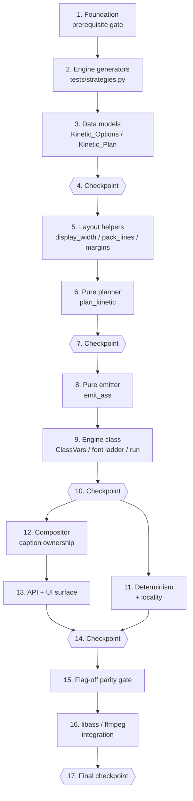

# Implementation Plan — Kinetic Typography Engine

These are incremental, test-first coding steps. Execute them **one task at a time**, in
order — each task builds on the previous ones so there is never orphaned code.

This engine is built **on top of the approved
[`av-engines-foundation`](../av-engines-foundation/tasks.md) spec**, whose own plan already
lands `worker/engines/` (`base.py`, `registry.py`, `capabilities.py`, `timebase.py`,
`artifacts.py`, `host.py`), the `engine_contributions` handoff into
`compositor.render_clip`, the Pipeline stage hooks, the test doubles in `tests/fakes.py`,
the shared generators in `tests/strategies.py`, **and** the `hypothesis` /
`requirements-dev.txt` / CI dependency fix. Task 1 here is therefore a **prerequisite
gate**, not a re-implementation: it verifies those modules and test utilities exist and
that the foundation suite is green. Nothing in this plan adds `hypothesis`, edits
`.github/workflows/ci.yml`, or modifies anything under `av-engines-foundation/`
_(Req 19.5)_.

Ordering is dependency-safe: prerequisite gate → engine generators → data models
(`Kinetic_Options`, `Kinetic_Plan`) → pure layout helpers → pure planner → pure ASS emitter
→ the `AV_Engine` class and its gate ladder → determinism/locality verification → the
compositor caption-ownership branch → API/UI surface → the flag-off parity gate → libass
integration. Every impure step is confined to a single UTF-8 write inside the
Engine_Workspace, so all of epics 3–8 are pure-function work testable with no ffmpeg, no
libass, and no fonts installed _(Reqs 18.2, 15.6)_.

Tasks marked with `*` are optional test sub-tasks (unit / property / integration tests).
Property tests use `hypothesis` with `@settings(max_examples=100)`, one property per test,
tagged `# Feature: kinetic-typography, Property N: <text>`, in the exact files named in the
design's Testing Strategy file mapping (`tests/test_kinetic_engine.py`,
`tests/test_kinetic_plan.py`, `tests/test_kinetic_ass.py`, `tests/test_kinetic_layout.py`,
`tests/test_kinetic_determinism.py`, `tests/test_kinetic_compositor.py`). Word_Timelines are
built with the existing `FakeWord` helper from `tests/conftest.py`; Engine_Contexts are
built from the foundation doubles in `tests/fakes.py`; libass-dependent behaviour uses the
existing `make_video`, `requires_ffmpeg`, `probe_size`, `probe_duration` helpers
_(Reqs 18.3, 18.4, 18.5)_.

Three sub-tasks are **intentionally not marked optional even though they are test/config
work**: 1.2 (proves the foundation this engine binds to is actually green before any
binding is written), 2.1 (the six engine generators every later property task imports), and
15.1 / 15.2 (the flag-off backward-compatibility parity gate, which is this spec's central
guarantee).

## Tasks

- [x] 1. Prerequisite gate on the AV engines foundation
  - [x] 1.1 Verify the foundation modules and contracts this engine binds to exist
    - Confirm `worker/engines/base.py` exports `AV_Engine` (with `resolve_options`/`plan`/`run`, `flag_field()`, `FLAG_SUFFIX`), `Engine_Stage.COMPOSE`, `Engine_Status`, `Engine_Context` (`words`, `duration`, `time_base`, `options`, `options_digest`, `rng()`, `remaining()`, `workspace`, `capabilities`, `permissibility`, `deps`), `Engine_Result` (+ `skipped`/`degraded`/`failed`), `Compose_Contribution` (`engine_id`, `inputs`, `video_filters`, `audio_filters`, `subtitle_path`, `z_order`), `Engine_Artifact`, `marker`, the `Engine_Options` protocol, the `coerce_*` helpers, `dump_options`, `options_digest`, and `derive_seed`.
    - Confirm `worker/engines/timebase.py` exports `Time_Base` (`snap`, `seconds_to_frame`, `frame_to_seconds`), `Timeline_Segment`, and `normalize_segments`; `worker/engines/capabilities.py` exports `Capability_Report` (`available`, `status`, `first_missing`, `missing`) resolving `font:<name>` through `worker.captions.font_available` and `ffmpeg_filter:<name>`; `worker/engines/artifacts.py` exports `Engine_Workspace` (`path`, `artifact`), `allocate_workspace`, `artifact_key`; `worker/engines/registry.py` exports the registry + registration decorator; `worker/engines/host.py` exports the stage runner and clip finaliser.
    - Confirm `worker/effects/compositor.py` `render_clip` already accepts the foundation's `engine_contributions` parameter (this plan only adds a branch inside it, in task 12.1) — that is the confirmed shipped parameter name, so use `engine_contributions` throughout epic 12 instead of introducing a second one.
    - Do **not** add, rename, or widen any foundation symbol; if one is missing, stop and finish the foundation task that owns it.
    - **Verified 1.1 — shipped reality (no foundation symbol added, renamed, or widened):** every symbol above exists and was checked by import, not by grep. Two wording corrections to carry into later epics: (a) `worker/engines/registry.py` ships **`register(engine, *, priority=None) -> AV_Engine`** — a module-level *function* taking an engine **instance** (plus `get_registry` / `reset_registry` / `Engine_Registry.register`), **not** a registration decorator, so task 9.1 must call `registry.register(Kinetic_Typography_Engine())` at import rather than decorate the class; (b) `worker/effects/compositor.py` `render_clip` takes **`engine_contributions`** (positional-or-keyword, `default=None`) — the confirmed name for all of epic 12. Also noted: `Engine_Context` now additionally carries `first_input_index` (from the AV-engine input-seam work); kinetic does not read it. `allocate_workspace` signature is `(temp_dir, job_id, clip_id, engine_id, options_digest, *, create=True)`. Host entry points are `Engine_Host.run_stage(...)` (stage runner) and `Engine_Host.finish_clip(clip_id)` (clip finaliser).
    - _Requirements: 1.1, 1.2, 1.5, 1.6, 18.3, 19.5_

  - [x] 1.2 Verify the foundation suite and property toolchain are green before binding to them
    - Run `pytest tests/test_engines_base.py tests/test_engine_registry.py tests/test_engine_capabilities.py tests/test_engine_timebase.py tests/test_engine_artifacts.py tests/test_engine_host.py -q` and confirm it passes.
    - Confirm `tests/fakes.py` provides `StaticProber` / `CountingProber` / `RaisingProber`, `RecordingStorage`, `FakeClock`, `FakeEngine` / `RaisingEngine`, and that `tests/strategies.py` provides `st_word_timeline`, `st_options_mapping`, `st_time_base`, `st_availability_map`; confirm `hypothesis` imports (the foundation already declares it in `requirements-dev.txt` — do **not** re-add it, and do **not** touch `.github/workflows/ci.yml`).
    - **Verified 1.2:** foundation subset (`test_engines_base`, `test_engine_registry`, `test_engine_capabilities`, `test_engine_timebase`, `test_engine_artifacts`, `test_engine_host`) = **72 passed**; full suite baseline = **287 passed, 52 skipped, 0 failed**. All seven `tests/fakes.py` doubles and all four `tests/strategies.py` generators import and draw live values; `hypothesis` 6.161.6 imports. `requirements-dev.txt` and `.github/workflows/ci.yml` untouched.
    - _Requirements: 18.3, 18.4, 18.7, 19.5_

- [x] 2. Engine-specific generators (`tests/strategies.py`)
  - [x] 2.1 Add the six kinetic generators to the existing shared generator module
    - Extend `tests/strategies.py` (do not create a parallel module) with `st_kinetic_options` (valid `Kinetic_Options` field mappings across the declared bounds: `max_lines` 1–4, `max_line_width` 6–80, `safe_area_x_pct` 0–25, `safe_area_y_pct` 0–40, `motion_duration_ms` 20–1000, `confidence_floor` 0.0–1.0), `st_kinetic_style` (the 7 members of `KINETIC_STYLES`), `st_reveal_mode` (`cumulative`, `word_by_word`).
    - Add `st_i18n_word_timeline` (wide-script Han/Hiragana/Katakana/Hangul, right-to-left Arabic/Hebrew, combining marks, emoji, and single tokens whose Display_Width exceeds any legal `max_line_width`), `st_broken_word_timeline` (missing `end`, non-numeric bounds, inverted `end < start`, zero-length, and empty / whitespace-only text), and `st_font_availability` (availability combinations over the `(font_override, preset_font, "Arial")` ladder, composable with the foundation `st_availability_map`).
    - All generators emit `FakeWord` instances from `tests/conftest.py` so they compose with the foundation's `st_word_timeline`; this sub-task is **not optional** because every later property task imports these names.
    - **Completed 2.1 — shipped shapes and three carried-forward notes:** all six generators added to `tests/strategies.py` (tranche 3, extended not forked). `st_kinetic_options()` emits a **plain field mapping** (not a `Kinetic_Options` instance — that dataclass lands in 3.2) covering every declared bound inclusively; `notes` is deliberately absent (resolution provenance, never input). `st_i18n_word_timeline()` and `st_broken_word_timeline()` both **draw their timing skeleton from `st_word_timeline`** and return its `(words, duration)` shape, so they are drop-in interchangeable. `st_font_availability()` returns a dict with `ladder` / `availability` (capability-id keyed, ready for `StaticProber`) / `expected_font` / `expected_marked`, merging foundation `st_availability_map` noise which the ladder entries override. (a) **`KINETIC_STYLES` / `REVEAL_MODES` are duplicated as literal constants** in `tests/strategies.py` because `worker/engines/kinetic.py` does not exist yet — **task 3.1 must define the same values** and task 9.4 must assert `tuple(kinetic.KINETIC_STYLES) == strategies.KINETIC_STYLES` and the same for `REVEAL_MODES` so the duplication cannot drift (the requirement is written into the module comment). (b) The **pinned `__all__` list** in `tests/test_engines_base.py::test_shared_test_doubles_and_generators_are_pinned` was deliberately updated with the 8 new names (2 constants + 6 generators), kept sorted, plus a `sorted()` self-check. (c) **`FakeWord.probability` exists but is hard-coded to `1.0`** and is not a constructor parameter; rather than widen that shared double, the new generators construct a `FakeWord` and set `.probability` on the instance (`_word` helper). Consequence for **task 6.8 (P13)**: timelines drawn straight from `st_word_timeline` can never sit below a legal `confidence_floor`, so P13 must draw from `st_i18n_word_timeline` / `st_broken_word_timeline` or set `.probability` itself.
    - _Requirements: 18.3, 18.4, 18.7_

- [ ] 3. Data models — `Kinetic_Options`, `Kinetic_Plan`, `Kinetic_Cue`, `Kinetic_Word`
  - [ ] 3.1 Create `worker/engines/kinetic.py` with the vocabularies and documented defaults
    - New module with a docstring, stdlib + `worker.captions` + `worker.effects.caption_presets` + `worker.engines.*` imports only, every heavy dependency reached through a lazy call so the module imports with ffmpeg, libass, and all optional fonts absent.
    - Define `KINETIC_STYLES` (sorted: `bounce`, `highlight_sweep`, `karaoke_fill`, `none`, `pop`, `slide_up`, `typewriter`), `DEFAULT_STYLE = "karaoke_fill"`, `REVEAL_MODES` (`cumulative`, `word_by_word`), `DEFAULT_REVEAL = "cumulative"`, `POSITIONS` (`bottom`, `center`, `top`), `FALLBACK_FONT = "Arial"`, `KINETIC_Z_ORDER = 100`, `ASS_NAME = "kinetic.ass"`, `MIN_WORD_S = 0.08`, `SYNTHESISED_RATIO_LIMIT = 0.40`, `CUE_FADE_MS = (120, 120)`, `BOUNCE_OVERSHOOT = 118`, `SLIDE_UP_PX = 40`, and the `_write_text_utf8(path, text)` helper.
    - _Requirements: 1.4, 4.1, 4.9, 6.2, 6.3, 6.4, 7.3, 9.3, 16.3_

  - [ ] 3.2 Implement the `Kinetic_Options` frozen dataclass with `parse` and `to_dict`
    - All fields exactly as designed (`style`, `reveal`, `preset_name`, `font_override`, `preset_font`, `font_size`, `position`, `max_lines`, `max_line_width`, `safe_area_x_pct`, `safe_area_y_pct`, `motion_duration_ms`, `highlight_keywords`, `keyword_ai`, `emoji_inline`, `confidence_floor`, `captions_enabled`, `hook_enabled`, `hook_duration_s`, `hook_font_size`, `durable_subtitle`, `permissibility`, `notes`), every one a JSON-serialisable scalar so the foundation `Engine_Options` protocol is satisfied.
    - `parse` is total: each field goes through a foundation coercion helper with its documented default and bounds (`coerce_choice(..., KINETIC_STYLES, DEFAULT_STYLE)`, `coerce_int(..., lo=1, hi=4)`, `coerce_float(..., lo=0.0, hi=1.0)`, …); it reads named keys only, so unrecognised keys are ignored and no input raises. `to_dict` emits every field in sorted key order with JSON-native types.
    - _Requirements: 10.1, 10.2, 10.5, 10.6, 10.7, 11.4_

  - [ ] 3.3 Implement `from_processing_options` with Base_Preset inheritance
    - Resolve the Base_Preset through `caption_presets.resolve_preset(options.caption_preset)` and inherit its `font`, `font_size`, `position`, colours, and border style; gate `highlight_keywords` on `options.caption_keyword_highlight and preset.highlight_keywords` and `emoji_inline` on `options.caption_emoji and preset.emoji_inline`; carry `captions_enabled`, `hook_enabled`, `hook_duration_s`, `hook_font_size`, `durable_subtitle`, `permissibility`.
    - Record `"style_substituted"` / `"position_substituted"` in `notes` when `coerce_choice` fell back. Read attributes only — never write to the supplied Processing_Options — and make coercion of an already-valid value the identity so resolution is idempotent. Read enablement from options already normalised by `worker.models.effective_options`.
    - _Requirements: 1.3, 4.8, 5.9, 7.4, 8.6, 10.3, 10.4, 10.8, 10.9, 10.10_

  - [ ] 3.4 Implement the `Kinetic_Word`, `Kinetic_Cue`, and `Kinetic_Plan` frozen dataclasses
    - `Kinetic_Word` (`text` already `_escape`-d, `start`, `end`, `rel_ms`, `emphasis`, `timing_synthesised`, `emoji`, `line`), `Kinetic_Cue` (`segment: Timeline_Segment`, `words`, `lines` as word-index tuples per Text_Line), and `Kinetic_Plan` (`style`, `reveal`, `font`, `font_size`, `position`, `align`, `play_res_x`, `play_res_y`, `margin_l`, `margin_r`, `margin_v`, `duration`, `style_line`, `hook_style`, `hook_text`, `hook_duration_s`, `cues`, `cue_level`, `degraded`, `markers`, `detail`, `colors`, `highlight_scale`).
    - `Kinetic_Plan.to_dict()` emits sorted, JSON-native keys and `Kinetic_Plan.from_dict()` reconstructs an equivalent value, so `plan(ctx)` can return a JSON-serialisable mapping.
    - _Requirements: 11.2, 11.4, 11.10_

  - [ ]* 3.5 Property test: options and plans round-trip; resolution is idempotent → `tests/test_kinetic_plan.py`
    - **Property 18: Options and plans round-trip; resolution is idempotent** — for every hostile mapping, `Kinetic_Options.parse(data)` returns a value without raising and ignores non-field keys; for every valid options value, `parse(o.to_dict()).to_dict() == o.to_dict()`; for every Processing_Options value, `resolve_options(resolve_options(o)) == resolve_options(o)` and `dataclasses.asdict(options)` is unchanged; for every plan, `Kinetic_Plan.from_dict(p.to_dict())` is equivalent to `p` and `p.to_dict()` is JSON-encodable. Generators: `st_options_mapping`, `st_kinetic_options`, `st_word_timeline`.
    - _Requirements: 10.1, 10.3, 10.5, 10.6, 10.7, 10.8, 10.9, 10.10, 11.2, 11.10, 17.8_ · _Properties: P18_

  - [ ]* 3.6 Property test: an unrecognised style falls back once, and names it → `tests/test_kinetic_engine.py`
    - **Property 10: An unrecognised style falls back once, and names it** — for any value outside `KINETIC_STYLES` (non-strings, empty strings, unknown names), `resolve_options` yields `style == DEFAULT_STYLE` and exactly one `engine:kinetic_typography:style_substituted` marker is carried; for any member value, none is carried. Generator: `st_options_mapping`.
    - _Requirements: 4.8_ · _Properties: P10_

- [ ] 4. Checkpoint — data models complete
  - Ensure all tests pass, ask the user if questions arise.

- [ ] 5. Pure layout helpers and Safe_Area geometry
  - [ ] 5.1 Implement `display_width` and `is_space_free`
    - `display_width(text)` counts `unicodedata.east_asian_width` classes `F`/`W` as 2 units, combining marks (categories `Mn`/`Me`) as 0 so a decomposed grapheme is not double-counted, and everything else as 1.
    - `is_space_free(text)` returns true for scripts written without inter-word spaces (Han, Hiragana, Katakana, Hangul), decided per-word from the first non-combining code point.
    - _Requirements: 8.1, 8.2, 8.4_

  - [ ] 5.2 Implement `pack_lines` greedy Text_Line packing
    - `pack_lines(words, max_lines, max_width) -> (lines as word-index lists, overflow tail)`: greedy left-to-right packing; a word whose own Display_Width exceeds `max_width` is placed alone on its line and never split; the join cost adds 1 unit between two Latin-script neighbours and 0 between space-free-script neighbours; words that do not fit within `max_lines` are returned as the overflow tail for the caller to re-split.
    - Keep every word intact inside one Text_Line — no word may cross a `\N` break.
    - _Requirements: 7.5, 7.6, 7.8, 8.4, 8.5_

  - [ ] 5.3 Implement `_POSITION_ALIGN` and the Safe_Area margin computation
    - `_POSITION_ALIGN` maps `bottom`/`center`/`top` to ASS alignments `2`/`5`/`8` with their v0.8.0 default `MarginV` values; an empty options position resolves to the Base_Preset position.
    - Compute `margin_l = margin_r = int(round(play_res_x * safe_area_x_pct / 100.0))` and `margin_v = max(default_margin_v, int(round(play_res_y * safe_area_y_pct / 100.0)))`, so the text box never sits outside the Safe_Area while preserving v0.8.0 vertical placement when the inset is smaller; `center` keeps `MarginV = 0` semantics with its safe-area obligation met by the horizontal insets.
    - _Requirements: 7.2, 7.3, 7.4, 7.10_

  - [ ]* 5.4 Property test: layout respects line count, line width, and word integrity → `tests/test_kinetic_layout.py`
    - **Property 14: Layout respects line count, line width, and word integrity** — for every Word_Timeline and options value, every `Default` event contains at most `max_lines - 1` literal `\N` breaks, every Text_Line's Display_Width is at most `max_line_width` unless the line holds exactly one word, no word's escaped text is split across a `\N`, Latin neighbours are joined by exactly one space and space-free neighbours by none. Generators: `st_word_timeline`, `st_i18n_word_timeline`, `st_kinetic_options`.
    - _Requirements: 7.5, 7.6, 7.8, 7.9, 8.1, 8.2, 8.4, 8.5, 8.10_ · _Properties: P14_

  - [ ]* 5.5 Property test: style margins keep the caption box inside the Safe_Area → `tests/test_kinetic_layout.py`
    - **Property 16: Style margins keep the caption box inside the Safe_Area** — for every options value and probed clip size, `MarginL`, `MarginR`, and `MarginV` are each at least the corresponding Safe_Area inset in pixels, `MarginL + MarginR < PlayResX`, `2 * MarginV < PlayResY`, and `Alignment` is the `_POSITION_ALIGN` value for the resolved position (Base_Preset position used when the option is empty). Generators: `st_kinetic_options`, hypothesis integers for width/height.
    - _Requirements: 7.2, 7.3, 7.4, 7.10_ · _Properties: P16_

- [ ] 6. The pure planner — `plan_kinetic`
  - [ ] 6.1 Implement sanitisation and cue grouping (planner steps 1–2)
    - `plan_kinetic(words, duration, time_base, opts, font, hook_text, keyword_planner, remaining) -> Kinetic_Plan`, pure: no I/O, no ffmpeg, no clock, no subprocess.
    - Step 1 drops empty / whitespace-only words and coerces bounds the way `captions._word_bounds` does (non-numeric → `0.0`, inverted → `end = start`), flagging those words `timing_synthesised`. Step 2 groups the survivors with `captions.words_to_cues` using its existing defaults, so grouping matches the v0.8.0 caption path. Escape every word with `captions._escape`.
    - _Requirements: 4.7, 5.1, 5.2, 6.1, 6.6_

  - [ ] 6.2 Implement layout application and proportional cue re-splitting (planner step 3)
    - Pack each cue's words with `pack_lines` into at most `opts.max_lines` lines of at most `opts.max_line_width` Display_Width, recording each word's `line` index and the cue's `lines` tuple.
    - On overflow, split the cue at a word boundary and divide the original interval in proportion to the two halves' word-time spans (`ratio = head_span / (head_span + tail_span)`, `0.5` for degenerate spans), snapping the boundary with `time_base.snap`; repeat until every cue fits.
    - _Requirements: 7.5, 7.6, 7.7, 7.8_

  - [ ] 6.3 Implement synthesised timing fill, snapping, and normalisation (planner steps 4–5)
    - Distribute a cue's span evenly across its words for every word flagged in step 1; widen zero-length words to `MIN_WORD_S`.
    - Snap every cue bound through `time_base.snap`, then run the cue list through `normalize_segments(segments, duration, time_base=time_base, min_duration=MIN_WORD_S)`; cues dropped by normalisation drop their words with them, surviving cues clamp their words into their own snapped bounds, and every word's `rel_ms` is its onset relative to its cue start in milliseconds.
    - _Requirements: 5.3, 5.4, 5.5, 5.6, 5.7, 5.8, 6.1, 6.2, 16.2_

  - [ ] 6.4 Implement keyword emphasis and the Word_Confidence floor (planner step 6)
    - When `opts.highlight_keywords` is on, call the injected `keyword_planner(flat_words, use_ai=opts.keyword_ai, client=None)` and consume the returned `set[int]` as a membership test against a positional index (never iterated), so ordering stays deterministic.
    - Strip emphasis from any word whose `probability` is below `opts.confidence_floor` while leaving its text and `[start, end)` untouched.
    - _Requirements: 5.9, 6.5, 11.4_

  - [ ] 6.5 Implement the degradation and budget checks (planner steps 7–9)
    - If `synthesised_count / word_count > SYNTHESISED_RATIO_LIMIT`, set `cue_level=True`, `degraded=True`, and add `engine:kinetic_typography:degraded:word_timings`.
    - Consult `remaining()` once between the layout and normalisation steps; at `<= 0` stop planning with `degraded=True` and `engine:kinetic_typography:degraded:budget`. Copy `Kinetic_Options.notes` (e.g. `style_substituted`) into `Kinetic_Plan.markers`, and populate `style_line`, `hook_style`, `colors`, `highlight_scale`, `align`, margins, `play_res_x/y`, and `detail`.
    - _Requirements: 4.8, 6.3, 6.4, 14.4_

  - [ ]* 6.6 Property test: cue timeline is sorted, disjoint, in-bounds, and word-consistent → `tests/test_kinetic_plan.py`
    - **Property 11: Cue timeline is sorted, disjoint, in-bounds, and word-consistent** — for every Word_Timeline, options value, and Time_Base, cue intervals are sorted by start, mutually non-overlapping, contained in `[0, duration]`, snapped (`time_base.snap(x) == x`), every emitted timestamp lies in `[0, duration]`, and every word's motion start satisfies `cue.start <= motion_start <= word.end`. Generators: `st_word_timeline`, `st_kinetic_options`, `st_time_base`.
    - _Requirements: 5.1, 5.2, 5.3, 5.4, 5.5, 5.6, 5.7, 5.8, 16.2_ · _Properties: P11_

  - [ ]* 6.7 Property test: malformed timings degrade instead of raising → `tests/test_kinetic_plan.py`
    - **Property 12: Malformed timings degrade instead of raising** — for every timeline with missing, non-numeric, inverted, zero-length, or empty-text words, planning and `run` return without raising; every synthesised word is flagged `timing_synthesised` with `end - start >= MIN_WORD_S`; past `SYNTHESISED_RATIO_LIMIT` the status is `degraded` with exactly one `degraded:word_timings` marker and every `Default` event carries a single `\fad` and no per-word `\t`. Generators: `st_broken_word_timeline`, `st_kinetic_options`.
    - _Requirements: 6.1, 6.2, 6.3, 6.4, 6.7_ · _Properties: P12_

  - [ ]* 6.8 Property test: low-confidence words lose emphasis but keep text and timing → `tests/test_kinetic_plan.py`
    - **Property 13: Low-confidence words lose emphasis but keep text and timing** — for every Word_Timeline and confidence floor, every word below the floor is emitted without emphasis tags while its text and `[start, end)` are identical to the emphasis-enabled run. Generators: `st_word_timeline`, `st_kinetic_options`.
    - _Requirements: 5.9, 6.5_ · _Properties: P13_

  - [ ]* 6.9 Property test: cue re-splitting conserves the interval proportionally → `tests/test_kinetic_plan.py`
    - **Property 15: Cue re-splitting conserves the interval proportionally** — for every Word_Timeline and options value that forces a cue overflow, the cues produced from one original cue are contiguous, their union equals the original snapped interval, and each part's share of the interval is within one frame of its share of the words' time span. Generators: `st_word_timeline`, `st_kinetic_options`, `st_time_base`.
    - _Requirements: 7.7_ · _Properties: P15_

- [ ] 7. Checkpoint — planner complete
  - Ensure all tests pass, ask the user if questions arise.

- [ ] 8. The pure ASS emitter — `emit_ass`
  - [ ] 8.1 Emit the header, the `Style: Default` line, and the `Style: Hook` line
    - `emit_ass(plan) -> str`, pure and locale-free. `[Script Info]` with `ScriptType: v4.00+`, `PlayResX`/`PlayResY` from the probed clip size, `WrapStyle: 2`, `ScaledBorderAndShadow: yes`; the `[V4+ Styles]` `Format:` line identical in shape to `captions.build_ass`.
    - `Style: Default` takes every look field from the Base_Preset exactly as `captions._preset_style_line` does (`primary`, `colors.highlight` as `SecondaryColour` so `\kf` sweeps correctly, `border_style`, karaoke-thickened outline/shadow), differing only in the three margin columns which carry the Safe_Area values from task 5.3; re-emit the existing `Style: Hook` definition with the same numbers. Then the `[Events]` `Format:` line.
    - _Requirements: 3.3, 7.1, 7.2, 7.3, 7.5, 10.4_

  - [ ] 8.2 Emit the seven Kinetic_Style word spans
    - Reproduce `captions.build_word_span` semantics byte-for-byte for the four shared styles: `none` (plain escaped word), `karaoke_fill` (`\kf` with `dur_cs = max(1, round((end-start)*100))`), `pop` (`\fscx60\fscy60` + `\t` ramp to 100), `typewriter` (`\alpha&HFF&` + `\t` to `&H00&`).
    - Add the three new styles: `bounce` as a two-stage `\t` overshooting to `BOUNCE_OVERSHOOT` then settling at 100; `slide_up` as an event-level `\move` from `SLIDE_UP_PX` below the resolved caption position ending at that position, plus the per-word alpha gate so words still appear on beat; `highlight_sweep` as a per-word `\t` colour transition from `colors.highlight` to `colors.primary`. All offsets are `rel_ms` relative to the cue start, with `d = opts.motion_duration_ms`.
    - _Requirements: 4.2, 4.3, 4.4, 4.5, 4.6_

  - [ ] 8.3 Compose Reveal_Mode gating, emphasis wrapping, and inline emoji
    - `word_by_word` prefixes each span with `{\alpha&HFF&\t(rel,rel+1,\alpha&H00&)}`; `typewriter` is excluded from the gate because its own tag set already is that gate. `cumulative` leaves the span untouched. Gating composes around the style span so the 7 × 2 matrix is a product.
    - Emphasis wraps outermost in `build_word_span`'s composition order (`{\c{highlight}&\fscx{scale}\fscy{scale}}` … `{\c{primary}&\fscx100\fscy100}`) leaving spoken timing untouched. When the Base_Preset and options both enable it, append the glyph from `captions.caption_emoji_glyph(...)` inside the word's span, dropping the glyph and keeping neighbours on an empty return.
    - _Requirements: 4.9, 5.9, 8.6, 8.7_

  - [ ] 8.4 Assemble events, joins, cue-level fallback, and the UTF-8 document
    - Join words within a Text_Line with `" "` (Latin) or `""` (space-free) and Text_Lines with the literal `\N`; emit right-to-left words in Word_Timeline order with no directional override characters inserted.
    - Under `cue_level`, replace all per-word tags with a single `{\fad(120,120)}` prefix over the plain joined text. Clamp every timestamp to `[0, duration]` and format it only through `captions._ass_timestamp`. Join the document with `"\n"`, end with exactly one trailing newline, and write UTF-8. Guarantee well-formedness by construction: spans come only from the closed style table, every `{` is closed in the same f-string, and `_escape` has already replaced `{`/`}` in word text.
    - _Requirements: 4.10, 4.11, 5.6, 6.4, 8.3, 8.8, 11.5, 11.6, 16.4_

  - [ ] 8.5 Emit the hook title event
    - When `opts.hook_enabled` and the hook text carried on `ctx.deps["hook_text"]` is non-empty, emit as the first event exactly what `build_ass` emits today: `Dialogue: 1,0:00:00.00,{hook_end},Hook,,0,0,0,,{\fad(250,350)}{escaped upper-cased hook}` with `hook_end = _ass_timestamp(max(0.5, opts.hook_duration_s))`, so no hook title is lost when the engine owns the Subtitle_Slot.
    - _Requirements: 3.3_

  - [ ]* 8.6 Property test: every emitted ASS document is well-formed → `tests/test_kinetic_ass.py`
    - **Property 6: Every emitted ASS document is well-formed** — for every Kinetic_Style, Reveal_Mode, and non-empty Word_Timeline, each `Dialogue:` line has balanced `{`/`}` braces, names a style declared in `[V4+ Styles]` (`Default` or `Hook`), has the 9 comma-separated fields the `Format:` line declares before its text, and the header carries `PlayResX`, `PlayResY`, and `WrapStyle: 2`. Generators: `st_word_timeline`, `st_kinetic_style`, `st_reveal_mode`, `st_kinetic_options`.
    - _Requirements: 4.10, 7.1, 7.5, 8.8_ · _Properties: P6_

  - [ ]* 8.7 Property test: visible text preserves every word in order → `tests/test_kinetic_ass.py`
    - **Property 7: Visible text preserves every word in order** — for every Word_Timeline including wide-script, RTL, combining-mark, emoji, and over-long tokens, every style, and every Reveal_Mode, stripping all override tags, `\N` breaks, and inline emoji from the `Default` events yields every non-whitespace word's `_escape`-d text in Word_Timeline order, with no directional override characters inserted. Generators: `st_word_timeline`, `st_i18n_word_timeline`, `st_kinetic_style`, `st_reveal_mode`.
    - _Requirements: 4.7, 4.11, 6.6, 8.3, 8.9_ · _Properties: P7_

  - [ ]* 8.8 Property test: shared styles reproduce `build_word_span` semantics → `tests/test_kinetic_ass.py`
    - **Property 8: Shared styles reproduce `build_word_span` semantics** — for all words and Base_Presets, the span for a non-emphasised word under `reveal="cumulative"` for each style in `{none, pop, typewriter, karaoke_fill}` is byte-identical to `captions.build_word_span(word, replace(preset, animation=style), False, cue_start=cue.start)`; `bounce` contains two `\t` stages ending at scale `100`; `slide_up` carries an event-level `\move` ending at the resolved caption position; `highlight_sweep` transitions `colors.highlight` → `colors.primary`. Generators: `st_word_timeline`, `st_kinetic_style`, `st_kinetic_options`.
    - _Requirements: 4.2, 4.3, 4.4, 4.5, 4.6_ · _Properties: P8_

  - [ ]* 8.9 Property test: Reveal_Mode is orthogonal to Kinetic_Style → `tests/test_kinetic_ass.py`
    - **Property 9: Reveal_Mode is orthogonal to Kinetic_Style** — for every style/Reveal_Mode pair and every Word_Timeline, the tag-stripped text and cue count are identical across both Reveal_Modes for the same style, and switching Reveal_Mode changes only the presence of the per-word `\alpha` gate. Generators: `st_word_timeline`, `st_kinetic_style`.
    - _Requirements: 4.9_ · _Properties: P9_

  - [ ]* 8.10 Property test: the hook title survives engine ownership → `tests/test_kinetic_ass.py`
    - **Property 5: The hook title survives engine ownership** — for all non-empty hook texts and Word_Timelines, when the engine applies with `hook_enabled`, the emitted ASS declares a `Style: Hook` line identical in shape to `captions.build_ass`'s, contains exactly one event styled `Hook`, and that event's tag-stripped text equals the escaped upper-cased hook text. Generators: `st_word_timeline`, `st_kinetic_options`, hypothesis `text()`.
    - _Requirements: 3.3, 3.7_ · _Properties: P5_

  - [ ]* 8.11 Unit tests: the two worked ASS examples, asserted literally → `tests/test_kinetic_ass.py`
    - Assert the design's worked `bounce` / `cumulative` event string and `highlight_sweep` / `word_by_word` event string verbatim for `PlayResX/Y = 1080/1920`, hormozi-like colours, `position="bottom"`, `safe_area_x_pct=6`, `safe_area_y_pct=10` (⇒ `MarginL/R = 65`, `MarginV = 220`), `motion_duration_ms=120`, `max_lines=2`, `max_line_width=22`, cue `[1.00, 2.20)` with `THIS` / `CHANGED` (emphasised) / `EVERYTHING`; assert the `cue_level=True` collapse to `{\fad(120,120)}THIS CHANGED\NEVERYTHING`, so any tag-shape regression is a one-line diff.
    - _Requirements: 4.4, 4.6, 6.4, 7.2, 7.5, 7.6_

- [ ] 9. The `Kinetic_Typography_Engine` class
  - [ ] 9.1 Declare the ClassVar contract, injected collaborators, and registration
    - `class Kinetic_Typography_Engine(AV_Engine)` with `engine_id = "kinetic_typography"`, `stage = Engine_Stage.COMPOSE`, `priority = 50`, `required_capabilities = ("ffmpeg_filter:subtitles",)`, `optional_capabilities = ()` (the `font:<family>` id is probed per clip), `requires_network = False`, `requires_model_download = False`, `time_budget_s = 5.0`, `max_media_passes = 0`, `produces_media = False`.
    - Keyword-only `__init__` injecting `font_probe=captions.font_available`, `keyword_planner=caption_presets.plan_keywords`, `ass_writer=_write_text_utf8`. Register once at import through the foundation registry decorator; keep the inherited `flag_field()` resolving to `kinetic_typography_enabled`; keep every dependency behind a lazy call so import succeeds with ffmpeg, libass, and all fonts absent.
    - _Requirements: 1.1, 1.4, 1.5, 1.6, 1.7, 1.8, 15.2, 15.5, 16.1, 18.1_

  - [ ] 9.2 Implement `_resolve_font` — the fallback ladder
    - Build the ladder `(opts.font_override, opts.preset_font, FALLBACK_FONT)` dropping empties, take the first rung as the requested family, and descend it probing `ctx.capabilities.available(f"font:{family}")` (which resolves through the injected probe / `captions.font_available`) with no download and no network.
    - Return the first available family plus at most one `engine:kinetic_typography:degraded:font:<requested_family>` marker when the requested family was not the one used; fall back to `FALLBACK_FONT` with that same single marker when nothing probes available. The returned family is always a ladder member, and the requested style and Reveal_Mode are emitted regardless.
    - _Requirements: 9.1, 9.2, 9.3, 9.4, 9.5, 9.6, 9.7, 9.8_

  - [ ] 9.3 Implement `resolve_options`, `plan`, and the `run` gate ladder
    - `resolve_options` delegates to `Kinetic_Options.from_processing_options` (pure, idempotent, non-mutating). `plan(ctx)` returns `plan_kinetic(...).to_dict()` — pure, no ffmpeg, no network, no subprocess — reading `ctx.words`, `ctx.duration`, `ctx.time_base`, `ctx.options`, the resolved font, `ctx.deps["hook_text"]`, the injected keyword planner, and `ctx.remaining`.
    - `run(ctx)` ladder in order: captions disabled → `skipped`; no non-whitespace word → `skipped`; `ffmpeg_filter:subtitles` unavailable → `degraded` + `unavailable:ffmpeg_filter:subtitles`; `ctx.remaining() <= 0` → `degraded` + `degraded:budget`. Otherwise resolve the font, plan, emit, and write once through `ctx.workspace.path(ASS_NAME)` inside `try/except OSError` → `failed` with `"<Type>: <msg>"`; declare the artifact via `ctx.workspace.artifact(ASS_NAME, media_type="subtitle", durable=opts.durable_subtitle)`; append `style:<kinetic_style>` and `supersedes_captions` markers; set status `degraded` when `kplan.degraded` else `applied`; return a `Compose_Contribution(engine_id, inputs=(), video_filters=(), audio_filters=(), subtitle_path=dest, z_order=KINETIC_Z_ORDER)`.
    - Enforce the ownership rule: when the status is `degraded`, return the result with `contribution=None` so `contribution is not None` ⇔ `applied` ⇔ the engine owns the Subtitle_Slot; never invoke ffmpeg or create a subprocess; never write outside the workspace.
    - _Requirements: 1.2, 1.3, 2.1, 2.2, 2.3, 2.4, 3.4, 3.5, 3.6, 3.7, 9.4, 11.1, 12.1, 12.2, 12.3, 12.4, 12.5, 12.7, 13.1, 13.3, 14.4, 15.1, 16.3_

  - [ ]* 9.4 Property test: the engine's declared contract is exactly the pinned one → `tests/test_kinetic_engine.py`
    - **Property 1: The engine's declared contract is exactly the pinned one** — on a freshly imported module, `engine_id == "kinetic_typography"`, `stage is Engine_Stage.COMPOSE`, integer `priority`, `"ffmpeg_filter:subtitles"` in `required_capabilities`, `requires_network is False`, `requires_model_download is False`, `max_media_passes == 0`, `produces_media is False`, positive `time_budget_s`, `flag_field() == "kinetic_typography_enabled"`, and exactly one COMPOSE-stage registry entry. No generator required.
    - _Requirements: 1.1, 1.4, 1.5, 1.6, 1.7, 1.8, 15.2, 16.1_ · _Properties: P1_

  - [ ]* 9.5 Property test: applying contributes a subtitle-only compose fragment → `tests/test_kinetic_engine.py`
    - **Property 2: Applying contributes a subtitle-only compose fragment** — for all Word_Timelines and options values yielding `applied`, the contribution has `engine_id == "kinetic_typography"`, `inputs == ()`, `audio_filters == ()`, `video_filters == ()`, `z_order == 100`, an existing `subtitle_path`, and `Engine_Result.media is None`. Generators: `st_word_timeline`, `st_kinetic_options`; workspace from the foundation `allocate_workspace(tmp_path, …)`.
    - _Requirements: 2.1, 2.3, 2.4, 12.4, 16.3_ · _Properties: P2_

  - [ ]* 9.6 Property test: gates return `skipped` and leave no contribution → `tests/test_kinetic_engine.py`
    - **Property 4: Gates return `skipped` and leave no contribution** — for all Word_Timelines, when `ProcessingOptions.captions` is disabled or the rebased timeline has no non-whitespace word, the status is `skipped`, `contribution is None`, `markers == ()`, and no file was written. Generators: `st_word_timeline`, `st_kinetic_options`.
    - _Requirements: 3.4, 3.5_ · _Properties: P4_

  - [ ]* 9.7 Property test: exactly one font name, always from the ladder, marked once → `tests/test_kinetic_engine.py`
    - **Property 17: Exactly one font name, always from the ladder, marked once** — for every options value and font availability combination, the document has exactly one `Fontname` in its `Style: Default` line, that value is a member of `(font_override, preset_font, "Arial")`, the requested style and Reveal_Mode are still emitted, at most one `degraded:font:` marker is recorded, and the injected probe is the only font oracle consulted (assert with `CountingProber`). Generators: `st_kinetic_options`, `st_font_availability`, `st_availability_map`.
    - _Requirements: 9.1, 9.2, 9.3, 9.4, 9.5, 9.7, 9.8, 13.3_ · _Properties: P17_

  - [ ]* 9.8 Unit tests: import isolation and registry singleton → `tests/test_kinetic_engine.py`
    - Importing `worker.engines.kinetic` with `shutil.which` and `captions.font_available` monkeypatched to fail raises nothing; importing the module twice registers the engine exactly once; an `OSError` from the injected `ass_writer` yields `failed` with a `"<Type>: <msg>"` detail and no contribution.
    - _Requirements: 1.4, 1.7, 12.5_

- [ ] 10. Checkpoint — engine complete and self-contained
  - Ensure all tests pass, ask the user if questions arise.

- [ ] 11. Determinism, locality, and cost verification
  - [ ]* 11.1 Property test: output is byte-identical, offline, and side-effect-free → `tests/test_kinetic_determinism.py`
    - **Property 19: Output is byte-identical, offline, and side-effect-free** — for the same clip bounds, Word_Timeline, options, Time_Base, and seed, two independent invocations produce byte-identical ASS content and equal Kinetic_Plan values; across them zero subprocesses are created and zero sockets opened (patch `subprocess.Popen` / `socket.socket` to raise); the content contains no absolute path, wall-clock value, or process identifier; every written file resolves inside the Pipeline `temp_dir`; the `Default` event count is at most the cue count plus one hook event; and the Options_Digest is equal for equal options and different when any field differs. Generators: `st_word_timeline`, `st_kinetic_options`, `st_time_base`.
    - _Requirements: 2.2, 11.1, 11.3, 11.4, 11.5, 11.6, 11.7, 11.8, 11.9, 12.1, 12.3, 12.6, 14.6, 15.1, 15.5, 15.6, 16.4_ · _Properties: P19_

  - [ ]* 11.2 Unit tests: determinism construction rules → `tests/test_kinetic_determinism.py`
    - Assert `plan_kinetic` calls `ctx.rng()` zero times (counting fake RNG), that `worker/engines/kinetic.py` imports no `time` / `datetime` / `os.getpid` / `locale` symbol, that every mapping the emitter reads is consumed via `sorted(...)`, and that keyword indices from a `set[int]` are only membership-tested; also assert a `RecordingStorage` durable run records the `artifact_key` in the result.
    - _Requirements: 11.3, 11.4, 11.5, 12.7_

- [ ] 12. Compositor caption-ownership handoff
  - [ ] 12.1 Add the `engine_owns_captions` branch to `render_clip`
    - In `worker/effects/compositor.py`, scan the compose contributions supplied by the foundation for `engine_id == "kinetic_typography"` with a non-`None` `subtitle_path`; that single check is the caption-ownership decision, because `skipped`/`degraded`/`failed` results carry `contribution=None`.
    - When the engine owns captions, suppress the compositor's own ASS generation entirely — no `words_to_cues`, no `plan_keywords` (so no duplicate LLM call), no `build_ass` — and feed `cap.subtitles_filter(kinetic_ass)` into the single Subtitle_Slot, appending the unchanged `captions` and `hook_title` marker spellings as applicable. Otherwise fall through to the existing v0.8.0 preset/legacy ladder byte-for-byte.
    - Leave the `caption_chain` / `look_chain` / b-roll / emoji graph assembly, the pass count, and the Caption_Layer z-order untouched, so with no contributions the new code is inert.
    - _Requirements: 2.5, 2.6, 3.1, 3.2, 3.6, 3.7, 3.8, 3.9, 13.2, 14.2, 19.6_

  - [ ]* 12.2 Property test: caption text is rendered by exactly one producer → `tests/test_kinetic_compositor.py`
    - **Property 3: Caption text is rendered by exactly one producer** — for any Processing_Options value, Word_Timeline, and Engine_Status outcome (including the flag disabled), `render_clip` builds its own caption ASS **iff** no `kinetic_typography` contribution with a `subtitle_path` was supplied, the filter graph contains exactly one `subtitles=` filter when captions or a hook are wanted, and the ffmpeg pass count equals the flag-disabled count for the same input (spy on the compositor's `_run`). Generators: `st_options_mapping`, `st_word_timeline`, and an outcome strategy over `applied`/`skipped`/`degraded`/`failed`/`timeout`.
    - _Requirements: 2.5, 2.6, 3.1, 3.2, 3.6, 3.9, 13.2, 14.2, 19.6_ · _Properties: P3_

  - [ ]* 12.3 Unit tests: engine-owned path spies and marker spellings → `tests/test_kinetic_compositor.py`
    - With a kinetic contribution present, assert `caption_presets.plan_keywords` and `captions.build_ass` are **never called** (spies/monkeypatched to raise), that `effects_applied` contains `captions` and `hook_title` and omits `caption_preset:*`, and that the engine's `style:<style>` / `supersedes_captions` markers are appended by the host rather than the compositor.
    - _Requirements: 3.7, 3.8_

- [ ] 13. API and UI surface
  - [ ] 13.1 Add the Feature_Flag and `kinetic_*` fields to `ProcessingOptions`
    - In `worker/models.py`, add `kinetic_typography_enabled: bool = False` (the flag `flag_field()` resolves to) plus the flat JSON-scalar fields `kinetic_style`, `kinetic_reveal`, `kinetic_font`, `kinetic_max_lines`, `kinetic_max_line_width`, `kinetic_safe_area_x_pct`, `kinetic_safe_area_y_pct`, `kinetic_motion_ms`, `kinetic_confidence_floor` at their documented defaults; join the boolean to the existing `bool_field` normalisation loop in `effective_options` so `from_dict` / `dataclasses.asdict` round-trip losslessly.
    - _Requirements: 10.10, 17.1, 17.8_

  - [ ] 13.2 Extend `OptionsModel` and the `/api/upload` Form parameters
    - In `api/main.py`, add the same fields with the same defaults to `OptionsModel` and extend the `/api/upload` `Form(...)` parameter list in parallel; unrecognised values are not rejected — they are coerced by `resolve_options`, so the job still processes.
    - _Requirements: 17.4, 17.7_

  - [ ] 13.3 Advertise the engine on `/api/info`
    - Add an `engines` entry `{"id": "kinetic_typography", "default_enabled": false, "available": <capability probe>, "styles": [...7 sorted...], "reveal_modes": ["cumulative", "word_by_word"]}` **alongside** — never replacing — the existing caption preset list, `VALID_ANIMATIONS`, `VALID_POSITIONS`, and every other v0.8.0 option value.
    - _Requirements: 17.2, 17.3_

  - [ ] 13.4 Add frontend defaults and `toOptions` forwarding
    - In `frontend/src/App.jsx`, add `kineticTypographyEnabled: false` and the `kinetic*` fields at their documented defaults to the defaults object, and forward every one of them from `toOptions`.
    - _Requirements: 17.5_

  - [ ] 13.5 Add the Kinetic typography controls to `SettingsPanel.jsx`
    - Add a "Kinetic typography" group with the enable toggle, a Kinetic_Style `Dropdown` over the 7 styles, and a Reveal_Mode `Dropdown` over the 2 modes, reusing the existing `Dropdown` component and styling; disable the group and annotate it when `/api/info` reports the engine unavailable.
    - _Requirements: 17.6_

  - [ ]* 13.6 Smoke tests: `/api/info` advertisement and `/api/upload` acceptance → `tests/test_api.py`
    - Single-execution checks: `/api/info` advertises `kinetic_typography` with its default, availability, `KINETIC_STYLES`, and `REVEAL_MODES` while still advertising every v0.8.0 caption preset and `VALID_ANIMATIONS` value; `/api/upload` accepts every kinetic field, and an unrecognised `kinetic_style` value still yields an accepted job.
    - _Requirements: 17.2, 17.3, 17.4, 17.7_

- [ ] 14. Checkpoint — surface wired end to end
  - Ensure all tests pass, ask the user if questions arise.

- [ ] 15. Backward-compatibility parity gate (this spec's central guarantee)
  - [ ] 15.1 Flag-off parity of `effects_applied` and the ffmpeg filter graph → `tests/test_kinetic_compositor.py`
    - With `kinetic_typography_enabled` off and **no** compose contributions, assert `render_clip` produces the same `effects_applied` list and the same `-filter_complex` string as the v0.8.0 baseline across a representative options matrix (captions on/off, hook on/off, each Caption_Preset, each position, legacy `caption_template` path, keyword highlight on/off, caption emoji on/off), with the ffmpeg invocation count unchanged.
    - Not optional: this is the upgrade-risk gate for Req 19.
    - _Requirements: 19.1, 19.4, 19.6_

  - [ ] 15.2 Pin the existing caption symbols against drift → `tests/test_kinetic_compositor.py`
    - Assert `caption_presets.BUILTIN_PRESETS` (names and field values), `VALID_ANIMATIONS`, `VALID_POSITIONS`, and `FALLBACK_PRESET_NAME` are unchanged, and that `captions.build_ass`, `build_word_span`, `words_to_cues`, and `subtitles_filter` keep their existing behaviour for callers that do not use this engine (compare against fixed expected outputs, not against the engine).
    - Not optional: it is the mechanism that keeps Reqs 19.2–19.3 honest as the engine evolves.
    - _Requirements: 19.2, 19.3, 19.5_

- [ ] 16. libass and ffmpeg integration tests (tiny generated clips)
  - [ ]* 16.1 Integration test: every Kinetic_Style × position parses under libass → `tests/test_kinetic_ass.py`
    - Guarded by `requires_ffmpeg`: for each of the 7 styles × 3 positions, burn the emitted ASS onto a 1-second `make_video` clip and assert the process exits 0 with no libass parse error in stderr. One example per combination, no property tests — this verifies libass, not this engine's logic.
    - _Requirements: 18.5, 18.6_

  - [ ]* 16.2 Integration test: one end-to-end single-pass render → `tests/test_kinetic_compositor.py`
    - Guarded by `requires_ffmpeg`: one `render_clip` run with a kinetic contribution present asserts exactly one ffmpeg invocation and that `probe_size` of the output equals `probe_size` of the input, with `probe_duration` unchanged.
    - _Requirements: 2.5, 2.6, 18.5_

- [ ] 17. Final checkpoint
  - Ensure all tests pass, ask the user if questions arise.

## Notes

- Tasks marked with `*` are optional test sub-tasks and can be skipped for a faster MVP; 1.2, 2.1, 15.1, and 15.2 are deliberately **not** optional (foundation gate, shared generators, parity gate).
- Epic 1 is a **prerequisite gate, not implementation**: `worker/engines/*`, the compositor contributions keyword, the Pipeline stage hooks, `tests/fakes.py`, `tests/strategies.py`, and the `hypothesis` / CI dependency fix are all owned by `av-engines-foundation`. This plan adds no foundation abstraction, edits nothing under `av-engines-foundation/`, and does not touch `requirements-dev.txt` or `.github/workflows/ci.yml` _(Req 19.5)_.
- Ordering is dependency-safe and pure-first: generators → data models → layout helpers → planner → emitter → engine class → determinism → compositor branch → API/UI → parity → libass. Epics 3–8 are all pure functions, so their property tests run with no ffmpeg, no libass, and no fonts installed _(Reqs 18.2, 15.6)_.
- All 19 design properties are covered by exactly one property-test sub-task: P18 (3.5), P10 (3.6), P14 (5.4), P16 (5.5), P11 (6.6), P12 (6.7), P13 (6.8), P15 (6.9), P6 (8.6), P7 (8.7), P8 (8.8), P9 (8.9), P5 (8.10), P1 (9.4), P2 (9.5), P4 (9.6), P17 (9.7), P19 (11.1), P3 (12.2) — landing in the six files the design's Testing Strategy names.
- Property tests use `hypothesis` (`@settings(max_examples=100)`, `deadline=None` for the tasks that write into `tmp_path`), one property per test, tagged `# Feature: kinetic-typography, Property N: ...`. Engine generators are added to the existing `tests/strategies.py` and doubles come from the existing `tests/fakes.py` — extend, never fork, those modules.
- The single ownership signal is `contribution is not None` ⇔ `Engine_Status.applied`: task 9.3 drops the contribution on `degraded` and task 12.1 reads only that, which is what makes the mutual-exclusion invariant (Req 3.9) provable from one check.
- Task 12.1 is the only edit to `worker/effects/compositor.py` and is inert with no contributions, which is exactly why the flag-off parity gate in epic 15 can assert an identical filter graph.

## Task Dependency Graph

Epic-level view — nodes on the same rank can proceed in parallel once their predecessors
land (checkpoints 4, 7, 10, 14, 17 are gates, not code):



Leaf-task execution waves (tasks in the same wave are independent and never write the same
file; tasks in wave *N* require every wave below *N*):

```json
{
  "waves": [
    { "id": 0,  "tasks": ["1.1", "1.2"] },
    { "id": 1,  "tasks": ["2.1"] },
    { "id": 2,  "tasks": ["3.1"] },
    { "id": 3,  "tasks": ["3.2"] },
    { "id": 4,  "tasks": ["3.3"] },
    { "id": 5,  "tasks": ["3.4"] },
    { "id": 6,  "tasks": ["5.1", "3.5"] },
    { "id": 7,  "tasks": ["5.2", "3.6"] },
    { "id": 8,  "tasks": ["5.3"] },
    { "id": 9,  "tasks": ["6.1", "5.4"] },
    { "id": 10, "tasks": ["6.2", "5.5"] },
    { "id": 11, "tasks": ["6.3"] },
    { "id": 12, "tasks": ["6.4"] },
    { "id": 13, "tasks": ["6.5"] },
    { "id": 14, "tasks": ["8.1", "6.6"] },
    { "id": 15, "tasks": ["8.2", "6.7"] },
    { "id": 16, "tasks": ["8.3", "6.8"] },
    { "id": 17, "tasks": ["8.4", "6.9"] },
    { "id": 18, "tasks": ["8.5"] },
    { "id": 19, "tasks": ["9.1", "8.6"] },
    { "id": 20, "tasks": ["9.2", "8.7"] },
    { "id": 21, "tasks": ["9.3", "8.8"] },
    { "id": 22, "tasks": ["12.1", "9.4", "8.9"] },
    { "id": 23, "tasks": ["13.1", "9.5", "8.10", "12.2"] },
    { "id": 24, "tasks": ["13.2", "9.6", "8.11", "12.3"] },
    { "id": 25, "tasks": ["13.3", "9.7", "11.1"] },
    { "id": 26, "tasks": ["13.4", "9.8", "11.2"] },
    { "id": 27, "tasks": ["13.5", "15.1"] },
    { "id": 28, "tasks": ["13.6", "15.2", "16.1"] },
    { "id": 29, "tasks": ["16.2"] }
  ]
}
```
