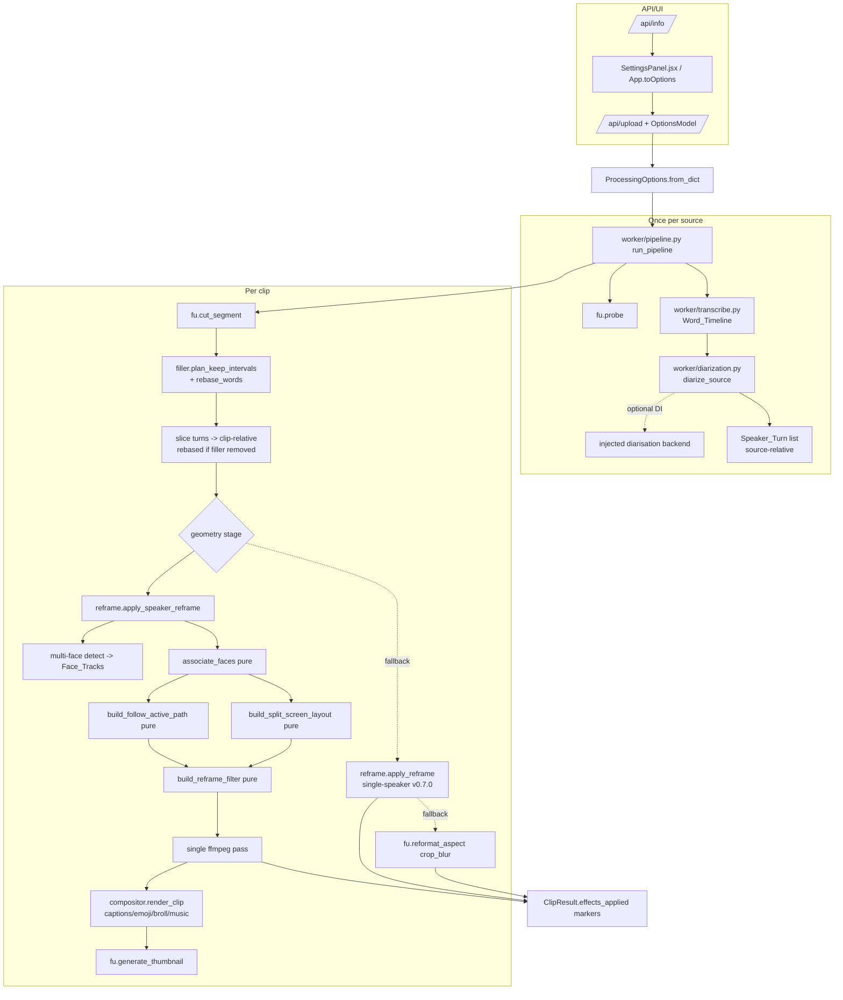

# Design Document — Speaker Diarisation & Multi-Speaker Reframe

## Overview

This design adds **speaker diarisation** and **speaker-aware reframe** to the
self-hosted AI Video Clipper (v0.7.0) **without disturbing its single-pass,
CPU-first architecture or its "all-off reproduces v0.7.0" contract**. It builds
directly on the existing geometry stage (`worker/effects/reframe.py` +
`worker/ffmpeg_utils.reformat_aspect`) and the shared `Word_Timeline`
(`worker.transcribe.Word`) that captions, emoji, and b-roll already consume.

Two cooperating capabilities are introduced:

- **Speaker diarisation** — a new `worker/diarization.py` module segments a
  source into ordered, non-overlapping **`Speaker_Turn`s**. The **primary signal
  is the offline Whisper `Word_Timeline`** (CPU-only, no GPU, no network). An
  optional **dependency-injected** diarisation backend can supply richer speaker
  assignments, but is never required; on its absence or failure the diariser
  degrades to word-timeline-only segmentation and records the degradation.
  Diarisation is computed **once per source**. _(Reqs 1–4, 15.1, 19, 20)_
- **Speaker-aware reframe** — `worker/effects/reframe.py` is extended with
  multi-face detection, `Face_Track` grouping, a pure **face↔speaker
  associator**, and two pure geometry builders: a **follow-active** crop-path
  builder and a **split-screen** region builder (default **2 regions**). The
  geometry stage in `worker/pipeline.py` chooses speaker-aware reframe when it
  applies, then falls back along a well-defined chain. All geometry is applied
  in the **existing single ffmpeg pass**. _(Reqs 5–14)_

Every constraint the product relies on is treated as a hard requirement:

- **Individually toggleable & default OFF** — new `ProcessingOptions` fields
  default off; an all-off run reproduces v0.7.0 output and `effects_applied`
  byte-for-byte. Enabling speaker-aware reframe **auto-enables the diarisation
  it needs internally** without flipping the persisted diarisation toggle.
  _(Reqs 16, 17)_
- **CPU-only, bounded, once-per-source** — diarisation runs once per source;
  frame sampling for face detection is capped; no GPU is required. _(Req 15)_
- **Graceful degradation is mandatory** — the pipeline never fails a clip
  because an enhancement is unavailable; it degrades
  speaker-aware → single-speaker → static reformat and records each step in
  `effects_applied`. _(Req 14)_
- **Single ffmpeg pass** — reframe replaces the geometry-stage crop and hands a
  geometry-prepared clip to the unchanged `Compositor`. _(Reqs 12, 13, 15.5)_
- **BYOK / offline / Permissibility** — any external backend is optional and
  DI'd; `Permissibility_Mode` forces local-only, offline operation. _(Reqs 4,
  19)_
- **Testability** — all core computation (segmentation, association, crop-path,
  split-screen geometry) is exposed as **pure functions** testable without
  ffmpeg, OpenCV, or a network; ffmpeg outputs are verified via ffprobe on tiny
  generated clips using the existing test helpers. _(Req 20)_

The guiding principle mirrors the tier-1 upgrade: **extend existing seams first,
add a focused new module only where the concern is genuinely new.** Diarisation
is genuinely new, so it becomes `worker/diarization.py`. Everything else extends
`reframe.py` (which already owns crop-path smoothing and the `sendcmd`+`crop`
single-pass mechanism) and hooks into `pipeline.py`'s existing geometry step.

## Architecture

### Component map



### Data flow (probe → transcribe → diarise once → per clip geometry)

```mermaid
sequenceDiagram
    participant P as pipeline.run_pipeline
    participant D as diarization.diarize_source
    participant R as reframe (speaker-aware)
    participant C as compositor.render_clip

    P->>P: info = probe(source)
    P->>P: transcript = transcribe(source)  (Word_Timeline)
    Note over P,D: diarisation is needed when reframe OR diarisation toggle is on
    P->>D: diarize_source(words, info.duration, backend=?, permissibility=?)  (ONCE)
    D-->>P: source_turns (ordered, non-overlapping) [+ degradation markers]
    loop per selected clip
        P->>P: cut_segment -> raw
        P->>P: words' = slice_words(clip); if filler: rebase_words(words', keeps)
        P->>P: clip_turns = slice_turns(source_turns, start, end)  (clip-relative, rebased)
        alt speaker-aware reframe applies (aspect narrower & turns present)
            P->>R: apply_speaker_reframe(raw, geo, clip_turns, options, detector, sampler)
            R-->>P: geo (or ReframeUnavailable -> fallback chain)
        else legacy reframe
            P->>P: apply_reframe(raw, geo)  (v0.7.0)  or reformat_aspect(crop_blur)
        end
        P->>C: render_clip(geo, options, words', ...)  (single pass, unchanged)
    end
```

Because `pipeline.py` already computes the **rebased** clip-relative
`Word_Timeline` before geometry/compositing, speaker-turn timing for a clip is
derived from that same rebased timeline — so removed (filler) intervals cannot
contain a turn boundary and all turn timing stays clip-relative and bounded
_(Reqs 13.4, 13.5)_.

### Single-pass integration model

The existing `apply_reframe` already emits a **single** ffmpeg pass using
`sendcmd=f='<script>' , crop=W:H:x:y , scale=tw:th , setsar=1`. Speaker-aware
reframe reuses this mechanism exactly:

- **follow_active** — emits the same `sendcmd`/`crop`/`scale` chain, but the
  crop-centre path is driven by the associated `Face_Track` per `Speaker_Turn`
  (with transitions on speaker change) instead of the single dominant face.
- **split_screen** — builds one `-filter_complex` graph (`crop` per region →
  `scale` → `vstack`/`hstack` → `setsar=1`) producing the composite at the
  target resolution in a single pass. No `sendcmd` is needed for the default
  static 2-up layout; transitions on shown-speaker change are expressed with
  `xfade`/`overlay` `enable=between(...)` within the same graph.

Either way the geometry stage still writes **one** geometry-prepared clip at the
target aspect/resolution, which the unchanged `Compositor` consumes _(Reqs 13.1,
13.2, 15.5)_.

### Precedence at the geometry stage

`pipeline.py`'s current `if options.reframe: apply_reframe else reformat_aspect`
block is replaced by an explicit precedence ladder _(Req 12)_:

```
speaker-aware reframe (if enabled AND aspect narrower AND turns present)
   └─ on ReframeUnavailable / FFmpegError ─▶ single-speaker reframe (v0.7.0)
                                                  └─ on failure ─▶ static crop_blur
single-speaker reframe (if legacy `reframe` on and speaker-aware off)
static crop_blur reformat (if neither on)
```

## Components and Interfaces

### New module: `worker/diarization.py`

#### `Speaker_Turn` data type — _Reqs 1.1, 3.1, 3.2, 3.3_

```python
# worker/diarization.py
from __future__ import annotations
from dataclasses import dataclass

@dataclass(frozen=True)
class Speaker_Turn:
    """A contiguous window attributed to one speaker (seconds)."""
    speaker_label: str          # stable id within the source, e.g. "S1"
    start: float
    end: float

    def to_dict(self) -> dict:  # Req 3.1 serialise
        return {"speaker_label": self.speaker_label,
                "start": self.start, "end": self.end}

    @classmethod
    def from_dict(cls, data: dict) -> "Speaker_Turn":
        return cls(str(data["speaker_label"]),
                   float(data["start"]), float(data["end"]))

def turns_to_dicts(turns: list[Speaker_Turn]) -> list[dict]: ...

def turns_from_dicts(data: list[dict]) -> list[Speaker_Turn]:
    """Round-trip parse; malformed records are skipped, valid ones kept
    (Req 3.3). Never raises on a bad element."""
```

#### Diarisation backend protocol (DI) — _Reqs 4.1, 20.1_

```python
from typing import Protocol

class DiarizationBackend(Protocol):
    """Optional external/model diariser. Injected for tests; never required."""
    def assign(self, words: list, duration: float) -> list[tuple[str, float, float]]:
        """Return raw (speaker_label, start, end) spans. May raise; the caller
        catches and degrades (Req 4.4)."""
```

#### Pure segmentation entry point — _Reqs 1–2, 4, 15.1, 19, 20.2_

```python
def segment_by_words(
    words: list,                 # clip-/source-relative Word objects
    duration: float,
    *,
    max_speakers: int = None,    # default: settings.diarization_max_speakers (2)
    pause_gap: float = None,     # default: settings.diarization_pause_gap
) -> list[Speaker_Turn]:
    """PURE offline segmentation from the Word_Timeline only (no backend,
    no ffmpeg, no network). Algorithm:
      1. Group words into speech runs split on silence gaps > pause_gap.
      2. Assign alternating/greedy speaker labels using a cheap heuristic
         (turn-taking on long gaps), capped at `max_speakers` distinct labels.
      3. Bound every turn within [0, duration] (Req 1.6), ensure start<=end
         (Req 1.5), order by start (Req 1.4), and merge adjacent same-label
         contiguous turns (Req 1.7).
      4. Empty words -> [] (Req 2.2). Single distinguishable speaker ->
         one turn spanning the spoken range (Req 2.3).
    Guarantees: ordered, non-overlapping [start,end) (Req 2.1), <= max_speakers
    distinct labels (Req 2.4), least-represented speakers merged when a naive
    pass would exceed the cap (Req 2.5)."""

def diarize_source(
    words: list,
    duration: float,
    *,
    backend: DiarizationBackend | None = None,
    max_speakers: int | None = None,
    permissibility: bool = False,
    notes: list[str] | None = None,   # degradation markers appended here
) -> list[Speaker_Turn]:
    """Produce Speaker_Turns for a whole source (called ONCE per source,
    Req 15.1).
      - permissibility=True OR backend is None -> pure segment_by_words
        (offline), recording `diarization:transcript` (Reqs 4.2, 19.1, 19.3).
      - backend present -> use backend.assign(...), align each span to
        Word_Timeline boundaries (Req 1.3), then normalise via the same
        ordering/bounding/merge/cap rules; record `diarization:model`.
      - backend raises -> fall back to segment_by_words and append
        `diarization_degraded` (Req 4.4).
    Never performs network access itself (Req 4.3)."""

def slice_turns(
    turns: list[Speaker_Turn], start: float, end: float,
) -> list[Speaker_Turn]:
    """Return source-turns clipped to [start,end] and rebased to clip-relative
    coordinates (0-based), bounded within [0, end-start]. Pure."""

def rebase_turns(
    turns: list[Speaker_Turn], keeps: list,  # filler Interval list
) -> list[Speaker_Turn]:
    """Remap clip-relative turns onto the tightened (post-filler) timeline,
    mirroring filler.rebase_words so turns stay aligned to the rebased words
    (Reqs 13.4, 13.5). Pure."""
```

### Extensions to `worker/effects/reframe.py`

#### Multi-face detection + `Face_Track` grouping — _Reqs 5, 20_

```python
@dataclass(frozen=True)
class FaceBox:
    t: float                     # sample time (s)
    x: int; y: int; w: int; h: int

@dataclass(frozen=True)
class Face_Track:
    track_id: str                # stable id, e.g. "F1"
    boxes: list[FaceBox]         # ordered by t
    def center_at(self, t: float) -> tuple[float, float] | None: ...
    def presence(self, start: float, end: float) -> float:
        """Fraction of [start,end] with a detected box (0..1). Pure."""

def detect_faces(
    video: str | Path, *,
    sample_fps: float = None,    # default settings.reframe_sample_fps
    max_samples: int = None,     # default settings.reframe_sample_cap (Req 15.2)
    detector=None,               # injected; default lazy-cv2 Haar (Req 5.3, 20.1)
) -> list[list[FaceBox]]:
    """Sample <= max_samples frames and return ALL face boxes per sampled
    frame (Req 5.1), not just the largest. Lazy vision import; on missing cv2
    or unopenable video returns [] and never raises (Reqs 5.3, 5.4, 15.3)."""

def build_face_tracks(
    per_frame: list[list[FaceBox]], *, iou_thresh: float = 0.3,
) -> list[Face_Track]:
    """PURE: group per-frame boxes into tracks by IoU/nearest-centroid
    continuity, each with a stable track_id (Req 5.2). No faces anywhere ->
    [] (Req 5.5). Testable without cv2."""
```

#### Face↔speaker associator (pure) — _Req 6, 20.3_

```python
@dataclass(frozen=True)
class Association:
    """Result of associating turns with tracks."""
    by_turn: dict[int, str | None]     # turn index -> track_id or None
    unassociated: list[int]            # turn indices with no track (Req 6.3)
    shown_order: list[str]             # track_ids by total speaking duration

def associate_faces(
    turns: list[Speaker_Turn],
    tracks: list[Face_Track],
) -> Association:
    """PURE association (Req 20.3):
      - assign at most one track per turn (Req 6.1), choosing the track with
        the highest presence() during the turn window (Req 6.2);
      - a turn with no overlapping track -> None + listed in `unassociated`
        (Req 6.3);
      - keep #distinct associated tracks <= #distinct speaker labels (Req 6.4);
      - turns sharing a speaker_label map to the same track where a consistent
        best track exists (Req 6.5)."""
```

#### Intensity mapping (pure) — _Req 10.2, 11.2_

```python
# Deterministic mapping intensity -> (ema_alpha, transition_seconds).
# Lower alpha = stronger smoothing = slower movement.
REFRAME_INTENSITY = {
    "subtle":   (0.15, 0.60),   # strongest smoothing, slowest, longest xfade
    "standard": (0.35, 0.35),
    "heavy":    (0.60, 0.18),   # weakest smoothing, fastest, shortest xfade
}

def intensity_params(intensity: str) -> tuple[float, float]:
    """Return (smoothing_alpha, transition_seconds); unknown -> 'standard'
    (Reqs 10.2, 11.2). Monotonic: subtle < standard < heavy in alpha and
    speed (Reqs 10.3, 10.4)."""
```

#### Follow-active crop-path builder (pure) — _Reqs 7.2, 8, 11, 20.4_

```python
def build_follow_active_path(
    turns: list[Speaker_Turn],
    assoc: Association,
    tracks: list[Face_Track],
    *,
    src_w: int, src_h: int, crop_w: int, crop_h: int,
    intensity: str = "standard",
    command_fps: float = 12.0,
    duration: float,
) -> list[Center]:
    """PURE: produce the dense crop-centre path (reusing the existing `Center`
    type, `ema_smooth`, `resample_centers`):
      - within a turn associated with a track, target that track's centre at
        each time (Req 8.1);
      - within an unassociated turn, hold the most recent valid centre
        (Req 8.4);
      - on a speaker change, interpolate the centre over the intensity-derived
        transition duration rather than jumping (Reqs 11.1, 11.2), ending no
        later than the next turn's stable window (Req 11.4);
      - smooth with the intensity alpha and CLAMP every centre so the crop
        window stays fully inside [0,src_w-crop_w]x[0,src_h-crop_h] throughout,
        including transitions (Reqs 8.2, 10.5, 11.3);
      - every emitted command time lies in [0, duration] (Req 8.5).
    Feeds the existing `build_sendcmd(...)`."""
```

#### Split-screen geometry builder (pure) — _Reqs 9, 20.4_

```python
@dataclass(frozen=True)
class Region:
    """A destination tile + the source crop feeding it."""
    dst_x: int; dst_y: int; dst_w: int; dst_h: int      # target-frame tile
    src_cx: float; src_cy: float                         # source crop centre
    track_id: str

def build_split_screen_layout(
    turns: list[Speaker_Turn],
    assoc: Association,
    tracks: list[Face_Track],
    *,
    target_w: int, target_h: int, src_w: int, src_h: int,
    max_regions: int = None,     # default settings.split_screen_max_regions (2)
) -> list[Region]:
    """PURE (Req 20.4). Default 2-up (stacked for vertical, side-by-side for
    landscape targets):
      - partition the target frame into non-overlapping tiles, one per shown
        speaker (Req 9.1), that EXACTLY cover the frame with no gap/overlap
        (Req 9.3);
      - centre each tile's source crop on its Face_Track (Req 9.2);
      - when #associated tracks > max_regions, show the tracks with the
        greatest total speaking duration up to max_regions (Req 9.4);
      - return [] when fewer than 2 tracks are associated so the caller falls
        back to follow_active (Req 9.5).
    (3-up / grid is a documented future extension; the default build is 2-up.)"""
```

#### ffmpeg geometry builder (pure) — _Reqs 8.3, 9.6, 13.2_

```python
def build_reframe_filter(
    layout: str,                 # "follow_active" | "split_screen"
    *,
    centers: list[Center] | None,        # follow_active
    regions: list[Region] | None,        # split_screen
    crop_w: int, crop_h: int, src_w: int, src_h: int,
    target_w: int, target_h: int,
    sendcmd_path: str | None = None,
    intensity: str = "standard",
) -> tuple[list[str], str, list[str]]:
    """PURE: return (input_args, filter_string_or_filtergraph, applied_notes)
    for a SINGLE ffmpeg pass (Reqs 8.3, 9.6, 13.2):
      - follow_active -> sendcmd + crop + scale + setsar (as v0.7.0);
      - split_screen  -> per-region crop -> scale -> vstack/hstack -> setsar,
        with xfade/overlay enable=between(...) for shown-speaker transitions
        (Req 11.5).
    Does not run ffmpeg; the caller assembles the command with settings.
    ffmpeg_binary and existing `_run` (Req 20.4/20.5)."""

def apply_speaker_reframe(
    video, dest, *,
    turns: list[Speaker_Turn],
    aspect: str = "9:16",
    layout: str = "follow_active",
    intensity: str = "standard",
    detector=None, sampler=None,          # DI (Req 20.1)
) -> Path:
    """Orchestrate: compute_crop_size (existing) -> detect_faces ->
    build_face_tracks -> associate_faces -> build path/regions ->
    build_reframe_filter -> single `_run`. Raises ReframeUnavailable to trigger
    the pipeline fallback chain when the aspect is not narrower (Req 12.5),
    no turns, no tracks, no usable geometry, or ffmpeg fails (Req 14)."""
```

### `pipeline.py` geometry-stage integration — _Reqs 12, 13, 14, 15, 16.5_

The diarisation call is added **once per source**, guarded so it runs only when
diarisation or speaker-aware reframe is enabled (Req 15.4); enabling reframe
auto-enables diarisation internally **without mutating** `options`
_(Req 16.5)_:

```python
need_diar = options.diarization or options.speaker_reframe
source_turns: list[Speaker_Turn] = []
if need_diar and transcript.words:
    diar_notes: list[str] = []
    source_turns = diarization.diarize_source(
        transcript.words, info.duration,
        backend=diar_backend,                 # None unless injected/configured
        max_speakers=settings.diarization_max_speakers,
        permissibility=options.permissibility_mode,
        notes=diar_notes,
    )
    run_diar_notes = diar_notes                # surfaced per clip below
```

The per-clip geometry block becomes the precedence ladder (replacing the current
`if options.reframe` block), consuming clip-relative + filler-rebased turns:

```python
clip_turns = diarization.slice_turns(source_turns, c.start, c.end)
if filler_changed:
    clip_turns = diarization.rebase_turns(clip_turns, plan.keeps)

used_layout = None
if options.speaker_reframe:
    try:
        reframe.apply_speaker_reframe(
            raw, geo, turns=clip_turns, aspect=options.aspect,
            layout=options.reframe_layout, intensity=options.reframe_intensity,
            detector=face_detector, sampler=frame_sampler,
        )
        used_layout = options.reframe_layout   # may be substituted internally
        applied.append(f"speaker_reframe:{used_layout}")
        applied.extend(run_diar_notes)         # diarization:* / *_degraded
    except (reframe.ReframeUnavailable, fu.FFmpegError):
        # fall back to single-speaker, then static (Reqs 14.1-14.4)
        applied.append("speaker_reframe_degraded")
        _legacy_geometry(...)                  # apply_reframe -> crop_blur
elif options.reframe:
    _legacy_geometry(...)                      # v0.7.0 (Req 12.2)
else:
    fu.reformat_aspect(raw, geo, aspect=options.aspect, mode="crop_blur")
```

### `ProcessingOptions` additions — _Reqs 7.1, 10.1, 16, 17_

Appended to `worker/models.py` `ProcessingOptions` (existing fields/defaults
unchanged, Req 17.1); all default OFF/standard so an all-off run is identical to
v0.7.0 _(Reqs 16.2, 16.3)_:

```python
# --- Speaker diarisation & multi-speaker reframe (default OFF) -----------
diarization: bool = False              # persistables diarisation toggle (Req 16.1)
speaker_reframe: bool = False          # speaker-aware reframe toggle (Req 16.1)
reframe_layout: str = "follow_active"  # follow_active | split_screen (Req 16.3)
reframe_intensity: str = "standard"    # subtle | standard | heavy (Req 16.3)

_REFRAME_LAYOUTS = ("follow_active", "split_screen")
_REFRAME_INTENSITIES = ("subtle", "standard", "heavy")
```

`from_dict` extends the bool-coercion list with `diarization`, `speaker_reframe`
and validates `reframe_layout`/`reframe_intensity` against their known sets,
applying the documented default (`follow_active` / `standard`) on unknown or
malformed values without raising _(Reqs 7.5, 17.3, 17.4, 18.5)_. Unknown keys
continue to be ignored by the existing dict-comprehension filter.

### `config.py` additions — _Reqs 2.4, 10.2, 15.1, 15.2_

```python
diarization_max_speakers: int = 2      # cap distinct speakers (Reqs 2.4, 2.5)
diarization_pause_gap: float = 0.9     # silence gap (s) that ends a turn
reframe_sample_fps: float = 5.0        # face-sampling rate (matches v0.7.0)
reframe_sample_cap: int = 120          # max sampled frames per clip (Req 15.2)
split_screen_max_regions: int = 2      # default 2-up (Reqs 9.4, 9.1)
```

### `/api/info`, `OptionsModel`, upload `Form`, frontend — _Reqs 7.4, 10.6, 18_

- **`/api/info`** — the `effects` block gains
  `"reframe_layouts": ["follow_active", "split_screen"]` and
  `"reframe_intensities": ["subtle", "standard", "heavy"]` (existing lists
  retained) _(Reqs 7.4, 10.6, 18.1, 17.5)_.
- **`OptionsModel` + `POST /api/upload` Form** — gain `diarization`,
  `speaker_reframe`, `reframe_layout`, `reframe_intensity` with identical
  defaults, threaded into the `from_dict` dict _(Req 18.2)_.
- **`App.jsx`** — `DEFAULT_SETTINGS` gains the four keys (OFF / `follow_active`
  / `standard`) and `toOptions` forwards them _(Req 18.3)_.
- **`SettingsPanel.jsx`** — the "Effects" block gains a **Speaker-aware
  reframe** toggle plus **Reframe layout** and **Reframe intensity** dropdowns
  (a **Diarisation** toggle sits alongside) _(Req 18.4)_. Profiles persist the
  opaque settings blob, so the new fields save/restore automatically.

## Data Models

| Model | Fields | Purpose |
|---|---|---|
| `Speaker_Turn` | `speaker_label:str, start:float, end:float` | Ordered, non-overlapping speaker attribution (source- then clip-relative). Serialisable via `to_dict`/`from_dict`. _(Reqs 1, 3)_ |
| `FaceBox` | `t, x, y, w, h` | One detected face in a sampled frame. |
| `Face_Track` | `track_id:str, boxes:list[FaceBox]` + `center_at`, `presence` | A face path across sampled frames with a stable id. _(Req 5.2)_ |
| `Association` | `by_turn:dict[int,str\|None], unassociated:list[int], shown_order:list[str]` | Turn→track mapping result. _(Req 6)_ |
| `Center` (existing) | `t, cx, cy` | Crop-centre keyframe; reused by the follow-active path. |
| `Region` | `dst_x/y/w/h, src_cx, src_cy, track_id` | One split-screen tile + its source crop. _(Req 9)_ |

**New `effects_applied` markers** (free-form strings on `ClipResult`):

| Marker | Meaning |
|---|---|
| `diarization:transcript` | turns from offline Word_Timeline segmentation _(Reqs 4.2, 19.3)_ |
| `diarization:model` | turns from an injected diarisation backend |
| `diarization_degraded` | backend errored → offline fallback _(Req 4.4)_ |
| `speaker_reframe:follow_active` | follow-active layout applied _(Req 14.5)_ |
| `speaker_reframe:split_screen` | split-screen layout applied _(Req 14.5)_ |
| `speaker_reframe_substituted` | requested layout substituted (unknown → follow_active, or split_screen → follow_active with <2 tracks) _(Reqs 7.5, 9.5)_ |
| `faces_none` | zero face tracks detected _(Req 14.2)_ |
| `speaker_reframe_degraded` | speaker-aware geometry unusable/failed → fell back _(Reqs 14.1–14.4)_ |
| `reframe` / static | existing v0.7.0 single-speaker / static-reformat markers |

## Correctness Properties

*A property is a characteristic or behaviour that should hold true across all
valid executions of a system — essentially, a formal statement about what the
system should do. Properties serve as the bridge between human-readable
specifications and machine-verifiable correctness guarantees.*

These properties were derived from the acceptance-criteria prework analysis.
Criteria classified as EXAMPLE, EDGE_CASE, INTEGRATION, or SMOKE are covered by
the unit / edge / integration tests in the Testing Strategy rather than by
universally-quantified properties. After the prework a **property reflection**
consolidated redundancy: the several bounds criteria (8.2, 8.5, 10.5, 11.3,
13.5, 20.6) collapse into one master bounds property (P13); the segmentation
structural criteria (1.1, 1.4, 1.5, 1.6) collapse into one well-formedness
property (P1); the cap criteria (2.4, 2.5) into P5; no-backend and backend-error
(4.2, 4.4) into P8; and the all-off / round-trip / unknown-value criteria into
P25–P26.

### Property 1: Speaker-turn structural well-formedness

*For any* Word_Timeline and source duration `D`, every produced `Speaker_Turn`
has `start <= end`, lies within `[0, D]`, and the returned list is ordered by
ascending `start`.

**Validates: Requirements 1.1, 1.4, 1.5, 1.6**

### Property 2: Speaker-turns are non-overlapping

*For any* Word_Timeline, the `[start, end)` intervals of any two distinct
produced `Speaker_Turn`s do not overlap.

**Validates: Requirements 2.1**

### Property 3: Adjacent same-label contiguous turns are merged

*For any* Word_Timeline, no two adjacent produced turns share the same
`speaker_label` while being contiguous (such pairs are always merged into one).

**Validates: Requirements 1.7**

### Property 4: Empty timeline yields zero turns without failure

*For any* source duration, an empty Word_Timeline produces zero `Speaker_Turn`s
and does not raise.

**Validates: Requirements 2.2**

### Property 5: Speaker cap is never exceeded

*For any* Word_Timeline and configured maximum `M`, the number of distinct
`speaker_label`s produced is at most `M`; when a naive segmentation would exceed
`M`, the least-represented speakers are merged into retained labels rather than
exceeding the cap.

**Validates: Requirements 2.4, 2.5**

### Property 6: Speaker-turn serialisation round-trip

*For any* list of `Speaker_Turn`s, parsing the serialised form
(`turns_from_dicts(turns_to_dicts(t))`) produces an equivalent list.

**Validates: Requirements 3.2**

### Property 7: Malformed turn records are discarded, valid ones retained

*For any* list of serialised turn records containing a mix of valid and
malformed elements, parsing keeps exactly the valid records and drops the
malformed ones without raising.

**Validates: Requirements 3.3**

### Property 8: Backend absence or failure degrades to offline segmentation

*For any* Word_Timeline, when no diarisation backend is injected the diariser
returns exactly the offline `segment_by_words` result; and when an injected
backend raises, the diariser returns the same offline result and records a
degradation marker.

**Validates: Requirements 4.2, 4.4**

### Property 9: Face boxes group into stable tracks

*For any* sequence of per-frame face-box sets, `build_face_tracks` returns
`Face_Track`s each with a stable `track_id`; and when no frame contains any
face box it returns zero tracks.

**Validates: Requirements 5.2, 5.5**

### Property 10: Association is single-valued and cardinality-bounded

*For any* set of `Speaker_Turn`s and `Face_Track`s, each turn is associated with
at most one track, the number of distinct associated tracks does not exceed the
number of distinct speaker labels, and turns sharing a `speaker_label` map to the
same track whenever a consistent best track exists.

**Validates: Requirements 6.1, 6.4, 6.5**

### Property 11: Association picks the most-present track; gaps are marked

*For any* set of `Speaker_Turn`s and `Face_Track`s, each associated turn's track
maximises `presence` over that turn's window, and any turn with no overlapping
track is left unassociated and recorded for degraded handling.

**Validates: Requirements 6.2, 6.3**

### Property 12: Follow-active crop tracks the active speaker and holds on gaps

*For any* turns, tracks, and association, at each time within a turn associated
with a track the (pre-smoothing) crop-centre target equals that track's centre,
and within an unassociated turn the crop-centre holds the most recent valid
centre.

**Validates: Requirements 8.1, 8.4**

### Property 13: Crop windows stay within frame bounds and times within the clip (master bounds)

*For any* Word_Timeline, `Face_Track` set, intensity, and clip duration `D`,
every emitted crop window — including during transitions — lies fully within the
source frame `[0, src_w-crop_w] x [0, src_h-crop_h]`, and every emitted command
time lies within `[0, D]`.

**Validates: Requirements 8.2, 8.5, 10.5, 11.3, 13.5, 20.6**

### Property 14: Intensity maps deterministically and monotonically

*For any* intensity value the mapping to `(smoothing_alpha, transition_seconds)`
is deterministic, the transition duration is derived from the intensity, and the
ordering subtle → standard → heavy yields monotonically weaker smoothing and
faster crop movement.

**Validates: Requirements 10.2, 10.3, 10.4, 11.2**

### Property 15: Speaker changes transition smoothly and end before the next stable window

*For any* consecutive turns with a speaker change in `follow_active`, the crop
centre is interpolated over the intensity-derived transition duration (never an
instantaneous jump) and the transition ends no later than the start of the next
turn's stable window.

**Validates: Requirements 11.1, 11.4**

### Property 16: Split-screen regions tile the target frame exactly

*For any* set of at least two associated tracks and any target aspect, the
`split_screen` builder produces non-overlapping regions whose union exactly
covers the full target frame with no uninitialised area, each region's source
crop centred on its track.

**Validates: Requirements 9.1, 9.2, 9.3**

### Property 17: Split-screen shows the most-talkative speakers within capacity

*For any* set of associated tracks exceeding the region capacity, the shown
speakers are exactly those with the greatest total speaking duration up to the
capacity.

**Validates: Requirements 9.4**

### Property 18: Too few tracks fall back to follow-active

*For any* clip with fewer than two associated tracks, the `split_screen` layout
falls back to `follow_active` and records a substitution marker.

**Validates: Requirements 9.5**

### Property 19: Unknown layout applies the follow-active default

*For any* unrecognised `reframe_layout` value, the `follow_active` default is
applied and a substitution is recorded.

**Validates: Requirements 7.5**

### Property 20: No geometry action when the target aspect is not narrower

*For any* source and target aspect that is not narrower than the source,
speaker-aware reframe takes no geometry action and leaves clip framing
unchanged.

**Validates: Requirements 12.5**

### Property 21: Filler rebasing keeps turns clip-relative and bounded

*For any* clip-relative Word_Timeline and filler keep-plan, `Speaker_Turn`s
rebased onto the tightened timeline are bounded within the final (post-filler)
clip duration and stay aligned to the rebased words.

**Validates: Requirements 13.4**

### Property 22: Diarisation runs at most once per source; disabled means no work

*For any* pipeline run, the diariser is invoked at most once per source video,
and when speaker-aware reframe (and diarisation) is disabled no diarisation and
no face-detection sampling occur.

**Validates: Requirements 15.1, 15.4**

### Property 23: Frame sampling is bounded

*For any* clip duration and configured sample cap, the number of frames sampled
for face detection does not exceed the cap.

**Validates: Requirements 15.2**

### Property 24: The degradation chain always produces geometry and records the right marker

*For any* combination of zero diarisation turns, zero face tracks, unusable
speaker-aware geometry, or an ffmpeg geometry failure, the pipeline falls back
along the chain (speaker-aware → single-speaker → static reformat) and records
the corresponding marker at each step; a successful speaker-aware run records a
marker identifying the applied layout.

**Validates: Requirements 14.1, 14.2, 14.3, 14.4, 14.5**

### Property 25: New option fields round-trip and unknown values apply defaults

*For any* options dict, serialising (`to_dict`) then parsing (`from_dict`)
preserves `diarization`, `speaker_reframe`, `reframe_layout`, and
`reframe_intensity` without loss; and *for any* malformed or unrecognised value
for `reframe_layout` or `reframe_intensity`, `from_dict` applies the documented
default without raising.

**Validates: Requirements 17.3, 17.4, 18.5**

### Property 26: All-off reproduces v0.7.0 behaviour

*For any* input, when `diarization` and `speaker_reframe` are both disabled the
pipeline's geometry decision, output, and `effects_applied` match pre-feature
v0.7.0 behaviour.

**Validates: Requirements 16.4, 17.2**

### Property 27: Reframe auto-enables diarisation without flipping the persisted toggle

*For any* options where `speaker_reframe` is enabled and `diarization` is
disabled, the pipeline computes the diarisation the reframe needs while the
persisted `diarization` option value remains unchanged.

**Validates: Requirements 16.5**

### Property 28: Permissibility forces offline, local, network-free diarisation

*For any* options with `permissibility_mode` enabled, diarisation uses only
offline Word_Timeline segmentation (any external backend is bypassed/degraded),
reframe uses only locally available vision dependencies, and no external
download or network call occurs.

**Validates: Requirements 19.1, 19.2, 19.3**

## Error Handling / Graceful Degradation

The pipeline never fails a clip because an enhancement is unavailable _(Req 14,
15)_. Degradations are surfaced via `effects_applied` markers. The full fallback
chain, with the exact marker recorded at each step:

| Condition / failure | Degraded behaviour | Marker recorded |
|---|---|---|
| No diarisation backend injected | Offline `segment_by_words` | `diarization:transcript` |
| Permissibility mode on | Offline segmentation only, no external backend/network _(Req 19)_ | `diarization:transcript` |
| Injected backend raises | Offline `segment_by_words` fallback _(Req 4.4)_ | `diarization_degraded` |
| Empty Word_Timeline | Zero turns; no failure _(Req 2.2)_ | — |
| Zero diarisation turns for a clip | Fall back to single-speaker reframe _(Req 14.1)_ | `speaker_reframe_degraded` |
| cv2 missing / video unopenable | `detect_faces` → `[]`, no raise _(Reqs 5.3, 5.4)_ | `faces_none` |
| Zero face tracks | Fall back to single-speaker reframe _(Req 14.2)_ | `faces_none`, `speaker_reframe_degraded` |
| split_screen with < 2 tracks | Fall back to `follow_active` for the clip _(Req 9.5)_ | `speaker_reframe_substituted` |
| Unknown `reframe_layout` value | Apply `follow_active` default _(Req 7.5)_ | `speaker_reframe_substituted` |
| Speaker-aware geometry unusable | Fall back to single-speaker reframe _(Req 14.3)_ | `speaker_reframe_degraded` |
| Single-speaker reframe also fails | Apply static `crop_blur` reformat _(Req 14.3)_ | `speaker_reframe_degraded` (+ static) |
| ffmpeg geometry command fails | Fall back along the chain, never fail the clip _(Req 14.4)_ | `speaker_reframe_degraded` |
| Target aspect not narrower than source | No geometry action; framing unchanged _(Req 12.5)_ | — |
| Speaker-aware reframe succeeds | — | `speaker_reframe:<layout>` _(Req 14.5)_ |

Diarisation is computed once per source; its degradation notes are attached to
each clip's `effects_applied` for provenance. The compositor's existing
"return `None` when nothing changed" contract is untouched, so an all-off clip
still incurs no extra ffmpeg pass _(Reqs 16.4, 17.2)_.

## Performance

Speaker-aware reframe is engineered to stay within the product's CPU-first,
bounded, once-per-source budget _(Req 15)_:

- **Diarisation is once per source** _(Req 15.1)_. `segment_by_words` is a pure,
  linear pass over the already-computed Whisper words — no audio re-decode, no
  model, no network. Cost is negligible relative to transcription.
- **Bounded frame sampling** _(Req 15.2)_. `detect_faces` samples at
  `reframe_sample_fps` (default 5 fps) capped at `reframe_sample_cap` (default
  120 frames) **per clip**. This is the same sampling discipline as the v0.7.0
  single-speaker reframe; multi-face detection adds only the cost of returning
  *all* boxes per already-decoded frame plus an O(frames × boxes) track-grouping
  pass — no extra frame decodes.
- **CPU-only, no GPU** _(Req 15.3)_. Detection uses the lazy OpenCV Haar cascade
  already in the codebase; no GPU path is introduced.
- **Single ffmpeg pass** _(Req 15.5)_. follow_active reuses the existing
  `sendcmd`+`crop`+`scale` pass verbatim; split_screen uses one
  `-filter_complex` (`crop`×N → `scale` → `vstack`/`hstack`). No extra passes
  beyond the geometry pass already run in v0.7.0.

**Expected render-time cost vs the single-speaker reframe** _(Req 15.6)_:

- **follow_active** — effectively **on par** with the v0.7.0 single-speaker
  reframe. The dominant cost (frame decode + Haar detection + one ffmpeg
  geometry pass) is unchanged; the only additions are cheap in-memory
  association and path building. Expect roughly **1.0–1.1×** the single-speaker
  reframe time.
- **split_screen** — a slightly heavier filtergraph (N crops + N scales + a
  stack) in the same single pass. Expect roughly **1.1–1.3×** the single-speaker
  reframe time, still one pass and still CPU-bound by the same frame count.
- **Diarisation disabled / reframe disabled** — **zero** added cost; no
  diarisation and no sampling occur _(Req 15.4)_, so an all-off run matches
  v0.7.0 exactly.

## Testing Strategy

The suite follows the project's established dual approach — **unit/example tests
for specific behaviours and edge cases**, **property-based tests for universal
properties**, and **tiny-clip ffmpeg integration tests** for composited output —
all runnable offline with mocked diariser, face detector, and sampler _(Req
20)_.

### Property-based tests

- **Library**: `hypothesis` (already used across the suite). Do not hand-roll
  generators; add strategies producing ordered, non-overlapping clip-relative
  `Word_Timeline`s (built from `FakeWord`) with a paired duration, plus
  strategies for synthetic `Speaker_Turn` lists and `Face_Track`/`FaceBox` sets.
- **Configuration**: minimum **100 iterations** per property test
  (`@settings(max_examples=100)`).
- **Tagging**: each property test carries a comment referencing its design
  property, format:
  `# Feature: speaker-diarization-reframe, Property N: <property text>`.
- **One property → one property test.** Coverage mapping:
  - Diarisation: **P1, P2, P3, P4, P5, P8** → `tests/test_diarization.py`
    _(Reqs 1.1, 1.4–1.7, 2.1, 2.2, 2.4, 2.5, 4.2, 4.4)_
  - Serialisation: **P6, P7** → `tests/test_diarization.py`
    _(Reqs 3.2, 3.3)_
  - Association + tracks: **P9, P10, P11** → `tests/test_speaker_reframe.py`
    _(Reqs 5.2, 5.5, 6.1–6.5)_
  - Geometry (crop-path, split-screen, intensity, bounds): **P12, P13, P14,
    P15, P16, P17, P18, P19, P20, P21** → `tests/test_reframe_geometry.py`
    _(Reqs 7.5, 8.1, 8.2, 8.4, 8.5, 9.1–9.5, 10.2–10.5, 11.1–11.4, 12.5, 13.4,
    13.5, 20.6)_
  - Pipeline degradation + perf: **P22, P23, P24, P26, P27, P28** →
    `tests/test_pipeline_degradation.py`
    _(Reqs 14.1–14.5, 15.1, 15.2, 15.4, 16.4, 16.5, 17.2, 19.1–19.3)_
  - Options round-trip: **P25** → `tests/test_options_roundtrip.py`
    _(Reqs 17.3, 17.4, 18.5)_

### Unit / example tests (pure functions, no ffmpeg) — _Req 20.2, 20.3, 20.4_

- Diarisation: `diarize_source` uses an injected backend and aligns spans to
  word boundaries _(Reqs 1.3, 4.1)_; single-speaker input → one turn _(Req
  2.3)_; `diarization:model` vs `diarization:transcript` marker selection.
- Association: DI'd detector/associator wiring _(Req 20.1)_; a turn with no
  overlapping track marked unassociated _(Req 6.3)_.
- Geometry: `follow_active` produces a valid `sendcmd`+`crop`+`scale` filter;
  `split_screen` 2-up tile arithmetic for a vertical target; `split_screen`
  shown-speaker transition uses the intensity duration _(Req 11.5)_.
- Precedence dispatch: speaker-aware chosen when enabled + narrower _(Req 12.1)_;
  legacy reframe when speaker-aware off + reframe on _(Req 12.2)_; static when
  both off _(Req 12.4)_.
- Options/API: defaults OFF/`follow_active`/`standard` _(Reqs 16.2, 16.3)_;
  independent toggles _(Req 16.1)_; `/api/info` advertises the new lists and
  keeps existing ones _(Reqs 7.4, 10.6, 17.5, 18.1)_; `OptionsModel`/Form accept
  the new fields _(Req 18.2)_.
- Edge cases: empty timeline, empty box sets, `< 2` tracks, unknown layout.

### ffmpeg integration tests (tiny clips) — _Req 20.5_

Using existing helpers `make_video`, `requires_ffmpeg`, `probe_size`,
`probe_duration`, `FakeWord`, with a **mocked face detector/sampler** returning
canned boxes (no cv2 needed):

- Render a 2–3s clip with `follow_active`; assert output exists and `probe_size`
  equals the target aspect resolution _(Reqs 8.3, 13.1)_.
- Render with `split_screen` (two canned tracks); assert `probe_size` equals the
  target and **spy on `_run` to assert a single ffmpeg invocation** _(Reqs 9.6,
  13.2, 15.5)_.
- Assert the geometry-prepared clip flows into `compositor.render_clip` with
  captions/emoji enabled and no additional geometry pass _(Req 13.3)_.
- Degradation: mock detector returning `[]` → clip still produced via
  single-speaker/static fallback, `faces_none`/`speaker_reframe_degraded`
  recorded _(Reqs 14.2, 14.6)_; forced `FFmpegError` on the speaker-aware pass →
  fallback still yields a clip _(Req 14.4)_.
- Permissibility: with `permissibility_mode` on and a spy backend/downloader,
  assert no backend/network call and a reframed clip is still produced _(Reqs
  19.1, 19.4)_.

### Test doubles — _Req 20.1_

- `FakeDiarizationBackend` (returns canned spans; a variant that raises, for
  P8/degradation).
- `FakeFaceDetector` / injected `sampler` returning canned per-frame boxes (and
  one that returns `[]`, and one that raises).
- Spies on `diarize_source` (call-count for P22), the frame sampler (cap for
  P23), and `ffmpeg_utils._run` (single-invocation assertions).

## Design Decisions & Rationale

- **Transcript-first diarisation, backend optional (DI)** — the primary signal
  is the offline Whisper `Word_Timeline`; an external/model diariser is injected
  and never required. This keeps the tool CPU-only, offline, and BYOK-friendly,
  and makes the whole subsystem unit-testable without audio models. *Rejected:*
  a mandatory `pyannote`/GPU diarisation pipeline — it would violate the
  CPU-first, offline, and no-mandatory-dependency constraints _(Reqs 4, 15, 19)_.
- **Max speakers default 2, merge least-represented beyond the cap** — matches
  the dominant interview/podcast use case and bounds association/geometry
  complexity. Configurable via `config.py` + option _(Reqs 2.4, 2.5)_.
- **split_screen caps at 2 regions (2-up) by default** — shows the two
  most-talkative speakers; `< 2` associated tracks falls back to `follow_active`
  and records the substitution. 3-up/grid is noted as a **future extension**,
  not the default build. *Rejected:* a 3+-up grid default — unnecessary
  complexity for the primary use case and harder to keep legible at 9:16 _(Reqs
  9.1, 9.4, 9.5)_.
- **Every capability defaults OFF; enabling reframe auto-enables diarisation
  internally** — preserves the byte-for-byte v0.7.0 reproduction guarantee while
  keeping the persisted diarisation toggle honest (reframe's internal need does
  not flip it) _(Reqs 16, 17)_.
- **Single ffmpeg pass at the geometry stage, reusing the existing
  `sendcmd`+`crop` mechanism** — no extra passes; the compositor stays unchanged.
  *Rejected:* a multi-pass render (e.g. per-speaker crops then a compositing
  pass) — it would double encode time and break the single-pass contract _(Reqs
  13, 15.5)_.
- **Precedence: speaker-aware → single-speaker → static reformat** — an explicit,
  testable ladder that guarantees a clip is always produced and each degradation
  is recorded _(Reqs 12, 14)_.
- **All core computation as pure functions** — segmentation, association,
  crop-path, and split-screen geometry take plain data and return plain data,
  with ffmpeg/OpenCV/network isolated behind DI seams. This is what makes the
  property-based suite possible and keeps it fast, deterministic, and CPU-only
  _(Req 20)_.
- **Honour Permissibility and filler-removal rebasing** — permissibility forces
  offline segmentation and local vision (enforced where the backend is
  selected); turns are sliced clip-relative and rebased through the same
  `filler.rebase_words` timeline transform so geometry never references removed
  intervals _(Reqs 13.4, 19)_.

## Requirements Coverage

| Requirement | Satisfied by |
|---|---|
| 1 — Speaker-turn segmentation | `segment_by_words`/`diarize_source` ordering/bounds/merge; P1, P3 |
| 2 — Coverage & non-overlap & cap | non-overlap + cap logic; P2, P4, P5 |
| 3 — Serialisation round-trip | `to_dict`/`from_dict`, `turns_from_dicts` skip-malformed; P6, P7 |
| 4 — Injection & offline | `DiarizationBackend` DI, offline fallback + marker; P8 + example |
| 5 — Multi-face detection | `detect_faces` (all boxes, lazy cv2) + `build_face_tracks`; P9 + integration |
| 6 — Face↔speaker association | `associate_faces` pure; P10, P11 |
| 7 — Layout selection | `reframe_layout` option + `/api/info`; unknown→default; P19 + examples |
| 8 — Follow-active crop | `build_follow_active_path`; P12, P13 |
| 9 — Split-screen layout | `build_split_screen_layout` (2-up, tiling, capacity, fallback); P16, P17, P18 |
| 10 — Smoothing & intensity | `intensity_params` deterministic/monotonic; P14, P13 |
| 11 — Smooth transitions | path/region transitions; P15, P13 |
| 12 — Precedence | pipeline precedence ladder; P20 + dispatch examples |
| 13 — Single-pass interop | geometry-prepared clip → unchanged compositor; P21, P13 + integration |
| 14 — Degradation chain | fallback ladder + markers; P24 + integration |
| 15 — Bounded / once-per-source | once-per-source diarise, capped sampling, single pass; P22, P23 + Performance section (15.6) |
| 16 — Toggleability & defaults | new OFF-by-default options; auto-enable without flip; P26, P27 |
| 17 — Back-compat & round-trip | additive fields, unknown-value tolerance, `/api/info` superset; P25, P26 |
| 18 — API & UI surface | `/api/info`, `OptionsModel`/Form, `App.jsx`, `SettingsPanel.jsx`; P25 + examples |
| 19 — Permissibility | offline/local-only enforcement; P28 + integration |
| 20 — Testability | pure functions + DI seams + tiny-clip ffprobe; P1–P28, all tests |

---

**Please review this design.** In particular, confirm:
1. The **transcript-first diarisation** with an optional injected backend (no
   mandatory `pyannote`/GPU) and the **max-2-speakers** default match your
   intent.
2. The **split_screen 2-up default** (with `< 2` tracks → `follow_active`
   fallback, 3-up/grid deferred as a future extension) is acceptable.
3. The **single-pass geometry** approach (follow_active via the existing
   `sendcmd`+`crop`; split_screen via one `crop`×N → `scale` → stack graph) and
   the **precedence ladder** (speaker-aware → single-speaker → static) are the
   right structure.

Once you approve the design, I will proceed to create `tasks.md` (the
implementation plan). I will not write tasks or change any code until you
approve.
