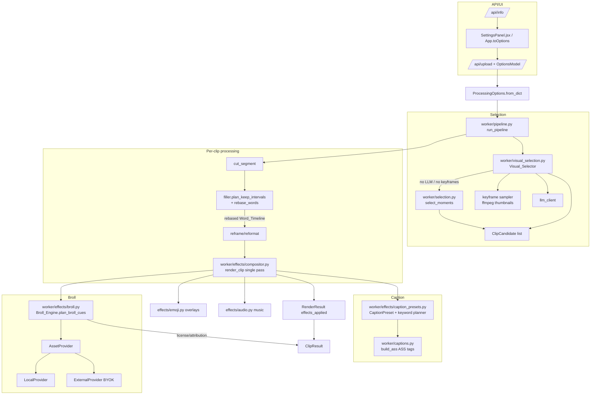
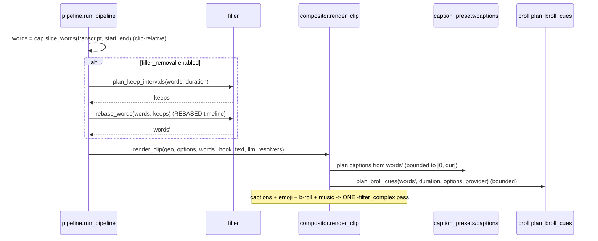

# Design Document — Tier 1 Creator Output Upgrade

## Overview

This design adds three editorially-powerful capabilities to the existing
self-hosted AI Video Clipper (v0.6.0) **without breaking its core architecture**:

- **Feature A — Animated captions**: extend `worker/captions.py` so caption
  looks are driven by a serializable `CaptionPreset` (animation style, font,
  colours, position, keyword-highlight rules, in-caption emoji policy) that
  emits **libass ASS tags only** (no `drawtext`). _(Reqs 1–6)_
- **Feature B — B-roll / image & clip overlay auto-insertion**: a new
  `worker/effects/broll.py` `Broll_Engine` plans `Broll_Cue`s from the
  (filler-rebased) `Word_Timeline`, resolves assets through pluggable
  `AssetProvider`s (local + external/BYOK), and the existing single-pass
  `Compositor` composits them alongside captions/emoji/music. _(Reqs 7–12)_
- **Feature C — Prompt / visual clip finding**: a new
  `worker/visual_selection.py` `Visual_Selector` samples bounded keyframes,
  derives cheap visual cues, optionally consults the LLM with a
  `Selection_Prompt`, merges visual + transcript scores, and returns the
  existing `ClipCandidate` shape — falling back to `worker/selection.py`
  when no LLM/keyframes are available. _(Reqs 13–15)_

The design honours every cross-cutting constraint the product already relies on
_(Reqs 16–22)_:

- **Individual toggleability & safe defaults** — each capability has its own
  `ProcessingOptions` field; b-roll, external downloads, and any added audio
  default OFF.
- **Single-pass CPU efficiency** — animated captions, in-caption emoji, and
  b-roll overlays all resolve into the *one* `-filter_complex` pass the
  `Compositor` already builds; unmodified streams are stream-copied; an
  all-off clip still returns `None` (no extra pass).
- **Graceful degradation** — every feature no-ops cleanly when an LLM/key/asset/
  font/keyframe/ffmpeg feature is missing, recording the degradation in
  `effects_applied` / job status.
- **BYOK + Permissibility** — external providers require an operator-supplied
  key; `Permissibility_Mode` forces `local_only` sourcing and disables all
  added audio.
- **Testability** — all planning/generation logic is pure and dependency-
  injected (mock LLM, mock `AssetProvider`, injected keyframe sampler), with
  ffprobe integration on tiny clips via the existing test helpers.

The guiding principle is **extend existing seams first, add focused new modules
only where concerns are genuinely new**. `CaptionPreset` extends `captions.py`;
b-roll compositing extends `compositor.py` exactly like emoji overlays already
do; visual selection wraps `selection.py` rather than replacing it.

## Architecture

### Component map



### Data flow of the Word_Timeline

The clip-relative `Word_Timeline` is the shared spine for captions and b-roll.
The ordering in `pipeline.py` already guarantees the correct timeline reaches
the compositor:



Because `pipeline.py` calls `filler.rebase_words` **before** `compositor.render_clip`,
both the caption planner and `Broll_Engine` automatically receive the rebased
timeline. This satisfies Feature B's post-filler synchronisation requirement
_(Req 11)_ with no extra plumbing: b-roll planning simply consumes the same
`words` list captions already use, so removed intervals cannot contain a cue.

### Single-pass integration model

The `Compositor` today builds one ffmpeg command:

```
inputs: [0]=base clip, [1]=music?, [2..]=emoji PNGs
filter_complex: [0:v] look-chain (color→zoom→fades→subtitles→progress) [vbase]
                emoji overlays -> [vout]
                audio: original (+ optional music mix / fades) -> [aout]
```

B-roll slots in as **additional overlay inputs and overlay filters in the same
graph**, mirroring the emoji mechanism exactly. Input indexing becomes:

```
[0]=base, [1]=music? , [broll inputs...] , [emoji inputs...]
```

Layer order (bottom → top): look chain → **b-roll overlays** → captions
(subtitles) → emoji → progress bar. B-roll sits **below captions** so text stays
legible _(Req 10.2)_. Each overlay is time-bounded with
`enable='between(t,a,b)'` _(Req 10.4)_.

## Components and Interfaces

### Feature A — Animated Captions

New module `worker/effects/caption_presets.py` holds the declarative preset
model and the (pure) keyword-highlight planner. `worker/captions.py` is extended
to consume a `CaptionPreset` and emit per-word ASS animation tags.

#### `CaptionPreset` (serializable definition) — _Reqs 1, 2, 5, 6_

```python
# worker/effects/caption_presets.py
from dataclasses import dataclass, field, asdict

AnimationStyle = str  # "none" | "pop" | "typewriter" | "karaoke_fill"

@dataclass(frozen=True)
class CaptionColors:
    primary: str   = "&H00FFFFFF"   # ASS &HAABBGGRR
    highlight: str = "&H0000E5FF"   # keyword highlight colour
    outline: str   = "&H00000000"
    box: str       = "&H80000000"

@dataclass(frozen=True)
class CaptionPreset:
    name: str                              # unique key advertised by /api/info
    animation: AnimationStyle = "none"     # per-word animation style (Req 2.2)
    font: str = "Arial"                    # default font (Req 5.1)
    font_size: int = 84
    colors: CaptionColors = field(default_factory=CaptionColors)
    position: str = "bottom"               # bottom|center|top default (Req 5.1)
    highlight_keywords: bool = False       # enable keyword emphasis (Req 3.1)
    highlight_scale: float = 1.18          # scale applied to highlighted words
    emoji_inline: bool = False             # in-caption emoji policy (Req 4.1)
    border_style: int = 1                  # 1=outline, 3=opaque box (boxed look)

    def to_dict(self) -> dict: ...         # Req 6.1 serialize
    @classmethod
    def from_dict(cls, data: dict) -> "CaptionPreset": ...   # Req 6.2 round-trip

# Built-in registry. The three existing static templates are expressed as
# presets with animation styles matching current behaviour (Req 1.1).
BUILTIN_PRESETS: dict[str, CaptionPreset] = {
    "karaoke": CaptionPreset("karaoke", animation="karaoke_fill", border_style=1),
    "boxed":   CaptionPreset("boxed",   animation="none", border_style=3),
    "minimal": CaptionPreset("minimal", animation="none", font_size=76),
    # New animated presets (Req 1.2):
    "pop":       CaptionPreset("pop", animation="pop", highlight_keywords=True),
    "typewriter":CaptionPreset("typewriter", animation="typewriter"),
    "hormozi":   CaptionPreset("hormozi", animation="pop", highlight_keywords=True,
                               emoji_inline=True, font_size=96, position="center"),
}

def resolve_preset(name: str) -> tuple[CaptionPreset, bool]:
    """Return (preset, substituted). Unknown -> (karaoke, True) (Req 1.5, 6.4)."""

def load_preset(data: dict | str) -> tuple[CaptionPreset, bool]:
    """Parse a name or serialized dict; malformed -> karaoke fallback (Req 6.4)."""
```

#### Keyword-highlight planner (pure, DI) — _Req 3_

```python
# worker/effects/caption_presets.py
DEFAULT_STOPWORDS: frozenset[str] = frozenset({...})  # articles, prepositions...

def plan_keywords(
    words: list,                 # clip-relative Word objects
    *,
    use_ai: bool = False,
    client=None,                 # injected LLM client (Req 21.1)
) -> set[int]:
    """Return the set of word indices to highlight.

    Deterministic rule set (Req 3.2): non-stopword tokens above a length
    threshold, ALL-CAPS tokens, numerals/currency, and tokens with high
    Whisper `probability`. When `use_ai` and `client` is available, merge the
    LLM's chosen words with the deterministic set (Req 3.3); if the LLM is
    unavailable or fails, return the deterministic set only (Req 3.4).
    When the preset disables highlighting the caller skips this entirely
    (Req 3.6) — no LLM call is made.
    """
```

#### ASS generation extension — _Reqs 2, 3, 4, 5_

`build_ass` gains a `preset: CaptionPreset | None` parameter and a
`keyword_indices` argument; `_caption_style` is extended to take colours/border
from the preset. The **concrete ASS tag strategy** (libass only, Req 2.3):

- **`pop` / `scale`** — per word, wrap the token in an animated transform:
  `{\fscx60\fscy60\t(0,120,\fscx100\fscy100)}word` timed to the word's cue,
  using `\t(t1,t2,...)` for the scale ramp. The word's dialogue event `Start`
  is set to its `start` time so the pop fires as it is spoken _(Req 2.1)_.
- **`typewriter`** — reveal words progressively using per-word
  `{\alpha&HFF&\t(reveal,reveal+30,\alpha&H00&)}` so each word fades from fully
  transparent to opaque at its `start`, or by emitting one dialogue line per
  cumulative word prefix. Chosen approach: per-word alpha reveal within a single
  cue event to keep event count bounded.
- **`karaoke_fill`** — the existing `{\kfNN}` sweep (unchanged behaviour for the
  `karaoke` preset, Req 1.1).
- **Keyword highlight** — highlighted word indices get an inline colour+scale
  span: `{\c&Hhighlight&\fscx118\fscy118}word{\c&Hprimary&\fscx100\fscy100}`
  _(Req 3.1)_. Highlight spans wrap the animation span so both compose.
- **In-caption emoji** — when `preset.emoji_inline`, the planner inserts an
  emoji glyph into the cue *text* adjacent to its keyword _(Req 4.1)_, kept
  independent of the overlay emoji effect _(Req 4.2)_. Under `Permissibility_Mode`
  only locally-available glyphs are used _(Req 4.4)_; a glyph the active font
  cannot render is dropped while surrounding words are retained _(Req 4.3)_.

All per-word timing is clamped to `[0, end-start]` _(Req 2.5)_; an empty
`Word_Timeline` yields zero dialogue events and never raises _(Req 2.4)_. Font
availability is checked via a helper `font_available(name)`; when missing the
preset renders with a fallback font and a `font_substituted:<name>` note is added
to `effects_applied` for the UI _(Req 5.3)_. Every preset+position combination
produces a libass-parseable ASS file _(Reqs 5.4, 1.3)_.

New pure helper signatures in `worker/captions.py`:

```python
def build_word_span(word, preset: CaptionPreset, highlighted: bool) -> str:
    """Return the ASS-tagged text span for one word (pure, testable)."""

def build_ass(
    cues, dest, *,
    video_width=1080, video_height=1920,
    preset: CaptionPreset | None = None,     # NEW
    keyword_indices: set[int] | None = None, # NEW
    position: str | None = None,             # override (Req 5.2)
    hook_text="", ...
) -> Path: ...
```

### Feature B — B-roll / Overlay Auto-Insertion

New module `worker/effects/broll.py`.

#### Data types — _Reqs 7, 12_

```python
# worker/effects/broll.py
from dataclasses import dataclass

@dataclass(frozen=True)
class AssetRef:
    path: str                    # local file path used for compositing
    kind: str                    # "image" | "video"
    provider: str                # "local" | external provider name
    source_id: str = ""          # provider asset id (Req 12.1)
    license: str = ""            # license string; "" => unknown (Req 20.3)
    attribution: str = ""        # required attribution text (Req 12.3)

@dataclass(frozen=True)
class BrollCue:
    start: float                 # clip-relative window (Req 7.2)
    end: float
    keyword: str                 # source phrase/keyword (Req 7.1)
    asset: AssetRef | None = None  # resolved later; None until asset found
```

#### Cue planning (pure) — _Reqs 7, 11, 21.3_

```python
BROLL_INTENSITY = {  # Req 7.4: cap count + total on-screen seconds
    "off":      (0,  0.0),
    "subtle":   (2,  6.0),
    "standard": (4, 12.0),
    "heavy":    (7, 20.0),
}

def plan_broll_cues(
    words: list,                 # REBASED clip-relative timeline (Req 11.1)
    duration: float,
    *,
    intensity: str = "off",
    hold: float = 2.5,
    min_gap: float = 3.0,
    keyword_fn=None,             # injected keyword selector (default: noun-ish)
) -> list[BrollCue]:
    """Select key phrases and emit at most N cues, each bounded to
    [0, duration] (Reqs 7.3, 11.3) and spaced by `min_gap`. Total on-screen
    time is capped by intensity (Req 7.4). Disabled/"off" -> [] (Req 7.5).
    Because `words` is already the post-filler timeline, no cue lands in a
    removed interval (Req 11.2)."""
```

#### Asset providers (interface + implementations, DI) — _Reqs 8, 12, 20, 21.1_

```python
class AssetProvider(Protocol):
    name: str
    def search(self, keyword: str) -> AssetRef | None: ...

class LocalProvider:
    """Resolves from settings.broll_dir; assets are operator-supplied
    (source path recorded, Req 12.2). No network (Req 8.2)."""
    def __init__(self, root: Path): ...

class ExternalProvider:
    """Provider-agnostic stock adapter (example: an Openverse/Pexels-style
    free-stock API). Requires a BYOK key + base URL. Downloads to a cache dir,
    records provider/source_id/license/attribution (Req 12.1). Injectable
    `downloader` for tests (Req 21.1). If license is unknown it returns an
    AssetRef with license='' and the engine drops it (Req 20.3)."""
    def __init__(self, api_key: str, base_url: str, downloader=None): ...

def resolve_asset(
    keyword: str, mode: str,
    local: LocalProvider | None,
    external: ExternalProvider | None,
) -> AssetRef | None:
    """Sourcing semantics (Req 8):
      off               -> None (Req 8.5)
      local_only        -> local.search only, no download (Req 8.2)
      local_then_external -> local first, external only on miss AND key present
                             (Req 8.3); no key => behaves as local_only (Req 8.4).
    Assets with unknown license are rejected (Req 20.3)."""
```

#### Engine orchestration — _Reqs 8, 9, 12_

```python
class Broll_Engine:
    def __init__(self, options, *, local=None, external=None): ...

    def plan(self, words, duration) -> list[BrollCue]:
        """plan_broll_cues + effective mode resolution. Permissibility_Mode
        forces local_only (Req 8.6/19.1); missing external key downgrades to
        local_only (Req 8.4); off disables all sourcing (Req 8.5)."""

    def resolve(self, cues) -> list[BrollCue]:
        """Attach assets; drop cues with no asset (Req 9.1), failed
        download/decode (Req 9.2), or unknown license (Req 20.3). Returns only
        resolvable cues (may be empty)."""
```

#### Compositor integration — _Req 10, 17_

`compositor.render_clip` gains a `broll_resolver=None` DI hook and builds b-roll
inputs/overlays into the same graph. A new pure builder in `broll.py`:

```python
def build_broll_overlay(
    cues: list[BrollCue],        # already resolved (asset != None)
    base_label: str, out_label: str,
    *, width: int, height: int, fps: float,
    input_offset: int,           # first free ffmpeg input index (Req 10.3)
) -> tuple[list[str], str, list[str]]:
    """Return (input_args, filtergraph, applied_notes).

    Image assets: `-loop 1 -t <dur> -i asset` (like emoji, Req 10).
    Video assets: `-i asset` (its own PTS), trimmed/scaled to the window.
    Each overlay scaled to ~0.5 frame width, placed upper/centre, layered
    below captions. Bound with enable='between(t,start,end)' (Req 10.4);
    zero-length windows get a 1-frame minimum (Req 10.5). Input indices are
    assigned from input_offset without collision with music/emoji (Req 10.3).
    Returns ([],"",[]) when there are no resolvable cues so the caller renders
    b-roll-disabled (Reqs 9.3, 10.6)."""
```

Input-index ownership in the assembled command becomes explicit:

```
idx 0  : base clip
idx 1  : music (if any)
idx 1/2.. : b-roll inputs        (broll_offset)
idx ..    : emoji inputs         (emoji_offset = broll_offset + len(broll_inputs))
```

If the b-roll filtergraph cannot be constructed, the compositor catches it and
renders without b-roll rather than failing the clip _(Req 10.6, 9.3)_. Only
cues actually composited are appended to `effects_applied` as
`broll:<keyword>` and their `AssetRef` license/attribution is surfaced on
`ClipResult` _(Reqs 9.4, 12.1)_.

### Feature C — Prompt / Visual Clip Finding

New module `worker/visual_selection.py`.

```python
# worker/visual_selection.py
@dataclass(frozen=True)
class Keyframe:
    t: float                     # timestamp (s)
    path: str                    # sampled JPEG
    brightness: float = 0.0      # cheap visual cue
    motion: float = 0.0          # frame-difference proxy vs previous keyframe

def sample_keyframes(
    source, total_duration, *,
    limit: int,                  # cap per source (Reqs 15.1, 17.4)
    sampler=None,                # injected for tests (Req 21.1)
) -> list[Keyframe]:
    """Sample <= `limit` evenly-spaced keyframes ONCE per source
    (Req 17.4) using fu.generate_thumbnail. Raises are caught by the caller
    (Req 15.2)."""

def derive_visual_cues(frames: list[Keyframe]) -> list[Keyframe]:
    """Compute brightness/motion proxies (cheap, CPU-only, no vision model)."""

def merge_scores(
    transcript_candidates: list[ClipCandidate],
    visual_frames: list[Keyframe],
    *, weight: float = 0.5,
) -> list[ClipCandidate]:
    """Combine transcript scores with visual-cue scores into one ranking
    (Req 14.2). Windows keep ClipCandidate shape (Req 14.4)."""

def select_moments_visual(
    transcript, options, source_path, total_duration,
    *, client=None, sampler=None,
) -> list[ClipCandidate]:
    """Feature C entry point.
      - visual_selection off -> delegate to sel.select_moments (Req 15.4).
      - Selection_Prompt + LLM available -> bias selection toward the prompt
        (Req 13.2), optionally sending prompt + frame descriptors or
        prompt + transcript to the LLM.
      - No LLM but prompt given -> deterministic fallback (Req 13.3).
      - keyframe sampling fails / provider missing -> transcript-only
        (Reqs 15.2, 15.3).
      - no audio -> rank on visual cues, still use any embedded transcript
        text (Req 14.3).
      - snap each candidate to sentence boundaries via sel.snap_to_sentences
        (Req 14.5); honour topic/vibe/clip_length/num_clips/range (Req 13.4).
      - catastrophic failure -> report + may return [] (Req 15.5)."""
```

`pipeline.run_pipeline` swaps its `sel.select_moments(...)` call for
`visual_selection.select_moments_visual(...)`, which internally delegates back
to `sel.select_moments` whenever visual selection is disabled or degraded, so
downstream stages are unchanged _(Reqs 14.4, 15.4)_.

## Data Models

### `ProcessingOptions` additions — _Reqs 16, 22_

New fields appended to `worker/models.py` `ProcessingOptions` (existing fields
and defaults unchanged, Req 22.1). All new visual/audio/rights features default
OFF _(Req 16.2)_:

```python
# Feature A — animated captions
caption_preset: str = "karaoke"        # preset name (supersedes caption_template
                                        # look; caption_template retained, Req 22.1)
caption_animation: str = ""            # "" = use preset default; else override
caption_keyword_highlight: bool = False
caption_keyword_ai: bool = False       # AI-assisted highlight (Req 3.3)
caption_emoji: bool = False            # in-caption emoji (Req 4)

# Feature B — b-roll overlays (OFF by default, Req 16.2)
broll: bool = False
broll_intensity: str = "standard"      # off|subtle|standard|heavy (used when broll on)
asset_sourcing_mode: str = "off"       # off|local_only|local_then_external (Req 8.1)
broll_provider: str = ""               # external provider name ("" = none)

# Feature C — prompt / visual selection
selection_prompt: str = ""             # free-text (Req 13.1)
visual_selection: bool = False         # OFF by default (Req 16.1)

# Cross-cutting
permissibility_mode: bool = False      # forces local_only + no audio (Req 19)
```

`from_dict` extends its bool-coercion list with the new boolean flags
(`broll`, `caption_keyword_highlight`, `caption_keyword_ai`, `caption_emoji`,
`visual_selection`, `permissibility_mode`) using the existing `_as_bool` helper,
and validates enum-like strings against known values, applying the documented
default for unknown values _(Reqs 16.5, 22.4)_. Unknown keys continue to be
ignored by the existing dict-comprehension filter _(Req 22.4)_.

**Effective-options normalisation** (applied once, centrally) enforces
`Permissibility_Mode` _(Req 19)_:

```python
def effective_options(o: ProcessingOptions) -> ProcessingOptions:
    if o.permissibility_mode:
        o = replace(o, music="",                     # no added audio (Req 19.1/19.3)
                       asset_sourcing_mode="local_only")  # (Req 8.6/19.1)
    if o.asset_sourcing_mode == "local_then_external" and not _external_key():
        o = replace(o, asset_sourcing_mode="local_only")  # (Req 8.4)
    return o
```

### `ClipResult` additions — _Reqs 12, 20_

```python
# worker/models.py ClipResult
broll_assets: list[dict] = field(default_factory=list)
# each: {provider, source_id, license, attribution, keyword, path}
# populated only for composited external assets (Reqs 12.1, 20.1); local assets
# record their source path (Req 12.2). Available for display/export (Req 12.3).
```

`effects_applied` continues to hold string markers; new markers:
`caption_preset:<name>`, `caption_preset_substituted`, `font_substituted:<name>`,
`keyword_highlight`, `caption_emoji`, `broll:<keyword>`, `visual_selection`,
and degradation markers (see Error Handling) _(Req 18.2)_.

### `config.py` additions — _Reqs 8, 12, 15, 20_

```python
# B-roll
broll_dir: Path = BASE_DIR / "assets" / "broll"       # LocalProvider library
broll_provider: str = ""                              # default external provider
broll_provider_api_key: Optional[str] = None          # BYOK (Req 8.3/20.2)
broll_provider_base_url: Optional[str] = None
broll_allow_download: bool = False                     # OFF by default (Req 12.4/20.2)
broll_cache_dir: Path = BASE_DIR / "assets" / "broll_cache"

# Visual selection
keyframe_sample_limit: int = 12                        # cap (Reqs 15.1, 17.4)
```

`ensure_local_dirs()` is extended to create `broll_dir` and `broll_cache_dir`.

### Preset serialization for profiles — _Reqs 6, 16.4_

Profiles already persist an opaque `settings` blob (frontend shape). Because a
preset is selected by **name** plus explicit override fields
(`caption_animation`, `caption_position`, `caption_keyword_highlight`,
`caption_emoji`), a saved profile round-trips through `from_dict`/`to_dict`
losslessly _(Req 16.4)_ and re-applies the same look on reload _(Req 6.3)_.
For full custom presets, `CaptionPreset.to_dict()`/`from_dict()` provide the
serialization round-trip _(Req 6.2)_, and malformed serialized presets fall back
to `karaoke` _(Req 6.4)_.


## Correctness Properties

*A property is a characteristic or behavior that should hold true across all
valid executions of a system — essentially, a formal statement about what the
system should do. Properties serve as the bridge between human-readable
specifications and machine-verifiable correctness guarantees.*

These properties were derived from the acceptance-criteria prework analysis.
Criteria classified as EXAMPLE, EDGE_CASE, INTEGRATION, or SMOKE are covered by
the unit / edge / integration tests described in the Testing Strategy rather
than by universally-quantified properties. After the prework, a **property
reflection** consolidated redundant criteria: the three bounded-window
criteria (2.5, 7.3, 11.3, 21.5) collapse into shared bounding properties; the
several "degrade to transcript-only" criteria (15.2, 15.3, and the no-LLM half
of 13.3) collapse into one degradation property; and the "all-off == v0.6.0"
criteria (16.3, 22.2, 17.3) collapse into one backward-compatibility property.

### Property 1: Built-in presets are complete

*For all* presets in the built-in registry, the preset defines a valid
animation style, a font, a colour scheme, and a default position.

**Validates: Requirements 1.2**

### Property 2: Unknown or malformed presets fall back to karaoke

*For any* preset name not in the registry, and *for any* malformed serialized
preset definition, preset resolution returns the `karaoke` preset and reports a
substitution.

**Validates: Requirements 1.5, 6.4**

### Property 3: Caption preset round-trip

*For any* `CaptionPreset` definition, parsing its serialized form
(`from_dict(to_dict(p))`) produces an equivalent definition.

**Validates: Requirements 6.2**

### Property 4: Per-word animation is timed to the word and bounded

*For any* clip-relative `Word_Timeline` and clip duration `D`, every generated
caption event's animation timing is anchored to its word's `start` and every
emitted timestamp lies within `[0, D]`.

**Validates: Requirements 2.1, 2.5, 21.5**

### Property 5: Captions use libass ASS tags only

*For any* preset and `Word_Timeline`, the generated caption representation
contains no ffmpeg `drawtext` filter and renders exclusively through the libass
`subtitles` filter.

**Validates: Requirements 2.3**

### Property 6: Keyword highlighting is visually distinct and timing-preserving

*For any* `Word_Timeline` and set of highlighted word indices, each highlighted
word's span carries a distinct colour and/or scale relative to non-highlighted
words, while every word's spoken `start`/`end` timing in the cue is unchanged.

**Validates: Requirements 3.1, 3.5**

### Property 7: Deterministic keyword planning and AI-unavailable equivalence

*For any* `Word_Timeline`, the deterministic keyword planner produces the same
result on repeated calls (makes no LLM call), and requesting AI-assisted
highlighting with no available LLM client produces exactly the deterministic
result.

**Validates: Requirements 3.2, 3.4**

### Property 8: AI-assisted highlighting extends the deterministic set

*For any* `Word_Timeline`, when AI-assisted highlighting is enabled and an LLM
client is available, the resulting highlighted set contains the deterministic
rule-set result as a subset.

**Validates: Requirements 3.3**

### Property 9: Preset styling applied, position override wins

*For any* preset, the generated ASS style reflects the preset's font, colours,
and default position when unoverridden; and *for any* preset paired with an
explicit position override, the ASS alignment matches the overridden position.

**Validates: Requirements 5.1, 5.2**

### Property 10: Every preset/position combination yields a parseable ASS file

*For all* combinations of built-in preset and caption position, `build_ass`
produces an ASS file that libass parses without error.

**Validates: Requirements 1.3, 5.4**

### Property 11: In-caption emoji respect permissibility

*For any* in-caption emoji set rendered under `Permissibility_Mode`, only
locally-available glyphs appear and no external download is attempted.

**Validates: Requirements 4.4**

### Property 12: B-roll cues are well-formed and bounded

*For any* `Word_Timeline` and clip duration `D`, b-roll planning emits at most
one cue per selected phrase, times each cue window to its source phrase, bounds
every cue window within `[0, D]`, and emits zero cues when b-roll is disabled.

**Validates: Requirements 7.1, 7.2, 7.3, 7.5, 21.5**

### Property 13: B-roll intensity caps count and total on-screen time

*For any* `Word_Timeline` and intensity setting, the number of planned cues does
not exceed the intensity's count cap and the summed on-screen duration does not
exceed the intensity's duration cap.

**Validates: Requirements 7.4**

### Property 14: No b-roll cue lands in a removed interval

*For any* rebased (post-filler-removal) `Word_Timeline`, no planned cue window
intersects a removed time interval, and every cue window stays within the final
clip duration.

**Validates: Requirements 11.2, 11.3**

### Property 15: Asset-sourcing mode semantics

*For any* keyword: `off` invokes no provider and returns no asset;
`local_only` invokes only the local provider (never the external provider or a
downloader); `local_then_external` invokes the external provider only when the
local provider misses and an API key is configured; and a missing key makes
`local_then_external` behave as `local_only`.

**Validates: Requirements 8.2, 8.3, 8.4, 8.5**

### Property 16: Permissibility forces local-only and mutes added audio

*For any* options record with `Permissibility_Mode` enabled, the effective
options set asset sourcing to `local_only` and disable added audio, so no music
input and no external download occurs regardless of other settings.

**Validates: Requirements 8.6, 19.1, 19.3**

### Property 17: Unusable cues are dropped, others retained

*For any* set of planned cues, cues whose asset cannot be resolved, whose asset
fails to download/decode, or whose license is unknown are dropped, while all
other cues are retained.

**Validates: Requirements 9.1, 9.2, 20.3**

### Property 18: Zero resolvable cues renders identically to b-roll disabled

*For any* clip, rendering with b-roll enabled but no resolvable assets produces
the same output (same modified/copied streams) as rendering with b-roll
disabled.

**Validates: Requirements 9.3**

### Property 19: Only composited cues are recorded with correct provenance

*For any* run, the b-roll markers in `effects_applied` correspond exactly to the
cues actually composited, and each composited asset records its provenance
(external assets: provider, source id, license, attribution; local assets:
source path).

**Validates: Requirements 9.4, 12.1, 12.2**

### Property 20: B-roll overlays are bounded, uniquely indexed, and layered below captions

*For any* combination of resolvable b-roll cues and emoji cues, each b-roll
overlay is bounded to its cue window via `enable='between(t,start,end)'`, all
overlay input indices are distinct and contiguous, and the b-roll overlay labels
precede the subtitles filter in the graph (captions layered on top).

**Validates: Requirements 10.2, 10.3, 10.4**

### Property 21: Visual merge yields ranked, shape-preserving, snapped candidates

*For any* transcript candidates and sampled visual cues, the merged result is
ordered by combined score, every item retains the `ClipCandidate` shape
(`start`, `end`, `score`, `reason`, `title`, `text`), and each candidate's
start/end are snapped to natural segment boundaries.

**Validates: Requirements 14.2, 14.4, 14.5**

### Property 22: Keyframe sampling is bounded

*For any* source duration and configured limit, the number of sampled keyframes
does not exceed the limit.

**Validates: Requirements 15.1**

### Property 23: Visual selection degrades to transcript-only and is a pass-through when disabled

*For any* transcript and options: when visual selection is disabled the result
equals `select_moments`; and when visual selection is enabled but keyframe
sampling fails, the provider is unconfigured, or a prompt is given with no LLM,
the result is the transcript-only `select_moments` outcome.

**Validates: Requirements 13.3, 15.2, 15.3, 15.4**

### Property 24: All new features off reproduces v0.6.0 behaviour

*For any* input, when every new option is disabled/default, the pipeline output
and `effects_applied` match pre-feature behaviour, the compositor returns `None`
(no extra pass) when no legacy effect is enabled either, and unmodified streams
are stream-copied.

**Validates: Requirements 16.3, 17.2, 17.3, 22.2**

### Property 25: New option fields round-trip

*For any* options dict, serializing (`to_dict`/`asdict`) then parsing
(`from_dict`) preserves every new field without loss.

**Validates: Requirements 16.4**

### Property 26: Malformed or unknown option values apply documented defaults

*For any* malformed or unrecognised value supplied for a new option field,
`from_dict` applies the documented default and does not raise.

**Validates: Requirements 16.5, 22.4**

### Property 27: Missing dependencies still produce clips and record degradation

*For any* combination of missing optional dependencies (LLM, provider key,
asset, keyframe sampler, font, filtergraph), the pipeline still produces clips
and records the degradation in `effects_applied` or job status.

**Validates: Requirements 18.1, 18.2, 18.4**

### Property 28: No external network when external features are disabled

*For any* input processed with all external-download and provider features
disabled, no network call or downloader invocation occurs.

**Validates: Requirements 18.3**

## Error Handling / Graceful Degradation

Every optional dependency has a defined `Degraded_Mode` behaviour. The pipeline
never fails a clip because an *enhancement* is unavailable _(Reqs 18, 9, 10.6,
15)_. Degradations are surfaced via `effects_applied` markers (per-clip) or job
status (run-level) _(Req 18.2)_.

| Missing dependency / failure | Degraded behaviour | Recorded as |
|---|---|---|
| No LLM client (selection) | Fall back to `sel.select_moments` deterministic segmentation | `visual_selection` absent; reason on candidates |
| No LLM client (keyword highlight, `use_ai`) | Deterministic rule set only _(Req 3.4)_ | `keyword_highlight` (no `_ai` suffix) |
| Highlighting disabled by preset | Skip all LLM highlight work _(Req 3.6)_ | — (no marker) |
| No external provider key | Downgrade `local_then_external` → `local_only` _(Req 8.4)_ | `broll_source:local_only` |
| Asset not found for a cue | Drop that cue, keep others _(Req 9.1)_ | cue simply absent from `broll:*` |
| Asset download/decode fails | Drop that cue, retain others _(Req 9.2)_ | `broll_asset_failed` |
| Unknown license | Treat asset unusable, drop cue _(Req 20.3)_ | `broll_license_unknown` |
| All b-roll cues dropped | Render identically to b-roll disabled _(Req 9.3)_ | no `broll:*` markers |
| B-roll filtergraph build error | Render clip without b-roll, do not fail _(Req 10.6)_ | `broll_degraded` |
| Keyframe sampling fails | Transcript-only selection _(Req 15.2)_ | `visual_degraded` |
| Visual provider unconfigured | Transcript-only selection _(Req 15.3)_ | `visual_degraded` |
| Preset font unavailable | Fallback font, continue, notify user _(Req 5.3)_ | `font_substituted:<name>` |
| Unknown/malformed preset | Fall back to `karaoke` _(Reqs 1.5, 6.4)_ | `caption_preset_substituted` |
| Empty `Word_Timeline` | Zero caption events, no failure _(Req 2.4)_ | — |
| Unrenderable in-caption glyph | Drop glyph, keep words _(Req 4.3)_ | — |
| No audio track | Skip music; rank visual cues + any embedded text _(Reqs 14.3, compositor)_ | existing behaviour |
| Zero-length cue window | Show overlay ≥ 1 frame _(Req 10.5)_ | `broll:<keyword>` |
| Malformed option value | Apply documented default, surface error _(Reqs 16.5, 22.4)_ | job error message |
| Catastrophic selection failure | Report failure, may return zero clips _(Req 15.5)_ | job status FAILED |

The compositor's existing "return `None` when nothing changed" contract is
preserved: with no legacy effect and no new feature enabled, `render_clip`
returns `None` and the caller keeps the input clip — guaranteeing no extra
ffmpeg pass _(Reqs 17.3, 24)_.

## API + UI Surface

### `/api/info` additions — _Reqs 1.4, 8.7, 22.3_

The existing `effects` block gains new option lists (existing lists retained):

```python
"effects": {
    ...existing...,
    "caption_presets": list(BUILTIN_PRESETS.keys()),      # Req 1.4
    "caption_animations": ["none", "pop", "typewriter", "karaoke_fill"],
    "asset_sourcing_modes": ["off", "local_only", "local_then_external"],  # Req 8.7
    "broll_intensities": ["off", "subtle", "standard", "heavy"],
    "broll_providers": _available_broll_providers(),      # [] when none configured
},
"broll_available": bool(settings.broll_provider_api_key),
```

### `OptionsModel` + upload `Form` fields — _Reqs 16.1, 22.1_

`OptionsModel` (Pydantic) gains the same new fields as `ProcessingOptions` with
identical defaults; `POST /api/upload` gains matching `Form(...)` parameters
(`caption_preset`, `caption_animation`, `caption_keyword_highlight`,
`caption_keyword_ai`, `caption_emoji`, `broll`, `broll_intensity`,
`asset_sourcing_mode`, `broll_provider`, `selection_prompt`, `visual_selection`,
`permissibility_mode`), each threaded into the `ProcessingOptions.from_dict`
dict. Existing fields and defaults are untouched _(Req 22.1)_.

### Frontend wiring — _Reqs 16.1, 6.3, 16.4_

- `App.jsx` `DEFAULT_SETTINGS` gains the new keys (all defaulting OFF/`karaoke`),
  and `toOptions` maps them into the request body.
- `SettingsPanel.jsx` gains controls in the existing collapsible sections:
  a **Caption preset** dropdown + **keyword highlight** / **AI highlight** /
  **in-caption emoji** toggles (Captions block); a **B-roll** section with an
  enable toggle, **intensity**, **asset sourcing mode**, and **provider**
  dropdowns; a **Selection prompt** textarea + **visual selection** toggle
  (Advanced block); and a **Permissibility mode** toggle.
- Because profiles persist the opaque frontend settings blob, the new fields are
  saved and restored automatically _(Reqs 6.3, 16.4)_, and the preset is
  restored by name plus its overrides.

## Testing Strategy

The suite follows the project's established dual approach: **unit/example tests
for specific behaviours and edge cases**, **property-based tests for universal
properties**, and **tiny-clip ffmpeg integration tests** for the composited
output — all runnable offline with mocked providers _(Req 21)_.

### Property-based tests

- **Library**: `hypothesis` (Python) — do not hand-roll generators; reuse the
  existing `FakeWord` shape via a Hypothesis strategy producing ordered,
  non-overlapping clip-relative word timelines and a paired duration.
- **Configuration**: minimum **100 iterations** per property test
  (`@settings(max_examples=100)`).
- **Tagging**: each property test is tagged with a comment referencing the
  design property, format:
  `# Feature: tier1-creator-output-upgrade, Property N: <property text>`.
- **One property → one property test.** Coverage mapping:
  - Caption: P1, P2, P3, P4, P5, P6, P7, P8, P9, P11 → `tests/test_caption_presets.py`
    _(Reqs 1.2, 1.5, 2.1, 2.3, 2.5, 3.1–3.5, 4.4, 5.1, 5.2, 6.2, 6.4, 21.5)_
  - B-roll planning: P12, P13, P14, P15, P16, P17 → `tests/test_broll_plan.py`
    _(Reqs 7.1–7.5, 8.2–8.6, 9.1, 9.2, 11.2, 11.3, 19.1, 19.3, 20.3, 21.5)_
  - B-roll compositing graph (pure builder): P19, P20 → `tests/test_broll_overlay.py`
    _(Reqs 9.4, 10.2, 10.3, 10.4, 12.1, 12.2)_
  - Visual selection: P21, P22, P23 → `tests/test_visual_selection.py`
    _(Reqs 13.3, 14.2, 14.4, 14.5, 15.1, 15.2, 15.3, 15.4)_
  - Options/back-compat: P24, P25, P26, P27, P28 → `tests/test_options_roundtrip.py`,
    `tests/test_pipeline_degradation.py` _(Reqs 16.3–16.5, 17.2, 17.3, 18.1–18.4,
    22.2, 22.4)_

### Unit / example tests (pure functions, no ffmpeg) — _Req 21.2, 21.3_

- Caption ASS tag generation per style (`pop`/`typewriter`/`karaoke_fill`), the
  three legacy templates' unchanged behaviour, `/api/info` preset advertising,
  highlight-disabled skips LLM (mock call-count assert), in-caption emoji
  insertion + independence from overlay emoji, font-substitution marker.
  _(Reqs 1.1, 1.4, 2.2, 3.6, 4.1, 4.2, 5.3, 6.1, 6.3)_
- B-roll: mode dispatch examples, defaults OFF, `broll_provider` DI, unknown
  license drop, attribution serialized on `ClipResult`. _(Reqs 8.1, 12.3, 12.4,
  16.2, 20.2)_
- Visual: `selection_prompt` field presence, prompt included in mock LLM
  request, `num_clips` cap honoured, keyframe sampler called at most once (spy).
  _(Reqs 13.1, 13.2, 13.4, 17.4)_
- Edge cases: empty timeline, zero-length window, no-audio ranking, catastrophic
  failure → `[]`. _(Reqs 2.4, 4.3, 10.5, 14.3, 15.5)_

### ffmpeg integration tests (tiny clips) — _Req 21.4_

Using existing helpers `make_video`, `requires_ffmpeg`, `probe_size`,
`probe_duration`, `FakeWord`:

- Render a 2–3s clip with each animated preset; assert output exists and
  `probe_size` matches target. _(Reqs 1.3, 5.4)_
- Render with b-roll (mock `AssetProvider` returning a tiny generated PNG/clip)
  + captions + emoji enabled; **spy on `_run` to assert a single ffmpeg
  invocation** _(Reqs 10.1, 17.1)_ and assert distinct input indices in the
  command _(Req 10.3)_.
- Assert **stream-copy** of audio when only video changes (`-c:a copy` present)
  and `render_clip` returns `None` when everything is off _(Reqs 17.2, 17.3)_.
- Zero resolvable assets produces output equivalent to b-roll disabled
  _(Req 9.3)_.

### Test doubles — _Req 21.1_

- `MockLLMClient` (already exists) for selection + keyword + emoji AI paths.
- A `SpyAssetProvider`/`FakeAssetProvider` implementing the `AssetProvider`
  protocol, plus an injected `downloader` recording calls (to assert no network
  under `local_only`/permissibility/disabled).
- An injected `sampler` for `sample_keyframes` returning canned `Keyframe`s (and
  one that raises, for the degradation property).

## Design Decisions & Tradeoffs

- **libass ASS animation over `drawtext`** _(Req 2.3)_: the codebase already
  standardised on libass because some ffmpeg builds lack freetype/`drawtext`.
  Per-word `\t(...)` transforms, `\alpha` reveals, `\kf` fills, and inline
  colour/scale spans give pop/typewriter/karaoke and keyword highlighting
  entirely within ASS, keeping captions in the single subtitles filter. Tradeoff:
  ASS tag composition is fiddly, mitigated by making span generation a pure,
  property-tested function.
- **Single-pass filtergraph over multiple passes** _(Reqs 10.1, 17.1)_: b-roll
  reuses the exact overlay-input mechanism emoji already uses (`-loop 1 -t D -i`
  for images; direct `-i` for video assets), appended to the same
  `-filter_complex`. This preserves CPU efficiency and the "return `None` when
  nothing changed" no-op contract. Tradeoff: graph complexity grows; mitigated by
  a dedicated pure `build_broll_overlay` builder with explicit input-index
  accounting and property tests for index uniqueness/ordering.
- **Image vs video b-roll** _(Req 10)_: images loop as still inputs bounded by
  `enable=between`; short video assets carry their own PTS and are trimmed/scaled
  to the cue window. Both are layered **below captions** so text stays legible.
- **Lightweight keyframe visual cues over a heavy vision model** _(Reqs 15,
  17.4)_: `Visual_Selector` samples a bounded number of keyframes once per
  source and derives cheap brightness/motion proxies, optionally handing frame
  descriptors (or transcript) to the already-configured LLM. This keeps the tool
  CPU-first with no new heavy dependency; a full vision model can be slotted in
  later behind the same `sampler`/merge interface.
- **Provider-agnostic b-roll with an example free-stock adapter** _(Reqs 8, 12,
  20)_: the `AssetProvider` protocol keeps sourcing pluggable; `LocalProvider`
  needs no key and `ExternalProvider` is a BYOK adapter (example: a free-stock
  API such as Openverse/Pexels-style). License/attribution capture and the
  "unknown license ⇒ unusable" rule are enforced in the engine, independent of
  the concrete provider.
- **Honouring `Permissibility_Mode`** _(Req 19)_: enforced once centrally in
  `effective_options` (mute audio + force `local_only`), so every downstream
  consumer inherits it and it cannot be bypassed by an individual toggle. This
  respects the operator's stated music/audio-permissibility (halal) preference by
  default-off design.
- **Extend `ProcessingOptions` additively** _(Req 22)_: all new fields are
  appended with safe defaults and unknown-key/unknown-value tolerance, so a
  v0.6.0 request is byte-for-byte behaviourally identical.

## Requirements Coverage

| Requirement | Satisfied by |
|---|---|
| 1 — Selectable animated presets | `CaptionPreset` registry + `resolve_preset`; `/api/info` presets; P1, P2, P10 |
| 2 — Per-word animation | `build_word_span` ASS tag strategy (pop/typewriter/karaoke_fill), libass-only; P4, P5 |
| 3 — Keyword highlighting | `plan_keywords` (deterministic + AI DI) + highlight spans; P6, P7, P8 |
| 4 — In-caption emoji | `preset.emoji_inline` inline insertion, permissibility-aware; P11 + emoji unit tests |
| 5 — Fonts/colors/positions | `_caption_style` from preset, position override, font fallback; P9, P10 |
| 6 — Preset round-trip | `CaptionPreset.to_dict/from_dict`, profile restore, malformed fallback; P2, P3 |
| 7 — Contextual overlay planning | `plan_broll_cues` (one-per-phrase, timed, bounded, intensity, disabled); P12, P13 |
| 8 — Asset sourcing modes | `resolve_asset` mode semantics + `effective_options`; `/api/info`; P15, P16 |
| 9 — Graceful fallback | `Broll_Engine.resolve` drop rules + compositor b-roll-disabled path; P17, P18, P19 |
| 10 — Single-pass composition | `build_broll_overlay` in the one filtergraph, layer order, indexing, bounding; P20 + integration |
| 11 — Post-filler sync | pipeline passes rebased `Word_Timeline` to planner; P12, P14 |
| 12 — Licensing/rights capture | `AssetRef` provenance recorded on `ClipResult.broll_assets`; P19 |
| 13 — Selection prompt | `selection_prompt` field + LLM biasing + no-LLM fallback; P23 + prompt unit test |
| 14 — Visual/scene cues | `sample_keyframes`/`derive_visual_cues`/`merge_scores`, `ClipCandidate` shape, snapping; P21 |
| 15 — Cost/perf/degrade | bounded sampling, once-per-source, transcript-only fallbacks; P22, P23 |
| 16 — Toggleability & defaults | new `ProcessingOptions` fields (OFF by default), round-trip, all-off parity; P24, P25, P26 |
| 17 — Single-pass CPU perf | one filtergraph, stream-copy, `None` no-op, once-per-source sampling; P24 + integration |
| 18 — Graceful degradation | Error-handling matrix; pipeline always produces clips + markers; P27, P28 |
| 19 — Permissibility controls | `effective_options` mutes audio + forces `local_only`; P16 |
| 20 — Licensing obligations | provenance capture, opt-in default-off, unknown-license drop; P17, P19 |
| 21 — Testability | DI clients/resolvers/sampler, pure planners, tiny-clip ffprobe, bounded-window property; P4, P12, all tests |
| 22 — Backward compatibility | additive fields, unknown-value tolerance, `/api/info` superset; P24, P26 |

---

**Please review this design.** In particular, confirm:
1. The `CaptionPreset` model + ASS tag strategy (libass-only pop/typewriter/
   keyword-highlight/inline-emoji) matches your intent.
2. The b-roll single-pass compositing approach (image + short-video overlays
   layered below captions, provider-agnostic BYOK sourcing) is acceptable.
3. The lightweight keyframe-based `Visual_Selector` (vs a heavy vision model) is
   the right cost tradeoff.

Once you approve the design, I can proceed to create `tasks.md` (the
implementation plan). I will not write tasks or change any code until you
approve.
