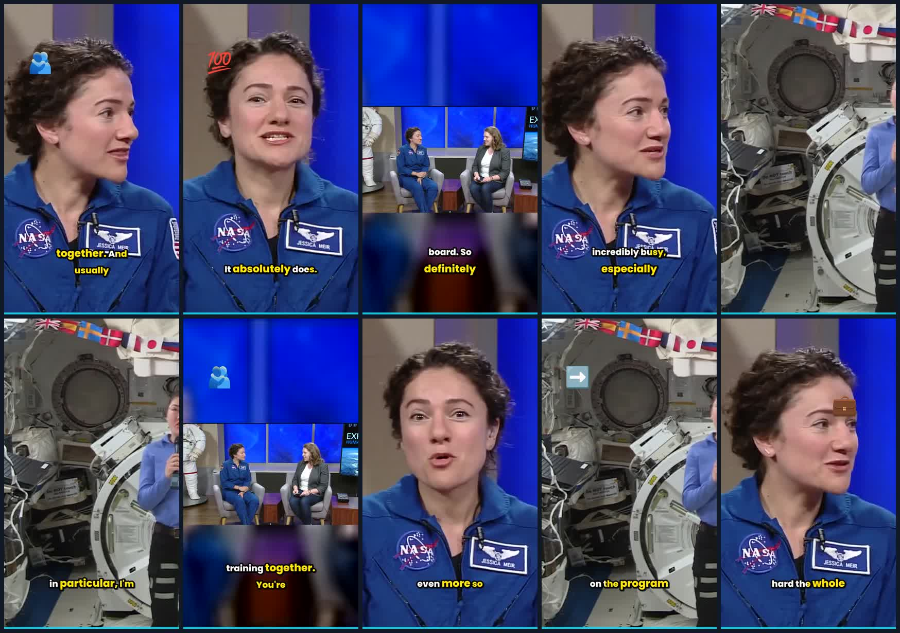

# Clips from real faces — and the bug this run found

**Not part of the product.** Pushed so the output can be watched in a browser. Delete freely.

Ten clips from **public-domain NASA footage**: an Expedition 59 crew interview. Faces were detected
in **15 of 15** sampled frames, sometimes three or four people at once — the first time this tool
has processed footage containing a human face.



## The clips

| # | Watch | Source range | Length | Score |
|---|---|---|---|---|
| 1 | [clip_01_80af31.mp4](clip_01_80af31.mp4) | 93.46 – 110.26 | 16.80 s | 42.2 |
| 2 | [clip_02_310bc6.mp4](clip_02_310bc6.mp4) | 82.56 – 92.98 | 10.42 s | 40.7 |
| 3 | [clip_03_32c91c.mp4](clip_03_32c91c.mp4) | 51.38 – 64.47 | 13.08 s | 39.3 |
| 4 | [clip_04_635804.mp4](clip_04_635804.mp4) | 42.40 – 50.82 | 8.42 s | 36.7 |
| 5 | [clip_05_9bef11.mp4](clip_05_9bef11.mp4) | 0.00 – 8.76 | 8.76 s | 35.9 |
| 6 | [clip_06_9780da.mp4](clip_06_9780da.mp4) | 124.83 – 149.99 | 25.16 s | 35.2 |
| 7 | [clip_07_6de6b1.mp4](clip_07_6de6b1.mp4) | 65.08 – 82.15 | 17.07 s | 34.6 |
| 8 | [clip_08_8bf1f9.mp4](clip_08_8bf1f9.mp4) | 110.40 – 123.00 | 12.60 s | 33.7 |
| 9 | [clip_09_393722.mp4](clip_09_393722.mp4) | 8.90 – 22.36 | 13.46 s | 32.5 |
| 10 | [clip_10_eda6cd.mp4](clip_10_eda6cd.mp4) | 24.01 – 42.40 | 18.39 s | 31.1 |

All `1080x1920` h264 / aac, 30 fps, with thumbnails and per-clip metadata JSON.

## What to look at

**The framing.** These are the first clips where reframing had a real subject to track, so the crop
follows the speaker instead of sitting in the centre. Every clip records `face_detector:mediapipe`.

## The bug this exposed

The first attempt produced ten clips that all logged:

```
face detector: mediapipe requested but could not be imported or constructed; falling back to haar
```

`/api/info` reported `mediapipe: available: true` and `scripts/docker_smoke.sh` asserts on that
field and passed — while **10 of 10 clips** silently fell back to Haar. Two faults:

1. The Dockerfile was missing `libegl1` and `libgles2`. `libmediapipe.so` dlopen's those **only when
   a task graph is constructed**, so `import mediapipe` succeeded and
   `create_from_options` raised `OSError: libGLESv2.so.2`. CI installs all four libraries; the image
   only ever got two — so CI tested the real detector and the container never did.
2. The capability probe only *imported* mediapipe, so it could not detect the above.

Both fixed in **#147**. After the fix, on identical input:

| | before | after |
|---|---|---|
| clips using BlazeFace | 0 of 10 | **10 of 10** |
| marker | `face_detector_substituted:mediapipe:haar` | `face_detector:mediapipe` |
| substitution warnings | 10 | **0** |

Only footage with a face in it could have surfaced this.

## Openly-licensed sources that work from a sandbox

All verified fetchable, all with faces and speech:

| Source | Licence | Notes |
|---|---|---|
| [NASA image/video library](https://images.nasa.gov) | Public domain | Crew interviews, press conferences. Used here. API: `images-api.nasa.gov/search?q=interview&media_type=video` |
| [Interview with Alfred Byrne, Lord Mayor of Dublin (1936)](https://commons.wikimedia.org/wiki/File:Interview_With_Mr_Alfred_Byrne_Lord_Mayor_Of_Dublin_(1936).webm) | Public domain | 62 MB, single speaker to camera |
| [Edison speech, 1920s](https://commons.wikimedia.org/wiki/File:Edison_speech,_1920s.ogv) | Public domain | 5.8 MB, short |
| [Tears of Steel](https://archive.org/details/Tears-of-Steel) | CC BY 3.0 | Blender open movie, live actors and dialogue |
| Wikimedia Commons | CC BY / CC BY-SA / PD | `filetype:video` plus a keyword via the Commons API |

Avoid TED talks: **CC BY-NC-ND** — the *ND* forbids derivatives, so clipping them is not permitted.

## Attribution

Source video: NASA, *Expedition 59 interview with Jessica Meir and Christina Koch* — **public
domain** (NASA material is generally not subject to copyright). Clips are derivatives.

## Reproducing

```bash
cp .env.example .env
docker compose up --build
# then upload any video with a person speaking, at http://localhost:8000
```
