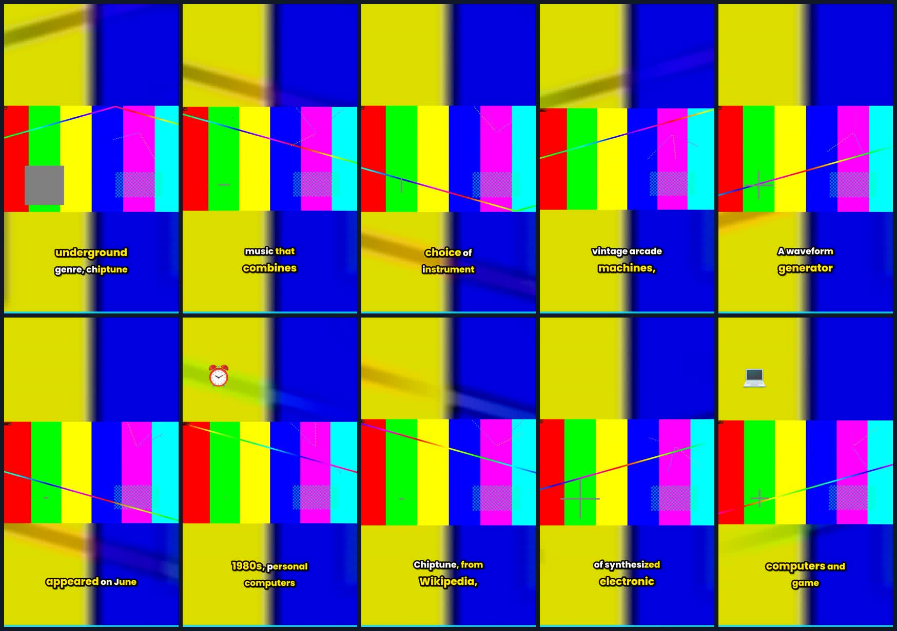

# Fresh clips from merged `main` (`58b0e13`)

**Not part of the product.** This branch exists so a real Docker run can be watched in a browser.
Delete it whenever — nothing depends on it.

Built by rebuilding the image from `main` at `58b0e13`, copying `.env` from `.env.example`, and
posting a 120-second 1920x1080 source to `POST /api/upload`. Whisper transcribed it, the selector
chose the windows, ffmpeg rendered them vertical with burned-in captions. **155 seconds**,
`status=completed`, 10 clips. Every file is **1080x1920 h264 / aac, 30 fps**.



## The clips — karaoke captions (the default)

| Clip | Source range | Length | Score |
|---|---|---|---|
| [clip_01_205bb6.mp4](clip_01_205bb6.mp4) | 88.01 – 104.19 | 16.18 s | 42.0 |
| [clip_02_177e3f.mp4](clip_02_177e3f.mp4) | 49.25 – 54.91 | 5.66 s | 39.8 |
| [clip_03_915dc8.mp4](clip_03_915dc8.mp4) | 55.67 – 69.13 | 13.46 s | 39.8 |
| [clip_04_1c4463.mp4](clip_04_1c4463.mp4) | 34.83 – 48.69 | 13.86 s | 39.4 |
| [clip_05_c7a136.mp4](clip_05_c7a136.mp4) | 104.19 – 118.55 | 14.36 s | 37.8 |
| [clip_06_7c32d6.mp4](clip_06_7c32d6.mp4) | 1.07 – 13.89 | 12.81 s | 37.8 |
| [clip_07_96c2bf.mp4](clip_07_96c2bf.mp4) | 70.09 – 76.37 | 6.28 s | 35.6 |
| [clip_08_1494b2.mp4](clip_08_1494b2.mp4) | 14.70 – 22.27 | 7.57 s | 34.9 |
| [clip_09_4b60b9.mp4](clip_09_4b60b9.mp4) | 22.91 – 33.91 | 11.00 s | 31.4 |
| [clip_10_4f7937.mp4](clip_10_4f7937.mp4) | 77.13 – 87.17 | 10.04 s | 30.9 |

Each has its `.jpg` thumbnail and the `.json` the tool wrote, carrying the per-clip metadata and:

```
"effects_applied": ["visual_selection", "colour_range_assumed:tv", "frame_rate_preserved:30",
                    "caption_preset:karaoke", "keyword_highlight", "caption_emoji", "captions",
                    "zoom", "transitions", "fades", "progress_bar", "emoji:standard",
                    "loudness:-11lufs"]
```

## The caption comparison, in `../clips-boxed/`

You said the subtitles looked out of sync. Measurement said the timing is correct — median lag
−0.04 s, and whisper accurate to ~20 ms where the audio can prove it — so what is left is per-word
variation of a few tens of milliseconds. **The karaoke fill is what makes that visible**, because
highlighting word by word draws the eye to each word's exact boundary.

So the same three windows are rendered again with the `boxed` preset (`animation=none`). Identical
timings, no per-word highlight:

| Window | karaoke (default) | boxed (no per-word fill) |
|---|---|---|
| 88.01 – 104.19 | [clip_01_205bb6.mp4](clip_01_205bb6.mp4) | [../clips-boxed/clip_01_cf1da8.mp4](../clips-boxed/clip_01_cf1da8.mp4) |
| 55.67 – 69.13 | [clip_03_915dc8.mp4](clip_03_915dc8.mp4) | [../clips-boxed/clip_03_251b16.mp4](../clips-boxed/clip_03_251b16.mp4) |
| 104.19 – 118.55 | [clip_05_c7a136.mp4](clip_05_c7a136.mp4) | [../clips-boxed/clip_05_35dc68.mp4](../clips-boxed/clip_05_35dc68.mp4) |

If the boxed ones read as fine and the karaoke ones do not, the issue is the emphasis rather than
the timing, and `CAPTION_PRESET=boxed` in `.env` is the whole fix. There are 14 presets; the ones
without a per-word fill are `boxed`, `minimal`, `pill`, `pill_green`, `headline` and `subtitle`.

## Caveat: the source has no faces

The video track is a synthetic test pattern carrying a real spoken-word recording, because the goal
was to exercise transcription, selection, rendering and captioning — not to look good. Reframing
therefore had nothing to track and fell back to a centre crop. On real footage that path uses
BlazeFace, which reported `available: True` in this run.

Titles also came from the fallback selector (`reason: "Selected by fallback segmentation"`), because
no `OPENAI_API_KEY` was set. That is the documented degraded path; set a key to get Phase 2's
selection and copywriting.

## Source attribution

The audio is from *Spoken Wikipedia – English – chiptune* on Wikimedia Commons, recorded by
[user:Arlo Barnes](https://commons.wikimedia.org/wiki/User:Arlo_Barnes), licensed
**[CC BY-SA 4.0](https://creativecommons.org/licenses/by-sa/4.0)**. These clips are derivatives and
carry the same licence. Video track generated with ffmpeg `testsrc2`.

## Reproducing

```bash
cp .env.example .env
docker compose up --build
# then upload anything with speech in it at http://localhost:8000
```
