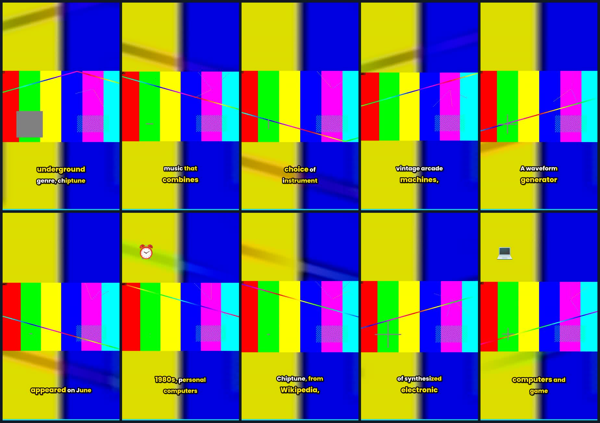

# Docker end-to-end verification artifacts

**Not part of the product.** This branch exists so the output of a real Docker run can be looked at
in a browser. Delete it whenever — nothing depends on it.

Produced by running the tool from merged `main` (`8847fb4`) inside a container: `.env` copied from
the fixed `.env.example`, then a 120-second 1920x1080 source with real human speech posted to
`POST /api/upload`. Whisper transcribed it, the selector chose the moments, and ffmpeg rendered them
vertical with burned-in karaoke captions. Total: **156 seconds**, `status=completed`.

Every clip is a genuine **1080x1920 h264 / aac, 30 fps** file. Click any `.mp4` below — GitHub plays
it in the blob viewer.



| # | Clip | Source range | Length | Score | Title, as whisper heard it |
|---|---|---|---|---|---|
| 1 | [clip_01_3ff34b.mp4](clip_01_3ff34b.mp4) | 88.01 – 104.19 | 16.18 s | 41.96 | They were in low demand by consumers as a whole, |
| 2 | [clip_02_7a6d03.mp4](clip_02_7a6d03.mp4) | 49.25 – 54.91 | 5.66 s | 39.81 | This is the original meaning of the term, as well |
| 3 | [clip_03_2de1e4.mp4](clip_03_2de1e4.mp4) | 55.67 – 69.13 | 13.46 s | 39.81 | It has been described as an interpretation of many genres, |
| 4 | [clip_04_4d0aa3.mp4](clip_04_4d0aa3.mp4) | 34.83 – 48.69 | 13.86 s | 39.40 | PSG sound chips, or synthesizers in vintage arcade machines, |
| 5 | [clip_05_93c185.mp4](clip_05_93c185.mp4) | 104.19 – 118.55 | 14.36 s | 37.80 | and has influenced the development of electronic dance music |
| 6 | [clip_06_f77d5c.mp4](clip_06_f77d5c.mp4) | 1.07 – 13.89 | 12.81 s | 37.75 | The English Wikipedia article chiptune, as it appeared on Ju… |
| 7 | [clip_07_22715c.mp4](clip_07_22715c.mp4) | 70.09 – 76.37 | 6.28 s | 35.56 | By the early 1980s, personal computers had become less expen… |
| 8 | [clip_08_1660ce.mp4](clip_08_1660ce.mp4) | 14.70 – 22.27 | 7.57 s | 34.86 | user Arlo Barnes, on June 21st, 2020. Chiptune, from Wikiped… |
| 9 | [clip_09_e3a29b.mp4](clip_09_e3a29b.mp4) | 22.91 – 33.91 | 11.00 s | 31.41 | For the altering of car electronics, see chiptuning. Chiptun… |
| 10 | [clip_10_0102bb.mp4](clip_10_0102bb.mp4) | 77.13 – 87.17 | 10.04 s | 30.85 | This led to a proliferation of outdated personal computers a… |

Each clip also has its `.jpg` thumbnail and the `.json` the tool wrote, e.g.
[clip_01_3ff34b.json](clip_01_3ff34b.json), carrying the per-platform metadata and:

```
"effects_applied": ["visual_selection", "colour_range_assumed:tv", "frame_rate_preserved:30",
                    "caption_preset:karaoke", "keyword_highlight", "caption_emoji", "captions",
                    "zoom", "transitions", "fades", "progress_bar", "emoji:standard",
                    "loudness:-11lufs"]
```

## Two honest caveats about what you are watching

**The source had no faces.** It was a synthetic `testsrc2` pattern carrying a real spoken-word
recording, because the point was to exercise transcription, selection, rendering and captioning end
to end — not to look pretty. So reframing had nothing to track and fell back to a centre crop. On
real footage that path uses BlazeFace, which reported `available: True` in this run.

**Titles came from the fallback selector, not an LLM.** `reason: "Selected by fallback segmentation"`
on every clip, because no `OPENAI_API_KEY` was set. That is the documented degraded path — the tool
still cuts, renders and captions, but the "smart" selection and copywriting from Phase 2 need a key.
Set one in `.env` to see that half.

## Reproducing it

The driver is not in this repo — it lived outside the tree on purpose. It only did what any client
does: `POST /api/upload` with the file, then poll `GET /api/jobs/{id}` until `status=completed`.

```bash
cp .env.example .env
docker compose up --build
# then upload anything with speech in it through the UI at http://localhost:8000
```
